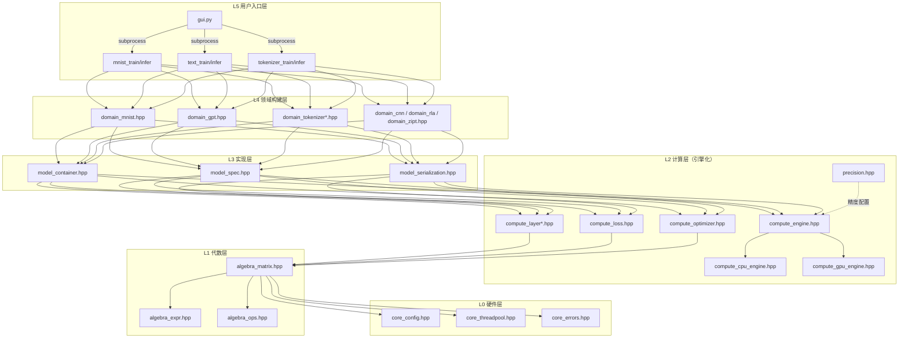

# AGENTS.md — AI 开发速览（neuralnet.cpp）

> 本文档专为 AI 编码助手编写：用最少 token 建立项目心智模型，快速开始开发。
> 人类向的完整文档在 `docs/`（索引见 §11）。**改代码前必读 §5 铁律与 §10 高频坑。**
> 当前版本：v1.2.0（混合精度 / RLA-2 / 防 NaN 跳步 / CPU 优化）+ 后续提交（Vulkan 设备选择、activation offload）。

## 1. 项目一句话

从零实现的 C++26 神经网络库：CPU / Vulkan 双后端，支持 MLP / ViT / GPT 训练推理 + BPE 分词器，可选 f16 混合精度。
`include/neuralnet.cpp/` 是 header-only 库（唯一入口 `nn.hpp`），`src/` 是可执行入口，`shaders/` 是 GPU 原语 shader。

## 2. 构建与测试

```bash
# 构建（默认 Release：-O3 -funroll-loops -march=native，Clang/GCC 另加 -fno-exceptions -Wall -Wextra -Wpedantic -Werror）
cmake -B build -G Ninja && cmake --build build

# 测试（默认关闭；开启后测试程序在 build/test/，并注册 ctest）
cmake -B build -G Ninja -DNN_ENABLE_TESTS=ON && cmake --build build && ctest --test-dir build
```

- 编译器：Clang++ 22.1+（C++26）；CMake 3.30+。CMake 在 Linux 上若 PATH 中能找到 `clang++` 会优先选它（自动向量化优于 g++），可用 `CXX=g++` 或 `-DCMAKE_CXX_COMPILER` 覆盖；MSVC 走 `/std:c++latest`。
- 构建选项：`NN_ENABLE_NATIVE`（默认 ON，开启 `-march=native`，分发/CI 用 `OFF` 生成可移植基线）；`NN_ENABLE_TESTS`（默认 OFF）。
- Vulkan 可选：CMake 自动探测 Vulkan + glslc，找到则定义 `NN_HAS_VULKAN` 启用 GPU，否则纯 CPU。支持多 Vulkan 设备选择（`--gpu` 参数，见 `cli/cli_gpu_option.hpp`）。
- **CUDA 后端已整体移除**（`cuda/`、`compute_cuda_engine.hpp`、`backend/compute_cuda_backend.hpp` 及全库 `NN_HAS_CUDA` 分支已删除；CLI 不再接受 `--cuda`）。带 CUDA 的历史快照见 git 分支 `legacy/cuda`。勿在文档中声称支持 CUDA。
- 应用入口：`build/{mnist_train,mnist_infer,text_train,text_infer,tokenizer_train,tokenizer_infer}`，另有 `layer_bench`（性能）与测试类可执行文件。`gui.py` 是 Python GUI，`train_pkg.py` 打包 `.nnpkg` 训练包，`cli_controllers.py` 提供 CLI 控制逻辑。

## 3. 目录速查（改什么任务 → 看什么文件）

| 任务 | 文件 |
|------|------|
| 加/改神经网络层（Linear/Attention/Norm/激活…） | `compute_layer.hpp`（聚合头）+ `compute_layer_{base,mlp,conv,softmax,attention,feedforward,transformer,gpt,zipt,rapt}.hpp` |
| 加/改损失函数 | `compute_loss.hpp` |
| 加/改优化器（SGD/Adam/AdamW/Muon） | `compute_optimizer.hpp` |
| 加/改引擎原语（CPU 实现） | `compute_engine.hpp`（接口）+ `compute_cpu_engine.hpp` |
| 加/改引擎原语（GPU 实现） | `compute_gpu_engine.hpp` + `backend/compute_vk_backend.hpp` + `backend/compute_vk_device.hpp` + `shaders/*.comp` |
| 张量/设备抽象 | `compute_tensor.hpp` |
| 混合精度 / f16 类型系统 | `precision.hpp`（Precision 枚举、`nn::f16`、`PrecisionProfile`） |
| 矩阵/表达式模板（CPU 代数层） | `algebra_matrix.hpp` / `algebra_span.hpp` / `algebra_expr.hpp` / `algebra_ops.hpp` / `algebra_compute.hpp` |
| 表达式 DSL / 融合 IR | `expr_dsl.hpp` / `expr_spec.hpp` / `expr_opt.hpp` / `expr_registry.hpp`（`expr_graph.hpp`/IR-C 已于 2026-09-19 移除） |
| 后端代码生成（IR-D emitter 抽象） | `expr_emitter.hpp`（注册表）+ `expr_glsl_gen.hpp`（GlslEmitter） |
| 模型容器/规格/序列化 | `model_container.hpp` / `model_spec.hpp` / `model_serialization.hpp` / `model_keyvalue_record.hpp` |
| MNIST / GPT / CNN / RLA / ZiPT / 分词器 模型工厂 | `domain_mnist.hpp` / `domain_gpt.hpp` / `domain_cnn.hpp` / `domain_rla.hpp` / `domain_zipt.hpp` / `domain_tokenizer{,_base,_bpe,_charbpe}.hpp` |
| 训练/推理 CLI 入口 | `src/mnist_train.cpp` 等；公共 CLI 逻辑在 `include/neuralnet.cpp/cli/` |
| 构建期工具（AOT 融合） | `tools/scan_exprs.cpp` / `tools/gen_fused.cpp`（另有 `tools/decode_fused.py` 调试用） |
| 与 PyTorch 对拍 | `compare_with_torch/`（model.py / text_train.py / text_infer.py） |

## 4. 分层架构（L0→L5，严格单向依赖，上层只依赖下层公有接口）

### 4.1 架构概览图



### 4.2 核心设计原则

**引擎化（Engine-Based）**：Layer 的 `forward/backward` 只写一次，通过 `ComputeEngine&` 参数自动适配 CPU/GPU。

**算法与原语分离**：
- Engine 只提供 op-level 原语（`matmul`/`add`/`exp`/`reduce`…）
- Layer 用原语组合表达算法（`ReLU = max(x,0)`）
- Engine 不知道 "ReLU" 是什么

**数据流**：
```
Matrix → engine.from_matrix → Tensor[GPU] → forward/loss/optimizer 全程在 GPU → 仅 evaluate 时 to_matrix 回 CPU
```

**多精度（v1.2.0 起）**：`Precision`（F16/F32；BF16/F64 为保留值，使用即报错）贯穿张量存储与算子输出；`PrecisionProfile{param/compute/stable/optimizer}` 做模型级配置。语义锚点见 `precision.hpp` 头注释与 `docs/development/05-mixed-precision.md`。

### 4.3 ComputeEngine 原语分类

| 类别 | 原语 |
|------|------|
| 矩阵级 | `matmul/batched_matmul/matmul_with_bias/transpose/add_inplace/accumulate/scale_inplace/axpy_inplace/zero` |
| 归约级 | `row_reduce_sum/max`、`col_reduce_sum/max`、`grouped_reduce_sum/max`（沿行方向按固定长度 R 分组归约，池化/多头等场景免逐通道循环） |
| 广播级 | `broadcast_row_inplace/broadcast_col_inplace` |
| 逐元素 | `elementwise_unary/binary/binary_scalar/select_scalar_cond` |
| 数据操作 | `slice_rows/insert_rows/gather_rows/scatter_add_rows/rearrange_3d/im2col/col2im/clone/copy_from/cast`（`im2col/col2im`：卷积/池化窗口展开与伴随散射，纯数据搬运） |
| 扫描级 | `scan_prefix_outer/scan_suffix_outer/outer_col`（RLA/RAPT，dk≤64，见 docs/development/06 §扫描原语） |
| 表达式 | `eval_expr/eval_expr_reduce`（AOT 融合 shader 入口） |
| 批次/内存 | `begin_batch/end_batch/flush_batch/release_idle_pool_blocks/pool_stats` |
| offload | `offload_store/offload_load/create_offload_buffer/offload_save/offload_restore`（activation offload） |

### 4.4 理解优先级（建议学习顺序）

1. **先理解 L0-L1**（基础数据结构）：`Matrix`、`Tensor`、`Scalar`
2. **再理解 L2 核心**：`ComputeEngine` 接口 + 一个简单 Layer（如 `Linear`）
3. **然后理解 L3**：`Model` 容器如何组合 Layer
4. **最后理解 L4-L5**：具体模型实现和训练流程

## 5. 铁律（违反必出 bug）

1. **禁止 throw/try/catch**：编译期 `-fno-exceptions` 强制。错误一律 `Result<T> = std::expected<T, Error>`（`core_errors.hpp`），调用方 `if (!r) return std::unexpected(...)` 传播。
2. **禁止 new/delete/裸指针所有权**：`std::vector` / `std::unique_ptr` / `std::span`。
3. **分层职责单一**：Matrix（L1）不写神经网络算法；Layer（L2）不写底层计算；原语 shader 永不含算法（ReLU/Softmax/Attention 等一律来自 Layer 或 DSL）。
4. **不穿透接口**：上层不访问下层内部数据结构（`.data()` 等），改一个模块只改一个头文件。
5. **布局全局统一 batch-major**：序列展平列序 `i = b*seq + t`（batch 在列方向）。历史上 GPT 曾用 position-major（`i = t*batch + b`）导致跨样本串扰的灾难级 bug，现已统一。**所有注意力/序列相关测试必须覆盖 batch>1**（batch=1 时两种布局重合，测不出）。
6. **GPU 命令录制生命周期**：录制期（`begin_batch`→`end_batch` 之间）引用的所有张量必须存活到 `end_batch()` 之后；GPU buffer 销毁走 `pending_destroys_` 延迟队列。
7. **AOT 闭合世界**：GPU 表达式 shader 全部构建期生成，运行时按 `expr_spec_key` 精确匹配，**未命中硬报错**，无 eager、无运行时编译。
8. **确定性**：任何"依赖容器迭代顺序"的决策点（BPE 平局打破、ID 分配等）必须显式排序/按 key 打破平局；并行化后结果必须与单线程逐字节一致。
9. **大词表禁止物化 one-hot**：用 `CrossEntropyLoss::forward_sparse`（整数标签 + loss_mask）。

## 6. 数据布局约定

```
Matrix: 行主序 (rows, cols)，data_[row*cols + col]
神经网络张量: 列主序 batch-major
  输入 (feature_dim, batch_size)   每列一个样本
  权重 (out_features, in_features)
  多头 Q/K/V: (H*d_k, batch*seq) → rearrange_3d → (batch*H*d_k, seq)
GPT 序列展平: 列序 i = b*seq + t（batch-major，全局唯一约定）
```

## 7. 表达式 DSL 与 AOT 融合管线（GPU 开发必读）

- Layer 内用 `nn::dsl`（`expr_dsl.hpp`）写普通数学表达式；CPU 编译期模板直接求值（内联+SIMD），GPU 折叠成 `ExprSpec`（扁平 IR，`expr_spec.hpp`）→ 按 key 查预编译融合 shader。
- 主要入口：`dsl::compute(engine, expr)`（一行表达式，最常用）；把结果写进既有张量（原地更新，零分配）用 `dsl::compute_into(engine, expr, dst)`；归约语义用 `dsl::compute_reduce`。**跨表达式融合（`start_expr/end_expr`、`begin_expr/end_expr`、`expr_graph.hpp`）已于 2026-09-19 移除**——理由与重新立项前提见 `docs/development/03-ir-optimization.md` §5.3。
- **fold 段（P-C1/C2，注意力的结构载体）**：`ExprSpec.fold = FoldSpec`（分块状态归约：键域逐块 body + 行标量态跨块进位 + `vecacc` 行向量态块累加 + 向量域 finalize）。注意力 forward 直调 `engine.eval_expr(make_fold_attn_o(...))`（**不经 DSL 钩子——scan 显式登记块是 fold spec 唯一注册来源**）；5 掩码变体 `FoldAttnMask`（Plain/Causal/Alibi/Doc/AlibiDoc，漏登记即 GPU 闭合世界硬报错）；`FoldSpec.causal_skip` 进 key（codegen 分歧点）；`EXPR_FOLD_BLOCK=128`/`EXPR_FOLD_ROWS_PER_WG=2` 为 CPU/GPU 共享常量（改则两侧同改）。详见 `expr_fold.hpp` 与 `expr_spec.hpp` 的 FoldSpec 注释。
- **构建期两步**（CMake 自动编排，改 Layer 内联表达式后重跑构建即可）：
  1. `scan_exprs`：dry-run 跑 Layer forward/backward，收集折叠出的 `ExprSpec` 结构（去重）→ `build/generated/expr_specs.bin`
  2. `gen_fused`：读 bin → 经 `emitter_registry` 选后端（默认 `"glsl"` = `GlslEmitter`）生成 GLSL → glslc → 内联 SPIR-V → `build/generated/fused_registry.hpp`
- **IR-D emitter 抽象**（`expr_emitter.hpp`）：把后端代码生成从 GLSL 专用抽象为 emitter 接口（一份 canonical IR → 多后端代码），`--list-backends` 可列出注册后端。目前仅 `glsl` 后端注册；`CpuEmitter`（已删除）与 `CudaEmitter`（随 CUDA 后端一并移除）均**不存在**，勿引用。
- 手写原语 shader 在 `shaders/*.comp`（matmul、matmul_tiled、matmul_gemv、batched_matmul、reduce、broadcast、elementwise_v2、transpose、gather、scatter_add、rearrange_3d、im2col、col2im、group_reduce、scan_prefix_outer、scan_suffix_outer、outer_col、cast），构建期 glslc 编译并嵌入 C++ 头文件。
- IR 优化 pass（canonicalize/CSE/寄存器分配）见 `expr_opt.hpp`，设计文档 `docs/development/03-ir-optimization.md`（含 IR-C 图融合的取舍记录 §5.3）。

## 8. 训练循环范式（写新入口时照抄）

```cpp
#include <neuralnet.cpp/nn.hpp>
nn::CpuEngine engine;                       // 或 nn::GpuEngine（NN_HAS_VULKAN）
auto model_r = nn::build_gpt_model(engine, vocab, d_model, seq, heads, d_ff, layers);
nn::Model model = std::move(*model_r);
// 优化器工厂：sgd / sgd_momentum / adam / adamw / muon
auto optimizer = nn::create_optimizer("adamw", engine,
    model.parameters(), model.param_gradients(), /*lr=*/1e-4, /*wd=*/0.01);

nn::CrossEntropyLoss ce_loss;
// 每 step（GPT 用 forward_sparse 稀疏路径，不物化 one-hot）：
model.zero_grad();
auto x = engine.from_matrix(batch);         // Matrix → Tensor
auto logits = model.forward(*x);
auto loss = ce_loss.forward_sparse(engine, *logits, labels, loss_mask, vocab);
auto grad = ce_loss.backward();             // (vocab, total) 梯度
model.backward(*grad);
optimizer.step();
```

> 注意签名细节：`Model::forward/backward/zero_grad` 与 `Loss::backward`、`Optimizer::step/zero_grad` **都不带 engine 参数**（engine 在 Model 构造时已绑定）；只有 `Loss::forward/forward_sparse` 和 `engine.from_matrix` 需要显式传 engine。

- 模型工厂：`nn::build_mnist_mlp_model(engine)` / `build_mnist_transformer_model(engine)` / `build_gpt_model(...)` / `build_gpt_model_from_spec(spec)`。
- 链式构建：`model.add_linear(784,256).add_relu().add_linear(256,10)`；模板版 `model.add<nn::Linear>(784,256)`。
- 序列化：`save_model` / `load_model` / `peek_model_spec`（`model_serialization.hpp`，v4 自描述格式）；`.nnpkg` 训练包见 `docs/usage/04-train-package.md`。
- GPT/RAPT 高级特性（`GPTModel` / `RAPTModel`，`compute_layer.hpp` 尾部）：梯度检查点（`checkpoint_every_`）、activation offload、文档感知掩码（`set_doc_ids`）、batch flush 粒度。RAPT 自 2026-09-19 起与 GPT 同档支持前三者（`RAPTModel::set_checkpoint_every/set_activation_offload/set_flush_interval`），offload 走共用实现 `ActivationOffloader`（`compute_layer_base.hpp`）。

## 9. 关键常量与配置（`core_config.hpp`）

- `Scalar = float`；`BLOCK_SIZE = 64`（matmul 分块，b_block 栈预算 64KB）；`PARALLEL_THRESHOLD = 524288`（SmartPolicy 并行阈值）。
- 不使用 `-ffast-math`（保 NaN/Inf，训练稳定性）。

## 10. 高频坑（Top 8，详见 `docs/development/08-pitfalls-and-lessons.md`）

1. **布局混用**：position-major vs batch-major → 跨样本串扰、loss 平台期。改序列代码先确认列序约定。
2. **GPU 双存储影子一致性**：CPU/GPU 双存储是分布式状态机问题；GPU-resident 路径已禁用，走 staging（每次算子往返 PCIe）。
3. **录制期 use-after-free**：局部张量在 `end_batch()` 前析构 → `VK_ERROR_DEVICE_LOST`。
4. **TDR/设备死亡**：`VK_ERROR_DEVICE_LOST` 不可重试（存 checkpoint 退出）；`VK_TIMEOUT` 可减半 batch 重试。
5. **缓存 key 冲突**：naive 位域/组合 key 会撞车，用强哈希（FNV-1a）或双字段。
6. **零拷贝 reshape 的 CPU/GPU 语义差异**：CPU 分支 reshape 需复制数据，GPU 保持零拷贝。
7. **内存爆炸**："所有出现位置"类索引随输入线性膨胀（BPE 曾 60-80GB）；大词表 one-hot 曾 3.2GB。先做内存预算。
8. **gradcheck 必须先 forward** 填充 `input_cache_` 再 backward，否则空缓存崩溃。

## 11. 文档索引（docs/，按类别子目录组织）

### 介绍类（docs/introduction/）

| 文档 | 何时读 |
|------|--------|
| `introduction/01-architecture.md` | 需要完整分层/数据流/模块详解时（**含快速理解指南和理解路线图**；CUDA 已移除备注见篇末） |
| `introduction/02-performance.md` | 性能优化（SmartPolicy、缓存分块、GPU） |
| `introduction/03-algorithm-reference.md` | 每个 Layer/Loss/Optimizer 的数学与原语分解 |
| `introduction/04-innovative-designs.md` | 创新设计全景 |

### 开发类（docs/development/）

| 文档 | 何时读 |
|------|--------|
| `development/01-compute-engine-development.md` | **计算引擎开发指南：接口详解、实现模式、添加新原语** |
| `development/02-operator-fusion.md` | **算子融合全篇：IR 扩展（归约语义）→ 表达式录制 → matmul 参与 IR 融合 → 跨 kernel 自动融合（一期 M + 二期 S1-S7 整合，删手写原语）** |
| `development/03-ir-optimization.md` | IR 优化（IR-A/B/D 已实施；**IR-C 图融合已评估并移除，§5.3 是取舍记录**） |
| `development/04-memory-optimization.md` | 显存优化（L1 激活重计算 / L2 内存池归还，已实施） |
| `development/05-mixed-precision.md` | **多精度计算（f16/混合精度）设计：Precision 类型系统、类型化存储、硬件/兼容路径分派、显式精度推导、PrecisionProfile（param/compute/stable/optimizer）、Phase 1/2 分期与验收** |
| `development/06-rapt-algorithm.md` | **线性注意力家族演进：RLA → RAPT → RLA-2 + 两趟式/flash 等价分析 + GPU 落地** |
| `development/07-zipt-algorithm.md` | AttnZip / ZiPT：记忆压缩解码器算法设计 |
| `development/08-pitfalls-and-lessons.md` | **踩坑警示录，改代码前读** |
| `development/09-code-review-2026-09-04.md` | **全库 C++ 代码审查报告（2026-09-04，102 文件，P0×0 / P1×48 / P2×92 / P3×95；含 08-27/08-28 已修项与未修项清单）** |
| `development/10-development-standards.md` | C++ 编码规范全文 |

### 使用类（docs/usage/）

| 文档 | 何时读 |
|------|--------|
| `usage/01-quickstart-model.md` | 构建模型 API 教程 |
| `usage/02-quickstart-train-infer.md` | 训练/推理 CLI + C++ API + GUI |
| `usage/03-compute-engine-usage.md` | 计算引擎使用指南：张量操作、矩阵运算、表达式融合 |
| `usage/04-train-package.md` | `.nnpkg` 训练包 |


## 12. 当前状态（截至 2026-09-24；早期条目按日期标注，最新提交以 `git log` 为准）

### 已交付能力

- **v1.2.0**（Release）：混合精度（`precision.hpp` + CPU/GPU f16 路径）、RLA-2/RAPT、防 NaN 跳步、CPU 优化、头文件保护更换、编译器兼容（GCC/MSVC）、测试补充。
- **v1.1.0**：GPT 训练错误修复、算子融合优化、ZiPT/RAPT 掩码。
- **后续提交**（v1.2.0 之后）：
  - **Vulkan 设备选择**（15eb731）：`--gpu` 参数指定设备（`cli/cli_gpu_option.hpp`、`backend/compute_vk_device.hpp`）。
  - **activation offload**（ee11e29）：相较梯度检查点更省时（实测 18s vs 26s / 5 step），推荐优先使用；`GPTModel::set_offload_enabled` + `ComputeEngine::offload_*` 原语。
  - **CPU 逐元素优化 + `dsl::compute_into`**（c0d3298）：DSL 模板路径向量化/并行、`Tensor::cpu_get_ptr`、零分配原地目标传递（optimizer/layer/loss 已迁移）。
  - **CUDA 后端整体移除**（96a3675）：`cuda/`、`compute_cuda_engine.hpp`、`backend/compute_cuda_backend.hpp`、全库 `NN_HAS_CUDA`/`--cuda`。快照见分支 `legacy/cuda`。
  - **IR-C 整体移除**（本次）：`expr_graph.hpp`、`compute_engine` 的 `begin_expr/end_expr`、`dsl::start_expr/end_expr`、`FusedChainLayer`、`Tensor::virtual_tag_`。取舍记录见 `docs/development/03-ir-optimization.md` §5.3。
  - **RLA/RAPT 激活重计算 + offload**（2026-09-19）：`RAPTModel/RAPTBlock` 补齐 `set_flush_interval / set_checkpoint_every / set_activation_offload`（此前对 RAPT 是静默 no-op，而 CLI 会打印"已启用"）；`ReLULinearAttention` 响应 `checkpoint_mode_`（跳过 7 项 backward 缓存）、`activation_cache()` 补齐遗漏的 4 项、backward 缺缓存硬报错；抽出通用 `ActivationOffloader`（`compute_layer_base.hpp`，GPT/RAPT 共用）；修 `RAPTModel::clear_cache()` 清空 `token_emb_`（参数被毁）与 `doc_ids` 无法关闭两个缺陷。新增 `rapt_checkpoint_test`（并入 `rapt_test`）与 `rapt_offload_test`，并让此前**从未被编译**的 `gpt_offload_test` 成为正式目标（ctest 15 → 18，全绿）。
  - **CNN 缓存契约加固 + 测试补齐**（2026-09-19）：`MaxPool2D::backward` 补 argmax 缓存/形状校验（旧行为是 `clear_cache()` 后**越界读空 vector 且不报错**——`vector::clear()` 保留容量，表现为静默用陈旧索引）；`Conv2D::backward` 补 im2col 缓存/形状校验（旧行为是 checkpoint 模式或 batch 变化后**静默用陈旧 im2col**）；两层的 `forward` 在 checkpoint 模式下**显式清空**缓存（只跳过赋值会因 size 相同而静默沿用旧数据）；两层补 `recompute_supported()`。新增 `cnn_test`（`maxpool_gradcheck` 独立参考比对 3 组配置 + 缓存/checkpoint 契约 + `cnn_smoke_test` 规格往返/层组成/端到端训练），CPU 与 `--gpu` 均逐位一致（此前 Conv2D/MaxPool2D **无任何 GPU 覆盖**、MaxPool2D **无任何测试**）。
  - **CNN 全引擎化**（2026-09-20）：新增 `im2col`/`col2im` 两个 op-level 数据搬运原语（接口 + CPU 实现 + Vulkan shader + backend 接线 + GpuEngine 包装）；`Conv2D`/`MaxPool2D` 的 forward/backward 改写为纯「引擎原语 + DSL」组合——消除 `to_matrix/from_matrix` PCIe 往返与 CPU 标量 im2col 循环，`col_cache_` 由 CPU `Matrix` 改为设备张量。布局 `(C,B*P) ↔ (C*P,B)` 用 `rearrange_3d` + `gather_rows/scatter_add_rows` + 缓存置换索引实现（`rearrange_3d` 单独做不到该三维转置）。池化反向改为「窗口内并列最大值**均分**梯度」（总梯度守恒；无并列时与 argmax-first 逐位一致）。`scan_exprs` 补 MaxPool2D dry-run（69 → 72 条融合表达式）。
  - **分组归约原语 + 融合 push-constant 缺陷修复**（2026-09-20）：新增 `grouped_reduce_sum/max`（沿行方向按固定长度 R 分组归约，接口 + CPU + Vulkan shader + backend + GpuEngine 包装），MaxPool2D 因此**彻底去掉逐通道循环**（原 `slice_rows + col_reduce_max + insert_rows` 的 C 次 dispatch → 单次原语）；组内广播复用 `gather_rows` + 缓存索引。修复 `GpuBackend::run_fused_gpu` 的 push-constant 固定头长度 bug（见下）；新增 `fused_gpu_test::run_reduce_consts` 回归用例。
  - **评估分块（CNN 全量评估 OOM 修复）**（2026-09-20）：`evaluate_mnist` 新增 `eval_batch`（默认 1000）分块前向 + 每块 `release_idle_pool_blocks()`；`mnist_train` 传 `cfg.batch_size`。此前 CNN/MLP 走 `N = x.cols()` 全量单次 forward，CNN 的 im2col 是 k²·C_in 倍 → 60000 样本需 ~6.4 GB → `vkAllocateMemory failed: -2`（训练步其实只多 130 MB）。见 `docs/development/08-pitfalls-and-lessons.md` §3.7。
  - **坑（已修，2026-09-20）**：`run_fused_gpu` 的 push-constant **固定头长度必须逐形态**与生成器 PC 声明一致（逐元素 2 / 逐元素+matmul 5 / 归约 4 / 归约+matmul 6）。历史 bug 把"归约但无 matmul"按 **5** 算 → 常量池整体后移一个 uint → **GPU 上"带常量的归约"静默错值而 CPU 正常**（表现为 `col_reduce_sum(select(x == col_broadcast(max), 1, 0))` 恒返回 kk-1 而非真实并列数）。教训：这类"只有 GPU 错"的问题要**先打印生成的 GLSL/IR 再猜成因**——本轮最初误判成"广播视图内联"并写了错误规避。见 `docs/development/08-pitfalls-and-lessons.md` §4.10。
  - **坑**：复合层 override `forward_recompute` 必须调用**虚函数** `set_checkpoint_mode` 关闭子层；基类默认实现只改本块标志位 → 子层缓存不重建（stride>1 时被上一轮陈旧缓存掩盖，表现为部分 stride 通过）。模式开关（checkpoint/offload/doc-mask）的缓存契约见 `docs/development/08-pitfalls-and-lessons.md` 模式 H。
  - **GPU 算子性能优化（2026-09-23）**：① `matmul_tiled.comp` 改 BK=16+双缓冲（共享保持 16KB 占用率不变），op 级 matmul +11~20%（**教训：BK=32 双缓冲要 32KB → blocks/SM 砍半，流水收益被占用率损失抵消净 0**）；② 融合生成器 `generate_glsl_matmul` 最终采用 **BK=32+双缓冲（32KB）**，四点多样本 A/B 实测（% = vs 单缓冲原版的**耗时**变化，负=更快）：浅网格 linear 1024³ **-1.9%**、batch512 **-4.9%**，深网格 feedforward/batch4096 **±0**，18/18 测试绿。**trade-off 表（融合侧调参必读）**：BK=16 双缓冲虽保 16KB 占用率，但 barrier 频率翻倍在深网格**真回退 -2%**（深网格延迟已被跨块调度掩盖，流水只剩 barrier 成本、只在浅网格是正收益）；BK=32 保住原版 barrier 节奏，32KB 占用率砍半被深网格 WG 余量吸收 → 全点最优。融合侧改动一律用 `layer --layer linear` 浅/深两点 + 每点 ≥3 样本测（单样本会被 ±3% 噪声骗）；③ `submit_and_wait` 改 solo fence/cmd 复用（`initialize` 预分配、submit 前 reset）+ 新增 `NN_GPU_PROFILE=1` stderr 分段计时（record/end/submit/wait/cleanup），逐元素固定开销 0.16→0.143ms；剖面显示余量 submit≈70µs + wait≈75µs 属驱动/唤醒延迟，kernel 本身 4096² 已达 370-440GB/s（峰值 448）**无优化空间**；④ **bench 方法论**：`layer_bench` 短跑必须 `--warmup ≥20` 等时钟爬坡（空闲 300MHz→1470→2070MHz，best-of 短跑双峰如 batched 4.57/5.9ms 即爬坡所致）；torch 用 CUDA event 只测 kernel、`layer_bench` 是 wall-clock 含提交开销，跨栈对比须先扣固定项。40HX 理论峰值 FP32 9.14 TFLOPS / 448 GB/s（34 SM×64×2×2.1GHz）。⑤ **batch=32 超线性异常（已解决 2026-09-24）**：原记录 fwd 2.78s——fwd 侧已由 fold 消除（S 不物化，现 batch=32 fwd 100ms 线性）；train 侧残留 B² 项根因 = 融合 matmul 后端 dispatch `wg_y` 按**总行** rows 派发、z=batch 又数第二遍 → 工作量 ∝ BH²（生成器契约是 y 只覆盖**批内**行 `m_per = rows/mm_batch`，多派的 WG 跑完整条 mm_k 流水后被写回守卫整块丢弃——**结果正确，对拍永远测不出，只有计时能暴露**；NN_GPU_PROFILE 按 key 聚合看翻倍比 4× 即定位）。修复 y 按 m_per 派发后 train batch=32 **2999.9→227.7ms（−92%）**、b16→b32 翻倍比 3.74→1.95 线性，batch=1 亦 −16%（BH=12 常驻空转同除），18/18 绿。教训：**dispatch 网格必须与生成器行界契约同源核对；"全绿"只证明算得对，不证明没空转**。
  - **fold 分块流式求值 + GPU 注意力全链优化（2026-09-24，7cdb41c+fd68573）**：注意力 forward 改单 fold kernel（`FoldSpec`：QKᵀ/掩码/online softmax/ΣwV 逐 `EXPR_FOLD_BLOCK=128` 块完成，S 绝不物化；`causal_skip` 整块跳过被屏蔽区；NR=2 每 WG 两行；subgroup 蝶式归约 + vecacc 4 路软件流水）；旧物化/两趟 forward 与 `build_attention_mask`/`mask_cache_`/`m/l/attn_cache_` 等死码删除。**实测 vs main 基线 7.9/20.3：mha fwd 5.41（−31.5%）、causal fwd 4.75（−40%）、train 17.5~17.7（−13%）**，18/18 绿。质量门禁轮补：Doc/AlibiDoc fold 注册与测试矩阵全覆盖、ALiBi slopes 表 `(1, batch·H)` 越界修复、GEMV subgroup≥4 门禁、causal_skip bin v8 往返断言。
  - **融合 matmul vec4 内核移植（2026-09-24，本轮）**：融合 matmul 同形状比 op 级 `matmul_tiled` 慢 2.3×（768×768×8192 fwd 6.18 vs 3.15ms——**"融合 vs op 级同形状对拍"是发现内核代差的 X 光**）——三重根因：内层 `acc+=dot(a[i],b[j])` 标量链（每 k ≈5× 指令发射）、全局 4×标量 ldg+16×标量 stg、共享 vec4 沿 k 布局。移植 op 级 v3 配方（共享沿 m/n + 每 k 2 LDS+4 VFMA.128 + vec4 别名快路径；trans 进 key → 分组**生成期**定死，%4 对齐 uniform 分支 + 同分组标量回退；BK=32/barrier 节奏/尾链不动）后：**linear 浅/深/投影三点 −33%/−48%/−47%（投影 6.18→3.25ms，达 op 级 97%）、mha fwd 4.59→3.63、mha train b1 13.0→10.8、b32 train 227.7→173.1（vs dispatch 修复前累计 2999.9→173 = −94%）**，18/18 绿。**坑（rapt_offload 抓出）**：共享索引必须用 tile 内**局部 k**，全局 k（`t*BK+local`）只进缓冲地址/守卫——混用则 t≥1（mm_k>32）越界共享 = 非确定性错值，且 num_tiles=1 的小形状对拍全测不出（全仓唯 rapt_offload d_model=64→2 tiles 有 tiles≥2 的数值对照）；"对拍全绿但数值每跑不同"→ 先同二进制跑两次 diff。
  - **全算子压榨 + OP/DSL 同步轮（2026-09-24，本轮）**：① `batched_matmul.comp` 移植 matmul_tiled v3（自 0.2.0 起从未优化——同形 1024³ 比 matmul 慢 1.85×，"回归"实为没吃到上轮配方）：vec4 共享 + BK16 双缓冲 + vec4 全局快路径（batch 基址对齐由 K%4/M%4/N%4 蕴含），**b1 1.66→0.876ms（−47%）、b8 8.12→4.08ms（2116→4214 GFLOPS）**；② `transpose.comp` 重写 32×8 WG / 32×32 共享分块（tile[32][33]，读写双向 128B 合并、零 bank 冲突、无除模），backend dispatch 改 (ceil(C/32), ceil(R/32))，**4096² 1.575→0.492ms（−69%）**；③ `reduce.comp` 列归约重写为 lane=列/warp=行块/32 列 tile + shared 跨块合并 + 4 路 ILP（旧版 lane 跨行步进完全不合并），max 恒等元 −inf→`lowest()`、行归约→subgroup 蝶式（与 DSL/CPU 统一），**4096² 0.843→0.273（−68%）、8192² −66%**；reduce 用 subgroup → CMake 需单独 `--target-env=vulkan1.2` 注册（同 matmul_gemv，否则 glslc 报 requires SPIR-V 1.3）；④ **DSL 列归约同结构重构**（`generate_glsl_reduce`：l/wb/col + `emit_col_merge` + dispatch cols/256→cols/32——CE 训练热路径，旧"每 WG 256 列每线程整列"WG 数=ceil(cols/256) 并行度极低；**合并值覆写回 s_red 与他 lane 读同址，必须 3 barrier：partial 完成→读完→写完，少读/写分离 barrier 会 sum 双计**）；⑤ `elementwise_v2`/`broadcast`/`gather` → vec4（镜像 DSL 契约 base=gid*4 + 同 kernel 标量回退），三处 dispatch ÷4；broadcast 去每元素除模 4096² −17%；⑥ **OP/融合 matmul BK 统一 A/B（推翻 09-23 结论②的 trade-off 表）**：OP 级 BK16→32 四点全回退（512³+9%、1024³+26%、4096³+29%、batched b8+29%）维持 16；融合侧 BK32→16 反超 **linear 浅 −24% / 深 fwd −24% / 深 train −17%（8.21→6.81ms）**→ 两侧同参 BK=16（历史"深网格 BK16 −2%"是对单缓冲旧基线的口径，非同参双缓冲对比）；⑦ `group_reduce` max 恒等元同统一 `lowest()`；⑧ **坑**：layer_bench transB/at 操作数恒建 (k,n)（应 (n,k)/(k,m)），k≠n → backend K mismatch → run 内 `*expected` 不查错 = UB → **0.000ms / 1.7e11 GFLOPS 超物理垃圾值**（k=n 正方形长期掩盖）；已改 per-variant setup + 错误检查 abort。教训：**bench 出现超物理数值先怀疑测法本身；`*expected` 不查错属"静默错值"家族**。gather 快路径曾漏读 `indices[]`（把索引下标当表行号），zipt CPU/GPU 对拍抓出——对拍是 vec4 改写唯一护栏，改后必跑。18/18 绿。最终 @1024：batched 0.871（与 matmul 0.853 持平）、col_reduce 0.123、transpose 0.138、broadcast 0.119；mha fwd 3.449 / causal fwd 2.819 / linear b4096 train 6.901ms。
  - **transpose 砖块化 + reduce 两段式 + bench 记账修复（2026-09-24，二轮）**：① **bench 虚高记账修复（「部分算子超出 40HX 理论」的根因）**：`bytes_reduce` 曾按 2N 记归约（输出仅向量级，实际 ≈N）→ 5244² 虚报 440 GB/s、4096² 虚报 491（**超 448 理论峰值，物理不可能**）；改精确 (N+out) 后真实 217-263 → **reduce 其实有一倍头寸**。其余算子记账审计正确，超频下略超 448 GB/s / 9.14 TFLOPS 标称属正常残差。② `transpose.comp` 定稿：64×64 tile（段宽 128→256B、每线程 16 元素摊薄 barrier）+ 共享落位交换（阶段 2 连续读 + 连续写全局）+ **8×8 WG 砖块化 dispatch**（`(8,8,n_bricks)`，bz→砖坐标、(x,y)→砖内 tile，shader 自算砖格）：**5244² 0.99→0.75ms（−24%）、4096² 0.51→0.37-0.43（−17~28%）**。消融链定根因（5244² kernel）：纯拷贝 0.556 → 过 shared+barrier 0.665（结构 +20%）→ 真转置线性 dispatch 0.850（+53%）：段宽 64 vs 32 仅 2%、共享散布落位交换 A/B 持平（代价对称），**真凶 = 并发 WG 写侧足迹散布整块**（转置输出行 = 输入列：线性 dispatch 下 136 个并发 WG 每行只写 256B、行距 21KB ≈180MB 散布）——砖块化让连续 64 WG 填满一砖、两侧足迹收敛 ~1MB 聚集；16×8 砖与 8×8 持平。③ `reduce.comp`：行归约 vec4 快路径（cols%4==0，load 指令 ÷4 + 4 vec4 累加器，横折后进蝶式）；列归约 **两段式 partials**（ggml `rms_norm_partials` 模式：pass1 行向切 nchunk（dispatch y=nchunk）→ partials(nchunk,cols)，pass2 复用整表 mode1 合并；**同 cmd 双 dispatch 单次提交 → 固定提交开销不翻倍**；scratch 走成员 `reduce_partial_` 防 batch 录制期 UAF）：**5244² 0.50→0.38-0.42ms**；push 扩 5×uint=20B（`chunk_rows`），**pipeline layout push range 同步 4→5 个 uint——漏改即静默错值**；512K 元素护栏排除微型形状（512² 两段 −16%：第二遍+屏障对 ~10µs kernel 净亏）。④ `broadcast.comp` vec 行单 vec4 装载（5244² −13~16%）。⑤ **方法论（改阈值/判回退前必读）**：同码对照两 exe 同窗交错实测 **噪声地板 ±5%、跨会话系统漂移 ±15%（未改码算子同漂，round2 全面慢 5-10%）**——两段式曾被跨会话单点误判「4096² 净亏 20%」，交错 A/B 实测只亏 2%（SP 5/5 配对胜）、5244² 反赢 6-9%（TP 4/5 配对胜）才定案保留；**调参/判退一律同窗交错 + 配对统计，禁止对着跨会话单点改参数**。18/18 绿。

  - **多精度 Phase 2（f16 存储真正生效 + 边界 cast 实测，2026-09-25，本轮）**：① 引擎接口运算类原语（逐元素/归约/分组归约/扫描/`eval_expr*`）加 `Precision P = F32`，新增 `cast_into`（写既有存储、保张量身份）/`copy_into`；② 新增 **`PrecisionEngine` 适配层**（`compute_precision_engine.hpp`）：f16 边界 cast 集中一处（入参抬 f32 → 内层既有 f32 实现 → 输出按 P 落回；in-place 走 `cast_into`），全 f32 = 纯直通逐字节一致；③ `dsl::compute/compute_reduce` 加 P、`compute_into` 取 dst 精度、CPU f16 叶子一次性 f32 镜像（`at()` 保持无分支）；④ Layer/Loss/Optimizer/工厂/CLI 全链接线（`Linear` param+compute、norm/CE = stable、Adam 状态 = optimizer、`Model::set_default_precision_profile` 须在 add 前、复合层**必须下传 profile**（`AttentionBase`/`FeedForward`/`TransformerEncoderLayer`——不下传则子层静默停 f32））；⑤ **`--f16` 语义修正为 `profile_f16()` = {param:F16, compute:F16, stable:F32, optimizer:F32}**（§9.4"全 f16（激进）"）：实测四字段全 f16 **不可训练**（optimizer=F16 时 Adam 的 v≈g²~1e-10 下溢→更新爆炸 loss 7.9→3.6e4；stable=F16 时 CE 链 ~200 步 NaN；两者同 f16 时 loss 恒定）；⑥ **关键实测（40HX，GPT d64/h4/L4/ff256、vocab 8208、seq256、b64）**：f32 峰值 3069MiB；f16 边界 cast **峰值反而升高**（2831MiB 后 backward OOM；探针 backward transient live 2795→**6687MB**、pending 2300→7000MB）。根因：每个算子都要把 f16 入参抬 f32 → 被 k 个算子读取的张量要 k 份 f32 副本；**LM head 已强制 stable（logits 保持 f32）消除 loss 链 6×512MB 的 cast**，但隐藏层激活的每算子 cast 仍是 2.4× 膨胀 → 结论：**边界 cast 只能拿"存储减半"，拿不到"峰值下降"；须做 in-kernel f16（typed IR：半精度直读直写 + f32 参考累加）**；⑦ 数值：GPU 上 `profile_f16` 与 f32 **逐 step 轨迹一致**（3.4776→3.1822 vs 3.1803，max_rel 6e-4）；**CPU 侧 f16 全模型训练发散（未定位，GPU 正常）**已记入 docs 05 §12.5；⑧ 新增 `f16_precision_test`（f32 零回归逐字节 / f16 算子 / in-place 存储精度 / GPT 轨迹对拍），**ctest 19/19 绿**。教训：**"让 profile 生效"必须连同"复合层把 profile 下传给子层"一起做——否则参数静默停在 f32（本轮 `Model::add` 用未设默认值覆盖了 GPTModel 构造器已注入的 profile，导致 token_emb 退回 f32）**；⑨ **in-kernel f16 变体索引地基（同轮）**：`ExprPrecSig`（位 i = 第 i 个输入 f16、bit16 = 输出 f16，**全 0 = 旧行为**）+ `expr_prec_sig_of(inputs,P)` + `ExprRegistry::variants / add(spec,sig)`（sig==0 仍走旧 `specs` 表 → bin v8、条目数、`[scan]/[gen]` 实测**逐字节不变**）+ 扫描分支登记 (结构, 签名) + 适配层 `NN_PREC_TRACE=1` 变体发现（**只有适配层看得到真实输入精度**）；**实测真实 GPT f16 变体空间 38 个 = 逐元素/归约 32（out=f16 9 / out=f32 23）+ matmul 段 5 + fold 1**，且存在 `in=[f16,f32]`、`in=[f32,f16,f16]`、`in=[f16,f32,f32]` 等混合签名 → **签名必须逐输入**（"全 f16/全 f32 两变体"会漏），**第一期只做逐元素+归约（占 84%）**；下一步 = bin v9 变体段 + `GlslEmitter` 按签名选 `float16_t`/`float`（`GL_EXT_shader_16bit_storage` + 显式转换）+ 设备启用 `storageBuffer16BitAccess` + 适配层按签名选 pipeline。⑩ **in-kernel f16 第一期已落地（同轮）**：`scan_exprs` 双 pass（f32 + f16，f16 pass 必须经适配层——原生 CpuEngine 喂 f16 = heap corruption 0xC0000374）→ **bin v9 只存 `{sig, 基础结构下标}`**（变体与基础结构同 key，免重复序列化）→ `GlslEmitter::generate(name, spec, sig)`（默认 0 = GLSL 逐字节不变；`float16_t` 缓冲 + 叶处显式转换——**RotateHalf 取负 / RowGather 的 `uint()` 必须在叶子处转**，否则 glslc 报 `'-' : wrong operand type`）→ `gen_fused` 每变体独立 shader（键 `key#sig`，`FusedShader.prec_sig`；不支持的形态跳过告警）→ 设备启用 `storageBuffer16BitAccess`（`NN_VULKAN_NO_16BIT_STORAGE=1` 强制回退）→ `run_fused_gpu` 输入改**类型擦除 buffer 视图**（`FusedInputs{owners,bufs}` **必须同时持有 owner**，只存裸指针 = 录制中途释放上传缓冲，实测 `A+=B err=0.5`）+ `GpuEngine::eval_expr` 按 `(key,sig)` 优先命中变体、**f16 输出按 2B/元素分配并重贴 `GpuTensorF16`**（漏了 → shader 只写前半 + f32 标签 → loss=NaN）+ 适配层 `supports_expr_precision_variant` 前置查询。**实测 batch32（GPT d64/L4/ff256/vocab8208/seq256）：f32 峰值 1595MiB；f16 in-kernel 3457MiB（loss 6.7059 vs f32 6.6969，差 0.13% ✓，19/19 绿）；f16 边界 cast 4124MiB** → 相对 cast **−16%**，但**仍高于 f32 2.2×**：54 变体只注册了 31（纯逐元素），剩余三类正是 transient 大户 —— **matmul 段（Linear 族，10）、含归约指令的逐元素（13，Norm 统计量链）、fold（注意力）**，补齐后才可能低于 f32 基线。⑪ **剩余开销归因（探针逐阶段，batch32；docs 05 §12.8）**：f16 的额外开销 = **每算子边界 cast 的临时块数量膨胀**，不是张量变大——**步末 released 272.5→288.5MB 基本持平**，但 backward 峰值 transient 1397→2869MB、中块（10-100MB）**16→52 项**、小块 234→587 项。同窗交错 3 样本：f32 峰值 **1588/1588/1588（完全稳定）**，f16 **4514/4582/3448（双峰，中位 4514，仍贵 2.2~2.9×）**——f16 的 transient 分配次数多（119 vs 50 块）使池回收/复用时序成为峰值决定因素。已实现 `supports_native_data_move()`（`clone/slice_rows/insert_rows/zero` 后端模板化字节拷贝 → 适配层对 f16 直接放行，省 2 份全尺寸临时量），但**探针复核逐项相同 → 这几类不是 GPT 路径大头，峰值中性**（保留：正确且对其它 workload 有净收益）。结论：下一期必须直接做 **matmul 段 + 含归约的逐元素 + fold** 三类带类型变体。⑫ **真正的峰值决定因素 = 池底材粒度 × 分配次数（2026-09-25，修正 ⑪ 的结论；docs 05 §12.9）**：新增 `NN_PREC_TRACE=1` 的 `[prec][miss]` 打印（适配层在每个静默回退 cast 点去重打印 `(key,sig,形态)`）→ 真实 GPT 配置 **38 个非零签名请求只 6 个未命中**（含 2×`0x10000` 全 f32 输入+f16 输出 = **scan 预测不到的 runtime-only 签名**），即 eval_expr 路径 84% 已原生 → ⑪ 的"cast 量级"解释不成立。直接对池粒度 A/B（既有旋钮）：f16 batch32 默认 12MB 块 **3445MiB** / 32MB 3468 / **4MB 2716** / **1MB 2614** / **阶梯≤16MB 2705（−21%）**，而 **f32 + 阶梯≤16MB 仍 1588MiB 不变**；数值不变（6.70~6.72）。代价：耗时 5.8s→11.3s（**只惩罚 f16**，与分配次数成正比的池记账成本，非 GPU 变慢）。→ 下一步工程项：**把池的小分配路径做快（按尺寸类空闲链表 + 批量块申请）**，即可兼得 −21% 峰值与原有耗时；在此之前 `NN_POOL_LADDER_MAX_MB=16` 是显式可选项（CLI `--f16` 时打印提示）。仍差 f32 1.7×（2705 vs 1588）→ 三类带类型变体依然必要但不再是唯一手段。⑬ **⑫ 的池粒度结论已被同窗复测推翻，真凶是"形状级"可归因的 op-level cast（2026-09-25，本轮；docs 05 §12.10）**：① 新增 `bench/run_ab_env.ps1`（按 env/args **同窗交错** A/B + 峰值/耗时配对）复测三档池配置（默认 12MB / `NN_POOL_LADDER_MAX_MB=16` / `NN_POOL_BLOCK_MB=4`）——峰值 3513/3513/3513 vs 3509~3141（双峰，均值仅 −3.6%）、耗时全部 ≈5.7s → **§12.9 的"−21% 峰值 + 2× 耗时"是跨会话单点产物，不存在"要抢回来的 2× 时间"**，池小分配快路径工程项作废（池账本计数器并入 `pool_stats()`：1 万次 allocate 只扫 ~5 万 block、`vkAllocateMemory` 累计 ~150ms，本就不是瓶颈）。② 新增**形状级 cast 归因**（`PrecisionEngine::note_temp_` + `dump_temp_stats()`，`NN_PREC_TRACE=1`，mem_probe 末尾按字节降序打印）→ 一次把 1.7GB cast 落到具体形状：**`(32768,256)=（batch·H·seq, seq)` 的注意力反向 W/grad_A 占 1152MB**（被 `batched_matmul`/`compute_reduce`/`compute_into` 反复抬 f32），其次 `(64,8192)` 270MB、`(256,8192)` 160MB、`(2048,256)` 112MB。**教学点：机制之争必须用形状/尺寸归因表裁决，别用总量推理。** ③ 据此补三类带类型变体：**matmul 段**（`generate_glsl_matmul(name,spec,sig)`：f16 槽声明 `float16_t` + 别名槽改 `uvec2`（4×half=8B）+ `unpackHalf2x16` 解 vec4，加载处统一转 f32，分块/双缓冲/barrier 与 f32 逐字一致）、**归约 kernel**（`generate_glsl_reduce(name,spec,sig)`：`rd()/wr()` 在读写点转换，覆盖 `emit_mm_decl` 点积 / 行+列两 pass 的 10 处直接索引读 / `operand()` 视图读与广播读 / 4 处输出写）、**目标传递与归约入口**（`GpuEngine::eval_expr_into|eval_expr_reduce` 加 `(key,sig)` 匹配 + f16 输出重贴 `GpuTensorF16`（归约向量形状按 raxis 取 `(rows,1)/(1,cols)`）；适配层这两个入口**此前 100% 走 cast**，现在先查 `supports_expr_precision_variant`）→ `gen_fused` 由 `41 变体/14 skip` 变 **54 变体/0 skip**（纯逐元素 31 + matmul 段 10 + 含归约 13）。④ **实测（同窗 3 轮，batch32/steps2/no-kv）**：f32 **1753（3/3 一致）**、f16 **2025/2025/2273 = 1.15~1.30×**（此前 3513，2.2×；即 cast 路径 **−35%~−41%**），耗时 f32 5.33s / f16 5.40s（**无回退**）；backward transient live 2878→1767MB、32MB 级块 44→16、pending 2914→1674MB；**batch64 f16 不再 OOM**（4475 vs f32 3411）；**ctest 19/19 绿**。⑤ 剩余 7 条 `[prec][miss]` 全是**扫描预测不到的运行时签名**（fold 1 / matmul 段 run-only sig 3 / 含归约 `[f32,f16]→f32` 2 / 逐元素 `0x0002`·`0x10000` 各 1）；更大的一项是 **op-level f16 GEMM**（`matmul_tiled`/`batched_matmul`/`matmul_gemv` 仍 f32 入参，对应 `(64,8192)×118`+`(2048,256)×112`+`(256,8192)×26` ≈670MB）→ 下一步：三个手写 GEMM shader 用宏参数化编译出第二份 SPIR-V，后端按操作数精度选 pipeline。⑭ **op-level f16 GEMM 落地 → `--f16` 首次真正优于 f32（2026-09-25，本轮；docs 05 §12.11）**：① **手法 = 一份 .comp 用 `-D` 编两份 SPIR-V**：`glslc` 支持 `-Dmacro[=defn]`，在 `matmul_tiled.comp`/`batched_matmul.comp` 顶部加 `#if defined(NN_SHADER_F16)` 开关（`NN_ETYPE=float16_t` / 别名槽 `NN_V4=uvec2`（4×half=8B，std430 步长恰好 8）/ `NN_LOADV4=vec4(unpackHalf2x16(arr[i].x), unpackHalf2x16(arr[i].y))` / `NN_RD=float(x)` / `NN_WR=float16_t(x)`），**f32 分支留在 `#else` 里逐字未动** → 共享 tile/vec4 外积/BM-BN-BK/双缓冲/barrier 节奏完全同构，只有全局加载与写出改类型；对齐判据完全复用（f16 `uvec2` 需 8B 对齐 ⇔ 下标%4==0，与 f32 `vec4` 需 16B 是同一条件）；f16 下**不发 C 的 vec4 别名**（逐标量写出，与 f32 的 `N%4!=0` 回退同构）。**零回归证明 = 头文件字节数不变**（`matmul_tiled_spv.hpp` 68670 / `batched_matmul_spv.hpp` 74408 与改动前逐一相同）。② 接线：CMake `nn_embed_shader(... -DNN_SHADER_F16=1)`；后端加两个 pipeline 且**只在 `device_.has_16bit_storage()` 时创建**（否则句柄空 → 自动回退 cast）；`matmul_gpu`/`batched_matmul_gpu` 加 `f16_io`（输出按 2B/元素分配 + `GpuTensor(shared_buffer,rows,cols)` 纯绑定视图，同 `run_fused_gpu` 的 `out_f16` 做法，调用方重贴 `GpuTensorF16`）；引擎加 `f16_view(Tensor)`（只借 buffer/形状，零转换）。③ **适配层必须把 `P != F32` 直接下传**（`matmul`/`batched_matmul`/`matmul_with_bias`）——**第一版就是漏了这步**：归因表逐项不变、峰值纹丝不动（内层永远看不到 f16 → 原生 GEMM 永远命中不了）；小 N（`n_out <= 8`，推理 GEMV 热路径）仍走 f32 回退。④ `CpuEngine::matmul_with_bias` 补下传 `P`（此前 `(void)P`）——否则 scan 的 f16 dry-run 只登记全 f32 签名，Linear::forward 的带类型 matmul 段变体永远发现不到；变体数 54→56。⑤ **实测（同窗交错 3 轮，batch32/steps2/no-kv）：f32 1754/1754/1754、f16 1570/1570/1570 = −10.5% 显存且略快（5.05 vs 5.11s）**，f16 从"双峰 2.2×"变成完全确定性；batch64 亦 −10.5%（3052 vs 3412，此前 f16 在 batch64 OOM）；`text_train --f16` avg_loss 6.7493 vs f32 6.6979（0.77%，f16 容差内）；ctest 19/19 绿。演进全景：f16 边界 cast 4124 → in-kernel 首期 3513 → +matmul段/归约/目标传递 2025~2286 → **+op-level GEMM 1570**。剩余约 550MB cast（`(2048,256)×80`、`(64,8192)×72`、`(256,8192)×10`、`(32768,16)×24`、LM head 混合精度 `(8208,64)×10`）+ 7 条 run-only 签名 + fold 变体，收益已递减。
  - **CPU 侧 f16 训练发散已修复（2026-09-25，本轮；docs 05 §12.12）**：§12.5"已知问题 1"（CPU f16 5~7 步 NaN、未定位）实为**双缺陷叠加**。① **DSL 预绑定喂错精度**：`MatmulRef::prepare_cpu` 固定以 P=F32 物化 C，而 `CpuEngine::matmul` f32 路径按 f32 存储直读 f16 张量 → `cpu_matrix<F32>()` 空指针 UB（Debug 断言 `tensor has no P-precision CPU storage`；Release 即 `text_train --f16` CPU 0xC0000005）；同族：`ReduceViewRef::prepare` 直读、适配层 `matmul/batched_matmul` 把 `P!=F32` 无条件下传、CPU 解释器 `eval_expr_impl` 无精度校验 → 修复 = prepare 先抬 f32 再物化 / f16 输入一次性镜像 / `CpuEngine::matmul|batched_matmul` 精度与存储不匹配时回退 f32 空间计算+按 P 舍入（两端同 f16 才走原生 f16 GEMM）/ 解释器加精度 `NN_REQUIRE`。② **`float_to_half_bits` 次正规分支移位 UB（真正的 NaN 制造机）**：守卫 `exp <= -46` 与其自身公式矛盾（只对 exp∈[-25,-15]/shift 14..24 成立）→ **exp∈[-45,-33]（|v|∈2.8e-14~1.2e-10）shift≥32 移位 UB** → 小值被转成垃圾 half（0x4000=2.0 / 512 / 8192 / 11776 / 18432，随机落 e=31 即 NaN）；**梯度正是这个量级、前向激活 ~0.1 从不落入** → 损坏只见于 f16 梯度写回、若干步后更新爆炸；GPU 走硬件转换故"只有 CPU 错"；单算子测试输入 ≥1e-3 故"全过" → 修复 = 守卫改 `exp <= -26`（≤-26 按 D<0.5 恒 flush 0）。③ **测试盲区**：`ref_ulp` 写成 `2^(e-10)`（应 `2^(e-25)`，**大 2^15 倍**）→ RHE 容差比被测值本身还大、垃圾值全放行；全位域往返输入 exp≥-24 进不了窗口 → 修复 ref_ulp + 补 exp∈[-60,-26] 全网格"必须恒 0"断言 + 两个历史垃圾代表值定点断言。④ **方法论**：新组件探针 **`f16_cpu_probe`**（阶段 A–I：单层 fwd/bwd → GPTBlock → 完整训练步，已注册 CMake 目标）+ **`NN_F16_DEBUG=1`** 层内逐中间量扫描（`nn_dbg_scan` + compute_into 预绑定失败 + accumulate/eval_into/prepare 异常打印，默认零开销）——把故障钉到 `accumulate: pre_dst=0, pre_src=8.7e-13, post_dst=18432` 单步即锁定转换函数。修复后：CPU f16 三组 profile（param/compute/CLI）6 步轨迹与 f32 **逐位一致**（3.4776→3.4135…）、`f16_precision_test` 的"已知问题"容忍分支改为**硬失败**、profile 单字段矩阵仅 optimizer=F16 仍发散（§12.5 数值性限制，与本缺陷无关）。

### 融合二期（`docs/development/02-operator-fusion.md`）完成：S1-S5、S7

S7 关键教训（改融合/IR 代码前必读）：

1. **运行时值禁进表达式常量池**（进 `expr_spec_key` 会破坏闭合世界）：`scale` 折进 Q（forward `scale_inplace` + backward 补乘）、`inv_num_valid` 后置 `scale_inplace`。
2. **BatchCol 视图要求 `(1, BH*seq)`**（doc_ids 按 (b,h) 块重复），`(1, batch*seq)` 会越界。
3. **RowGather 主输入行数≠网格行数**（loss_vec 在 (1,N) 读 (C,N) logits），校验只查 cols。
4. `gen_fused` `emit_spec` 的 ±inf 常量必须用 `numeric_limits`。
5. matmul + 列归约不支持（gen_fused 跳过）。
6. **IR 扩展**：MatmulSpec.batch（不进 key，dispatch z）、Row/Col/Batch 操作数(6/7/8)、RowGather(9)/BatchMod(10)/BatchCol(11)；注意力 forward 现为单 fold kernel（`FoldSpec`，5 掩码变体经 `fold_mask_variant_`——m/l/W 表达式+bm(W,V_t) 的 S7 forward 结构已删），bwd=R/X 表达式+3 个 `batched_matmul`；CE 稠密 `denom=col_sum(exp(logits-cb(col_max)))`，稀疏 grad/loss_vec 用 Row+RowGather。

### 全库审查（`docs/development/09-code-review-2026-09-04.md`，2026-09-04 完成）

- 规模：102 个手写 C++ 文件（60 hpp + 42 cpp）；结论 **P0×0 / P1×48 / P2×92 / P3×95**。
- 08-27 审查的 P0/P1/P2 已修项（BPE vocab≥258、batch-size≥1、patch-size 整除 28、cnn-pool≤28、Muon 0.2√max(m,n)、epoch lr 钳制、gpu_test 退出码等）见报告 §1。
- **未修**：`col_reduce` 并行非逐字节、`VK_TIMEOUT` 重试未实现（且 `--tdr-retry` 配置从未被使用）、第三梯队（序列化/GUI/测试质量/`set_doc_ids` 残留）。CUDA 后端死代码（含隐藏编译错误）已整体移除，快照见 `legacy/cuda`。
- CE / Adam / AdamW / SGD 公式已验证正确。

### 已过时的历史说明

- **CpuEmitter**：`cpu_emitter.hpp` 与 CpuEmitter 实现**已删除**（审查报告记为已删、N/A，仅 `expr_emitter.hpp` 注释残留）。早期"待修 CpuEmitter 隐性缺陷"问题已随之消失，勿再引用。
- **融合三期 S6**：未列入当前计划；其替代方案 P2-12 图级缓存亦随 IR-C 于 2026-09-19 删除。
- **IR-C（图 IR / 跨表达式融合）**：已评估并整体移除，`expr_graph.hpp` / `begin_expr`/`end_expr` / `start_expr`/`end_expr` / `FusedChainLayer` 均**不存在**，勿引用或重新发明——重新立项前提见 `docs/development/03-ir-optimization.md` §5.3 末段。

> 变更此文件时务必同步 git 状态：`CMakeLists.txt` 的 `project(... VERSION ...)` 可能滞后于 git tag，以 git tag 为准。
