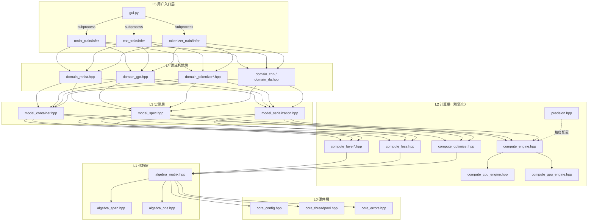

# AGENTS.md — AI 开发速览（neuralnet.cpp）

> 本文档专为 AI 编码助手编写：用最少 token 建立项目心智模型，快速开始开发。
> 人类向的完整文档在 `docs/`（索引见 §11）。**改代码前必读 §5 铁律与 §10 高频坑。**
> 本文只记录**当前状态**；演进记录、已修复勘误、被否决方案与性能 A/B 过程统一归档在 `docs/history.md`（索引见 §11）。当前能力清单见 §12。

## 1. 项目一句话

从零实现的 C++26 神经网络库：CPU / Vulkan 双后端，支持 MLP / ViT / GPT 训练推理 + BPE 分词器，可选 f16 混合精度。
`include/neuralnet.cpp/` 是 header-only 库（唯一入口 `nn.hpp`），`src/` 是可执行入口，`shaders/` 是 GPU 原语 shader。

## 2. 构建与测试

```bash
# 构建（默认 Release：-O3 -funroll-loops -march=native，Clang/GCC 另加 -fno-exceptions -Wall -Wextra -Wpedantic -Werror）
cmake -B build -G Ninja && cmake --build build

# 测试（默认关闭；开启后测试程序在 build/test/，并注册 ctest）
cmake -B build -G Ninja -DNN_ENABLE_TESTS=ON && cmake --build build && ctest --test-dir build
```

- 链接报 `permission denied`（`build/` 下 exe 正在运行被占用 → 构建中止，易误判为"未改动"）：追加 `-- -k 0` 让 ninja 跳过失败目标继续构建其余目标；被占用目标仍需关掉进程后重链。
- 编译器与标准库：**CMakeLists 不指定**（编译器由 CMake 默认探测或调用方 `CXX=...` / `-DCMAKE_CXX_COMPILER` 决定，标准库跟随编译器默认）；**CI 显式指定 clang++**（Linux/Windows，避免 GCC 独有警告在 `-Werror` 下失败）。标准库编译/链接两侧必须一致（否则链接期大量 `std::__cxx11::*` 未定义）。CMake 3.30+；已验证 Clang 22+（C++26）、g++ 15.2、MSVC（走 `/std:c++latest`）均可构建。
- 构建选项：`NN_ENABLE_NATIVE`（默认 ON，开启 `-march=native`，分发/CI 用 `OFF` 生成可移植基线）；`NN_ENABLE_TESTS`（默认 OFF）。
- Vulkan 可选：CMake 自动探测 Vulkan + glslc，找到则定义 `NN_HAS_VULKAN` 启用 GPU，否则纯 CPU。支持多 Vulkan 设备选择（`--gpu` 参数，见 `cli/cli_gpu_option.hpp`）。
- **本项目不支持 CUDA**：后端仅 CPU / Vulkan，CLI 无 `--cuda` 参数；文档勿声称支持 CUDA。
- 应用入口：`build/{mnist_train,mnist_infer,text_train,text_infer,tokenizer_train,tokenizer_infer}`，另有 `layer_bench`（性能）与测试类可执行文件。`gui.py` 是 Python GUI，`train_pkg.py` 打包 `.nnpkg` 训练包，`cli_controllers.py` 提供 CLI 控制逻辑。

## 3. 目录速查（改什么任务 → 看什么文件）

| 任务 | 文件 |
|------|------|
| 加/改神经网络层（Linear/Attention/Norm/激活…） | `compute_layer.hpp`（聚合头）+ `compute_layer_{base,mlp,conv,softmax,attention,feedforward,transformer,gpt,rapt}.hpp` |
| 加/改位置编码（Learned/Sinusoidal/RoPE/ALiBi/无） | `compute_position_encoding.hpp`（`PositionEncoder` 基类 + 子类 + 按注入点分开的两个工厂）+ `compute_layer_attention.hpp` 的 `AttnScoreMask` 族（掩码语义） |
| 加/改损失函数 | `compute_loss.hpp` |
| 加/改优化器（SGD/Adam/AdamW/Muon） | `compute_optimizer.hpp` |
| 加/改引擎原语（CPU 实现） | `compute_engine.hpp`（接口）+ `compute_cpu_engine.hpp` |
| 加/改引擎原语（GPU 实现） | `compute_gpu_engine.hpp` + `backend/compute_vk_backend.hpp` + `backend/compute_vk_device.hpp` + `shaders/*.comp` |
| 张量/设备抽象 | `compute_tensor.hpp` |
| 混合精度 / f16 类型系统 | `precision.hpp`（Precision 枚举、`nn::f16`、`PrecisionProfile`） |
| 矩阵/代数层（CPU 存储与手写内核） | `algebra_matrix.hpp` / `algebra_span.hpp` / `algebra_ops.hpp`（`Expression`/`BoolExpression` 概念在 `expr_dsl.hpp`） |
| 表达式 DSL / 融合 IR | `expr_dsl.hpp` / `expr_spec.hpp` / `expr_opt.hpp` / `expr_registry.hpp`（IR-C 图融合未采用、无 `expr_graph.hpp`；取舍记录见 `docs/history.md`） |
| 后端代码生成（IR-D emitter 抽象） | `expr_emitter.hpp`（注册表）+ `expr_glsl_gen.hpp`（GlslEmitter） |
| 模型容器/规格/序列化 | `model_container.hpp` / `model_spec.hpp` / `model_serialization.hpp` / `model_keyvalue_record.hpp` |
| MNIST / GPT / CNN / RLA / 分词器 模型工厂 | `domain_mnist.hpp` / `domain_gpt.hpp` / `domain_cnn.hpp` / `domain_rla.hpp` / `domain_tokenizer{,_base,_bpe,_charbpe}.hpp` |
| 训练/推理 CLI 入口 | `src/mnist_train.cpp` 等；公共 CLI 逻辑在 `include/neuralnet.cpp/cli/`（**`cli_help.hpp` = 各 `--help` 的统一排版器**：宽度感知对齐、统一版式；改帮助/加选项前先读其文件头的审计约定） |
| 构建期工具（AOT 融合） | `tools/scan_exprs.cpp`（**单步** = 收集 + 生成）/ `tools/fused_generate.hpp`（生成阶段，原独立工具 `gen_fused`；另有 `tools/decode_fused.py` 调试用）。**库外使用者**：CMake 函数 `nn_enable_gpu_fusion(<target> MAIN <含 main 的源>)`（定义在 `CMakeLists.txt`，样例 `examples/fusion_custom_layer*`） |
| 批量改写 / 一致性审计（改多处时用，均带 `-DryRun`） | `tools/edit_ranges.ps1`（行区间删除：四重断言 + **花括号平衡护栏**）/ `tools/test_refactor.ps1`（删定义块 / 插 include / 正则替换）/ `tools/apply_nn_try.ps1`（`auto X = f(); if (!X) …` → `NN_TRY`/`NN_TRY_CHECK`，L2 层，带 `-DryRun` 计数）/ `tools/doc_rename.ps1`（文档词法改名）/ `bench/doc_align_audit.ps1`（文档↔代码对齐审计：文件/符号/CLI/数字/测试名）/ `bench/doc_inventory.ps1`（引擎接口盘点 + **第 [4] 节 L2+ 分层审计：`Matrix`/Matrix 型 I/O 动词零命中门禁，铁律 #12**） |
| 与 PyTorch 对拍 | `compare_with_torch/`（model.py / text_train.py / text_infer.py） |
| GUI ↔ CLI 一致性（改 `gui.py`/`cli_controllers.py`/任一 CLI 选项后跑） | `bench/gui_cli_audit.py`（三节：GUI→CLI flag 差集 + 反向缺失、幽灵选项=帮助声明 vs 解析分支、`gui.py` 的 `self.X` 赋值静态校验；退出码 0 = 无偏差。复现：`python bench/gui_cli_audit.py`） |

## 4. 分层架构（L0→L5，严格单向依赖，上层只依赖下层公有接口）

### 4.1 架构概览图


```mermaid
graph TB
    subgraph "L5 用户入口层"
        A["mnist_train/infer"]
        B["text_train/infer"]
        C["tokenizer_train/infer"]
        D["gui.py"]
    end
    
    subgraph "L4 领域构建层"
        E["domain_mnist.hpp"]
        F["domain_gpt.hpp"]
        G["domain_tokenizer*.hpp"]
        F2["domain_cnn / domain_rla.hpp"]
    end
    
    subgraph "L3 实现层"
        H["model_container.hpp"]
        I["model_spec.hpp"]
        J["model_serialization.hpp"]
    end
    
    subgraph "L2 计算层（引擎化）"
        K["compute_engine.hpp"]
        L["compute_cpu_engine.hpp"]
        M["compute_gpu_engine.hpp"]
        N["compute_layer*.hpp"]
        O["compute_loss.hpp"]
        P["compute_optimizer.hpp"]
        P2["precision.hpp"]
    end
    
    subgraph "L1 代数层"
        Q["algebra_matrix.hpp"]
        R["algebra_span.hpp"]
        S["algebra_ops.hpp"]
    end
    
    subgraph "L0 硬件层"
        V["core_config.hpp"]
        W["core_threadpool.hpp"]
        X["core_errors.hpp"]
    end
    
    D -->|subprocess| A & B & C
    A & B & C --> E & F & G & F2
    E & F & G & F2 --> H & I & J
    H & I & J --> K & N & O & P
    K --> L & M
    N & O & P --> Q
    P2 -.精度配置.-> K
    Q --> R & S
    Q --> V & W & X
```

### 4.2 核心设计原则

**引擎化（Engine-Based）**：Layer 的 `forward/backward` 只写一次，通过 `ComputeEngine&` 参数自动适配 CPU/GPU。

**算法与原语分离**：
- Engine 只提供 op-level 原语（`matmul`/`add`/`exp`/`reduce`…）
- Layer 用原语组合表达算法（`ReLU = max(x,0)`）
- Engine 不知道 "ReLU" 是什么

**数据流**：
```
Matrix → engine.from_matrix → Tensor[GPU] → forward/loss/optimizer 全程在 GPU → 仅 evaluate 时 to_matrix 回 CPU
```

**多精度**：`Precision`（F16/F32；BF16/F64 为保留值，使用即报错）贯穿张量存储与算子输出；`PrecisionProfile{param/compute/stable/optimizer}` 做模型级配置。语义锚点见 `precision.hpp` 头注释与 `docs/development/05-mixed-precision.md`。

### 4.3 ComputeEngine 原语分类

| 类别 | 原语 |
|------|------|
| 矩阵级 | `matmul/batched_matmul/matmul_with_bias/transpose/add_inplace/accumulate/scale_inplace/zero` |
| 归约级 | `row_reduce_sum`、`col_reduce_sum/max`、`grouped_reduce_sum/max`（沿行方向按固定长度 R 分组归约，池化/多头等场景免逐通道循环） |
| 数据操作 | `slice_rows/insert_rows/gather_rows/scatter_add_rows/rearrange_3d/im2col/col2im/clone/copy_from/cast`（`im2col/col2im`：卷积/池化窗口展开与伴随散射，纯数据搬运） |
| 扫描级 | `scan_prefix_outer/scan_suffix_outer/outer_col`（RLA/RAPT，dk≤64，见 docs/development/06 §扫描原语） |
| 表达式 | `eval_expr/eval_expr_into/eval_expr_reduce`（AOT 融合 shader 入口） |
| 批次/内存 | `begin_batch/end_batch/flush_batch/release_idle_pool_blocks/pool_stats` |
| offload | `create_offload_buffer/offload_save/offload_restore`（activation offload） |

> 引擎共 **49** 个 virtual 方法（复现：`bench/doc_inventory.ps1` 的 `virtual methods`；M6 新增 `import_impl` 使其由 48 → 49；`grep -c "\bvirtual\b"` 原始计 51 处 = 49 方法 + 析构 1 + 注释里的词 1）；逐元素/广播等计算类原语一律经表达式
> DSL 求值，不经 Layer 直调（`dsl::row_reduce_max` 是 DSL 叶子，不是引擎算子）。CRLF/`scan_exprs` AOT 键规则见 §7。

### 4.4 理解优先级（建议学习顺序）

1. **先理解 L0-L1**（基础数据结构）：`Matrix`、`Tensor`、`Scalar`
2. **再理解 L2 核心**：`ComputeEngine` 接口 + 一个简单 Layer（如 `Linear`）
3. **然后理解 L3**：`Model` 容器如何组合 Layer
4. **最后理解 L4-L5**：具体模型实现和训练流程

## 5. 铁律（违反必出 bug）

1. **禁止 throw/try/catch**：编译期 `-fno-exceptions` 强制。错误一律 `Result<T> = std::expected<T, Error>`（`core_errors.hpp`）。**传播写法统一走 `NN_TRY(decl, expr)` / `NN_TRY_CHECK(x)`**（L2 层 494 处已收敛，见 `core_errors.hpp` 宏注释）——展开后与手写 `auto r = expr; if (!r) return std::unexpected(r.error());` 逐字等价；新代码请沿用该形态。
2. **禁止 new/delete/裸指针所有权**：`std::vector` / `std::unique_ptr` / `std::span`。
3. **分层职责单一**：Matrix（L1）不写神经网络算法；Layer（L2）不写底层计算；原语 shader 永不含算法（ReLU/Softmax/Attention 等一律来自 Layer 或 DSL）。
4. **不穿透接口**：上层不访问下层内部数据结构（`.data()` 等），改一个模块只改一个头文件。
5. **布局全局统一 batch-major**：序列展平列序 `i = b*seq + t`（batch 在列方向）。position-major（`i = t*batch + b`）会造成跨样本串扰，任何情况下不得混用。**所有注意力/序列相关测试必须覆盖 batch>1**（batch=1 时两种布局重合，测不出）。
6. **GPU 命令录制生命周期**：录制期（`begin_batch`→`end_batch` 之间）引用的所有张量必须存活到 `end_batch()` 之后；GPU buffer 销毁走 `pending_destroys_` 延迟队列。
7. **AOT 闭合世界**：GPU 表达式 shader 全部构建期生成，运行时按 `expr_spec_key` 精确匹配，**未命中硬报错**，无 eager、无运行时编译。
8. **确定性**：任何"依赖容器迭代顺序"的决策点（BPE 平局打破、ID 分配等）必须显式排序/按 key 打破平局；并行化后结果必须与单线程逐字节一致。
9. **大词表禁止物化 one-hot**：用 `CrossEntropyLoss::forward_sparse`（整数标签 + loss_mask）。
10. **`//` 注释中禁止出现 `\` 反斜杠**（尤其行尾）：GCC 行拼接会把下一行并入当前注释——轻则 `-Wcomment -Werror` 编译失败，重则下一行代码被静默吞掉。
11. **张量存储不可绕过引擎（M1，docs/development/17 §4.1）**：一切 Tensor 的创建/读写/reshape 必须经 ComputeEngine（`create_tensor/from_matrix/to_matrix/reshape` 等）；存储访问器（`cpu_matrix/cpu_shared/gpu_tensor/gpu_shared`）与静态直构工厂（`Tensor::from_matrix/cpu/...`）**已私有**，绕过 = 编译错误。库内豁免仅两条：引擎 friend（ComputeEngine/CpuEngine/GpuEngine）与 `detail::TensorAccess`（DSL 求值器专用通道，**库外禁用**，违反靠 grep 审计抓）。
12. **L2+ 计算路径禁用 Matrix（M4，docs/development/17 §4.6 + §3 D11）**：Layer/Loss/Optimizer/Model 头文件里不得出现 `Matrix`/`MatrixT` 类型，也不得调用 Matrix 型 I/O 动词（`from_matrix`/`to_matrix`/`copy_from`）。层自算的辅助数据（索引/位置编码/掩码/斜率/编码表等——没有引擎侧生成原语的那类）一律走 **span 宿主桥** `detail::upload_span/download_span/download_vector`（内部是 M3 的批量 `write`/`read`，见 `compute_engine.hpp` 尾部）或 `create_tensor`+`InitSpec`/`zero` 就地建张量；数据集、预训练权重、对拍与落盘等大批量 I/O 仍在 I/O 层用 `from_matrix`/`to_matrix`。**审计口径**：`pwsh -File bench/doc_inventory.ps1` 第 [4] 节，验收 = `L2-VIOLATIONS: 0`（宿主桥用量只披露不判违规）。

## 6. 数据布局约定

```
Matrix: 行主序 (rows, cols)，data_[row*cols + col]
神经网络张量: 列主序 batch-major
  输入 (feature_dim, batch_size)   每列一个样本
  权重 (out_features, in_features)
  多头 Q/K/V: (H*d_k, batch*seq) → rearrange_3d → (batch*H*d_k, seq)
GPT 序列展平: 列序 i = b*seq + t（batch-major，全局唯一约定）
```

## 7. 表达式 DSL 与 AOT 融合管线（GPU 开发必读）

- Layer 内用 `nn::dsl`（`expr_dsl.hpp`）写普通数学表达式；CPU 编译期模板直接求值（内联+SIMD），GPU 折叠成 `ExprSpec`（扁平 IR，`expr_spec.hpp`）→ 按 key 查预编译融合 shader。
- 主要入口：`dsl::compute(engine, expr, rows, cols)`（一行表达式，最常用——**必带输出形状**，没有 2 参重载）；把结果写进既有张量（原地更新，零分配）用 `dsl::compute_into(engine, expr, dst)`；归约语义用 `dsl::compute_reduce`。**跨表达式融合（IR-C：`start_expr/end_expr`、`begin_expr/end_expr`、`expr_graph.hpp`）未采用**，当前没有任何跨表达式录制机制——取舍记录与重新立项前提见 `docs/development/03-ir-optimization.md` §5.3。分组归约（MaxPool 窗口等）用 `dsl::grouped_reduce_sum/max(tensor, R)` 视图（**R 走运行期视图参数 `vp`、不进 key**——同一结构不同 R 共享一个 shader）；**alpha 缩放**写成 `dsl::matmul(..., batch) * dsl::rparam(alpha)` 尾链（rparam 值不进 key）。
- **fold 段（P-C1/C2）**：`ExprSpec.fold = FoldSpec`（分块状态归约：键域逐块 body + 行标量态跨块进位 + `vecacc` 行向量态块累加 + 向量域 finalize）——**通用折叠表达式机制，不含任何注意力专属语义**（与注意力无关的通用样例 rowmax/rowsum/softmax_denom 在 `expr_fold.hpp`）。注意力 forward 直调 `engine.eval_expr(make_fold_attn_o(...))`（**不经 DSL 钩子——scan 显式登记块是 fold spec 唯一注册来源**）；该构造与**掩码种类 `AttnMaskKind`（Plain/Causal/CausalDoc）定义在 `compute_layer_attention.hpp`**（按 AOT 原则"表达式文本只出现在 Layer"归位）——位置偏置是**正交的第二入参** `bool score_bias`（由 `PositionEncoder::has_score_bias()` 给出），实际登记 5 个组合（3 掩码 × 2 偏置 − 1；漏登记即 GPU 闭合世界硬报错）；`FoldSpec.tri_skip`（行界整块跳过）进 key（codegen 分歧点）；`EXPR_FOLD_BLOCK=128`/`EXPR_FOLD_ROWS_PER_WG=2` 为 CPU/GPU 共享常量（改则两侧同改）。详见 `expr_fold.hpp` 与 `expr_spec.hpp` 的 FoldSpec 注释。
- **构建期单步**（CMake 自动编排，改 Layer 内联表达式后重跑构建即可）——`scan_exprs` 同进程**收集 + 生成**：
  1. **收集**：只收集**结构**（= 唯一需要构建期枚举的东西）。两个来源**互补、不冗余**（`NN_SCAN_DUMP_SOURCES=1` 可逐条打印来源）：`FusedAnchor<Expr>` 在静态初始化期按表达式**类型**自登记（编译期可达，dry-run 跑不到的分支也覆盖）；per-layer dry-run + 模型 pass 执行补齐**运行期配置决定**的变体（视图种类/项数在类型层面推不出，符号实例 `Expr{}` 与真实实例会折叠出不同 key）；fold spec（3 掩码 × 2 偏置的 5 个组合等 8 条）与 matmul trans 族由 `scan_exprs` **显式登记**。**只跑 f32 一遍**——实测 f16 遍对结构贡献为 0（跳过它签名 66 → 0、结构恒 84），该两遍已删除。**实测分工（84 条）**：per-layer dry-run 38（含模型 pass +25、显式登记 +8）、锚点 59，重叠 46 → **锚点独有 13、dry-run 独有 25**。所以**任何一方单独删掉都会丢结构**——dry-run/model pass 是结构的主要来源，删不掉。
  2. **生成**：`tools/fused_generate.hpp`（原独立工具 `gen_fused`）对**每个结构发三份**：V0 全 f32（键 = `key`）/ **V1 运行期精度分派**（键 = `key#x`）/ V2 native16（键 = `key#a`，按 `expr_prec_sig_native16` 的**结构谓词**判定）→ 经 `emitter_registry` 选后端（默认 `"glsl"` = `GlslEmitter`）生成 GLSL → glslc → 内联 SPIR-V → `build/generated/fused_registry.hpp`。**不经 `.bin` 中间序列化**（`write_registry/read_registry` 已删除）。
- **精度签名不再是构建期集合**（"签名从身份降级为参数"）：V1 的 GLSL 对每个输入/输出各声明 f32 + `float16_t` 双视图，加载/存储处按 push constant `uint prec`（bit i = 输入 i 为 f16，bit16 = 输出 f16）走 uniform 分支，**一份 shader 覆盖任意签名**。因此运行期**不存在 miss、不存在边界 cast 回退、不存在回填清单**（`tools/prec_backfill.txt` 已删除，`NN_PREC_TRACE` 的"补变体"流程随之失效）。V1 对每个结构无条件生成 ⇒ 任何签名都命中。
- **新增调用点无需改动其他文件**（实测）：在 Layer 头里新写一个 `dsl::compute`（其结构不在任何 dry-run / 模型 pass 覆盖内）→ 锚点独有 13 → 14、结构 84 → 85、注册表新增 `key` / `key#x` / `key#a` 三条，**其他文件零改动**。
- **库外使用者：`nn_enable_gpu_fusion(<target> MAIN <含 main 的源>)`**（`CMakeLists.txt`）：使用者在自己的层头里写 `dsl::compute` + 在 CMake 加这一行 → 自动生成**该目标专属**的 `fused_registry.hpp` 并加进它的 include path。机制 = 收集器由**库内收集逻辑**（`tools/scan_exprs.cpp`：锚点 + dry-run + 模型 pass + 显式登记）**加上本目标的全部 TU**（`-DNN_EXPR_SCAN` 编译，让使用者的调用点自登记）组成。**⚠ 必须保留库内收集逻辑**：84 个结构里只有 13 个来自编译期锚点、71 个来自 dry-run/模型 pass，"纯锚点收集器"会漏库自身的结构。**⚠ include 顺序有语义**：`${NNF_OUT_DIR}` 必须排在 `${CMAKE_BINARY_DIR}/generated` 之前（后者含库自身注册表与手写原语 shader 嵌入头），否则 `__has_include("fused_registry.hpp")` 会解析到库的那一份、使用者的自定义结构全部闭合世界报错。样例见 `examples/fusion_custom_layer*`。
- **端到端验收（库外 + f16 分派）**：`build/fusion_custom_layer_example.exe` 实测两种**自研算子形态**：①逐元素 `exp(|x|·α)/(√|y|+α)`；②归一化形态 `rsqrt(col_reduce_sum(x)·inv + ε)`（= 库内 LayerNorm/RMSNorm 的 `std_inv` 同形，`raxis=1`、`viewkinds=[0,8]`，属库里"只有执行 Layer 才拿得到"的那一类）。两者都只用**锚点**（自定义层没有 dry-run）→ 都命中并跑通 ⇒ `nn_enable_gpu_fusion` 对常见自定义层可靠。实测值：CPU f32 `0.6712035`（差 0）；**GPU f32（V0）`0.6712036`（差 5.96e-08）**；**GPU f16（V1 运行期精度分派）`0.6708984`（差 3.05e-04，f16 舍入内）**；归一化形态 GPU f16 `1.2246094`。含 rparams ⇒ native16 谓词不通过 ⇒ f16 命中必然是 `key#x`；注册表若漏了它就是闭合世界硬报错，"跑通"本身即断言。**残余不确定性**：库内确有 25 条结构只有执行 Layer/模型才拿得到（锚点的符号实例 `Expr{}` 与运行期实例折叠结果不同）；实测的两种自定义形态不在其中，但无法先验排除。若使用者的自定义层遇到闭合世界报错，下一步是给 `nn_enable_gpu_fusion` 加 `COLLECT <file>` 钩子（由使用者提供"跑一遍自己的层"的收集函数，等价于库内的模型 pass）。
- **库是 header-only，多 TU 必须可链接**：头里的类外定义一律要 `inline`（曾漏 `GpuBuffer::~GpuBuffer` → ≥2 个 TU 的程序链接期 duplicate symbol，`examples/fusion_custom_layer*` 抓到）。
- **IR-D emitter 抽象**（`expr_emitter.hpp`）：把后端代码生成从 GLSL 专用抽象为 emitter 接口（一份 canonical IR → 多后端代码），`--list-backends` 可列出注册后端。目前仅 `glsl` 后端注册（无 `CpuEmitter`/`CudaEmitter` 实现）。
- 手写原语 shader 在 `shaders/*.comp`（matmul、matmul_tiled、matmul_gemv、batched_matmul、reduce、elementwise_v2、transpose、gather、scatter_add、rearrange_3d、im2col、col2im、group_reduce、scan_prefix_outer、scan_suffix_outer、scan_prefix_outer_gen、scan_suffix_outer_gen（gen = 通用 dk 版，dk>64 后端走它）、outer_col、cast），构建期 glslc 编译并嵌入 C++ 头文件；多数 shader 另用 `-DNN_SHADER_F16=1` 编一份 f16 变体（`NN_ETYPE=float16_t`，f32 分支留在 `#else`）。
- IR 优化 pass（canonicalize/CSE/寄存器分配）见 `expr_opt.hpp`，设计文档 `docs/development/03-ir-optimization.md`（IR-C 取舍记录在其 §5.3，归档正文在 `docs/history.md`）。

## 8. 训练循环范式（写新入口时照抄）

```cpp
#include <neuralnet.cpp/nn.hpp>
nn::CpuEngine engine;                       // 或 nn::GpuEngine（NN_HAS_VULKAN）
auto model_r = nn::build_gpt_model(engine, vocab, d_model, seq, heads, d_ff, layers);
nn::Model model = std::move(*model_r);
// 优化器工厂：sgd / sgd_momentum / adam / adamw / muon
auto optimizer = nn::create_optimizer("adamw", engine,
    model.parameters(), model.param_gradients(), /*lr=*/1e-4, /*wd=*/0.01);

nn::CrossEntropyLoss ce_loss;
// 每 step（GPT 用 forward_sparse 稀疏路径，不物化 one-hot）：
model.zero_grad();
auto x = engine.from_matrix(batch);         // Matrix → Tensor
auto logits = model.forward(*x);
auto loss = ce_loss.forward_sparse(engine, *logits, labels, loss_mask, vocab);
auto grad = ce_loss.backward();             // (vocab, total) 梯度
model.backward(*grad);
optimizer.step();
```

> 注意签名细节：**`Layer::forward/backward/zero_grad/forward_recompute` 自 M6 段 C 起不带 engine 参数**（engine 在 `init(engine)` 时绑定到层内 `engine_`；方法体里用函数首行的局部 `ComputeEngine& engine = engine_ref()`，DSL 入口照旧收 engine 形参）。`Model::forward/backward/zero_grad`、`Loss::backward`、`Optimizer::step/zero_grad` 本来就不带 engine；**仍需显式传 engine 的**：`Loss::forward/forward_sparse`、`engine.from_matrix`、以及 `PositionEncoder`/`RotaryEmbedding` 这类辅助对象（`apply/backward`）与层内私有 helper。**手工构造的层必须先 `layer.init(engine)`**（`Model::add` 会自动调）——未绑定即 fail-fast 并打印调用点 file:line。

- 模型工厂：`nn::build_mnist_mlp_model(engine)` / `build_mnist_transformer_model(engine)` / `build_gpt_model(...)` / `build_gpt_model_from_spec(spec)`。
- 逐层构建：`model.add<nn::Linear>(784,256); model.add<nn::ReLU>(); model.add<nn::Linear>(256,10);`——`add<T>(args...)` 是模板方法（无链式 API），返回 `Result<void>`，须检查错误；层构造后自动 `init(engine)`。
- 序列化：`save_model` / `load_model` / `peek_model_spec`（`model_serialization.hpp`，v4 自描述格式）；`.nnpkg` 训练包见 `docs/usage/04-train-package.md`。
- GPT/RAPT 高级特性（`GPTModel` / `RAPTModel`，`compute_layer.hpp` 尾部）：梯度检查点（`checkpoint_every_`）、activation offload、文档感知掩码（`set_doc_ids`）、batch flush 粒度。RAPT 与 GPT 同档支持前三者（`RAPTModel::set_checkpoint_every/set_activation_offload/set_flush_interval`），offload 走共用实现 `ActivationOffloader`（`compute_layer_base.hpp`）。

## 9. 关键常量与配置（`core_config.hpp`）

- `Scalar = float`；`BLOCK_SIZE = 64`（matmul 分块，b_block 栈预算 64KB）；`PARALLEL_THRESHOLD = 524288`（自适应并行阈值，由 `nn::parallel_for_blocks/parallel_for_samples` 门控）。
- 不使用 `-ffast-math`（保 NaN/Inf，训练稳定性）。

## 10. 高频坑（Top 8，详见 `docs/development/08-pitfalls-and-lessons.md`）

1. **布局混用**：position-major vs batch-major → 跨样本串扰、loss 平台期。改序列代码先确认列序约定。
2. **GPU 双存储影子一致性**：CPU/GPU 双存储是分布式状态机问题；GPU-resident 路径已禁用，走 staging（每次算子往返 PCIe）。
3. **录制期 use-after-free**：局部张量在 `end_batch()` 前析构 → `VK_ERROR_DEVICE_LOST`。
4. **TDR/设备死亡**：`VK_ERROR_DEVICE_LOST` 不可重试（存 checkpoint 退出）；`VK_TIMEOUT` 可减半 batch 重试。
5. **缓存 key 冲突**：naive 位域/组合 key 会撞车，用强哈希（FNV-1a）或双字段。
6. **零拷贝 reshape 的 CPU/GPU 语义差异**：CPU 分支 reshape 需复制数据，GPU 保持零拷贝。
7. **内存爆炸**："所有出现位置"类索引随输入线性膨胀、大词表 one-hot 物化都会把内存吃到几十 GB 级。先做内存预算（历史量级见 `docs/development/08-pitfalls-and-lessons.md`）。
8. **gradcheck 必须先 forward** 填充 `input_cache_` 再 backward，否则空缓存崩溃。

## 11. 文档索引（docs/，按类别子目录组织）

### 总档

| 文档 | 何时读 |
|------|--------|
| `history.md` | **全仓唯一的历史状态归档**：演进记录 / 已修复勘误 / 被否决方案 / 性能 A/B 过程。代码注释与其他文档只记录当前状态；查"为什么当初这么改、旧数字是多少"只来这里 |
| `release-notes/v*.md` | 面向使用者的版本变更说明（破坏性 API 变更 + 迁移指南 + 验收基线）。当前为 `release-notes/v1.5.0.md`（v1.4.6 → 底层统一 M1–M6 + 位置编码重构 + 分词器优化） |

### 介绍类（docs/introduction/）

| 文档 | 何时读 |
|------|--------|
| `introduction/01-architecture.md` | 需要完整分层/数据流/模块详解时（**含快速理解指南和理解路线图**） |
| `introduction/02-performance.md` | 性能优化（自适应并行、缓存分块、GPU） |
| `introduction/03-algorithm-reference.md` | 每个 Layer/Loss/Optimizer 的数学与原语分解 |
| `introduction/04-innovative-designs.md` | 创新设计全景 |

### 开发类（docs/development/）

| 文档 | 何时读 |
|------|--------|
| `development/01-compute-engine-development.md` | **计算引擎开发指南：接口详解、实现模式、添加新原语** |
| `development/02-operator-fusion.md` | **算子融合全篇（当前形态与设计约束）：IR 扩展（归约语义）→ 表达式录制 → matmul 参与 IR 融合 → 跨 kernel 自动融合（一期 M1-M7 + 二期 S1-S5/S7；分期实施流水与否决方案见 `docs/history.md`）** |
| `development/03-ir-optimization.md` | IR 优化（现行 IR-A/B/D；**IR-C 图融合未采用——取舍记录正文在 `docs/history.md`，重新立项前提见其 §5.3**） |
| `development/04-memory-optimization.md` | 显存优化：L1 激活重计算（梯度检查点）/ L2 内存池整块归还；L3 远期 |
| `development/05-mixed-precision.md` | **多精度计算（f16/混合精度）：Precision 类型系统、类型化存储、硬件/兼容路径分派、显式精度推导、PrecisionProfile（param/compute/stable/optimizer）、当前实测结论与已知数值限制（§12）** |
| `development/06-rapt-algorithm.md` | **线性注意力（RLA → RAPT → RLA-2）：直观理解 + 数学定义 + 扫描原语工程落地 + 训练显存开关** |
| `development/08-pitfalls-and-lessons.md` | **踩坑警示录，改代码前读** |
| `development/10-development-standards.md` | C++ 编码规范全文 |
| `development/12-compute-engine-inventory.md` | **引擎接口盘点（复现：`bench/doc_inventory.ps1`）：49 个 virtual 方法、Layer 直调 21 个（基础设施/数据搬运/状态扫描/fold 登记）、两套 CPU 求值机制（DSL 模板 + IR 解释器）、ctest 21 个测试；演进记录见 `docs/history.md`** |
| `development/13-refactor-backlog.md` | **已合并的重定向 stub（2026-10-01）：未完成项与裁定台账迁入 `development/18-roadmap.md`；已完成 / 被否决 / 已执行记录在 `docs/history.md`** |
| `development/15-computeengine-refresh.md` | **ComputeEngine Refresh 详细设计（13 §10 展开）：张量出生绑定 + `import` + 存储多态；含 P-1（PrecisionEngine 下沉删除）与 P1（出生绑定 + `bind_check_` 跨引擎检查 + `adopt` 内部通道，**两项均已实施 2026-09-29**）与 D1-D9 未决点裁定；**未实施的 P2-P6 已被 17 吸收改期（M1-M7），后续立项读 17** |
| `development/16-computeengine-p0-inventory.md` | **Refresh P0 盘点结果（2026-09-28）：ensure_gpu 43 分类 / ComputeEngine& 175 打标 / 宿主中转 381 清单 / ctest 双基线（Lavapipe 20 20、Mali offload 非确定）/ GPU 稳定性探针与未决 7 项** |
| `development/17-unified-tensor-engine.md` | **统一 Tensor/ComputeEngine/MemoryPool 底层架构总纲（2026-09-30 裁定；M1-M6 全部已实施 2026-09-30，仅 M7 未立项）：访问不变量（Tensor 存储私有、一切经引擎，已立为铁律 #11）、InitSpec 声明式初始化、批量 read/write、Matrix 降级为宿主 I/O 载体（L2+ 禁用 = 铁律 #12）、内存池契约统一、`import` 跨设备拉取、Layer 删每调用 engine 形参（M6 段 C，Loss/DSL/辅助对象保留形参见 §8）；吸收 15 未实施的 P2-P6（改期 M1-M7）。立项前先读本文件 + §5 分期 + §8** |
| `development/18-roadmap.md` | **未来方向路线图 + 未完成项裁定台账（2026-10-01，13 号清单的承接者）：P0-P3 分期、13 号逐条裁定（做/条件触发/不做）、触发式立项条件、非目标、门禁与验收口径。要规划下一步、查某件事该不该做、避免重复立项时读本文** |
| `development/14-f16-stable-gpu-loss-frozen.md` | **故障报告（2026-09-26，未修）：GPU `stable=f16` 训练 loss 打印冻结（权重不冻结）——触发矩阵、测试覆盖缺口、证据与复现** |

### 使用类（docs/usage/）

| 文档 | 何时读 |
|------|--------|
| `usage/01-quickstart-model.md` | 构建模型 API 教程 |
| `usage/02-quickstart-train-infer.md` | 训练/推理 CLI + C++ API + GUI |
| `usage/03-compute-engine-usage.md` | 计算引擎使用指南：张量操作、矩阵运算、表达式融合 |
| `usage/04-train-package.md` | `.nnpkg` 训练包 |

## 12. 当前状态

> 本节只列**当前事实**；演进记录、已修复勘误、被否决方案与性能 A/B 过程见 `docs/history.md`。

### 已知问题

- **GPU `stable=f16` 训练 loss 打印冻结（未修）**：`text_train --precision-stable f16` 时 step 恒 4.0137、跨 epoch/跨进程逐位相同；**权重照常更新**（同进程跨 epoch 模型快照 63% 参数字节不同，冻结仅在 loss 回读链）；CPU 同配置健康；ctest 全绿（21/21）但**无 GPU+stable=f16 用例**。触发矩阵、覆盖缺口与证据见 `docs/development/14-f16-stable-gpu-loss-frozen.md`。推荐路径 `--f16`（stable/optimizer=f32）实测健康。
- **数值性限制**：四字段全 f16 不可训练——`optimizer=f16` 单独即令 Adam 更新爆炸、`stable=f16` 链约 200 步 NaN，见 `docs/development/05-mixed-precision.md` §12.5；常规 f32 训练健康收敛。
- **不存在的 CLI 参数**：`--tdr-retry`/`--max-tdr-retries` 与 `mnist_train --osc-guard`/`--osc-window`/`--osc-threshold`（**均已移除**：前两者从未实现，后三者属"帮助声明了、解析分支不存在"的幽灵选项，2026-10-01 已从帮助/控制器/GUI 三层清除，详见 `docs/history.md`「GUI / CLI 参数一致性清理」）。
- **`text_train --model zipt` 启动即中止（未修）** → **已随 ZiPT 整体移除而消失（2026-10-01）**：AttnZip/ZiPT 已从主线移除（`--model zipt` 现在直接报"未知模型架构"并给出迁移提示），代码保留在 **`legacy/zipt` 分支**。**恢复前提（两条同时满足）**：① **算法层**——压缩向量必须因果（压缩器只能看当前位置之前的内容）；② **代码层**——实现质量对齐 RAPT/GPT（支持 `forward_recompute` 梯度检查点与 activation offload、CLI/序列化/测试齐备）。裁决依据见 `docs/history.md`「ZiPT 移除」条。已移除的 API：`ZiPTModel`/`ZiPTBlock`/`CrossAttention`、`build_zipt_model*`/`make_zipt_spec`/`ZiPTConfig`/`ZIPT_MEMORY_TOKENS`、`ModelSpec::is_zipt()` 与 `memory_tokens`/`window` 字段、CLI `--model zipt`/`--window`/`--memory-tokens`、`zipt_test`；`ModelType` 的 6 号枚举保留为 `Reserved_ZiPT` 占位，用于对旧 `.bin`（type=6）给出明确错误。

### 已交付能力（当前功能清单）

- **混合精度**：`precision.hpp` 的 `Precision`/`PrecisionProfile{param/compute/stable/optimizer}`；CPU/GPU f16 路径 = 边界 cast（`ComputeEngine` 基类 NVI 入口，**原 `PrecisionEngine` 装饰器已删除下沉**，见 15 §4.1）+ in-kernel f16 带类型变体 + op-level f16 GEMM（一份 .comp 用 `-DNN_SHADER_F16=1` 编第二份 SPIR-V）；`--f16` = `profile_f16()` = {param:F16, compute:F16, stable:F32, optimizer:F32}，实测峰值显存低于 f32（`docs/development/05` §12.11）。
- **线性注意力**：RLA-2 / RAPT（`docs/development/06`）。
- **张量出生绑定（Refresh P1，2026-09-29）**：`Tensor::engine_` observer + `bound()`/`engine()`；库内产物出生即绑定——引擎公共入口（含 `create_tensor`/`from_matrix`/`cast` 等已 NVI 化的工厂）统一 `stamp_`，`dsl::compute`/`compute_reduce` 静态工厂出口经内部 `adopt` 通道；公共入口带 `bind_check_` 跨引擎检查（**双方都绑定且指针不同 → 硬错误**，单侧未绑定放行；`NN_BIND_DEBUG=1` 时未绑定输入也报错，用于抓库内漏网与库外迁移清单）。**库内新增 Tensor 出生点必须走引擎入口或 `adopt`，新引擎入口须带 `bind_check_`+`stamp_`**（模板见 `docs/development/01` 步骤 1，取舍见 15 §3.1/§4.3）。
- **访问收口（统一总纲 M1，2026-09-30）**：Tensor 存储访问器与静态直构工厂**私有化**（铁律 #11），库外（9 测试文件 + text_train + scan_exprs）全部迁 `engine.create_tensor/from_matrix/to_matrix`；`ComputeEngine::reshape` 落地（D10，元素数不匹配返回 Result 错误）；DSL 求值器经 `detail::TensorAccess` 域内通道。验收：ctest 19/19 + CPU 探针逐位一致 + scan 双 hash 不变（详见 17 §5 M1 行与 `docs/history.md`）。
- **声明式初始化（统一总纲 M2，2026-09-30）**：`InitSpec`（Uninitialized/Zero/Constant/Uniform/Normal）+ `engine.create_tensor(rows, cols, P, spec)` 四参重载——**层算分布参数、引擎填数**（host 生成后上传，策略调用方不可见）；分布类 seed 必填（U1 裁定，层传 `kInitSeed = 42`），引擎内按创建序号混流防同 seed 撞流（同形状多层不互为镜像）。`Layer::init` 全部迁声明式（Linear/Conv2D/LayerNorm/RMSNorm/token_emb/可学习位置编码/ones_row_），mlp/conv 的 `thread_local rng_` 与 init 侧 `random_device` 清零——**初值跨进程逐字节确定**；`generate()` 采样 RNG 与 `text_train` 数据洗牌 RNG 属运行期随机性，裁定不迁。验收：build 零告警 + ctest 全绿 + `gpu_stability_probe --init-hash` 全部模型跨进程 hash 一致 + scan 双 hash 不变（详见 17 §5 M2 行与 `docs/history.md`）。**ZiPT 移除后为 5 类模型**，当前锚：mnist_mlp `a22e807ee05ec3ac` / cnn `4020958a14160bbd` / mnist_transformer `04a72d865624042a` / gpt `8efa936ac5c8c9b2` / rapt `d1998412d41ef2a0`（rapt 锚由 `b037632f75b7159c` 变化的原因——探针同引擎顺序构建、`InitSpec` seed 按创建序号混流——见 `docs/history.md`「ZiPT 移除」条）。
- **批量读写（统一总纲 M3，2026-09-30）**：`ComputeEngine` I/O 分组新增 `read/write/get_index/set_index`（与 `from_matrix/to_matrix` 同组，D9 保留原名）——**批量 `read/write` 是本体**：span 元素类型与 `precision()` 精确匹配（U2：float↔F32、f16↔F16，错配运行期错误、类型非法编译期 static_assert），GPU `read` 隐含 flush+同步（走 `to_matrix` 同路）、`write` 覆盖既有存储不替换对象（宿主直写 / GPU 走 `copy_from` drain）；**索引级是语法糖**（宿主直读写，GPU 每次一整轮 staging，不承诺热循环性能）。测试 f32 填充/恢复路径迁 `write`（f16 转换填充保留 `copy_from`——其语义就是 f32 Matrix→f16 的转换入口）。顺带修复稳定性探针漏 `backend.initialize()` 的 GPU 崩溃（16 §7-2 根因）并补测：dev0/dev2/dev4 进程内+跨进程 loss/hash 逐字节一致。验收：build 122/122 + ctest 19/19 + `--io-roundtrip` CPU/GPU 全过 + CPU 字节锚不变 + scan 双 hash 不变（详见 17 §5 M3 行与 `docs/history.md`）。
- **Matrix 降级收口（统一总纲 M4，2026-09-30）**：铁律 #12 新立——**L2+（Layer/Loss/Optimizer/Model）头文件零 `Matrix`、零 `from_matrix/to_matrix/copy_from`**；层自算的辅助数据（RoPE cos/sin、正弦位置编码、ALiBi 斜率/偏置、文档掩码与边界、位置/词元索引、卷积置换与广播索引、patch 提取与散射、labels/mask 打包…共 45 处 I/O + 32 处类型）全部迁 span 宿主桥 `detail::upload_span/download_span/download_vector`（内部 = M3 批量 `write/read`，f16 目标按 RHE 同口径）或 `create_tensor`+`InitSpec`/`zero`。**审计**：`bench/doc_inventory.ps1` 新增第 [4] 节分层审计（注释剥离后匹配，`L2-VIOLATIONS` 验收口径 0，宿主桥用量只披露）；U5 落点裁定 = 扩展 doc_inventory。**字节零变化**：CPU `--steps 20` hash=`6f8849f14da23110`、GPU dev2 `8ef51b2927253c50` 均与迁移前逐位一致，scan 双 hash 不变，ctest 19/19（详见 17 §3 D11/§5 M4 行与 `docs/history.md`）。
- **内存契约统一（统一总纲 M5，2026-09-30）**：`pool_stats()` 不再有"CPU 返回空串"的空档——无池引擎走基类默认实现，返回宿主直配账本 **`direct{ blocks=… live_bytes=… peak_bytes=… total_blocks=… total_bytes=… }`**（账本 `nn::host_alloc_ledger()` 在 `algebra_matrix.hpp` 的 `MatrixT` 分配/释放三出口记账，relaxed 原子、只在分配路径）；GPU 照旧 `persist{…} transient{…} pending=…`。**两引擎同一动词、都非空**，训练日志一套代码读两个引擎；`release_idle_pool_blocks()` 对 CPU 是**语义成立的 no-op**（直配无整块可归还，已写进头注释与 04 号文档）。验收：CPU/GPU `NN_MEM_STATS=1 text_train` 实测两引擎都非空且随 model-built/optimizer-created 递增 + 四件套（build/ctest/字节锚/scan hash）全过（详见 17 §4.5/§5 M5 行与 `docs/history.md`）。
- **跨设备拉取 import（统一总纲 M6 段 B + 15 P3，2026-09-30）**：`ComputeEngine::import(src[, P])` 公共 NVI（`bind_check_` + `stamp_`）+ 新虚 `import_impl`（**virtual 方法 48 → 49，`doc_inventory` 口径；`grep -c "\bvirtual\b"` 原始 51 处**）。语义 = 同设备同精度零拷贝别名 / 同设备异精度引擎内 cast / 跨设备经宿主中转（基类默认内含同设备快路）；`GpuEngine::import_impl` 保留原 `ensure_gpu` 的宿主直传快路径（省一次宿主拷贝），并修掉它硬取 `cpu_matrix()`（F32 槽）对 f16 源取空指针的隐患。**16 §2 的 43 处 `ensure_gpu` 调用点已全部改名 `import`**（`ensure_gpu` 符号清零，命名即防线），返回新句柄、不改写 `src`（就地重绑定须调用点显式写）。**同批 M6 段 A**：15 D6-1（`load_model` 白做上传与 PCIe 往返收敛为 `copy_from` 一行，save→load→save SHA256 逐字节一致）、D6-3（`matmul_with_bias_impl` 默认宿主兜底改纯虚）、D7（`Model::set_engine` 死码删除）、D8（offload 占位改 `create_tensor`），并把 `NN_BIND_DEBUG=1 ctest` 打通成**可执行门禁**（19/19，含修两处库内中转漏网 + `bind_error_` 同步打 stderr）。验收：ctest 19/19（带与不带 NN_BIND_DEBUG 各一轮）、CPU 锚 `6f8849f14da23110` 与 **GPU dev2 `8ef51b2927253c50`** 逐位不变、scan 双 hash 不变、`--io-roundtrip` CPU/GPU 全过、L2 审计 0（详见 17 §5 M6 行/§8 交接与 `docs/history.md`）。
- **Layer 删每调用 engine 形参（统一总纲 M6 段 C + 15 P2，2026-09-30）**：`Layer::forward/backward/zero_grad/forward_recompute` **不再收 engine 形参**——engine 在 `init(engine)` 时绑定到层内 `engine_`（`init` 改 NVI：公共入口绑定后转 `init_impl`，17 处层 override 随之改名）；方法体用函数首行 `ComputeEngine& engine = engine_ref();` 局部引用（**DSL 入口保留形参**，15 §3.3），54 处定义 + 约 200 处调用点编译器穷尽驱动改写。**新不变量：复合层 `init_impl` 必须 init 全部子层**（含 ReLU/GeLU/SwiGLU/Softmax/`pos_encoding_` 这类无参量子层——本轮补齐 5 处；漏了会 fail-fast 并打印调用点 file:line）。`engine_ref()` 带 `source_location` 诊断；`scan_exprs`/测试里"构造后直接 forward"的层补 `init(engine)`（15 处）。**保留形参**（记录在 17 §8）：`Loss::forward/forward_sparse`（Loss 无天然绑定时机、测试里跨 CPU/GPU 复用，改法须先裁定构造签名）、DSL 入口、`PositionEncoder`/`RotaryEmbedding` 等辅助对象与层内私有 helper。验收：ctest 19/19（带与不带 `NN_BIND_DEBUG=1` 各一轮）、CPU 锚 `6f8849f14da23110` 与 GPU dev2 锚 `8ef51b2927253c50` 逐位不变、`--init-hash` 六模型与 M2 锚全同、scan 双 hash 不变、`--io-roundtrip` CPU/GPU 全过、L2 审计 0、layer_bench 正/逆序配对 A/B 无系统性回退（详见 17 §5 M6 行/§8 与 `docs/history.md`）。
- **训练稳定性**：防 NaN 跳步。
- **训练显存开关（GPT 与 RAPT 同档）**：梯度检查点 `set_checkpoint_every`、activation offload `set_activation_offload`、文档掩码 `set_doc_ids`、batch flush 粒度 `set_flush_interval`；检查点与 offload **可混合**（checkpoint 块重算、其余块 offload）。引擎侧 API 为 `create_offload_buffer`/`offload_save`/`offload_restore`（`set_offload_enabled` 不存在）。
- **Vulkan 多设备选择**：`--gpu` 参数与 `NN_VULKAN_DEVICE` 环境变量（`cli/cli_gpu_option.hpp`、`backend/compute_vk_device.hpp`）。
- **计算类原语全量走 DSL**：Layer 直调 21 个，全部是基础设施/数据搬运/状态扫描/fold 登记（`docs/development/12` §2.1；M4 后 `from_matrix/to_matrix` 已退出 L2 直调，宿主辅助数据走 `detail::upload_span/download_span`）；逐元素/归约/matmul 等一律经 `dsl::compute*`。
- **注意力单 fold kernel**：`FoldSpec` 分块流式求值（分数矩阵 S 不物化），**掩码 × 位置偏置两个正交维度**：掩码 = `AttnMaskKind`（Plain/Causal/CausalDoc），偏置 = `bool score_bias`（ALiBi），共 5 个组合；`tri_skip` 整块跳过被屏蔽区。**两个维度各有策略对象、互不感知**：`AttnScoreMask` 族（`PlainScoreMask`/`CausalScoreMask`/`CausalDocScoreMask`，只做掩码）在**配置期**由 `make_score_mask_()` 定型；位置偏置由 `PositionEncoder::apply_score_bias()` 在"掩码之后、softmax 之前"独立叠加（非 ALiBi = no-op）。forward/backward 各两次虚调用，热路径里没有任何 `use_alibi_/use_doc/use_rope_` 标志位判断，掩码工厂也不再查询位置编码。
- **位置编码统一为多态基类，所有权按注入点划分**：`compute_position_encoding.hpp` 的 `PositionEncoder`（基类 + `Learned/Sinusoidal/RoPE/ALiBi/None` 子类），注入点分三组（嵌入侧 `apply`、Q/K 侧 `apply_qk`、分数侧 `apply_score_bias`），各子类只覆写自己那组。**谁拥有 = 谁负责**：模型侧（`GPTModel`/`RAPTModel`）持有嵌入侧编码器（`make_embedding_position_encoder`），注意力层（`CausalSelfAttention`/`ReLULinearAttention`）**自持**注意力侧编码器（`make_attention_position_encoder`）；同一策略类型只在其中一个工厂里实做，另一个映射为恒等。`PosEncodingType` 的分发只剩这两个工厂，层间无位置编码对象传递（RoPE 的 cos/sin 表随层构建，默认配置 ≈64KB/层）。ALiBi 的偏置不融进掩码表达式，而是掩码之后的独立一步（见上面 `row()` 的告警）。
- **CNN 全引擎化**：`im2col`/`col2im` 数据搬运原语 + `rearrange_3d` 布局置换，Conv2D/MaxPool2D 前反向为「引擎原语 + DSL」，无 PCIe 往返；池化反向为窗口并列最大值均分梯度。
- **评估分块**：`evaluate_mnist` 的 `eval_batch`（默认 1000）分块前向 + 每块 `release_idle_pool_blocks()`，防大 batch 评估 OOM。
- **BPE 保序并行 encode**：`Tokenizer::set_encode_threads`（0=自动/1=顺序/>1=指定）+ `encode_segments_`——按空白安全切分点分段、段内经全局线程池并发编码、**按段下标升序拼接**，任意并行度与顺序执行**逐字节一致**（铁律 #8；切分点必为 chunk 边界、标记不含空白不会被切断）；文本 < 256 KiB 或找不到切分点回退顺序路径。`bpe_merge_impl_` 改 thread_local `BpeMergeScratch` + 手写堆，每 chunk 合并**零堆分配**。`text_train::parallel_tokenize` 收编到 `nn::parallel_for_samples`，`tokenizer_infer` 新增 `--threads`。实测 8 MiB 多样文本 `encode` 0.93s→0.134s（32 线程，7.0x）；`.tokcache` 重新生成 SHA256 与旧实现一致。**训练期合并循环仍不可并行**（链式依赖，见 `docs/development/08` §4.2）。
- **CPU 性能**：DSL 模板路径向量化/并行、`dsl::compute_into` 零分配原地更新、`Tensor::cpu_get_ptr`、分块 GEMM 内核（BLOCK_SIZE=64）。
- **测试**：ctest 注册 **21** 个测试（**19** 个测试目标 + `cnn_test_gpu` = `cnn_test --gpu` + `fusion_custom_layer_example` = 库外使用者形态的 AOT 融合端到端门禁；`-DNN_ENABLE_TESTS=ON`；需 Vulkan 的用例退出码 77 = skip）。其中 `fused_gpu_test` = **融合 shader 逐形态** GPU 对拍（rope/swiglu/gelu/softmax/matmul/matmul+reduce/norm/reduce_consts/fold v1/fold attn/回退硬报错）。

### 融合二期状态与 IR 编码约束（改融合/IR 代码前必读）

二期范围 = S1-S5、S7（S6 自动窗口不接线，不在当前计划；详见 `docs/development/02-operator-fusion.md`，分期实施流水见 `docs/history.md`）。

1. **运行时值禁进表达式常量池**（进 `expr_spec_key` 会破坏闭合世界）：`scale` 折进 Q（forward `scale_inplace` + backward 补乘）、`inv_num_valid` 后置 `scale_inplace`。
2. **BatchCol 视图要求 `(1, BH*seq)`**（doc_ids 按 (b,h) 块重复），`(1, batch*seq)` 会越界。
3. **RowGather 主输入行数≠网格行数**（loss_vec 在 (1,N) 读 (C,N) logits），校验只查 cols。
4. **key 只描述结构**（= 自登记锚点的前提；契约回归测试 `src/expr_fused_key_test.cpp`，并入 `expr_cpu_test`）：常量池**值**、`MatmulSpec.transA/transB`、分组归约 **R** 三者**不进** `expr_spec_key`——值走 push constant `c<i>`，转置走 `mm_trans`（shader 内两条加载路径 + uniform 分支），R 走视图参数 `vp`（`gr_r<i>()` 运行期循环）。**精度签名同样不进 key**：`key#x` 是"运行期精度分派"结构变体（双视图 + PC `prec`，覆盖任意签名），`key#a` 是 native16 结构变体，两者都不带签名 hex（旧的 `key#<sighex>[#a]` 形式已随签名降级为参数而消失）。反之**属于结构、必须进 key** 的：`AttnScoreMask::mask_kind()`、`FoldSpec.tri_skip`。生成阶段 `emit_spec` 的 ±inf 常量必须用 `numeric_limits`。
5. **matmul + 列归约可用**：`generate_glsl_reduce` 列分支按元素分解 batch（`batch = row/m_per`，遍历全部 `rows = batch*m_per` 行）；覆盖 = `expr_cpu_test::col_max(matmul)`（batch=2 独立标量参考）+ `expr_gpu_test` col 对拍（广播/向量/batch=2）。
6. **IR 扩展点**：MatmulSpec.batch（不进 key，dispatch z）、MatmulSpec.transA/transB（不进 key，PC `mm_trans`）、分组归约 R（不进 key，PC `vp`）、Row/Col/Batch 操作数(6/7/8)、RowGather(9)/BatchMod(10)/BatchCol(11)；注意力 forward = 单 fold kernel（`FoldSpec`，掩码 `AttnScoreMask::mask_kind()` × 位置偏置 `PositionEncoder::has_score_bias()` 两个正交入参，构造期定型），bwd = 掩码 → 位置偏置（独立一步）→ softmax 的 R/X 表达式 + 3 个 `batched_matmul`；CE 稠密 `denom = col_sum(exp(logits-cb(col_max)))`，稀疏 grad/loss_vec 用 Row+RowGather。

> ⚠ **`row()` 的批内语义依赖 `MatmulSpec.batch`**：`dsl::row()` 在 IR 里是"批内行号"，其分解来自**同一 ExprSpec 里的 matmul 段**。把原本融在 matmul 表达式里的项（如 ALiBi 的 `col − row`）拆成**独立一步**后，新 spec 没有 matmul → batch 退化为 1 → `row()` 变**全局行号** → 静默错值（alibi 实测 |偏置| 达 27，理论界 ≈7）。
> 独立成步的表达式若需要"批内位置"，请用 **`(rows,1)` 行表 + `dsl::row_broadcast`**（按全局行号直读，与网格分解无关）——`AlibiPositionEncoder::apply_score_bias` 即此写法。凡是含占位 `eval()` 的节点（`RowIdxLeaf`/`ColIdxLeaf`/`RowGatherRef`/`BatchModRef`/`BatchColRef`）真实语义只由 IR 解释器提供，`dsl::compute_into` 的 `cpu_preparable_v` 白名单不会放它们进模板路径。

> 变更此文件时务必同步 git 状态：`CMakeLists.txt` 的 `project(... VERSION ...)` 可能滞后于 git tag，以 git tag 为准。
