# 🧠 neuralnet.cpp — 代码架构与运行流程

> 一个从零实现的 C++26 MNIST 手写数字识别神经网络，支持多线程加速、Adam/SGD 优化器、以及 Python GUI 交互界面。

---

## 📐 系统总体架构

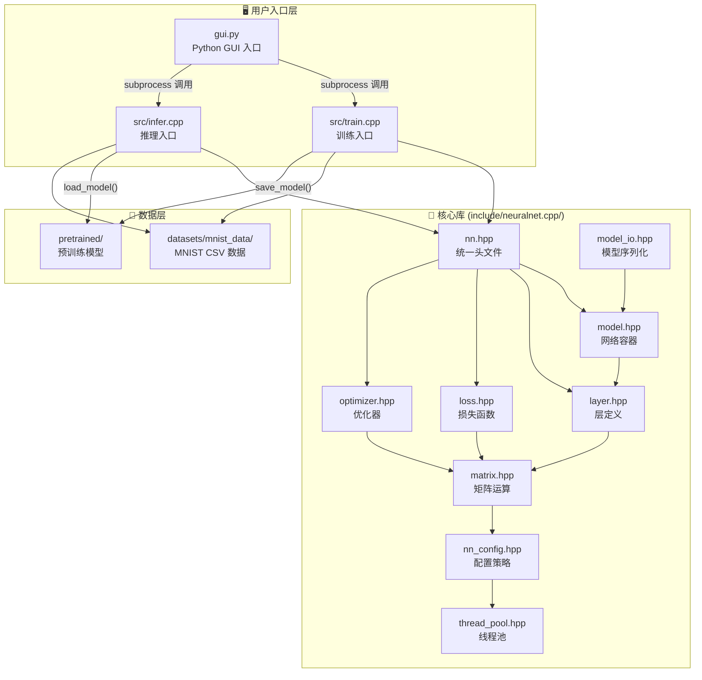

---

## 🏗️ 分层架构详解

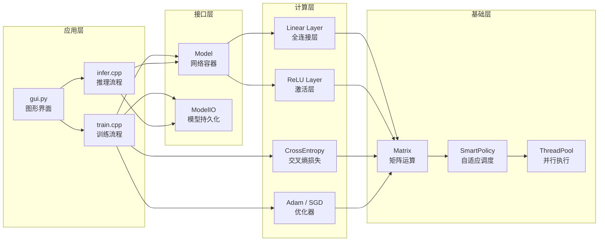

---

## 🔄 训练流程 (train.cpp)

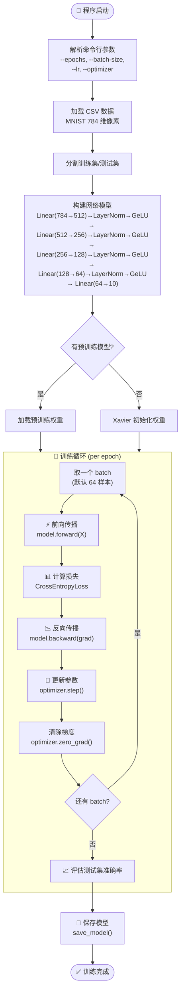

---

## 🔮 推理流程 (infer.cpp)

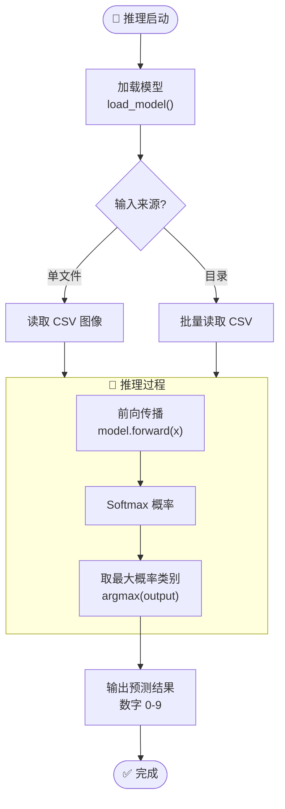

---

## 🧩 核心组件关系图

### Matrix — 数据基石

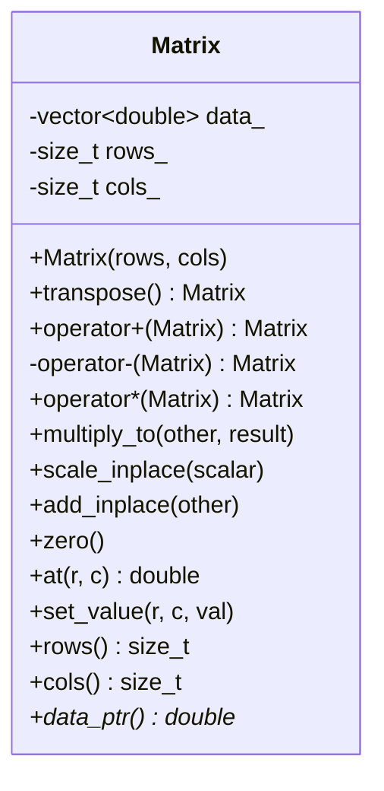

> 📝 **行主序存储，列式批处理**：内存按行主序排列（`index = row * cols + col`），但批处理中每个样本存储为一列，`(784, N)` 表示 N 张 28×28 图像。

### Layer — 计算层

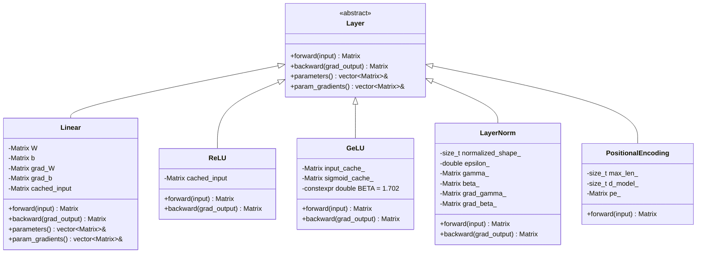

### Model — 网络容器

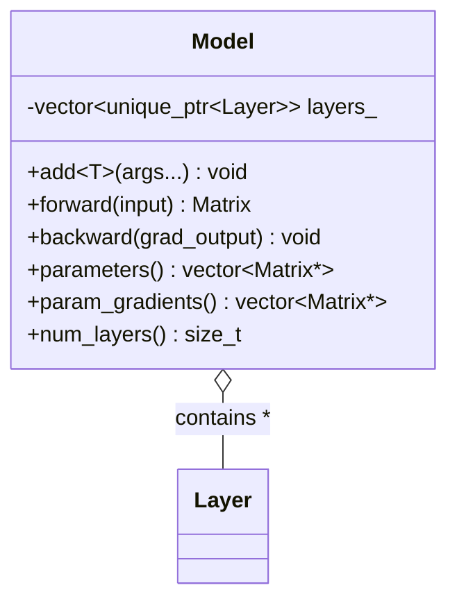

### Optimizer — 参数更新

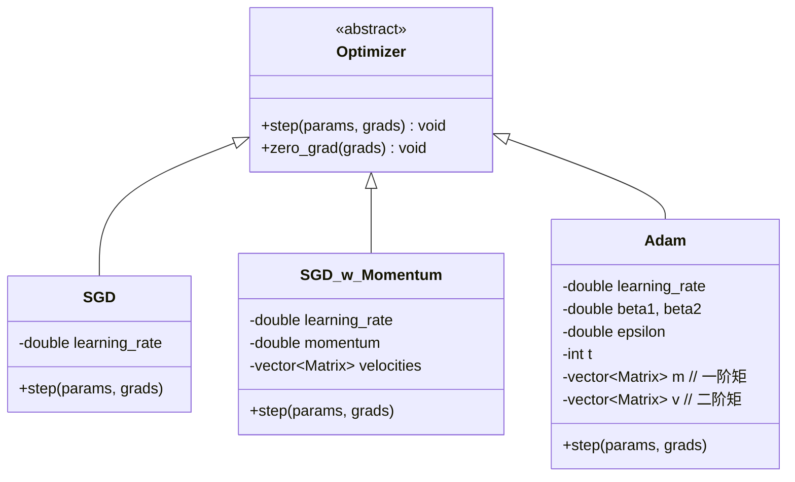

---

## ⚡ 并行执行策略

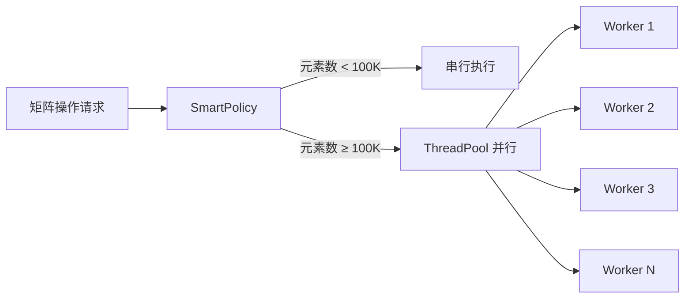

| 组件 | 作用 |
|------|------|
| `ThreadPool` | 单例线程池，懒初始化，管理 worker 线程和任务队列 |
| `SmartPolicy` | 自适应调度：小矩阵串行避免开销，大矩阵自动并行 |
| `parallel_for_each` | 并行遍历元素 |
| `parallel_transform` | 并行变换（如 ReLU、矩阵加减） |
| `parallel_transform_reduce` | 并行归约（如求和、求均值） |

---

## 📦 模型序列化格式 (model_io.hpp)

### V2 格式（当前）

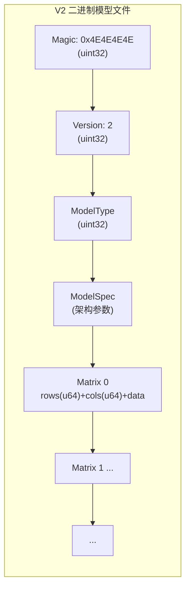

### ModelSpec 编码

| 模型类型 | 字段 |
|----------|------|
| MLP | `layer_dims`: num_dims(u32) + dim_0..dim_N(u64) |
| Transformer | d_model, num_heads, d_ff, num_layers, patch_size (各 u64) |
| GPT | vocab_size, d_model, seq_len, num_heads, d_ff, num_layers (各 u64) |

### 公开 API

| 函数 | 说明 |
|------|------|
| `save_model(path, model, spec)` | 保存 Model + ModelSpec 为 V2 格式 |
| `load_model(path, model)` | 加载参数到已有 Model（兼容 V1/V2） |
| `peek_model_spec(path)` | 只读文件头，返回 ModelSpec（V1 返回 Unknown） |

所有函数失败时抛出 `ModelIOError`，无 `std::cout` 副作用。

---

## 🐍 Python GUI 工作流

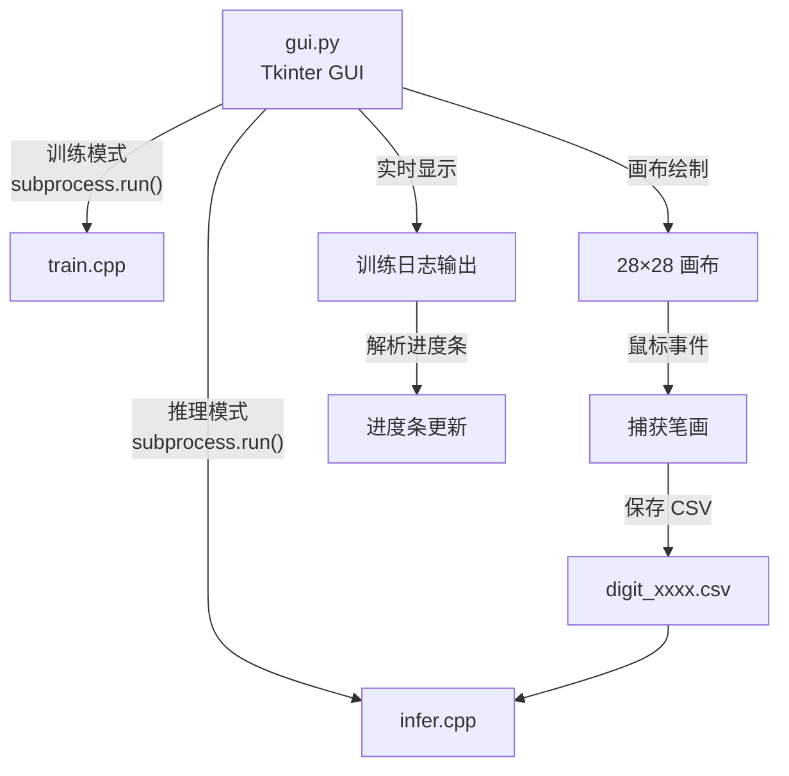

**辅助 Python 脚本：**
| 脚本 | 用途 |
|------|------|
| `save_dataset.py` | 从 raw MNIST 生成训练/测试 CSV |
| `extract_digits.py` | 从 CSV 中提取单个数字图像 |
| `csv_png.py` | 将 CSV 像素数据转为 PNG 图像预览 |

---

## 🗂️ 构建系统 (CMakeLists.txt)

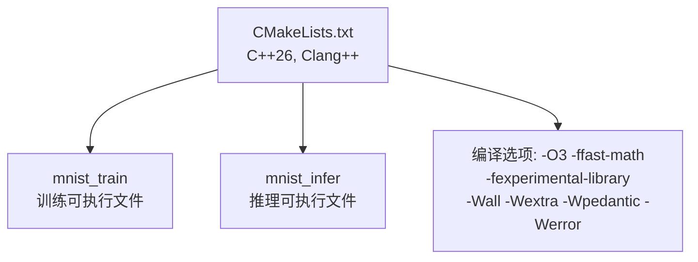

---

## 📊 数据流全景

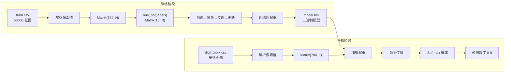

---

## 🎯 网络结构总结

默认 MNIST 架构（定义在 `mnist_common.hpp` 的 `MNIST_LAYER_DIMS`）：

```
┌──────────────────────────────────────────────────────────┐
│                 MNIST 手写数字识别网络                      │
├──────────────────────────────────────────────────────────┤
│  Input:    784 (28×28 像素展平)                           │
│  ────────────────────────────────────────────────────── │
│  Layer 1:  Linear(784 → 512) + LayerNorm + GeLU          │
│  Layer 2:  Linear(512 → 256) + LayerNorm + GeLU          │
│  Layer 3:  Linear(256 → 128) + LayerNorm + GeLU          │
│  Layer 4:  Linear(128 → 64)  + LayerNorm + GeLU          │
│  Layer 5:  Linear(64  → 10)                              │
│  ────────────────────────────────────────────────────── │
│  Loss:     CrossEntropy (含数值稳定 Softmax)              │
│  Optimizer: Adam / SGD / SGD+Momentum                    │
│  输出:      10 维向量 → argmax → 数字 0-9                  │
└──────────────────────────────────────────────────────────┘
```

> 📝 网络架构由 `MNIST_LAYER_DIMS = {784, 512, 256, 128, 64, 10}` 驱动，
> 自动在隐藏层之间插入 LayerNorm + GeLU 激活。

---

*Generated by GitHub Copilot — MiMo V2.5*
