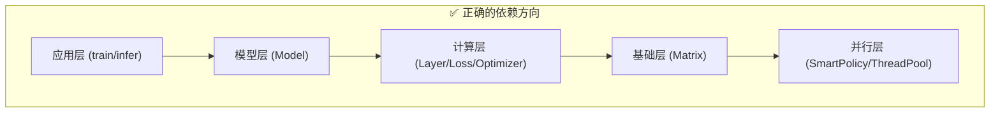

# 📐 C++ 开发规范

> 本文档定义了 neuralnet.cpp 项目的开发规范，旨在确保代码质量、可维护性和高性能。

---

## 📋 目录

1. [核心原则](#-核心原则)
2. [内存管理规范](#-内存管理规范)
3. [模块隔离规范](#-模块隔离规范)
4. [模块化设计规范](#-模块化设计规范)
5. [高性能编程规范](#-高性能编程规范)
6. [C++ 标准跟进规范](#-c-标准跟进规范)
7. [代码风格规范](#-代码风格规范)
8. [错误处理规范](#-错误处理规范)
9. [文档与注释规范](#-文档与注释规范)

---

## 🎯 核心原则

### 1. 零手动内存管理
**目标：** 完全消除显式指针操作和手动内存管理。

```cpp
// ❌ 禁止
int* data = new int[100];
delete[] data;

// ✅ 推荐
std::vector<int> data(100);
// 或
std::array<int, 100> data;
```

### 2. 简洁接口设计
**目标：** 面向开发者的接口尽可能简单、直观。

```cpp
// ❌ 复杂接口
void train(Matrix& W, Matrix& b, const Matrix& X, double lr, int epochs, bool verbose, ...);

// ✅ 简洁接口
model.train(dataset, config);
```

### 3. 高性能优先
**目标：** 在保证可读性的前提下，追求极致性能。

### 4. 紧跟最新标准
**目标：** 始终使用最新的 C++ 标准（当前：C++26）。

### 5. 模块隔离与最小化依赖
**目标：** 每个模块只通过简洁的公有接口对外提供服务。修改某个模块的内部实现（如 Matrix 的存储格式、ThreadPool 的调度策略）不应引发其他模块的连锁修改。即**改一个模块只需改一个头文件**。

```cpp
// ❌ 违反隔离：上层模块直接穿透接口、访问底层数据结构
// layer.hpp 中：
auto m_span = matrix.span();            // 泄露了内部 std::span 视图
matrix.data().begin();                  // 泄露了内部 std::vector&
SmartPolicy::for_each(...);             // 上层模块直接调用并行策略

// ✅ 遵循隔离：上层模块只调用 Matrix 暴露的语义化操作
matrix.apply_relu();                    // Matrix 自己封装逐元素操作
matrix.add_inplace(other);              // Matrix 自己封装算术操作
// 并行策略由 Matrix 内部决定，上层不感知
```

**核心规则：**

| 规则 | 说明 |
|------|------|
| **不穿透接口** | 上层模块不应直接访问下层模块的底层数据结构（如 `.data()`, `.span()`） |
| **不跨层调用** | Layer/Optimizer 不应直接调用 `SmartPolicy` 或 `global_thread_pool()` |
| **不假设实现** | 上层模块不应依赖下层模块的内部类型（如假定数据存储在 `std::vector` 中） |
| **自包含修改** | 修改模块内部实现（如换存储格式、换并行策略），只需修改该模块的头文件 |

---

## 🧠 内存管理规范

### 1. 禁止使用的模式

| 模式 | 说明 | 替代方案 |
|------|------|----------|
| `new` / `delete` | 手动堆内存管理 | `std::vector`, `std::make_unique` |
| `malloc` / `free` | C 风格内存管理 | `std::vector`, `std::array` |
| `new[]` / `delete[]` | 动态数组 | `std::vector<T>` |
| `std::auto_ptr` | 已废弃的智能指针 | `std::unique_ptr` |
| C 风格指针转换 | `(int*)ptr` | `static_cast`, `reinterpret_cast` |
| 裸指针所有权 | `void process(int* data)` | `std::span<T>`, `std::vector<T>&` |

### 2. 推荐使用的模式

#### 2.1 值语义优先
```cpp
// 使用值类型存储数据
class Matrix {
    std::vector<double> data_;  // ✅ 自动内存管理
    std::size_t rows_, cols_;
};

// 使用 std::array 处理固定大小
std::array<double, 128> buffer;  // ✅ 栈上分配
```

#### 2.2 智能指针管理多态对象
```cpp
// 独占所有权
std::unique_ptr<Layer> layer = std::make_unique<Linear>(784, 64);

// 共享所有权（仅在必要时）
std::shared_ptr<Resource> resource = std::make_shared<Resource>();

// 工厂函数返回值
[[nodiscard]] std::unique_ptr<Optimizer> create_optimizer(const Config& config);
```

#### 2.3 使用 std::span 传递只读数据
```cpp
// ✅ 推荐：使用 span 传递连续数据
void process(std::span<const double> data);

// ❌ 避免：使用裸指针
void process(const double* data, std::size_t size);
```

#### 2.4 使用 std::span 访问矩阵数据
```cpp
// ✅ 推荐：使用 span() 访问矩阵数据（C++20 零开销抽象）
auto data = matrix.span();          // std::span<double>
auto cdata = const_matrix.span();   // std::span<const double>

// 在 lambda 中捕获 span（类型安全，编译期大小检查）
auto func = [data](std::size_t i) noexcept {
    return data[i] * 2.0;
};

// ❌ 避免：使用已废弃的 data_ptr()
double* ptr = matrix.data_ptr();  // [[deprecated]]
```

#### 2.5 预分配缓冲区模式
```cpp
// ✅ 推荐：预分配并在就地操作
void multiply_to(Matrix& result, const Matrix& other) const {
    // 直接写入预分配的缓冲区
    for (std::size_t i = 0; i < rows_; ++i) {
        for (std::size_t j = 0; j < other.cols_; ++j) {
            double sum = 0.0;
            for (std::size_t k = 0; k < cols_; ++k) {
                sum += at(i, k) * other.at(k, j);
            }
            result.set_value_unchecked(i, j, sum);
        }
    }
}
```

### 3. 内存管理检查清单

- [ ] 是否有裸指针用于所有权管理？
- [ ] 是否有 `new` / `delete` 操作？
- [ ] 是否使用 `std::vector` 替代动态数组？
- [ ] 是否使用 `std::unique_ptr` 管理多态对象？
- [ ] 是否使用 `std::span` 替代裸指针访问连续数据？
- [ ] 热路径中是否预分配缓冲区？

---

## 🔒 模块隔离规范

> 本章节是「核心原则 5. 模块隔离与最小化依赖」的具体化规则，**必须严格遵守**。

### 1. 隔离总则



**规则：依赖只能从上往下，禁止从下往上，禁止跨层调用。**

- 应用层 → 可以调用 Model 的所有公有接口
- 计算层 → 可以调用 Matrix 的**语义化公有接口**（如 `multiply_to`, `add_inplace`, `apply_relu`）
- 计算层 → **禁止**直接调用 `SmartPolicy::for_each`、`global_thread_pool()`、`Matrix::data()`、`Matrix::span()`
- 基础层 → **禁止**依赖计算层或应用层的任何类型

### 2. 禁止的反模式

#### 2.1 上层直接操作底层数据结构

```cpp
// ❌ 禁止：Layer 直接获取 Matrix 的底层 vector 并迭代
// optimizer.hpp 当前写法：
auto &p_vec = p.data();       // 泄露 std::vector<Scalar>&！
auto &g_vec = g.data();
SmartPolicy::for_each(zip_view.begin(), zip_view.end(), [...]);

// ✅ 正确：Matrix 自己提供语义化操作，内部自行决定串行/并行
//    Optimizer 只调用：
matrix.axpy(-lr, grad);       // p = p - lr * g
//    或更抽象的：
optimizer->apply_update(param, grad);  // 内部调用 matrix 的批量操作
```

#### 2.2 上层直接调用并行策略

```cpp
// ❌ 禁止：Layer 中直接判断阈值并调用 SmartPolicy
// layer.hpp 当前写法（ReLU）：
if (n >= SmartPolicy::PARALLEL_THRESHOLD) {
    SmartPolicy::for_each(indices.begin(), indices.end(), [...]);
} else {
    for (std::size_t i = 0; i < n; ++i) [...]
}

// ✅ 正确：Matrix 封装逐元素操作，内部处理并行/串行决策
Matrix result = input.apply([](Scalar x) noexcept { return std::max(x, 0.0); });
```

#### 2.3 跨层直接访问全局线程池

```cpp
// ❌ 禁止：Matrix 内部绕过 SmartPolicy 直接调 global_thread_pool()
// matrix.hpp 当前写法（multiply_to、transpose_to 中）：
global_thread_pool().parallel_for_blocks(...);

// ✅ 正确：通过 SmartPolicy 间接调用，SmartPolicy 是并行策略的唯一入口
//    如果将来换用 TBB/OpenMP，只改 SmartPolicy 和 ThreadPool 即可
SmartPolicy::parallel_for_blocks(...);
```

### 3. 正确的接口分层设计

#### 3.1 Matrix 应暴露的语义化操作（而非裸数据访问）

```cpp
class Matrix {
public:
    // ── 逐元素变换（替代上层手动 for_each + span） ──
    template <typename F>
    [[nodiscard]] Matrix apply(F&& func) const;        // out[i] = func(in[i])
    
    template <typename F>
    void apply_inplace(F&& func);                      // in[i] = func(in[i])
    
    template <typename F>
    [[nodiscard]] Matrix binary_apply(const Matrix& other, F&& func) const;  // out[i] = func(a[i], b[i])
    
    template <typename F>
    void binary_apply_inplace(const Matrix& other, F&& func);

    // ── 归约操作（替代上层手动 transform_reduce） ──
    template <typename F, typename T>
    [[nodiscard]] T reduce(T init, F&& func) const;   // 对标 transform_reduce

    // ── 批量线性代数操作（替代上层手动遍历参数矩阵） ──
    static void batch_axpy(Scalar alpha,
                           std::span<std::reference_wrapper<Matrix>> params,
                           std::span<std::reference_wrapper<Matrix>> grads);
};
```

#### 3.2 Layer 应该通过 Matrix 语义接口实现

```cpp
// ✅ Layer 只需调用 Matrix 的语义操作，不感知底层存储和并行策略
Result<Matrix> ReLU::forward(const Matrix& input) override {
    input_cache_ = input;
    return input.apply([](Scalar x) noexcept { return x > 0 ? x : 0; });
}
```

#### 3.3 Optimizer 应该调用 Matrix 的批量操作

```cpp
// ✅ Optimizer 不再逐个参数矩阵手动迭代 .data()
Result<void> Adam::step() override {
    ++t_;
    // 批量操作：一次调用处理所有参数矩阵，内部并行
    Matrix::batch_adam_update(params_, grads_, m_, v_, lr_, beta1_, beta2_, eps_, t_);
    return {};
}
```

### 4. 隔离性自检清单

修改以下模块时，受影响的文件应**不超过 2 个**：

| 修改场景 | ✅ 预期只改 | ❌ 当前实际需要改 |
|----------|-------------|------------------|
| Matrix 换存储格式（如 `vector` → 自定义 allocator） | `matrix.hpp` | `matrix.hpp` + `layer.hpp` + `optimizer.hpp` + `loss.hpp` + `model_io.hpp` |
| SmartPolicy 换并行策略（如线程池 → TBB） | `nn_config.hpp` | `nn_config.hpp` + `layer.hpp` + `optimizer.hpp` + `loss.hpp` + `matrix.hpp` |
| ThreadPool 换调度算法 | `thread_pool.hpp` | `thread_pool.hpp` + `matrix.hpp`（直接调了 `parallel_for_blocks`） |
| Layer 新增一种激活函数 | `layer.hpp` | `layer.hpp` ✅ 已满足 |
| Optimizer 新增一种优化器 | `optimizer.hpp` | `optimizer.hpp` ✅ 已满足 |

### 5. 迁移路线图

当前项目存在大量跨层穿透调用，需逐步重构：

| 阶段 | 内容 | 影响范围 |
|------|------|----------|
| **Phase 1** | Matrix 新增 `apply()` / `apply_inplace()` / `binary_apply()` 等语义化方法 | `matrix.hpp` |
| **Phase 2** | Layer（ReLU/GeLU/LayerNorm/Softmax）改用 Matrix 语义方法，删除直接 SmartPolicy 调用 | `layer.hpp` |
| **Phase 3** | Optimizer（SGD/Adam）改用 Matrix 批量操作，删除 `.data()` 穿透 | `optimizer.hpp` |
| **Phase 4** | Loss（MSELoss/CrossEntropyLoss）改用 Matrix 语义方法 | `loss.hpp` |
| **Phase 5** | Matrix 内部不再直接调 `global_thread_pool()`，统一经 SmartPolicy | `matrix.hpp` |

---

## 🏗️ 模块化设计规范

### 1. 目录结构

```
include/neuralnet.cpp/
├── nn_config.hpp      # 全局配置和常量
├── thread_pool.hpp    # 线程池实现
├── matrix.hpp         # 核心矩阵类
├── layer.hpp          # 层基类和实现
├── loss.hpp           # 损失函数
├── optimizer.hpp      # 优化器
├── model.hpp          # 模型容器
├── model_io.hpp       # 模型序列化
└── nn.hpp             # 统一入口头文件
```

### 2. 头文件设计原则

#### 2.1 单一职责
```cpp
// ✅ 每个头文件只负责一个功能模块
// matrix.hpp - 矩阵运算
// layer.hpp  - 层定义
// loss.hpp   - 损失函数

// ❌ 避免大而全的头文件
```

#### 2.2 最小化依赖
```cpp
// ✅ 只包含必要的头文件
#include <vector>
#include <cstddef>
#include <utility>

// ❌ 避免包含不必要的头文件
#include <iostream>  // 除非需要 I/O
#include <algorithm> // 除非需要算法
```

#### 2.3 命名空间组织
```cpp
namespace nn {
    // 所有公共 API 都在 nn 命名空间中
    class Matrix { ... };
    class Model { ... };
    
    // 内部实现使用嵌套命名空间
    namespace detail {
        class InternalHelper { ... };
    }
}
```

### 3. 接口设计模式

#### 3.1 流式 API（Fluent API）
```cpp
// ✅ 支持链式调用
Model model;
model.add<Linear>(784, 64)
    .add<ReLU>()
    .add<Linear>(64, 10)
    .add<CrossEntropyLoss>();
```

#### 3.2 类型安全的工厂函数
```cpp
// ✅ 使用模板参数推导
template <typename LayerType, typename... Args>
Model& add(Args&&... args) {
    layers_.push_back(std::make_unique<LayerType>(std::forward<Args>(args)...));
    return *this;
}
```

#### 3.3 两级访问接口
```cpp
// ✅ 安全访问 + 快速访问
class Matrix {
    // 安全访问（带边界检查）
    [[nodiscard]] double at(std::size_t row, std::size_t col) const;
    
    // 快速访问（热路径使用）
    [[nodiscard]] double at_unchecked(std::size_t row, std::size_t col) const noexcept;
};
```

#### 3.4 使用 std::reference_wrapper 避免拷贝
```cpp
// ✅ 传递引用而非拷贝
void update(std::vector<std::reference_wrapper<Matrix>> params, 
            std::vector<std::reference_wrapper<Matrix>> grads);
```

### 4. 模块化检查清单

- [ ] 每个头文件是否只负责一个功能？
- [ ] 是否最小化头文件依赖？
- [ ] 接口是否简洁直观？
- [ ] 是否支持链式调用？
- [ ] 是否提供安全和快速两种访问方式？

---

## ⚡ 高性能编程规范

### 1. 编译期优化

#### 1.1 constexpr 函数
```cpp
// ✅ 编译期计算
[[nodiscard]] constexpr std::size_t index(std::size_t row, std::size_t col) const noexcept {
    return row * cols_ + col;
}
```

#### 1.2 编译期常量
```cpp
// ✅ 使用 constexpr 常量
constexpr std::size_t BLOCK_SIZE = 64;  // 缓存友好的块大小
constexpr double EPSILON = 1e-12;
```

#### 1.3 static_assert 编译期检查
```cpp
// ✅ 编译期断言
static_assert(BLOCK_SIZE * BLOCK_SIZE * sizeof(double) <= 32768, 
              "Block size exceeds L1 cache size");
```

### 2. 运行期优化

#### 2.1 预分配缓冲区
```cpp
// ✅ 预分配避免热路径中的内存分配
class Linear : public Layer {
    Matrix product_buf_;    // 预分配的中间结果缓冲区
    Matrix grad_WT_buf_;    // 预分配的梯度缓冲区
    
    void forward(const Matrix& input) override {
        // 使用预分配缓冲区，避免 new/delete
        multiply_to(product_buf_, weights_);
    }
};
```

#### 2.2 栈上小对象优化
```cpp
// ✅ 小对象使用 std::array（栈分配）
class CrossEntropyLoss : public Loss {
    [[nodiscard]] double compute(const Matrix& predicted, const Matrix& target) const override {
        if (num_classes <= 128) {
            // 小对象：栈上分配，避免堆分配
            std::array<double, 128> log_probs;
            // ...
        } else {
            // 大对象：堆分配
            std::vector<double> log_probs(num_classes);
        }
    }
};
```

#### 2.3 缓存友好的算法
```cpp
// ✅ 分块算法提高缓存命中率
void matrix_multiply(Matrix& result, const Matrix& a, const Matrix& b) {
    constexpr std::size_t BLOCK = 64;  // 适配 L1 缓存
    
    for (std::size_t i = 0; i < a.rows(); i += BLOCK) {
        for (std::size_t j = 0; j < b.cols(); j += BLOCK) {
            for (std::size_t k = 0; k < a.cols(); k += BLOCK) {
                // 处理分块
                for (std::size_t ii = i; ii < std::min(i + BLOCK, a.rows()); ++ii) {
                    for (std::size_t jj = j; jj < std::min(j + BLOCK, b.cols()); ++jj) {
                        double sum = 0.0;
                        for (std::size_t kk = k; kk < std::min(k + BLOCK, a.cols()); ++kk) {
                            sum += a.at(ii, kk) * b.at(kk, jj);
                        }
                        result.set_value_unchecked(ii, jj, sum);
                    }
                }
            }
        }
    }
}
```

#### 2.4 并行化
```cpp
// ✅ 使用自定义 SmartPolicy 进行并行化
void SmartPolicy::apply(Iterator begin, Iterator end, Func func) {
    const auto distance = std::distance(begin, end);
    if (distance < PARALLEL_THRESHOLD) {
        // 小数据量：串行执行
        std::for_each(std::execution::seq, begin, end, func);
    } else {
        // 大数据量：并行执行
        std::for_each(std::execution::par_unseq, begin, end, func);
    }
}
```

### 3. 性能注解

#### 3.1 noexcept 标注
```cpp
// ✅ 明确标注 noexcept
[[nodiscard]] double at_unchecked(std::size_t row, std::size_t col) const noexcept {
    return data_[index(row, col)];
}
```

#### 3.2 [[nodiscard]] 标注
```cpp
// ✅ 避免忽略返回值
[[nodiscard]] Matrix transpose() const;
[[nodiscard]] double compute_loss(const Matrix& predicted, const Matrix& target) const;
```

#### 3.3 inline 标注
```cpp
// ✅ 小函数使用 inline
[[nodiscard]] constexpr std::size_t rows() const noexcept { return rows_; }
[[nodiscard]] constexpr std::size_t cols() const noexcept { return cols_; }
```

### 4. 性能检查清单

- [ ] 热路径中是否预分配缓冲区？
- [ ] 是否使用 constexpr 进行编译期计算？
- [ ] 小对象是否使用栈分配（std::array）？
- [ ] 矩阵运算是否使用缓存友好的分块算法？
- [ ] 是否适当使用并行化？
- [ ] 是否标注 noexcept、[[nodiscard]]、inline？

---

## 🔧 C++ 标准跟进规范

### 1. 当前标准：C++26

```cmake
# CMakeLists.txt
set(CMAKE_CXX_STANDARD 26)
set(CMAKE_CXX_STANDARD_REQUIRED ON)
```

### 2. 积极使用的 C++20/23 特性

| 特性 | 标准 | 用途 |
|------|------|------|
| `std::expected<T, E>` | C++23 | 所有 API 的错误传播，替代 throw/try/catch |
| `std::span` | C++20 | 非拥有型连续内存视图，替代裸指针 |
| `std::ranges` | C++20 | 数据处理管道（如 `ranges::generate` Xavier 初始化） |
| `std::views::iota` | C++20 | 延迟整数序列（并行索引生成） |
| `std::views::zip` | C++20 | 多范围并行迭代（优化器参数更新） |
| `std::execution::par_unseq` | C++17 | 并行执行策略（矩阵运算） |

### 3. 标准跟进检查清单

- [ ] 是否使用最新的 C++ 标准（C++26）？
- [ ] 是否积极使用 C++20/23/26 新特性？
- [ ] 是否避免使用已废弃的特性？
- [ ] 是否使用编译器实验性库支持？

---

## 📝 代码风格规范

### 1. 命名规范

| 类型 | 风格 | 示例 |
|------|------|------|
| 类名 | CamelCase | `Matrix`, `Linear`, `Adam` |
| 函数名 | snake_case | `compute_loss`, `forward_pass` |
| 变量名 | snake_case | `learning_rate`, `batch_size` |
| 常量名 | snake_case | `block_size`, `epsilon` |
| 私有成员 | 尾部下划线 | `data_`, `rows_`, `weights_` |
| 模板参数 | CamelCase | `LayerType`, `ValueType` |
| 命名空间 | snake_case | `nn`, `nn::detail` |

### 2. 格式规范

```cpp
// 缩进：4 个空格
if (condition) {
    do_something();
}

// 大括号：K&R 风格
void function() {
    // ...
}

// 指针/引用：靠近类型名
int* ptr;       // ✅ 推荐
int *ptr;       // ❌ 避免

const std::vector<int>& vec;  // ✅ 推荐
const std::vector<int> &vec;  // ❌ 避免
```

### 3. 包含顺序

```cpp
// 1. 对应的头文件（如适用）
#include "matrix.hpp"

// 2. C++ 标准库
#include <vector>
#include <memory>
#include <algorithm>

// 3. 第三方库
#include <fmt/format.h>

// 4. 项目内头文件
#include <neuralnet.cpp/nn_config.hpp>
```

---

## 🛡️ 错误处理规范

### 1. 使用 std::expected (C++23)

**全项目禁止使用 throw/try/catch**，统一使用 C++23 的 `std::expected<T, E>` 进行错误传播。

#### 基础类型定义（nn_config.hpp）

```cpp
struct Error {
    std::string message;
};
template <typename T>
using Result = std::expected<T, Error>;
```

#### 函数签名约定

```cpp
// ✅ 所有公共 API 使用 Result<T> 返回错误
Result<Matrix> forward(const Matrix& input);
Result<void> save_model(const std::string& path, Model& model);
Result<ModelSpec> peek_model_spec(const std::string& path);

// ❌ 禁止抛异常
Matrix forward(const Matrix& input);  // 旧方式
void save_model(...);                  // 旧方式
```

#### 错误返回模式

```cpp
// 返回错误
return std::unexpected(Error{"Invalid matrix dimensions"});

// 成功返回（隐式构造）
return matrix;        // T 类型
return {};            // void
```

#### 调用方检查模式

```cpp
// 模式 1：检查后使用
auto result = model.forward(input);
if (!result) {
    std::cerr << "Error: " << result.error().message << '\n';
    return 1;
}
auto output = *result;

// 模式 2：链式传播（适用于中间层）
auto r = layer.forward(input);
if (!r) return std::unexpected(r.error());  // 向上传播
return *r;
```

### 2. 构造函数中的验证

构造函数不能返回 `std::expected`，使用以下策略：

```cpp
// 策略 1：工厂函数（推荐用于公共 API）
class Layer {
    [[nodiscard]] static Result<Layer> create(std::size_t in, std::size_t out) {
        if (in == 0) return std::unexpected(Error{"in_features must be > 0"});
        return Layer(in, out);
    }
};

// 策略 2：延迟验证（适用于内部组件）
class Optimizer {
    Result<void> step(...) {
        if (params_.size() != grads_.size())
            return std::unexpected(Error{"params/grads size mismatch"});
        // ... 实际更新逻辑
        return {};
    }
};

// 策略 3：assert（仅用于编程错误，debug 模式捕获）
// 适用于运算符重载中不可能发生的维度不匹配
assert(false && "matrix multiplication dimension mismatch");
```

### 3. 热路径中的错误处理

```cpp
// ✅ 热路径中标注 noexcept（不抛异常的函数）
[[nodiscard]] double at_unchecked(std::size_t row, std::size_t col) const noexcept {
    return data_[index(row, col)];
}

// ✅ 使用 assert 检查编程错误（debug 模式有效，release 模式编译掉）
assert(rows_ == other.rows() && "dimension mismatch");

// ✅ 使用 if constexpr 在编译期分支
if constexpr (std::is_same_v<Policy, SeqPolicy>) {
    // 串行执行
} else {
    // 并行执行
}
```

### 4. 错误处理检查清单

- [ ] 所有公共 API 是否使用 `Result<T>` 返回错误？
- [ ] 是否禁止使用 throw/try/catch？
- [ ] 热路径是否标注 noexcept？
- [ ] 构造函数验证是否使用工厂函数或延迟验证？
- [ ] 错误信息是否清晰描述问题？
- [ ] 调用方是否检查了 Result 返回值？

---

## 📚 文档与注释规范

### 1. 注释风格

```cpp
// ── 函数描述 ──
// 详细说明函数的功能、参数和返回值
//
// @param input 输入矩阵
// @return 输出矩阵
[[nodiscard]] Matrix forward(const Matrix& input) const;

// ── 转置（返回新矩阵） ──
[[nodiscard]] Matrix transpose() const;
```

### 2. Doxygen 风格（可选）

```cpp
/**
 * @brief 计算前向传播
 * 
 * @param input 输入数据矩阵
 * @return 计算结果矩阵
 * 
 * @throws std::invalid_argument 如果维度不匹配
 */
[[nodiscard]] Matrix forward(const Matrix& input) const;
```

### 3. 文档检查清单

- [ ] 公共 API 是否有文档注释？
- [ ] 复杂算法是否有解释性注释？
- [ ] 注释是否清晰简洁？
- [ ] 是否使用一致的注释风格？

---

## ✅ 总结

本规范旨在确保 neuralnet.cpp 项目：

1. **内存安全**：完全消除手动内存管理，使用 RAII 和智能指针
2. **模块化**：清晰的职责分离，简洁的接口设计
3. **高性能**：预分配、缓存友好、并行化
4. **现代化**：始终使用最新的 C++ 标准和特性
5. **类型安全的错误处理**：使用 `std::expected<T, Error>` 替代异常，错误是类型签名的一部分

遵循本规范将帮助团队构建高质量、可维护、高性能的 C++ 代码库。

---

> 📅 最后更新：2026-07-15
> 
> 维护者：EthanPeng-2048 & AI