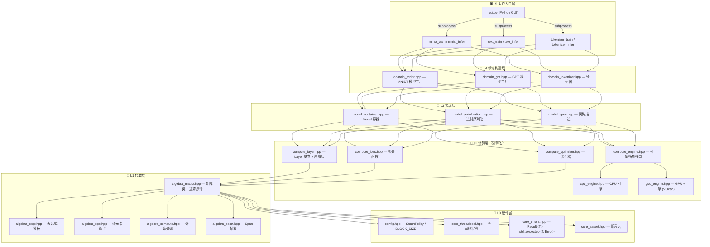
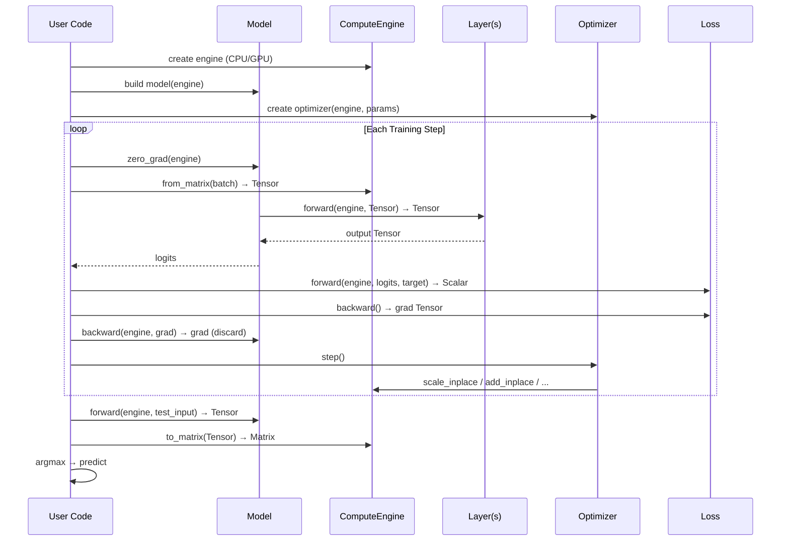

# 🧠 neuralnet.cpp 架构设计

> 一个从零实现的 C++26 神经网络库，支持 CPU/GPU 双后端、多层 Transformer、GPT 语言模型训练与推理。

---

## 📐 系统分层总览

项目采用 **6 层分层架构**（L0 ~ L5），每层职责单一、严格隔离，上层仅依赖下层的公有接口。



---

## 🔑 核心设计原则

### 1. 引擎化架构（Engine-Based Architecture）

这是项目最核心的设计理念：

```
Layer 的 forward/backward 只写一次，通过 ComputeEngine 参数自动适配 CPU/GPU。
不再有 forward_gpu / backward_gpu。
```

```cpp
// compute_layer.hpp — 所有 Layer 统一接口
class Layer {
public:
    virtual Result<Tensor> forward(ComputeEngine& engine, const Tensor& input) = 0;
    virtual Result<Tensor> backward(ComputeEngine& engine, const Tensor& grad_output) = 0;
};
```

**数据流（GPU 训练为例）：**

```
Matrix(x_batch)
  ──engine.from_matrix──▶ Tensor[GPU]
  ──forward──▶ Tensor[GPU]
  ──loss.forward──▶ Scalar
  ──loss.backward──▶ Tensor[GPU]
  ──backward──▶ (丢弃)
  ──optimizer.step──▶ 参数就地更新（全程在 GPU）
```

仅 `evaluate` 时 `engine.to_matrix` 下载到 CPU 做 argmax。

### 2. 算法与原语分离

| 层级 | 职责 | 示例 |
|------|------|------|
| **ComputeEngine** (L2) | 只提供 op-level 原语 | `matmul`, `add`, `exp`, `max`, `reduce` |
| **Layer** (L2) | 通过组合原语表达算法 | `ReLU = max(x, 0)`, `GeLU = 5 次原语组合` |
| **Shader** (GPU) | 引擎内部实现，用户不可见 | `matmul.comp`, `elementwise.comp` |

这意味着 **Engine/Shader 不知道 "ReLU" 是什么**，它只提供 `max` 原语。Layer 用 `max(x, 0)` 表达 ReLU 算法。

### 3. 零手动内存管理

- `Matrix` 内部使用 `std::vector<Scalar>`，无裸指针
- `Tensor` 使用 `shared_ptr` 内部持有存储，拷贝廉价（零拷贝传递）
- 错误处理使用 C++23 `std::expected<T, Error>`，项目中 **禁止 throw/try/catch**
- 编译时通过 `-fno-exceptions` 强制执行

### 4. 统一张量类型 `Tensor`

`Tensor` 是跨设备的统一数据容器：

```cpp
class Tensor {
    Device device_;                    // CPU 或 GPU
    std::shared_ptr<Matrix> cpu_data_; // CPU 存储
    std::shared_ptr<GpuTensor> gpu_data_; // GPU 存储（条件编译）
};
```

- CPU/GPU 存储互斥：`device()` 决定哪个指针有效
- 跨设备传输由 `ComputeEngine` 负责，`Tensor` 本身不主动迁移
- `shared_ptr` 使得拷贝廉价，传递零开销

---

## 📂 模块详解

### L0 硬件层

| 文件 | 职责 |
|------|------|
| `config.hpp` | `Scalar` 类型定义、`BLOCK_SIZE=64`、`PARALLEL_THRESHOLD`、SmartPolicy 自适应策略 |
| `core_threadpool.hpp` | 全局线程池，latch 零分配设计，`parallel_for_each` / `parallel_transform` |
| `core_errors.hpp` | `struct Error { std::string message; }` + `using Result<T> = std::expected<T, Error>` |
| `core_assert.hpp` | `NN_ASSERT` 宏（L1 层形状校验使用，L2+ 层使用 Result） |
| `core_file.hpp` | 文件加载工具 |

### L1 代数层

| 文件 | 职责 |
|------|------|
| `algebra_matrix.hpp` | `Matrix` 类：行主序存储 `(rows, cols)`，矩阵乘法（缓存分块 + SmartPolicy 并行），加法、转置、归约 |
| `algebra_expr.hpp` | 表达式模板（AST），实现编译期零开销逐元素运算 |
| `algebra_ops.hpp` | 逐元素算子：`ReLU`, `GeLU`, `Neg`, `Exp`, `Add`, `Mul` 等 |
| `algebra_span.hpp` | `Span` 抽象，提供对矩阵数据的安全视图 |
| `algebra_compute.hpp` | `compute::apply(span, expr)` — AST 统一入口 |

### L2 计算层（引擎化）

**ComputeEngine 原语分类：**

| 类别 | 原语 |
|------|------|
| 矩阵级 | `matmul`, `batched_matmul`, `transpose`, `add_inplace`, `scale_inplace`, `zero`, `axpy_inplace` |
| 归约级 | `row_reduce_sum`, `col_reduce_sum`, `row_reduce_max`, `col_reduce_max` |
| 广播级 | `broadcast_row_inplace`, `broadcast_col_inplace` |
| 逐元素 | `elementwise_unary`, `elementwise_binary`, `elementwise_binary_scalar` |
| 条件选择 | `elementwise_select_scalar_cond` |
| 数据操作 | `slice_rows`, `insert_rows`, `gather_rows`, `scatter_add_rows`, `rearrange_3d`, `clone` |
| 批控制 | `begin_batch` / `end_batch`（CPU: no-op; GPU: command buffer） |

**表达式统一入口：**

| 文件 | 职责 |
|------|------|
| `expr_spec.hpp` | `ExprSpec` 逐元素表达式扁平 IR（纯数据结构，跨后端可序列化，GPU AOT 契约）+ `expr_spec_key`（规范结构 key，AOT 收集/匹配依据） |
| `expr_dsl.hpp` | 统一表达式 DSL（`nn::dsl`）：编译期模板，普通数学写法；CPU 直接求值（内联+SIMD）；GPU 经 `to_expr_spec` 折叠出 `ExprSpec` → 按 `expr_spec_key` 匹配预编译融合 shader。含 `start_expr/end_expr` 块式融合 |
| `expr_registry.hpp` | 构建期表达式注册表（`scan_exprs` 收集折叠出的结构，按 key 去重；二进制 dump/load 供 `gen_fused` 消费） |
| `fused_registry.hpp` | **生成物**（构建期 `gen_fused` 产出）：`key → {ExprSpec 结构, 内联 SPIR-V}` 融合 shader 注册表；运行时按 key 精确匹配 |
| `tools/scan_exprs.cpp` | 构建期工具：dry-run 跑 Layer 的 forward/backward，收集内联表达式的结构（派生物）→ `expr_specs.bin` |
| `tools/gen_fused.cpp` | 构建期工具：读 bin → `glsl_gen` → glslc → 内联 SPIR-V → `fused_registry.hpp` |
| `eval_expr` | `ComputeEngine` 虚接口：CPU 编译期模板求值（经 `dsl::compute`）；Vulkan 按 `expr_spec_key` 查 `fused_registry`（闭合世界，未命中硬报错，无 eager、无运行时编译） |
| `dsl::compute(engine, expr, rows, cols)` | 统一求值入口：CPU 走编译期模板；GPU 折叠成 `ExprSpec` → `eval_expr` 按 key AOT 分发 |

> **AOT 收集原则**：表达式**文本只出现在 Layer**（内联写进 `forward/backward`）。构建期 `scan_exprs` dry-run 执行 Layer 代码触达它们，把折叠后的 `ExprSpec` 结构（派生物，非手写定义）收集进注册表；`gen_fused` 据此合成融合 shader 并内联进 `fused_registry.hpp`。运行时按 key 精确匹配 dispatch，最终程序自包含、无运行时编译器。

### L3 实现层

| 文件 | 职责 |
|------|------|
| `model_container.hpp` | `Model` 容器：持有 `vector<unique_ptr<Layer>>` + `ComputeEngine*`，链式构建，`forward`/`backward` 委托 |
| `model_spec.hpp` | `ModelSpec` 纯数据结构：`ModelType` 枚举 + MLP/Transformer/GPT 参数 |
| `model_serialization.hpp` | 二进制序列化 v4 自描述格式（KeyValueRecord 规格头），`save_model` / `load_model` / `peek_model_spec` |

### L4 领域构建层

| 文件 | 职责 |
|------|------|
| `domain_mnist.hpp` | MNIST 工厂函数：`build_mnist_mlp_model()` / `build_mnist_transformer_model()` |
| `domain_gpt.hpp` | GPT 工厂函数：`build_gpt_model()` / `build_gpt_model_from_spec()` |
| `domain_tokenizer.hpp` | 分词器：`Tokenizer` 基类 + `WordZipTokenizer` / `BPETokenizer` / `ByteZipTokenizer` |

---

## 📊 数据布局约定

所有张量采用 **列主序 batch-major** 布局（column-major, batch-major）：

```
输入:  (feature_dim, batch_size)     — 每列一个样本
输出:  (out_dim, batch_size)         — 每列一个样本
权重:  (out_features, in_features)   — 行主序存储

Matrix 索引:  data_[row * cols + col]
```

**批量注意力的特殊布局：**

```
多头 Q/K/V: (H*d_k, batch*seq)    — 头维度在行方向，batch 在列方向
rearrange 后: (batch*H*d_k, seq)   — 使 batched_matmul 能按 batch*H 切分
```

---

## 🔄 完整训练流程



---

## 🏗️ 构建与编译

**环境要求：**
- CMake ≥ 3.30
- Clang (支持 C++26) 或 GCC 15+
- Vulkan SDK（可选，GPU 加速）

**构建命令：**

```bash
cmake -B build -DCMAKE_BUILD_TYPE=Release
cmake --build build --parallel
```

**产物：**

| 可执行文件 | 用途 |
|-----------|------|
| `mnist_train` | MNIST 手写数字训练 |
| `mnist_infer` | MNIST 推理 |
| `text_train` | GPT 文本生成训练 |
| `text_infer` | GPT 文本推理 |
| `tokenizer_train` | BPE 分词器训练 |
| `tokenizer_infer` | BPE 分词器推理 |
| `compute_bench` | 计算性能基准测试 |
| `bench_thresholds` | 并行阈值基准测试 |
| `gpu_test` | GPU 后端测试 |

---

## 📁 完整头文件依赖图

```
nn.hpp（统一入口）
├── L0: core_errors → config → core_threadpool
├── L1: algebra_matrix → algebra_span / algebra_ops / algebra_expr / algebra_compute
├── L2: tensor → compute_engine → cpu_engine [→ gpu_engine]
│       → compute_layer → compute_loss → compute_optimizer
├── L3: model_container → model_spec → model_serialization
└── L4: domain_mnist → domain_gpt → domain_tokenizer
```
