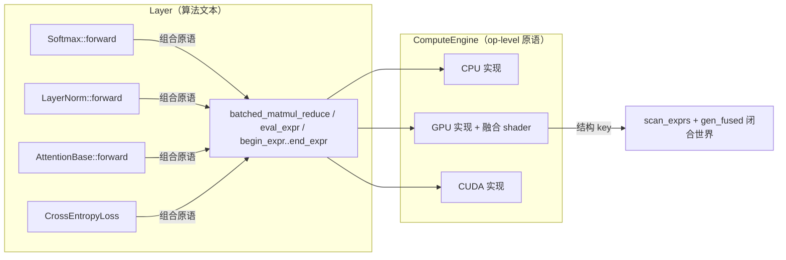

# 算子融合设计（Operator Fusion）—— 减少 GPT+Vulkan 训练显存

> 状态：实施中 · 里程碑 **M1（ExprSpec 归约语义）✅ 完成**、**M2（begin_expr/end_expr 录制框架）✅ 完成**、**M3（Softmax/LayerNorm/RMSNorm 归约融合）✅ 完成**、**M4（matmul 融合原语）✅ 完成**、**M5（CrossEntropy 稀疏融合）✅ 完成**、**M6（两趟式注意力）✅ 完成**
> 目标版本：与现有 `eval_expr` AOT 融合管线共存
> 关联文档：`DEVELOPMENT_STANDARDS.md`（分层铁律）、`01-architecture.md`

---

## 0. 问题与目标

### 0.1 现象
GPT+Vulkan 训练显存远高于 PyTorch。根因（详见前期分析）：
1. **注意力分数矩阵全量物化**：`scores / masked / attn_cache_` 各一份 `H·batch·seq²`，且 `attn_cache_` 永久缓存供反向。
2. **无算子融合**：Softmax/LayerNorm/RMSNorm 用多次原语 + 多次 `clone`，产生多份全尺寸中间 Tensor。
3. **损失侧全量 softmax over vocab**：`logits` + `softmax` 各 `vocab×seq·batch`。
4. 内存池 first-fit 碎片化 + 永不归还（本设计不涉及，单独跟踪）。

### 0.2 目标
在**严格不违反分层铁律**的前提下，通过"原语进引擎 + 算法留 Layer + 结构融合"实现：
- Softmax / LayerNorm / RMSNorm / CrossEntropy 融为单 kernel，消除全尺寸中间 Tensor。
- 注意力采用**两趟式内存高效算法**，不物化 `O(seq²)` 分数矩阵。
- 完全兼容现有 `eval_expr` AOT 闭合世界机制，不引入运行时编译。

### 0.3 合规红线（不可逾越）
> 本设计成立的前提是以下红线被严格尊重，任何改动不得跨越：

| 红线 | 说明 |
|------|------|
| **引擎只提供 op-level 原语** | `ComputeEngine` 只能有 `matmul`/`reduce`/`broadcast`/`elementwise` 这类通用原语；**绝不允许出现 `softmax`/`attention`/`layernorm` 命名的接口** |
| **算法文本只在 Layer** | ReLU/GeLU/Softmax/LayerNorm/Attention/CrossEntropy 的公式只写在 `compute_layer.hpp` / `compute_loss.hpp` |
| **融合逻辑归工具/引擎内部** | `glsl_gen` / `gen_fused` / 各引擎实现负责"怎么融"，Layer 只写"是什么" |
| **Shader 是引擎内部实现** | 融合 shader 只存在于 `shaders/` + 各引擎，用户不可见 |

> ⚠️ 设计原则：**原语可以多、可以专（matmul+归约、matmul+exp+sum 都是合法原语），但原语必须"通用可复用、不叫算法名"。** 引擎可以认"结构"（`reduce(matmul(A,B))`、`matmul→softmax→matmul`），绝不认"算法名"。

---

## 1. 总体架构



**核心机制**：Layer 用现有 `eval_expr` + 新增录制 `begin_expr/end_expr` 表达算法；引擎/工具按**结构**合成融合 kernel。所有中间 Tensor 由融合 kernel 内部消解，不落 VRAM。

---

## 2. 阶段一：`ExprSpec` 增加归约语义（地基）

### 2.1 目标
让现有逐元素 `ExprSpec` 能表达"按列/按行归约出小标量 → 广播回各元素"，从而表达 Softmax/LayerNorm。**这是录制融合和两趟注意力的共同地基。**

### 2.2 改动文件：`include/neuralnet.cpp/expr_spec.hpp`

#### 2.2.1 `ExprViewKind` 增加归约视图
```cpp
enum class ExprViewKind : uint8_t
{
    Linear       = 0,   // 现有
    RotateHalf   = 1,   // 现有
    RowMod       = 2,   // 现有
    // ── 新增：归约视图（输出为每列/每行一个标量，供广播）──
    ColReduceSum = 3,   // 该输入按列求和 → (1, cols)
    ColReduceMax = 4,   // 该输入按列求 max → (1, cols)
    RowReduceSum = 5,   // 该输入按行求和 → (rows, 1)
    RowReduceMax = 6,   // 该输入按行求 max → (rows, 1)
};
```
> 语义：当某输入视图是归约视图时，它在求值期代表一个"每列/每行一个标量"的广播向量。归约视图的**求值索引语义**：对输出元素 `(r,c)`，读取的是归约向量在 `r`（行归约）或 `c`（列归约）处的标量。

#### 2.2.2 明确 ExprSpec 的"归约-广播"扩展语义
现有 `ExprSpec` 语义是"逐元素：输出=最后寄存器"。扩展后增加：
- 允许**归约视图输入**参与表达式（它自动广播到整行/整列）。
- 引入**归约指令**（可选，见 2.3），使"先对某表达式结果归约"可表达。

新增上限说明：归约视图不改变输入张量数量上限（仍 ≤8）。

### 2.3 新增归约指令（推荐，能力更强）
在 `ExprOp` 增加两类指令（供"表达式内部归约"使用，如 `exp(shifted)` 求和）：
```cpp
enum class ExprOp : uint8_t
{
    // ...现有...
    // ── 新增：归约指令（dst 为归约结果标量向量）──
    ColSum    = 20,  // dst[c] = Σ_r a[r][c]
    ColMax    = 21,  // dst[c] = max_r a[r][c]
    RowSum    = 22,  // dst[r] = Σ_c a[r][c]
    RowMax    = 23,  // dst[r] = max_c a[r][c]
};
```
> 归约指令的 `dst` 是一个"隐式张量"（每列/每行一个标量），后续指令可通过**广播操作数**引用它。

#### 2.3.1 操作数 kind 增加"广播引用"
```cpp
enum class ExprOperandKind : uint8_t
{
    Reg    = 0,  // 现有
    Input  = 1,  // 现有
    Const  = 2,  // 现有
    Fanout = 3,  // 现有
    // ── 新增：引用一个"行/列归约结果"，自动广播 ──
    Reduce = 4,  // 引用某归约指令 dst（按行或按列广播）
};
```

### 2.4 求值/折叠扩展（`expr_dsl.hpp` 的 `SpecBuilder`）
- `add_reduce_input(t, kind)`：登记归约视图 + 输入。
- `add_reduce_instr(op, operand)`：登记归约指令。
- DSL 层提供 `col_reduce_sum(x)` / `col_reduce_max(x)` / `row_reduce_sum(x)` / `row_reduce_max(x)` 自由函数，返回可参与后续算术的"归约叶子"。

### 2.5 CPU 正确性实现（`cpu_engine.hpp`）
`eval_expr` 的 CPU 路径按扩展语义求值：
- 先对归约视图输入做一次归约，缓存每列/每行标量；
- 归约指令就地归约寄存器数组；
- 逐元素求值时，广播操作数按当前 `(r,c)` 取对应标量。
- 为保持零开销，`eval()` 仍内联；归约预计算在循环外完成（每列/每行一次）。

### 2.6 兼容性
- 现有逐元素表达式（无归约）行为完全不变，`expr_spec_key` 兼容（新增枚举值不影响旧结构）。
- `gen_fused` / `glsl_gen` 需识别新视图/指令；旧 shader 不受影响。

---

## 3. 阶段二：表达式录制 `begin_expr/end_expr`

### 3.1 目标
让 Layer 用**多行表达式**写出算法（如 Softmax 的五步），引擎录制结构并在 `end_expr` 时整体融合。这是 `begin_batch/end_batch`（提交级）的"计算级"推广。

### 3.2 改动文件：`include/neuralnet.cpp/compute_engine.hpp`
```cpp
// 表达式录制（计算级融合）：
//   begin_expr 进入录制；期间 Layer 调 eval_expr / 组合原语；
//   end_expr 时引擎做融合分析，将可融合子序列合成单 kernel。
//   CPU 引擎：begin/end 为 no-op（各表达式直接求值）。
//   GPU 引擎：录制结构 → 融合 → dispatch；闭合世界，未命中硬报错。
[[nodiscard]] virtual Result<void> begin_expr() = 0;
[[nodiscard]] virtual Result<void> end_expr() = 0;
```

### 3.3 虚拟寄存器 DAG（引擎内部）
录制期间，每个表达式产出：
- 一个**虚拟寄存器**（Tensor 形态中间引用，记录其 `ExprSpec` 结构 + 依赖）。
- 后续表达式可把前序虚拟寄存器当作输入（依赖边）。

`end_expr` 时执行**融合分析**：
1. 构建依赖 DAG。
2. 判定融合边界：
   - **小中间量**（每列/每行标量的归约结果）→ 留寄存器/共享内存，不落 VRAM；
   - **逐元素链**（同一形状、无分支）→ 并入同一 kernel；
   - **大张量 / matmul 结果** → spill 到内存，作为下一 kernel 输入。
3. 产出 `{kernel 序列}`，每个 kernel 由 `glsl_gen` 从结构合成。

### 3.4 录制状态的存放
- 录制状态（虚拟寄存器表、依赖图）存放于各引擎内部（`cpu_engine.hpp` / `gpu_engine.hpp`），Layer 无感知。
- GPU 引擎在 `end_expr` 时：查/合成融合 shader → `begin_batch` 语义下发 → `end_batch`。

### 3.5 闭合世界保持
- `scan_exprs` 增加对各 Layer 录制路径的 dry-run 覆盖（见 §6）。
- 未命中的录制结构 → `eval_expr` 现有"硬报错"逻辑，提示补进扫描。

---

## 4. 阶段三：新增 matmul 融合原语（两趟注意力的承载点）

> 这些是**通用、可复用**的 op-level 原语，引擎不认识"attention"，只认识"matmul 后接归约 / matmul 操作数含 softmax 结构"。

### 4.1 改动文件：`include/neuralnet.cpp/compute_engine.hpp`

#### 4.1.1 `ReduceOp` 枚举（新增，op-level）
```cpp
enum class ReduceOp : uint32_t
{
    Sum = 0,
    Max = 1,
    Min = 2,
};
```

#### 4.1.2 通用原语 1：`batched_matmul_reduce`
```cpp
// 批量矩阵乘后沿某输出维度归约，不物化中间 A·B。
// 语义：对每个 batch b，C_b = reduce_axis( alpha * op(A_b, B_b) )。
//   reduce_cols=true : 沿输出列归约 → 每 batch 输出 (M_b, 1)
//   reduce_cols=false: 沿输出行归约 → 每 batch 输出 (1, N_b)
// 典型用途：softmax 的分子/分母（max/sum of QKᵀ），norm 类统计。
[[nodiscard]] virtual Result<Tensor> batched_matmul_reduce(
    const Tensor& A, const Tensor& B, std::size_t batch,
    ReduceOp op, bool transA, bool transB,
    Scalar alpha, bool reduce_cols) = 0;
```

#### 4.1.3 通用原语 2：`batched_matmul_softmax_denom`
```cpp
// 批量矩阵乘后：减去行 max → exp → 按输出列求和。
// out = Σ_col exp( alpha*op(A_b,B_b) - row_max_b )，每 batch 输出 (M_b, 1)
// 将 softmax 的分母（含数值稳定）与 matmul 融合，不物化 (M_b, N_b)。
[[nodiscard]] virtual Result<Tensor> batched_matmul_softmax_denom(
    const Tensor& A, const Tensor& B, const Tensor& row_max,
    std::size_t batch, bool transA, bool transB, Scalar alpha) = 0;
```

#### 4.1.4 通用原语 3：`batched_matmul_softmax_apply`
```cpp
// 批量矩阵乘 + 行 softmax 归一化后与第三个张量相乘累加（两趟式注意力 Pass 2）。
// 对每个 batch b：
//   W_b[i,j] = exp( alpha*op(A_b,B_b)[i,j] - row_max_b[i] ) / denom_b[i]
//   out_b[i,k] = Σ_j W_b[i,j] * V_b[j,k]
// 按 tile 流式执行，不物化 W_b（即 (M_b, N_b) 权重矩阵）。
[[nodiscard]] virtual Result<Tensor> batched_matmul_softmax_apply(
    const Tensor& A, const Tensor& B, const Tensor& V,
    const Tensor& row_max, const Tensor& denom,
    std::size_t batch, bool transA, bool transB, Scalar alpha) = 0;
```

> 说明：这三个原语**都可复用**于其他场景（softmax、layernorm 统计、grad-norm 等），不叫算法名。`ReduceOp`/原语均返回 `Result<Tensor>`、RAII，符合"零手动内存/无异常"。

---

## 5. 阶段四：Layer 算法重构（算法文本留 Layer）

> 本阶段只改 `compute_layer.hpp` / `compute_loss.hpp` 内部，把"多次原语 + clone"改为"录制/融合原语"。**不改接口语义，算法公式不变。**

### 5.1 `Softmax::forward`（`compute_layer.hpp` ~820）
改为表达式录制（结构不变，算法文本仍是那五步）：
```cpp
Result<Tensor> Softmax::forward(ComputeEngine& engine, const Tensor& input) override
{
    auto b = engine.begin_expr();                 // 开始录制
    if (!b) return std::unexpected(b.error());

    auto row_max = engine.row_reduce_max(input);  // (rows,1) 小标量，留寄存器
    if (!row_max) return std::unexpected(row_max.error());
    auto shifted = engine.elementwise_binary_scalar_sub_broadcast(input, *row_max); // 见 5.1.1
    auto exp_shift = engine.elementwise_unary(UnaryOp::Exp, *shifted);
    auto row_sum = engine.row_reduce_sum(*exp_shift);   // (rows,1) 小标量
    auto output = engine.elementwise_binary_div_broadcast(*exp_shift, *row_sum);

    auto e = engine.end_expr();                   // 整段合成单 kernel
    if (!e) return std::unexpected(e.error());

    output_cache_ = *output;
    return output;
}
```
> 录制期间 `row_max`/`row_sum`（每行一个标量）由融合分析判定留在共享内存，`shifted`/`exp_shift` 为 kernel 内部寄存器，**仅 `input` 与 `output` 落 VRAM**。中间三份全尺寸 Tensor 全部消除。

#### 5.1.1 新增最小广播原语（可选，避免引入新命名算法）
为让 Layer 少 clone，可在引擎加两个通用广播原语：
```cpp
// out = A - B（B 为 (rows,1)，按行广播）
[[nodiscard]] virtual Result<Tensor> elementwise_broadcast_row(
    BinaryOp op, const Tensor& A, const Tensor& row_vec) = 0;
// out = A / B（B 为 (rows,1)，按行广播）
```
> 若不想加，可复用现有 `clone + broadcast_row_inplace`，但录制融合仍能把这两步并进 kernel。**优先加广播原语**（更干净、减少 clone 分配）。

### 5.2 `LayerNorm` / `RMSNorm`（`compute_layer.hpp` ~492 / ~686）
同样用录制表达：
- 均值/方差归约（`row_reduce_sum` + 组合）→ 归一化 → γ/β 逐元素。
- 归约中间量（每行标量）留寄存器；归一化 + 仿射逐元素链融成一个 kernel。
- 反向同理（`gy*normalized`、`broadcast_col` 等）。

### 5.3 `CrossEntropyLoss::forward_sparse`（`compute_loss.hpp`）
- 用录制 + `batched_matmul_softmax_denom`/归约表达 softmax；
- 只对标签位置 gather `log_softmax` 求 loss；
- 只算标签位置梯度（`softmax - one_hot` 的稀疏版），**不物化 `vocab×seq·batch` 全 softmax**。
- 保留现有"下载 softmax 到 CPU"的正确性回退路径（见 §8）。

### 5.4 `AttentionBase::forward`（`compute_layer.hpp` ~1159）—— 两趟式
把现有 `batched_matmul(Q,K) → mask → softmax → batched_matmul(softmax,V)` 改为两趟，用 §4 原语：
```cpp
// Q_cache,K_cache,V_cache: (BH*d_k, seq)，按 batch*H 切块
const std::size_t BH = batch * num_heads_;
auto b = engine.begin_expr();

// Pass 1a：m = 行 max of (alpha*QᵀK)   —— 不物化 scores
auto m = engine.batched_matmul_reduce(
    Q_cache_, K_cache_, BH, ReduceOp::Max, /*transA=*/true, /*transB=*/false,
    scale_, /*reduce_cols=*/true);
// 施加因果/ALiBi 掩码到 m（常数掩码对 max 的修正，见 5.4.1）
apply_mask_to_rowmax(engine, *m, batch, seq);

// Pass 1b：l = Σ exp(alpha*QᵀK - m)   —— 重算 QᵀK，仍不物化
auto l = engine.batched_matmul_softmax_denom(
    Q_cache_, K_cache_, *m, BH, /*transA=*/true, /*transB=*/false, scale_);

// Pass 2：O = W·V，W 为行 softmax，逐 tile 累加，不物化
auto concat_out = engine.batched_matmul_softmax_apply(
    Q_cache_, K_cache_, V_cache_, *m, *l, BH,
    /*transA=*/true, /*transB=*/false, scale_);

auto e = engine.end_expr();
```
> **显存收益**：`scores`/`masked`/`attn_cache_` 三份 `BH·seq×seq` 全部消失，只剩 `m`/`l`（`BH·seq`）与 `O`（`BH·d_k·seq`）。每层从 ~3×`BH·seq²` 降到 `O(BH·seq·d_k)`。代价：`QᵀK` 计算两遍（2× FLOPs），对训练可接受。

#### 5.4.1 掩码处理
- **因果掩码**：对 row-max 的修正是常数（`-inf` 屏蔽列），可通过在 `batched_matmul_reduce` 传入掩码上界，或 Layer 在 `m` 上做一次常数修正（不物化 scores）。
- **ALiBi 线性偏置**：`m_i = max_j(alpha*scores_ij + slope*|i-j|)`，偏置可折进 `alpha` 与 mask 的修正中。
- **文档块对角掩码**：按 doc_id 分组，同 softmax 结构处理。
> 掩码逻辑在 **Layer**（`apply_mask_` 钩子保留），引擎只认"matmul+reduce"结构。

### 5.5 注意力反向（`AttentionBase::backward`）
两趟式反向需要 `attn` 权重 `W` 用于 `grad_Q/grad_K/grad_V`。两条路线（Layer 决策）：
- **A（推荐，省显存）**：反向**重算** `W`（用 §4 原语再算一次），不缓存 `attn_cache_`。多 1 次 `QᵀK`，但省去整份 `BH·seq²` 缓存。
- B（省计算）：保留 `attn_cache_`（放弃部分显存收益）。
> 设计默认 A，暴露开关。

---

## 6. 阶段五：工具链 / 构建（闭合世界）

### 6.1 `tools/scan_exprs.cpp`
增加对各 Layer **录制路径**的 dry-run 覆盖：
- `Softmax::forward/backward`
- `LayerNorm`/`RMSNorm::forward/backward`
- `CrossEntropyLoss`（softmax 结构）
- `AttentionBase` 两趟结构（至少覆盖常用 `seq/H/d_k` 组合）
使新融合结构被收集进 `expr_specs.bin`。

### 6.2 `tools/gen_fused.cpp` + `glsl_gen.hpp`
- `glsl_gen` 学会从含**归约视图/归约指令**的 `ExprSpec` 生成带 workgroup 归约（共享内存 + `barrier`）的 shader。
- 为 §4 的三个 matmul 融合原语生成 tile 化 shader（两趟：Pass1 归约、Pass2 流式 `W·V`，均不写 `(M,N)` 中间矩阵）。
- 产物 `fused_registry.hpp` 增加这些结构的 key。

### 6.3 `CMakeLists.txt`
沿用现有 `scan_exprs → gen_fused` 两步（§177-205 已存在）：
- 新增 shader 源（如 `shaders/bmm_reduce.comp`、`shaders/bmm_softmax_apply.comp`）加入 `GPU_SHADER_HPPS`。
- `scan_exprs` 目标追加新 dry-run 调用。
- 无需新外部依赖（仍走 `glslc` + 内联 SPIR-V）。

---

## 7. 阶段六：后端实现

| 后端 | 文件 | 实现 |
|------|------|------|
| CPU | `cpu_engine.hpp` | `begin_expr/end_expr` 为 no-op；`eval_expr` 扩展归约语义；§4 三个原语用等效循环（先正确、后可向量化） |
| GPU (Vulkan) | `gpu_engine.hpp` + `shaders/*.comp` + `vk_backend.hpp` | 录制融合分析；`eval_expr` 查 `fused_registry`；§4 原语 dispatch 融合 shader |
| CUDA | `cuda_engine.hpp` + `cuda_kernels.cu` | 同 GPU，CUDA 融合 kernel（`bmm_reduce`、`bmm_softmax_apply`） |

所有原语遵循现有约定：`Result<T>` 返回、batch 录制可组合、失败回退到组合路径。

---

## 8. 正确性与回退策略

1. **CPU 正确性基准**：CPU 实现先按"多次原语"正确实现，作为融合 kernel 的参考。
2. **gradcheck**：为 Softmax/LayerNorm/RMSNorm/Attention/CrossEntropy 加/复用中心差分 gradcheck（现有 `softmax_gradcheck`、`rmsnorm_gradcheck`、`attn_gradcheck`、`gpt_gradcheck` 均可扩展）。
3. **GPU 回退**：融合 kernel 未命中/失败时，回退到"原语组合"路径（复用现有 fallback 模式），保证训练不中断、结果不变。
4. **数值稳定性**：`batched_matmul_reduce` 保留 `-max` 平移（`alpha*QᵀK - m`），与现有 softmax 一致。
5. **两趟一致性**：两趟 `QᵀK` 重算，需保证 `m`/`l` 在两次计算间一致（同一 kernel 内共享，无漂移）。

---

## 9. 显存收益估算（示例：batch=32, H=8, seq=1024, fp32）

| 项目 | 现状 | 融合后 |
|------|------|--------|
| 注意力分数/缓存（每层） | ~3×`BH·seq²` ≈ 3.2 GB | `O(BH·seq·d_k)` ≈ 0.2 GB |
| 注意力缓存（8 层） | ~8.6 GB | ~1.6 GB |
| 损失全 softmax（vocab=25k） | `logits`+`softmax` ≈ 6.6 GB | 仅标签 gather ≈ 0 |
| Softmax/LN 中间量 | 每 op 全尺寸中间 | 融合消除 |

> 注意：以上为**激活路径**收益。参数/优化器状态（Adam m/v = 2×params）不受影响；内存池碎片化另案处理。

---

## 10. 里程碑（增量、每步可验证）

| 里程碑 | 内容 | 验证 |
|--------|------|------|
| M1 ✅ | `ExprSpec` 加归约视图/指令 + CPU `eval_expr` 扩展 | `expr_reduce_test` 全过 + `expr_dsl_test` 回归 |
| M2 ✅ | `begin_expr/end_expr` 录制框架 + CPU no-op | 现有测试回归通过 |
| M3 ✅ | **Softmax/LayerNorm/RMSNorm fwd/bwd 改 DSL 归约表达式 + GPU 归约融合 shader**（glsl_gen 工作组归约、gen_fused 归约轴、vk_backend 归约调度、eval_expr_reduce 归约向量输出） | `fused_gpu_test` 全过 + `rmsnorm_gradcheck`/`softmax_gradcheck`/`attn_gradcheck`/`gpt_gradcheck` + MNIST Transformer 训练（CPU/GPU × layernorm/rmsnorm） |
| M4 ✅ | **§4 三个 matmul 融合原语（bmm_reduce/bmm_denom/bmm_apply，CPU + GPU 融合 shader，可选掩码）** | `matmul_fusion_test`（CPU err=0 / GPU err≤1.9e-6）+ `gpt_gradcheck` 回归 |
| M5 ✅ | **CrossEntropyLoss 稀疏融合（`col_softmax_denom` + `col_softmax_sparse_forward`，不物化全 softmax；单 kernel 稠密梯度 + 标签位置 loss_vec）** | `ce_fusion_test`（CPU err=0 / GPU err≤4.8e-7）+ GPT 训练（CPU/GPU）回归 |
| M6 ✅ | **Attention 两趟式（forward m/l/O + 反向重算 W 的两个融合原语，不物化 (BH·seq, seq) 得分/概率矩阵）** | `matmul_fusion_test` 扩展（8 用例）+ `attn_gradcheck`/`gpt_gradcheck` 全过 + GPT/MNIST 训练（CPU/GPU × learned/alibi/rope） |
| M7 | CUDA 后端对齐；文档与 `DEVELOPMENT_STANDARDS.md` 补"原语可专、不叫算法名"约定 | 全套测试 |

---

## 11. 风险与开放问题

1. **glsl_gen 融合工作量**：两趟注意力的 tile 化代码生成是最大工作量，等价于手写一版内存高效注意力生成器。M4-M6 可先用**手写固定 shader** 验证收益，再决定是否泛化为结构生成。
2. **闭合世界 vs 形状变化 ✅ 已解决（形状无关融合）**：`RowMod`/`RotateHalf` 的周期/块大小（如 RoPE 的 d_k）改为**运行时视图参数**——不进 `expr_spec_key`，作为 push constant vp 槽由 dispatch 按实际 spec 填充 → 同结构不同形状共享一个融合 shader（**任意 d_k 全融合，零额外显存**）。彻底无法覆盖的结构（如新表达式）在 `eval_expr` 未命中时**硬报错**（绝不静默回退，保持项目"GPU 硬报错、不降级"哲学）。
3. **反向重算 vs 缓存**：默认反向重算 `W`（省显存），若训练变慢明显，提供缓存开关。
4. **不引入运行时编译**：所有融合 kernel 保持 AOT 预编译，`end_expr` 只做查表/装配。

---

## 12. 文件改动清单（汇总）

| 文件 | 改动 |
|------|------|
| `include/neuralnet.cpp/expr_spec.hpp` | 归约视图、归约指令、`Reduce` 操作数 |
| `include/neuralnet.cpp/expr_dsl.hpp` | `SpecBuilder` 支持归约；归约 DSL 自由函数 |
| `include/neuralnet.cpp/compute_engine.hpp` | `ReduceOp` 枚举；`begin_expr/end_expr`；`batched_matmul_reduce`/`..._softmax_denom`/`..._softmax_apply`；M6 反向 `..._softmax_backward_q`/`..._softmax_backward_kv`；M5 列式 `col_softmax_denom`/`col_softmax_sparse_forward`；`elementwise_broadcast_row` |
| `include/neuralnet.cpp/cpu_engine.hpp` | 上述原语 CPU 实现（先正确后优化） |
| `include/neuralnet.cpp/gpu_engine.hpp` | 录制融合分析；GPU 原语实现 |
| `include/neuralnet.cpp/backend/vk_backend.hpp` | 新融合 shader dispatch（含 M6 两反向 pipeline、M5 两列式 pipeline） |
| `include/neuralnet.cpp/cuda_engine.hpp` + `cuda_kernels.cu` | CUDA 实现 |
| `include/neuralnet.cpp/compute_layer.hpp` | Softmax/LN/RMSNorm/Attention 改录制/两趟（`two_pass_mask_` 决策钩子） |
| `include/neuralnet.cpp/compute_loss.hpp` | CrossEntropyLoss 稀疏融合（`forward_sparse` 融合路径 + 旧回退；`softmax_cols_` 用融合分母） |
| `shaders/*.comp` | 归约/两趟注意力融合 shader |
| `tools/scan_exprs.cpp` | 录制路径 dry-run |
| `tools/gen_fused.cpp` + `glsl_gen.hpp` | 归约/两趟结构生成 |
| `CMakeLists.txt` | 新 shader 接入 |
| `docs/DEVELOPMENT_STANDARDS.md` | 补"原语可专、不叫算法名"约定 |

---

## 13. 实施记录

### M1 ✅（2026-08）— ExprSpec 归约语义（地基）

**改动**：
- `expr_spec.hpp`：`ExprViewKind` 增加 `ColReduceSum/Max`、`RowReduceSum/Max`（归约视图）；`ExprOp` 增加 `ColSum/ColMax/RowSum/RowMax`（归约指令）；`ExprOperandKind` 增加 `Reduce`（广播引用归约结果）；辅助谓词 `expr_op_is_reduce`/`expr_view_is_reduce` 等；`expr::reduce`/归约视图便捷构造；`validate_expr_spec` 增加归约语义校验（Reduce 只能引用已出现的归约指令、禁止自引用、寄存器不得引用归约 dst）。
- `expr_dsl.hpp`：`SpecBuilder::add_reduce_input/add_reduce_instr`；`ReduceViewRef<Kind>`（归约视图叶子，`row_reduce_sum(x)` 等 Tensor 重载）；`ReduceRef<E,Rop>`（归约指令节点，表达式重载）；`has_reduction_v` 特征；`dsl::compute` 对含归约表达式在 CPU 上分流到 `eval_expr`（模板求值无法表达全行/全列归约）。
- `cpu_engine.hpp`：`eval_expr` 扩展——归约视图预计算（每行/每列标量）+ 归约指令按指令序预计算（重放前缀、支持转递依赖）+ 主循环跳过归约指令、`Reduce` 操作数广播读取；输出为归约向量时广播到 (rows,cols)。
- `src/expr_reduce_test.cpp`（新）+ `CMakeLists.txt`：7 组数值验证（行/列归约广播、Softmax 视图+指令混合、纯指令输出、归约叠加视图、标量混合）+ 折叠结构断言 + 非法引用校验 + key 确定性。

**关键决策**：
- **固定 DSL 折叠求值顺序**（`Binary`/`Select::to_spec` 先求值操作数到局部变量再 `add_instr`）：C++ 函数实参求值顺序未指定，直接 `add_instr(op, l.to_spec(b), r.to_spec(b))` 会让 views/inputs 登记顺序随编译器（MSVC 左→右 / Clang 右→左）漂移，破坏 `expr_spec_key` 跨编译器稳定性。已修复并在 `expr_dsl_test`/`fused_gpu_test` 验证无回归。
- 归约指令源允许引用更早归约结果（转递依赖），按指令序预计算保证拓扑依赖成立。
- GPU 尚未支持归约结构：含归约表达式在 GPU 上走现有闭合世界硬报错（M3 引入融合 shader 前不改 Layer 行为）。

### M2 ✅（2026-08）— begin_expr/end_expr 录制框架

- `compute_engine.hpp`：`begin_expr()/end_expr()` 纯虚接口（计算级融合入口）。
- `cpu_engine.hpp` / `gpu_engine.hpp` / `cuda_engine.hpp`：no-op 实现（各表达式/原语独立求值，行为不变）。
- Layer 可先行用 `begin_expr/end_expr` 包住算法段落而语义不变；录制融合分析（虚拟寄存器 DAG + 融合边界判定）在 M3 落地。

### M3 ✅（2026-08）— Softmax 归约融合（GPU 工作组级归约 kernel）

**改动**：
- `expr_spec.hpp`：`RowBroadcast=7`（输入 (rows,1) 读 b[r]，gamma/beta 逐行参数）、`ColBroadcast=8`（输入 (1,cols) 读 b[c]，std_inv 逐列统计量）；`expr_spec_reduce_axis(spec)`（-1=逐元素 / 0=行归约 / 1=列归约 / -2=混合轴不支持）。
- `expr_dsl.hpp`：`BroadcastRef<Kind>` 广播视图叶子 + `row_broadcast(t)`/`col_broadcast(t)` 自由函数；`has_reduction_v` 覆盖广播叶子（模板求值无法跨网格广播，分流 eval_expr）。
- `cpu_engine.hpp`：视图校验/read_input 支持广播视图（形状与输出不同）。
- `glsl_gen.hpp`：**`generate_glsl_reduce`** —— 工作组级归约融合 kernel 生成。每个工作组（256 线程）协作处理一行（行归约）/一列（列归约）：shared memory 树形归约（每归约槽 256 槽位，槽=归约视图+归约指令），随后输出该行/列全部元素。push constants 增加 `uint rows`；dispatch 行归约 (rows,1,1)、列归约 (cols,1,1)。
- `tools/gen_fused.cpp`：`FusedShader` 增加 `int reduce_axis`；按轴选 `generate_glsl_reduce`/`generate_glsl`；混合轴结构跳过（运行时闭合世界硬报错）。
- `include/neuralnet.cpp/backend/vk_backend.hpp`：`fused_reduce_axis_` 记录每 key 归约轴；注册时归约 shader push constants 多一个 uint rows；`run_fused_gpu` 按轴组 push constants 与 dispatch。
- `compute_layer.hpp`：**Softmax::forward/backward 改为单 DSL 归约表达式**（算法公式不变）：
  - forward: `exp(x - row_max) / row_sum(exp(x - row_max))`
  - backward: `out * (grad - row_dot(out * grad))`
- `tools/scan_exprs.cpp`：Softmax fwd/bwd dry-run（收集归约结构）。
- `src/fused_gpu_test.cpp`：Softmax fwd/bwd GPU-vs-CPU 端到端（走真实 Layer + 融合 shader）。

**关键决策**：
- **全部归约必须同轴**（行或列）才能单 kernel 融合；混合轴（归一化 backward 的 `grad_gamma` 行归约 + `grad_x` 列归约）拆成多个表达式/原语。
- 归约 shader 的寄存器声明直接放 for 循环体（勿用额外 `{}` 包裹，否则源寄存器越作用域）；sum 用中缀 `+`（`acc = acc + v`），max 用函数 `max(acc, v)`。
- **归约向量原生输出 `eval_expr_reduce`/`dsl::compute_reduce`**：表达式在 (rows,cols) 网格求值，但输出为归约向量本身（(rows,1)/(1,cols)）。用于归一化的 (1,B) 统计量（mean/var/rms_inv）与 (F,1) 梯度归约（grad_gamma/grad_beta）。GPU 通过归约 shader 的 `vector_out` push constant（thread 0 写代表元素）实现；`compute_reduce` 的 scan 占位张量须按归约轴取向量形状，否则 dry-run 中 `add_inplace` 形状失配中断。
- **融合表达式保持 F 无关结构（关键）**：`inv_features=1/F`、`epsilon` 等**形状相关常量**若折进表达式，`expr_spec_key` 随归一化维度 F 漂移 → 闭合世界硬报错。解法：融合表达式只含 F 无关结构（raw 归约 + 广播/逐元素），形状相关标量在 (1,B) 小向量上用引擎原语（运行时标量）施加。
- **LayerNorm backward 拆分为多个表达式**：grad_x 若写成单表达式会因重复子表达式（`grad*gamma` 出现 3 次）超出 8 输入上限 → 拆成 mean_g/mean_gn 两个归约向量输出 + 一个逐元素 grad_x。
- LayerNorm/RMSNorm 的 fwd/bwd 融合完成（M3 完整）；后续优化：DSL 子表达式共享（消除重复输入）、归一化反向重算优化。

**验证**：
- `fused_gpu_test`：softmax/rmsnorm/layernorm fwd+bwd 全过（GPU 归约融合 shader 端到端，err ≤ 2.4e-7）✅
- `softmax_gradcheck` / `rmsnorm_gradcheck` / `attn_gradcheck` / `gpt_gradcheck` 全过 ✅
- MNIST Transformer 训练冒烟（CPU/GPU × layernorm/rmsnorm）正常 ✅；`expr_reduce_test`/`expr_dsl_test`/`tensor_expr_test`/`doc_attn_test`/`attn_consistency_test` 全过 ✅
- 构建：非 CUDA 全量编译通过（`build_verify`）

### M4 ✅（2026-08）— matmul 融合原语（两趟注意力的承载点）

**接口**（`compute_engine.hpp`）：
- `ReduceOp` 枚举（Sum/Max/Min）。
- `batched_matmul_reduce(A, B, batch, op, transA, transB, alpha, reduce_cols, mask?)`：matmul 后沿输出列归约 → 每 batch (M,1) 堆叠 (batch*M,1)。`reduce_cols=false`（沿输出行归约）仅 CPU 实现。
- `batched_matmul_softmax_denom(A, B, row_max, batch, transA, transB, alpha, mask?)`：减行 max → exp → 沿输出列求和（softmax 分母，数值稳定）。
- `batched_matmul_softmax_apply(A, B, V, row_max, denom, batch, transA, transB, alpha, mask?)`：行 softmax 归一化后与 V 相乘累加（两趟式注意力 Pass 2），不物化 W。
- **掩码约定**：可选 `mask` (M,N) 共享张量（所有 batch 相同）；`-inf` 屏蔽（max 天然免疫、sum/min/denom/apply 显式跳过或贡献 0），有限值为偏置（ALiBi）。掩码由 Layer 构建，原语保持 op-level。

**实现**：
- `cpu_engine.hpp`：三个原语 CPU 参考实现（含 mask、四种转置组合）。
- `shaders/bmm_reduce.comp` / `bmm_denom.comp` / `bmm_apply.comp`：手写融合 shader（工作组级，每工作组协作处理一行；`bmm_apply` 用共享内存存 W 行，N≤4096）。push constants `M,N,K[,D],flags,alpha`。
- `vk_backend.hpp`：三 pipeline + `dispatch_bmm_generic` + `bmm_reduce_gpu`/`bmm_denom_gpu`/`bmm_apply_gpu`（mask 为空时绑定 A 占位 + has_mask=0）。
- `gpu_engine.hpp`：三原语 GPU 实现（`reduce_cols=false` 报错回退）。
- `cuda_engine.hpp`：占位（返回错误，回退组合路径）。
- `src/matmul_fusion_test.cpp`（新）：CPU err=0 / GPU err≤1.9e-6，覆盖四种转置 × Max/Sum × 有/无掩码 + denom/apply 注意力布局。

**关键决策**：
- 掩码用共享 (M,N) 张量（-inf 屏蔽 + 有限偏置），而非在引擎中硬编码因果/ALiBi——保持"引擎只认 op-level 结构"。M6 集成时 Layer 构建掩码并传给原语。
- `bmm_apply` 共享内存存 W 行（N≤4096），Phase1 算 W、Phase2 累加 O——不物化 (M,N) 权重。
- M6 集成时注意力 V 需 (N,D) 布局（当前 V_cache 为 (d_k,seq)），用现有 transpose 原语转换。

**验证**：`matmul_fusion_test` 全过（40 用例）+ `gpt_gradcheck`/`fused_gpu_test`/`expr_reduce_test`/`expr_dsl_test` 回归全过 ✅

### M5 ✅（2026-08）— CrossEntropy 稀疏融合（不物化全 softmax）

**目标**：大词表稀疏交叉熵（GPT text_train，vocab≈25k）不再物化 `(classes, total)` 全 softmax / 不再整张下载到 CPU，显存峰值从 ~3-4×(classes,total) 降至 ~2×(classes,total)（logits + grad），并消除大下载/上传。

**新原语**（`compute_engine.hpp`，op-level 结构）：
- `col_softmax_denom(logits, col_max)` → (1, N)：`denom[c] = Σ_r exp(logits[r][c] - col_max[c])`。单 kernel 融合（工作组内树形归约，不物化 exp 张量）；可复用于任意"exp 后列归约"（dense softmax 分母等）。
- `col_softmax_sparse_forward(logits, labels, mask?, vocab_size, inv_num_valid, loss_vec_out)` → (C, N)：单 kernel 同时计算
  - `grad[c][i] = valid(i) ? inv_num_valid·exp(logits[c][i]-col_max[i])/denom[i] - [c==labels[i]]·inv_num_valid : 0`（稠密梯度，返回）
  - `loss_vec[i] = valid(i) ? logits[labels[i]][i] - col_max[i] - log(denom[i]) : 0`（标签位置 log_softmax，out 参数）
  - kernel 内部两阶段：Phase A 列内 max + denom（共享内存归约），Phase B 写稠密 grad + 标签位置 -1 与 loss 收集。labels 以 (1, N) 浮点打包（vocab_size ≤ 2^24 可精确表示，越界/非法列整列置 0）。

**实现**：
- `shaders/col_softmax_denom.comp`（3 bindings，PC C,N，dispatch N 工作组）；`shaders/col_softmax_sparse_forward.comp`（5 bindings，PC C,N,vocab_size,flags,inv_num_valid）。
- `vk_backend.hpp`：两 pipeline + `col_softmax_denom_gpu`/`col_softmax_sparse_forward_gpu`（复用 `dispatch_bmm_generic`；grad 返回张量在最后 binding，loss_vec 倒数第二）。
- `cpu_engine.hpp` / `gpu_engine.hpp` / `cuda_engine.hpp`（桩）。
- `compute_loss.hpp`：
  - `softmax_cols_`（dense 路径）改用 `col_softmax_denom`（替代 clone-sub+exp+reduce）。
  - `forward_sparse` 重构：**融合路径**（上传 labels/mask 小张量 → 单 kernel 得 grad + loss_vec → `row_reduce_sum(loss_vec)` 下载标量算 loss）+ **旧路径回退**（下载 softmax 到 CPU，正确性安全网；如 vocab_size>2^24 时自动回退）。
- `src/ce_fusion_test.cpp`（新）：denom / sparse_forward（无 mask、有 mask、全非法）× CPU/GPU + `CrossEntropyLoss::forward_sparse` 端到端 loss/grad vs 参考。

**关键决策与坑**：
- **labels 浮点打包**：以 (1, N) float 上传；vocab_size ≤ 2^24 时 float 可精确表示类别索引，kernel 内 `uint(labels[i])` 读取。越界标签/被 mask 列由 kernel 判定整列置 0，与 CPU 参考一致。
- **`dispatch_bmm_generic` 输出约定**：返回张量（grad）必须在最后一个 binding，out 参数（loss_vec）倒数第二。
- 融合路径与回退路径的 num_valid 判定必须一致（CPU 统计与 kernel 的 `valid(i)` 判定公式相同）。
- 融合不可用（如 vocab 超 2^24）时回退旧路径，保证数值一致（loss/grad 相同公式）。

**验证**（全部通过 ✅）：
- `ce_fusion_test`：18 用例（denom + sparse_forward ×3 场景 + CE 端到端 loss/grad），CPU err=0 / GPU err≤4.8e-7
- 全量回归：`matmul_fusion_test` / `attn_gradcheck` / `gpt_gradcheck` / `fused_gpu_test` / `expr_reduce_test` / `expr_dsl_test` / `tensor_expr_test` / `doc_attn_test` / `attn_consistency_test` / `softmax_gradcheck` / `rmsnorm_gradcheck` 全过
- GPT 文本训练冒烟（CPU+GPU，稀疏 CE 融合路径）loss 正常下降；MNIST Transformer 训练（CPU+GPU，dense 路径用融合分母）正常

### M6 ✅（2026-08）— 两趟式注意力（forward m/l/O + 反向重算 W）

**目标**：GPT+Vulkan 训练显存峰值从 ~3-4×BH·seq² 降至 ~1×BH·seq²——forward 不再物化 scores/masked/attn，backward 不再物化 grad_S。

**新反向融合原语**（`compute_engine.hpp`，与 M4 同 op-level 铁律）：
- `batched_matmul_softmax_backward_q(A, B, P, row_max, denom, batch, transA, transB, alpha, r_out, mask?)`：Pass 1，单次 dispatch 同时计算
  - `R[i] = Σ_j W[i][j]·P[i][j]`（→ 经 `r_out` 输出，(batch*M,1)）
  - `grad_Q[:,i] = alpha·Σ_j W[i][j]·(P[i][j]−R[i])·B_b[:,j]`（→ 返回，(batch*K,M)）
- `batched_matmul_softmax_backward_kv(A, B, P, G, R, row_max, denom, batch, transA, transB, alpha, grad_v_out, mask?)`：Pass 2，单次 dispatch 同时计算
  - `grad_K[:,j] = alpha·Σ_i W[i][j]·(P[i][j]−R[i])·A_b[:,i]`（→ 返回，(batch*K,N)）
  - `grad_V[j][k] = Σ_i W[i][j]·G[i][k]`（→ 经 `grad_v_out` 输出，(batch*K,N)）
- 两者均在 kernel 内部重算 `W[i][j] = exp(alpha·op(A,B)+mask−row_max)/denom`，**绝不物化 (M,N) 概率矩阵**。

**实现**：
- `shaders/bmm_q_backward.comp`：工作组 per (b,i)；Phase A 算 W 行（共享内存，N≤4096）+ 累加 R + 树形归约；Phase B 用共享 W 行算 grad_Q 各 k。8 bindings（A,B,Mask,RowMax,Denom,P,OutR,OutGQ）。
- `shaders/bmm_kv_backward.comp`：工作组 per (b,j)；Phase A 算 W 列（共享内存，M≤4096）；Phase B 算 grad_K 与 grad_V。10 bindings（A,B,Mask,RowMax,Denom,P,G,R,OutV,OutK）。
- `vk_backend.hpp`：`bmm_q_backward_gpu`/`bmm_kv_backward_gpu`（复用 `dispatch_bmm_generic`；`r_out`/`grad_v_out` 作为倒数第二 binding 输入、返回张量作为最后一个 binding 输出）。
- `cpu_engine.hpp`：两原语 CPU 参考实现；`gpu_engine.hpp`：GPU 实现；`cuda_engine.hpp`：占位（回退）。
- `compute_layer.hpp` AttentionBase：
  - **forward 两趟式**：`m = bmm_reduce(Max)` → `l = bmm_denom` → `O = bmm_apply(Q,K,V_t,m,l)`（V 需 (BH*seq, d_k)，用 `transpose + rearrange_3d(seq,BH,d_k)` 按 batch 转置）；`O` 再按 batch 转置回 (BH*d_k, seq)。缓存 m/l（各 (BH*seq,1)，替代 attn_cache_）。
  - **backward 重算**：`P = grad_A = bmm(grad_concat,V)`；`G = grad_concat^T`（同 V 的布局转换）；`bmm_softmax_backward_q` → grad_Q；`bmm_softmax_backward_kv` → grad_K/grad_V。不再物化 grad_S。
  - **掩码决策钩子 `two_pass_mask_`**：返回 `{use_two_pass, mask}`；MHA 无掩码两趟式；`CausalSelfAttention` 纯因果（无 ALiBi/doc_ids）构建共享 (seq,seq) 掩码走两趟式，ALiBi（按头偏置）或 doc_ids（按样本掩码）回退旧路径。
- `src/matmul_fusion_test.cpp`：新增 8 用例（q_backward/kv_backward × 有/无掩码 × R/grad_Q/grad_K/grad_V）。

**关键决策与坑**：
- **`dispatch_bmm_generic` 的输出约定**：返回张量永远是最后一个 binding，out 参数张量是倒数第二 → shader 里 `OutK` 必须在最后（9）、`OutV` 在 8（曾写反导致 GPU grad_K 与 grad_V 互换）。
- **kv_backward 的 `A_b[:,i]` 索引**：`transA` 时 A_b 物理 (K,M)，第 i 个 query 向量为 `A_b[k][i] = flat[b*K*M + k*M + i]`；`!transA` 时为 `A_b[i][k] = flat[b*M*K + i*K + k]`。CPU 参考实现最初把两个分支写反（shader 是对的），导致 CPU 与参考互相一致但语义错——以 shader/前向 dot_ab 约定为准修正。
- **V/G 布局转换**：`transpose` 是全矩阵转置，无法直接得到 (BH*seq, d_k)；用 `transpose → rearrange_3d(seq, BH, d_k, false)` 实现按 batch 转置（同 trick 用于 O 转回）。
- **闭合世界限制（已由"形状无关融合"解决）**：RoPE 的 AOT 融合 shader 当时只覆盖 dk ∈ {32,64,128}，d_k 不在集合内会回退错误。见下文"形状无关融合"——RowMod/RotateHalf 参数改为运行时视图参数后，**任意 d_k 都命中同一融合 shader**；仍无法覆盖的结构在 GPU 上**硬报错**（不静默回退）。

**验证**（全部通过 ✅）：
- `matmul_fusion_test`：48 用例（新增 8），CPU err=0 / GPU err≤4.8e-7
- `attn_gradcheck` / `gpt_gradcheck` 全过（两趟式前向+重算反向数值正确，max_err≤0.014）
- `fused_gpu_test` / `expr_reduce_test` / `expr_dsl_test` / `tensor_expr_test` / `doc_attn_test` / `attn_consistency_test` / `softmax_gradcheck` / `rmsnorm_gradcheck` 回归全过
- GPT 文本训练冒烟（CPU+GPU × learned 两趟式 / alibi 回退 / rope 两趟式）loss 正常下降；MNIST Transformer 训练冒烟（CPU+GPU）正常

### 形状无关融合 ✅（2026-08）— 任意 d_k / 任意形状适配

**问题**：`RowMod`（周期=d_k）与 `RotateHalf`（块=d_k）的 `param` 以**结构常量**折进 `expr_spec_key` → 每换一个 d_k 就要一个新融合 shader → 闭合世界无法穷举所有 d_k（d_k 实际可为任意值，含非 2 的幂）。

**方案（核心：把形状参数从 key 里拿出来变成运行时数据）**：
1. **`expr_spec_key` 剔除 RowMod/RotateHalf 的 param**（保留 kind 与 negate_first_half）——结构相同 → 同 key；不同 d_k 共享一个融合 shader。
2. **`glsl_gen` 把这两个参数作为 push constant `vpN` 槽读取**（而非 GLSL 字面量）——生成的 shader 是"泛化"的，mod/block 由运行时提供。
3. **`gen_fused`/`vk_backend` 记录并传递 vp 槽数**：FusedShader 增 `view_param_count`；注册时 pc_uints = 固定头 + view_param_count；`run_fused_gpu` 增 `view_params` 参数，置于固定头之后、常量池之前。
4. **`GpuEngine::eval_expr`/`eval_expr_reduce` 按实际 spec 提取 vp 参数**（`expr_spec_runtime_view_params`）传入 dispatch。
5. **未命中硬报错（保持项目哲学）**：未命中任何融合 shader（如未来新增未扫描表达式）**硬报错**（`GpuEngine::eval_expr`/`eval_expr_reduce` 返回错误，绝不静默回退 CPU），提示把该路径补入 scan_exprs 覆盖。

**效果**：
- 扫描表达式从 24 → 18 条（RoPE 的 4×dk 去重为同构）；`fused_gpu_test` 用 d_k ∈ {16, 40, 64, 96, 128}（含非 2 的幂）全部命中同一融合 shader，err≤1.2e-7。
- `scan_exprs` 只需收集**任意一个 d_k** 即可覆盖所有 d_k；RoPE 仍是唯一使用 RowMod/RotateHalf 的表达式，其余融合表达式（norm/softmax/swiglu）本就形状无关。
- 零额外显存：cos/sin 仍以小表 (d_k, seq) 按 RowMod 平铺，不物化 (batch*H*d_k, seq) 大表。

**验证**：`fused_gpu_test` 新增非 2 的幂 d_k（40/96）+ 未扫描表达式回退用例（err=0）全过；GPT 训练 d_k=40/d_k=16 + rope + GPU 无回退警告（全融合）；全部回归（matmul_fusion/ce_fusion/attn_gradcheck/gpt_gradcheck/expr_*/doc_attn/attn_consistency/softmax/rmsnorm）全过 ✅

