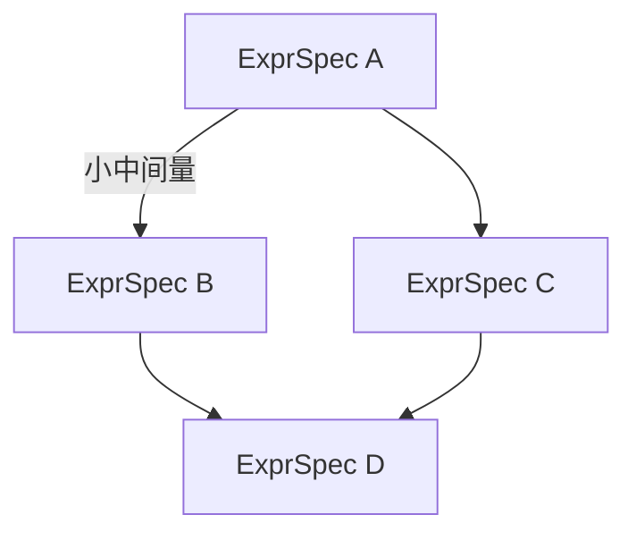

# IR 优化（IR Optimization）—— 为融合算子引入中间表示

> 状态：**IR-A（canonicalize：DCE/常量折叠/代数化简/稳定重编号）+ IR-B（CSE + 寄存器分配 liveness）✅ 已实施（2026-08-23）**；IR-C（图 IR）/IR-D（emitter）待立项
> 关联文档：`09-operator-fusion.md`（算子融合）、`DEVELOPMENT_STANDARDS.md`（分层铁律）、`08-pitfalls-and-lessons.md`
> 目标：在**不推翻现有 AOT 闭合世界**的前提下，把 `ExprSpec` 从"直通轻量 IR"演进为带优化 pass 的规范 IR，分阶段提升开发便利与代码质量。

---

## 1. 背景与动机

当前融合算子生成流水线为四段：

```
Layer 内联表达式 → to_expr_spec 折叠 → ExprSpec → glsl_gen → GLSL → glslc → SPIR-V → fused_registry.hpp
                    （前端）                （IR）        （后端）
运行时：fold → expr_spec_key → find_fused(key) → dispatch（闭合世界）
```

`ExprSpec` 已经是事实上的轻量 IR：SSA 式扁平指令表、内存访问视图、可序列化（NNEXP）、跨后端、确定性结构 key。**但它没有优化 pass**——指令序列是表达式模板按求值顺序直接产出的线性代码，`glsl_gen` 逐条原样展开。

由此产生实际问题（详见 `operator-fusion-m1-m2.md`）：
1. **子表达式重复**导致超输入/寄存器上限（如 `grad*gamma` 出现 3 次 → 超 `EXPR_MAX_INPUTS=8`，被迫手工拆表达式）。
2. **无死代码消除、无常量折叠、无代数化简**，shader 携带冗余计算。
3. **无寄存器分配**，`num_regs` 线性增长，受 `EXPR_MAX_REGS=16` 约束。
4. **后端耦合**：`glsl_gen` 为 GLSL 专用，CUDA 各自实现，无法"一份 IR 多后端"。
5. **无融合分析**：`begin_expr/end_expr` 规划的多表达式融合（文档 §3.3）因缺图 IR 未落地。

本文给出一个**分阶段**引入 IR 优化的设计，核心约束是**不破坏闭合世界的确定性 key 匹配**。

---

## 2. 分层红线（不可逾越）

与 `09-operator-fusion.md` 一致：

| 红线 | 说明 |
|------|------|
| **算法文本只在 Layer** | 公式只写在 `compute_layer.hpp` / `compute_loss.hpp` |
| **引擎只提供 op-level 原语** | 引擎认"结构"（`reduce(matmul(A,B))`），绝不认"算法名" |
| **融合/优化逻辑归工具/引擎内部** | IR、pass、emitter 都在引擎/工具内部，Layer 无感知 |
| **Shader 是内部实现** | 融合 shader 只存在于 `shaders/` + 引擎 |

IR 属于"引擎/工具内部"，**完全落在红线允许区**，且强化"引擎认结构不认算法名"的哲学。

---

## 3. IR 设计目标

1. **规范性**：把 `ExprSpec` 正式确立为 IR 规范，写清语义、上限、序列化。
2. **可优化性**：提供确定性优化 pass（DCE、常量折叠、CSE、寄存器分配、代数化简）。
3. **闭合世界兼容**：key 定义在 **canonical（优化后）IR** 上，scan 与 runtime 两端一致。
4. **跨后端**：IR → 多 emitter（GLSL / CUDA / CPU），可选推进。
5. **可扩展为图 IR**：为 `begin_expr/end_expr` 融合分析预留 DAG 演进路径。

---

## 4. IR 结构（阶段 A：规范化 ExprSpec）

沿用现有 `ExprSpec` 数据结构，不改变其形态，仅确立为 IR 并加 canonicalization 层：

```cpp
struct ExprSpec {
    std::vector<ExprInstr> instrs;   // SSA 式指令表
    std::vector<ExprView>  views;    // 与 inputs 一一对应（索引映射）
    std::vector<Scalar>    consts;   // 常量池
    std::uint32_t          num_regs;
};
```

- 指令：`ExprInstr{ op, dst, a, b, c }`，操作数 kind 为 `Reg/Input/Const/Fanout/Reduce`。
- 视图：`Linear/RotateHalf/RowMod/RowBroadcast/ColBroadcast` + 归约视图。
- 上限：`EXPR_MAX_INPUTS=8 / REGS=16 / INSTRS=64 / CONSTS=16`。

### 4.1 canonical IR 定义

> **canonical IR = `canonicalize_expr_spec(spec)` 的输出**，是 key 计算、去重、shader 合成的唯一依据。

关键约定：
```
expr_spec_key(spec) ≡ expr_spec_key(canonicalize_expr_spec(spec))
```
即 **key 一定在 canonical IR 上计算**。scan（构建期折叠时）与 runtime（运行时折叠时）必须都先 canonicalize 再算 key，保证两端一致。

### 4.2 确定性铁律

- **pass 遍历顺序必须固定**（如始终按指令序从前到后、视图按输入序、常量按出现序）。
- **CSE 胜利者选择必须确定**（如取首次出现、同序最小寄存器号）。
- **寄存器分配算法必须确定**（固定贪心顺序，杜绝跨编译器漂移）。
- 参考既有教训（`aot-fusion-collect.md` 坑 1b）：C++ 实参求值顺序未指定曾导致 key 跨编译器不稳定。任何 pass 不得引入依赖未定义求值顺序的逻辑。

---

## 5. 优化 pass 设计

### 5.1 阶段 A：canonicalization（地基）

`canonicalize_expr_spec(spec) → spec`，含：

| pass | 说明 |
|------|------|
| **DCE（死代码消除）** | 从最后一条指令（输出）反向遍历，剔除不影响输出的指令 |
| **常量折叠** | `x+0`、`x*1`、`x*0`、`neg(neg(x))`、`max(x,x)`、比较真值等 |
| **代数化简** | 幂等、结合/交换律的确定性规范化（可选，注意浮点语义） |
| **稳定排序/重编号** | 保证 canonical 形态跨调用一致 |

**注意浮点语义**：代数化简须保守，避免改变数值结果（如 `a+b+c` 的合并顺序会影响舍入）。默认只做**不改变求值语义**的化简。

### 5.2 阶段 B：CSE + 寄存器分配

| pass | 说明 |
|------|------|
| **CSE（公共子表达式消除）** | 哈希指令 `(op,a,b,c)` → 若已存在等价指令则复用其 dst，消除重复子表达式 → 降低输入/寄存器压力，缓解超限问题 |
| **寄存器分配** | 活跃性分析（liveness）→ 寄存器复用 → 降低 `num_regs`，让更多表达式落在 `EXPR_MAX_REGS=16` 内 |
| **死寄存器回收** | 结合 DCE 回收不再活跃的寄存器 |

CSE 需处理 `Input/Const/Reduce` 操作数的等价性（视图相同 + 输入相同 + 常量相同才等价）。归约指令的 CSE 需保证归约槽语义一致。

### 5.3 阶段 C：图 IR（DAG，可选推进）

为支撑 `begin_expr/end_expr` 融合分析，把扁平 IR 演进为**图 IR**：



- 节点 = 表达式/虚拟寄存器，边 = 依赖。
- **融合边界决策**：小中间量（每行/每列标量的归约结果）→ 留寄存器/共享内存；大张量 → spill 到内存作为下一 kernel 输入。
- **kernel 序列产出**：DAG 分层 → 每层一个融合 kernel。
- **key 语义扩展**：从"单表达式结构"变为"kernel 图结构"，`expr_registry` 序列化格式需兼容/迁移。

> 阶段 C 是工作量主体（约 1–2 周），**建议在确有跨 kernel 自动融合需求时再投入**。

---

## 6. 后端 emitter 抽象（阶段 D，可选）

把 `glsl_gen.hpp` 的 GLSL 专用生成抽象为 emitter 接口：

```
IR → GlslEmitter / CudaEmitter / CpuEmitter
```

- `generate_glsl` / `generate_glsl_reduce` 保留为 GLSL emitter 实现。
- 一份 canonical IR 可产出多后端代码，替换"GLSL 专用 + CUDA 各自实现"。
- 依赖阶段 A/B 的 canonical IR 形态稳定后推进。

---

## 7. 落地路径与里程碑

| 里程碑 | 内容 | 工作量 | 风险 | 收益 |
|--------|------|--------|------|------|
| **IR-A** | 确立 ExprSpec 为 IR 规范 + `canonicalize_expr_spec`（DCE/常量折叠/稳定排序）+ 接入 key | 小（1–2天） | 低 | DCE/常量折叠、确定性地基 |
| **IR-B** | CSE + 寄存器分配（liveness） | 中（3–5天） | 中 | 缓解超限拆表达式 |
| **IR-C** | 图 IR + `begin_expr/end_expr` 融合分析 | 大（1–2周） | 高 | 多表达式自动融合 |
| **IR-D** | 后端 emitter 抽象（GLSL/CUDA/CPU） | 中（3–5天） | 中 | 一份 IR 多后端 |

> **实施记录（2026-08-23，IR-A + IR-B 已完成）**：
> - 新增 `include/neuralnet.cpp/expr_opt.hpp`：`fold_constants_and_algebra`（常量池去重 + 保守常量折叠 + 代数化简）、`dead_code_elimination`、`renumber_registers`（寄存器连续重编号 + 常量池清理）、`common_subexpression_elimination`（Fanout 归一化 + 哈希复用）、`allocate_registers_liveness`（liveness 线性扫描，确定性贪心）、`canonicalize_expr_spec`（完整链）。
> - **canonical IR 接入 key**：`ExprRegistry::add/contains`、CPU `eval_expr_impl`、GPU `eval_expr/eval_expr_reduce` 全部先 `canonicalize_expr_spec` 再算 key；scan/gen_fused 存 canonical spec → shader 按 canonical 合成（闭合世界两端一致）。**dispatch 必须用 canonical 的 consts**（折叠可能增删常量池）。
> - **关键不变量**：canonicalize 不改变 views/inputs（顺序、内容），只优化 instrs/consts/num_regs → 运行时输入绑定布局不变；输出指令（最后一条）恒为真实寄存器（glsl_gen 输出 `r<last_dst>`）。
> - **glsl_gen 配套重构**：寄存器"先声明、后赋值"（`float r0, r1, ...;` + 纯赋值），兼容 liveness 复用同号寄存器（否则 GLSL redefinition）。
> - **关键坑**：① regalloc 复用后归约指令 dst 与逐元素 dst 必须**区段分离**（validate 要求 reduce_dst/elem_dst 按号互斥）；② 各 pass 重映射只处理 `expr_instr_num_operands(op)` 实际使用的操作数（未用 b/c 是默认哨兵 {0,0}，不得当 Reg(0) 重编号）。
> - 验证：新增 `src/expr_opt_test`（各 pass/确定性/幂等/语义等价/上限压力/归约区段互斥）；`expr_dsl_test`/`expr_reduce_test`/`tensor_expr_test`/`fused_gpu_test`/`matmul_fusion_test`/`ce_fusion_test`/gradcheck 系列/gpt_checkpoint_test 全绿；MNIST + text_train（CPU/GPU、含 checkpoint-every）端到端训练正常。
> - 顺带修复预存在 bug：`text_train --save-interval 0` 触发 `(step+1) % 0` 整数除零崩溃（HEAD 亦复现，与 IR 无关）。

**推荐**：先落地 IR-A + IR-B（约 1 周），解决真实痛点并铺好确定性地基；IR-C 视需求再投入。

---

## 8. 验证策略

canonicalization 与优化 pass 的验证重点：

1. **确定性**：同一 spec 多次 canonicalize 得相同结果；跨编译器（Clang/MSVC）key 稳定。
2. **语义等价**：canonical 前后 CPU 求值结果一致（容差内）；优化不改变浮点语义。
3. **现有测试全量回归**：
   - `expr_dsl_test` / `expr_reduce_test` / `tensor_expr_test`
   - `fused_gpu_test`（融合 shader GPU vs CPU）
   - `matmul_fusion_test` / `attn_gradcheck` / `gpt_gradcheck`
   - GPT / MNIST 训练冒烟（CPU + GPU）
4. **上限压力测试**：构造超输入/超寄存器用例，验证 CSE + 寄存器分配后落入限制内。
5. **闭合世界覆盖**：新增优化后，scan 覆盖的路径仍能命中（key 定义在 canonical IR 上，两端一致）。

---

## 9. 工作量小结

| 目标 | 总工作量 |
|------|----------|
| 轻量 IR + 优化（IR-A + IR-B） | 约 1 周 |
| 完整 IR + 图 IR 融合分析（A+B+C） | 约 2–4 周 |
| + 后端 emitter（+D） | 视需要追加 3–5 天 |

最大成本集中在**阶段 C（图 IR）**与**确定性 key 验证**。现有 `ExprSpec` 已是合格轻量 IR，直通、简单、确定性是其最大优点，建议以"小步演进、不推翻"为原则推进。
