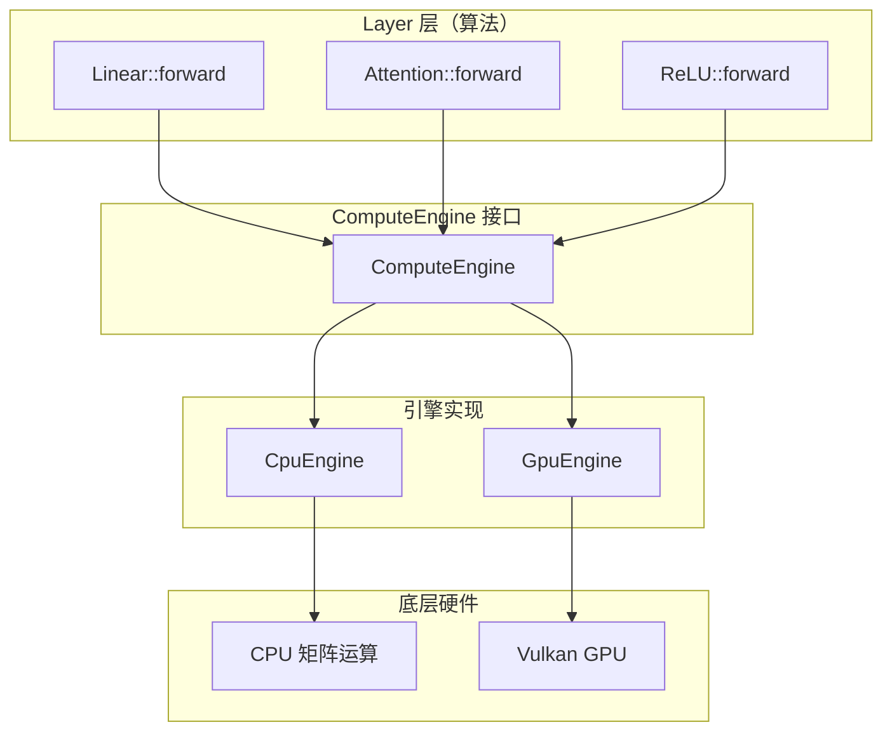

# 🔧 计算引擎开发指南

> 面向想要理解或修改计算引擎实现的开发者。

---

## 📋 目录

1. [引擎架构概览](#引擎架构概览)
2. [ComputeEngine 接口详解](#computeengine-接口详解)
3. [CPU 引擎实现](#cpu-引擎实现)
4. [GPU 引擎实现](#gpu-引擎实现)
5. [添加新原语](#添加新原语)
6. [性能优化考虑](#性能优化考虑)
7. [测试策略](#测试策略)
8. [常见问题](#常见问题)

---

## 🏗️ 引擎架构概览

### 设计原则



**核心思想**：
1. **接口与实现分离**：Layer 只依赖 `ComputeEngine` 接口
2. **算法与原语分离**：引擎只提供基础操作，不含算法逻辑
3. **一次编写，多后端运行**：同一个 Layer 代码自动适配 CPU/GPU

### 文件结构

```
include/neuralnet.cpp/
├── compute_engine.hpp          # 抽象接口定义
├── compute_cpu_engine.hpp      # CPU 实现
├── compute_gpu_engine.hpp      # GPU 实现（Vulkan）
├── compute_tensor.hpp          # Tensor 类定义
├── core_config.hpp             # 常量配置
└── core_errors.hpp             # 错误处理
```

---

## 🔌 ComputeEngine 接口详解

### 1. 设备查询

```cpp
[[nodiscard]] virtual Device device() const noexcept = 0;
```

**作用**：返回引擎运行的设备类型（CPU/GPU）

**实现要求**：
- 必须是 `noexcept`
- 返回值在引擎生命周期内不变

### 2. 批处理控制

```cpp
[[nodiscard]] virtual Result<void> begin_batch() = 0;
[[nodiscard]] virtual Result<void> end_batch() = 0;
[[nodiscard]] virtual Result<void> flush_batch() { return {}; }
```

**CPU 引擎**：
- 全部为 no-op（操作立即同步执行）

**GPU 引擎**：
- `begin_batch()`：开始录制 command buffer
- `end_batch()`：提交 command buffer + 等待完成
- `flush_batch()`：中间提交（防 TDR）

**使用模式**：
```cpp
engine.begin_batch();
// ... 执行多次操作 ...
engine.end_batch();  // 提交并等待
```

### 3. 张量工厂

```cpp
[[nodiscard]] virtual Tensor create_tensor(std::size_t rows, std::size_t cols) = 0;
[[nodiscard]] virtual Result<Tensor> from_matrix(const Matrix& m) = 0;
[[nodiscard]] virtual Result<Matrix> to_matrix(const Tensor& t) = 0;
```

**作用**：
- `create_tensor`：创建空张量
- `from_matrix`：CPU Matrix → Tensor（可能拷贝）
- `to_matrix`：Tensor → CPU Matrix（可能下载）

**实现注意**：
- `from_matrix` 应返回拷贝，避免外部修改影响
- `to_matrix` 应返回拷贝，避免内部状态泄露

### 4. 矩阵级原语

```cpp
// 矩阵乘法
[[nodiscard]] virtual Result<Tensor> matmul(
    const Tensor& A, const Tensor& B,
    bool transA = false, bool transB = false) = 0;

// 批量矩阵乘法
[[nodiscard]] virtual Result<Tensor> batched_matmul(
    const Tensor& A, const Tensor& B,
    std::size_t batch,
    bool transA = false, bool transB = false,
    Scalar alpha = Scalar{1}) = 0;

// 就地加法
[[nodiscard]] virtual Result<void> add_inplace(Tensor& A, const Tensor& B) = 0;

// 就地缩放
[[nodiscard]] virtual Result<void> scale_inplace(Tensor& A, Scalar s) = 0;

// 融合 axpy: A += scalar * B
[[nodiscard]] virtual Result<void> axpy_inplace(Tensor& A, Scalar scalar, const Tensor& B) = 0;

// 置零
[[nodiscard]] virtual Result<void> zero(Tensor& A) = 0;
```

**矩阵乘法细节**：

| 参数 | 含义 |
|------|------|
| `transA` | 是否转置 A |
| `transB` | 是否转置 B |
| `batch` | 批量大小（batched_matmul） |
| `alpha` | 输出缩放系数（batched_matmul） |

**batched_matmul 语义**：
- A: `(batch * A_rows, A_cols)` 按 batch 切分
- B: `(batch * B_rows, B_cols)` 按 batch 切分
- 输出: `(batch * M, N)` 垂直堆叠

### 5. 归约原语

```cpp
// 按行求和: (rows, cols) → (rows, 1)
[[nodiscard]] virtual Result<Tensor> row_reduce_sum(const Tensor& A) = 0;

// 按列求和: (rows, cols) → (1, cols)
[[nodiscard]] virtual Result<Tensor> col_reduce_sum(const Tensor& A) = 0;

// 按行求最大值: (rows, cols) → (rows, 1)
[[nodiscard]] virtual Result<Tensor> row_reduce_max(const Tensor& A) = 0;

// 按列求最大值: (rows, cols) → (1, cols)
[[nodiscard]] virtual Result<Tensor> col_reduce_max(const Tensor& A) = 0;
```

### 6. 广播原语

```cpp
// 按行广播: A (R, C) op= row_vec (R, 1)
[[nodiscard]] virtual Result<void> broadcast_row_inplace(
    Tensor& A, const Tensor& row_vec, BinaryOp op) = 0;

// 按列广播: A (R, C) op= col_vec (1, C)
[[nodiscard]] virtual Result<void> broadcast_col_inplace(
    Tensor& A, const Tensor& col_vec, BinaryOp op) = 0;
```

### 7. 逐元素原语

```cpp
// 一元运算: out = unary_op(A)
[[nodiscard]] virtual Result<Tensor> elementwise_unary(
    UnaryOp op, const Tensor& A) = 0;

// 二元运算: out = binary_op(A, B)
[[nodiscard]] virtual Result<Tensor> elementwise_binary(
    BinaryOp op, const Tensor& A, const Tensor& B) = 0;

// 标量二元运算: out = op(A, scalar) 或 op(scalar, A)
[[nodiscard]] virtual Result<Tensor> elementwise_binary_scalar(
    BinaryOp op, const Tensor& A, Scalar s, bool scalar_first = false) = 0;
```

**支持的运算**：

| 类型 | 运算 |
|------|------|
| UnaryOp | Neg, Exp, Log, Sqrt, Rsqrt, Abs, Tanh |
| BinaryOp | Add, Sub, Mul, Div, Max, Min |

### 8. 条件选择原语

```cpp
// out = compare_op(A, scalar_b) ? then_t : scalar_else
[[nodiscard]] virtual Result<Tensor> elementwise_select_scalar_cond(
    CompareOp cmp, const Tensor& A, Scalar scalar_b,
    const Tensor& then_t, Scalar scalar_else) = 0;
```

**典型用途**：ReLU 反向 `(x > 0) ? grad : 0`

### 9. 数据操作原语

```cpp
// 行切片
[[nodiscard]] virtual Result<Tensor> slice_rows(
    const Tensor& src, std::size_t start_row, std::size_t count) = 0;

// 行插入
[[nodiscard]] virtual Result<void> insert_rows(
    Tensor& dst, std::size_t dst_start_row, const Tensor& src) = 0;

// 行收集（embedding 查表）
[[nodiscard]] virtual Result<Tensor> gather_rows(
    const Tensor& table, const Tensor& indices) = 0;

// 行散列累加（embedding 梯度）
[[nodiscard]] virtual Result<void> scatter_add_rows(
    Tensor& dst, const Tensor& indices, const Tensor& grad) = 0;

// 3D 重排
[[nodiscard]] virtual Result<Tensor> rearrange_3d(
    const Tensor& x, std::size_t M, std::size_t B, std::size_t N,
    bool inverse = false) = 0;

// 转置
[[nodiscard]] virtual Result<Tensor> transpose(const Tensor& A) = 0;

// 深拷贝
[[nodiscard]] virtual Result<Tensor> clone(const Tensor& src) = 0;
```

### 10. 表达式求值

```cpp
// 逐元素表达式融合
[[nodiscard]] virtual Result<Tensor> eval_expr(
    const ExprSpec& spec,
    std::span<const Tensor> inputs,
    std::size_t rows, std::size_t cols) = 0;
```

**作用**：将多个逐元素操作合并为一次调用，减少临时张量

---

## 🖥️ CPU 引擎实现

### 文件位置

`include/neuralnet.cpp/compute_cpu_engine.hpp`

### 实现模式

```cpp
class CpuEngine final : public ComputeEngine {
public:
    // 1. 设备查询
    [[nodiscard]] Device device() const noexcept override { 
        return Device::CPU; 
    }
    
    // 2. 批处理控制（no-op）
    [[nodiscard]] Result<void> begin_batch() override { return {}; }
    [[nodiscard]] Result<void> end_batch() override { return {}; }
    
    // 3. 张量工厂
    [[nodiscard]] Tensor create_tensor(std::size_t rows, std::size_t cols) override {
        return Tensor::cpu(rows, cols);
    }
    
    // 4. 矩阵乘法（委托给 Matrix::multiply）
    [[nodiscard]] Result<Tensor> matmul(
        const Tensor& A, const Tensor& B,
        bool transA, bool transB) override {
        // 实现细节...
    }
};
```

### 关键实现细节

#### 1. 错误处理

```cpp
[[nodiscard]] Result<Tensor> matmul(...) override {
    if (!A.is_cpu() || !B.is_cpu())
        return std::unexpected(Error{"matmul: tensors are not CPU"});
    // ...
}
```

**原则**：
- 检查输入设备类型
- 返回 `Result<T>` 而不是抛异常
- 错误信息清晰明确

#### 2. 并行化

```cpp
[[nodiscard]] Result<Tensor> gather_rows(...) override {
    const std::size_t total = num * D;
    if (total >= PARALLEL_THRESHOLD && num > 1) {
        // 行块并行
        auto row_indices = std::views::iota(std::size_t{0}, num);
        nn::for_each(row_indices.begin(), row_indices.end(), [...](std::size_t i) {
            // 每行独立查表，无数据竞争
        });
    } else {
        // 串行路径
    }
}
```

**并行策略**：
- 行块并行：每行独立，无数据竞争
- 阈值控制：小任务串行，避免调度开销

#### 3. 表达式求值

```cpp
[[nodiscard]] Result<Tensor> eval_expr(
    const ExprSpec& spec,
    std::span<const Tensor> inputs,
    std::size_t rows, std::size_t cols) override {
    // CPU 走编译期模板求值
    return dsl::compute(spec, inputs, rows, cols);
}
```

---

## 🎮 GPU 引擎实现

### 文件位置

`include/neuralnet.cpp/compute_gpu_engine.hpp` + `backend/compute_vk_backend.hpp`

### 实现模式

```cpp
class GpuEngine final : public ComputeEngine {
private:
    VkBackend backend_;  // Vulkan 后端
    
public:
    // 1. 设备查询
    [[nodiscard]] Device device() const noexcept override { 
        return Device::GPU; 
    }
    
    // 2. 批处理控制（录制 command buffer）
    [[nodiscard]] Result<void> begin_batch() override {
        return backend_.begin_recording();
    }
    
    [[nodiscard]] Result<void> end_batch() override {
        return backend_.end_recording_and_submit();
    }
    
    // 3. 矩阵乘法（dispatch shader）
    [[nodiscard]] Result<Tensor> matmul(...) override {
        // 选择 matmul shader（naive/tiled/batched）
        // dispatch compute shader
    }
};
```

### 关键实现细节

#### 1. Command Buffer 录制

```cpp
[[nodiscard]] Result<void> begin_batch() override {
    // 开始录制 Vulkan command buffer
    VkCommandBufferBeginInfo beginInfo{};
    beginInfo.flags = VK_COMMAND_BUFFER_USAGE_ONE_TIME_SUBMIT_BIT;
    vkBeginCommandBuffer(commandBuffer_, &beginInfo);
    return {};
}

[[nodiscard]] Result<void> end_batch() override {
    // 结束录制 + 提交 + 等待完成
    vkEndCommandBuffer(commandBuffer_);
    vkQueueSubmit(queue_, 1, &submitInfo, fence_);
    vkWaitForFences(device_, 1, &fence_, VK_TRUE, UINT64_MAX);
    return {};
}
```

#### 2. Shader 选择

```cpp
[[nodiscard]] Result<Tensor> matmul(...) override {
    // 根据矩阵大小选择 shader
    if (M < 64 || N < 64 || K < 64) {
        // 小矩阵：naive shader
        return dispatch_matmul_naive(A, B, transA, transB);
    } else {
        // 大矩阵：tiled shader
        return dispatch_matmul_tiled(A, B, transA, transB);
    }
}
```

#### 3. 内存管理

```cpp
[[nodiscard]] Result<Tensor> create_tensor(std::size_t rows, std::size_t cols) override {
    // 从显存池分配
    auto buffer = backend_.allocate_buffer(rows * cols * sizeof(Scalar));
    return Tensor::gpu(rows, cols, std::move(buffer));
}
```

**内存池策略**：
- 预分配大块显存
- 按需切分给张量
- 延迟销毁（`pending_destroys_`）

---

## ➕ 添加新原语

### 步骤 1：在接口中声明

在 `compute_engine.hpp` 中添加纯虚函数：

```cpp
// 新原语：逐元素绝对值差
[[nodiscard]] virtual Result<Tensor> elementwise_abs_diff(
    const Tensor& A, const Tensor& B) = 0;
```

### 步骤 2：在 CPU 引擎中实现

在 `compute_cpu_engine.hpp` 中添加实现：

```cpp
[[nodiscard]] Result<Tensor> elementwise_abs_diff(
    const Tensor& A, const Tensor& B) override {
    if (!A.is_cpu() || !B.is_cpu())
        return std::unexpected(Error{"elementwise_abs_diff: tensors are not CPU"});
    if (A.rows() != B.rows() || A.cols() != B.cols())
        return std::unexpected(Error{"elementwise_abs_diff: shape mismatch"});
    
    Matrix result(A.rows(), A.cols());
    auto a_span = A.cpu_matrix().span();
    auto b_span = B.cpu_matrix().span();
    auto r_span = result.span();
    
    for (std::size_t i = 0; i < a_span.size(); ++i) {
        r_span[i] = std::abs(a_span[i] - b_span[i]);
    }
    
    return Tensor::from_matrix(std::move(result));
}
```

### 步骤 3：在 GPU 引擎中实现

在 `compute_gpu_engine.hpp` 中添加实现：

```cpp
[[nodiscard]] Result<Tensor> elementwise_abs_diff(
    const Tensor& A, const Tensor& B) override {
    // 1. 选择或创建 shader
    // 2. 准备 push constants
    // 3. dispatch compute shader
    // 4. 返回结果张量
}
```

### 步骤 4：创建 GPU Shader（可选）

在 `shaders/` 目录创建 `.comp` 文件：

```glsl
#version 450

layout(local_size_x = 64) in;

layout(push_constant) uniform PushConstants {
    uint rows;
    uint cols;
};

layout(binding = 0) readonly buffer BufferA { float A[]; };
layout(binding = 1) readonly buffer BufferB { float B[]; };
layout(binding = 2) writeonly buffer BufferR { float R[]; };

void main() {
    uint idx = gl_GlobalInvocationID.x;
    if (idx >= rows * cols) return;
    R[idx] = abs(A[idx] - B[idx]);
}
```

### 步骤 5：添加测试

在 `test/` 目录创建测试文件：

```cpp
TEST_CASE("elementwise_abs_diff") {
    CpuEngine engine;
    
    Matrix a(2, 2);
    Matrix b(2, 2);
    // ... 初始化 ...
    
    auto ta = engine.from_matrix(a);
    auto tb = engine.from_matrix(b);
    
    auto result = engine.elementwise_abs_diff(*ta, *tb);
    REQUIRE(result);
    
    auto r_matrix = engine.to_matrix(*result);
    // ... 验证结果 ...
}
```

### 步骤 6：更新文档

1. 更新 `compute_engine.hpp` 的注释
2. 更新本文档的原语列表
3. 更新 `docs/01-architecture.md` 的原语分类表

---

## ⚡ 性能优化考虑

### 1. 内存分配

**问题**：频繁分配/释放显存会导致碎片和性能下降

**解决方案**：
```cpp
// 使用内存池
class GpuEngine {
    MemoryPool pool_;  // 显存池
    
    [[nodiscard]] Result<Tensor> create_tensor(std::size_t rows, std::size_t cols) {
        auto buffer = pool_.allocate(rows * cols * sizeof(Scalar));
        return Tensor::gpu(rows, cols, std::move(buffer));
    }
};
```

### 2. Kernel 融合

**问题**：多个小操作导致多次 kernel launch 开销

**解决方案**：
```cpp
// 使用表达式 DSL
auto result = dsl::compute(
    engine,
    [](auto a, auto b, auto c) {
        return a + b * c;  // 融合为单个 kernel
    },
    {tensor_a, tensor_b, tensor_c},
    rows, cols
);
```

### 3. 并行化

**问题**：串行执行浪费多核 CPU

**解决方案**：
```cpp
// 使用行块并行
if (total_work >= PARALLEL_THRESHOLD) {
    nn::for_each(row_indices.begin(), row_indices.end(), 
        [&](std::size_t i) {
            // 每行独立处理，无数据竞争
        });
}
```

### 4. 缓存友好

**问题**：随机内存访问导致 cache miss

**解决方案**：
```cpp
// 行主序存储 + 顺序访问
for (std::size_t r = 0; r < rows; ++r) {
    for (std::size_t c = 0; c < cols; ++c) {
        // 顺序访问 data_[r * cols + c]
    }
}
```

---

## 🧪 测试策略

### 1. 单元测试

每个原语必须有对应的单元测试：

```cpp
TEST_CASE("matmul") {
    CpuEngine engine;
    
    Matrix a(2, 3);
    Matrix b(3, 2);
    // ... 初始化 ...
    
    auto ta = engine.from_matrix(a);
    auto tb = engine.from_matrix(b);
    
    auto result = engine.matmul(*ta, *tb);
    REQUIRE(result);
    
    auto r_matrix = engine.to_matrix(*result);
    // ... 验证结果 ...
}
```

### 2. 数值精度测试

使用 `gradcheck` 验证梯度计算：

```cpp
TEST_CASE("linear_gradcheck") {
    CpuEngine engine;
    Linear layer(10, 5);
    
    Matrix input(10, 1);
    // ... 初始化 ...
    
    bool ok = gradcheck(engine, layer, input);
    REQUIRE(ok);
}
```

### 3. 性能测试

使用 `perf_smoke.cpp` 验证性能：

```bash
./build/perf_smoke --matmul 1024
```

### 4. GPU 特定测试

```bash
./build/gpu_test
```

**注意**：无 Vulkan 时返回 77（跳过）

---

## ❓ 常见问题

### Q1: 为什么使用 `Result<T>` 而不是异常？

**A**: 项目禁止使用异常（`-fno-exceptions` 编译选项）。`Result<T>` 提供类似的错误处理能力，但不需要异常支持。

### Q2: 如何调试 GPU 问题？

**A**:
1. 启用 Vulkan 验证层
2. 使用 `gpu_test` 运行测试
3. 检查 `VK_ERROR_DEVICE_LOST` 错误
4. 使用 RenderDoc 捕获 frame

### Q3: 如何添加新的激活函数？

**A**:
1. 在 `UnaryOp` 或 `BinaryOp` 中添加枚举值
2. 在 `CpuEngine` 中实现逐元素运算
3. 在 `GpuEngine` 中实现 shader
4. 在 Layer 中组合使用

### Q4: 如何优化矩阵乘法？

**A**:
1. 使用 `matmul_tiled` shader（分块优化）
2. 调整 `BLOCK_SIZE`（缓存分块大小）
3. 使用 `batched_matmul`（批量运算）
4. 启用 `SmartPolicy`（自适应并行）

### Q5: 为什么 `begin_batch/end_batch` 在 CPU 上是 no-op？

**A**: CPU 操作是同步的，立即执行。GPU 操作是异步的，需要录制 command buffer 后统一提交。

---

## 📚 相关文档

- **接口定义**：`include/neuralnet.cpp/compute_engine.hpp`
- **CPU 实现**：`include/neuralnet.cpp/compute_cpu_engine.hpp`
- **GPU 实现**：`include/neuralnet.cpp/compute_gpu_engine.hpp`
- **Tensor 定义**：`include/neuralnet.cpp/compute_tensor.hpp`
- **表达式 DSL**：`include/neuralnet.cpp/expr_dsl.hpp`
- **性能优化**：`docs/02-performance.md`
- **踩坑警示**：`docs/08-pitfalls-and-lessons.md`

---

*最后更新：2026-08-31*
*维护者：Ethan*