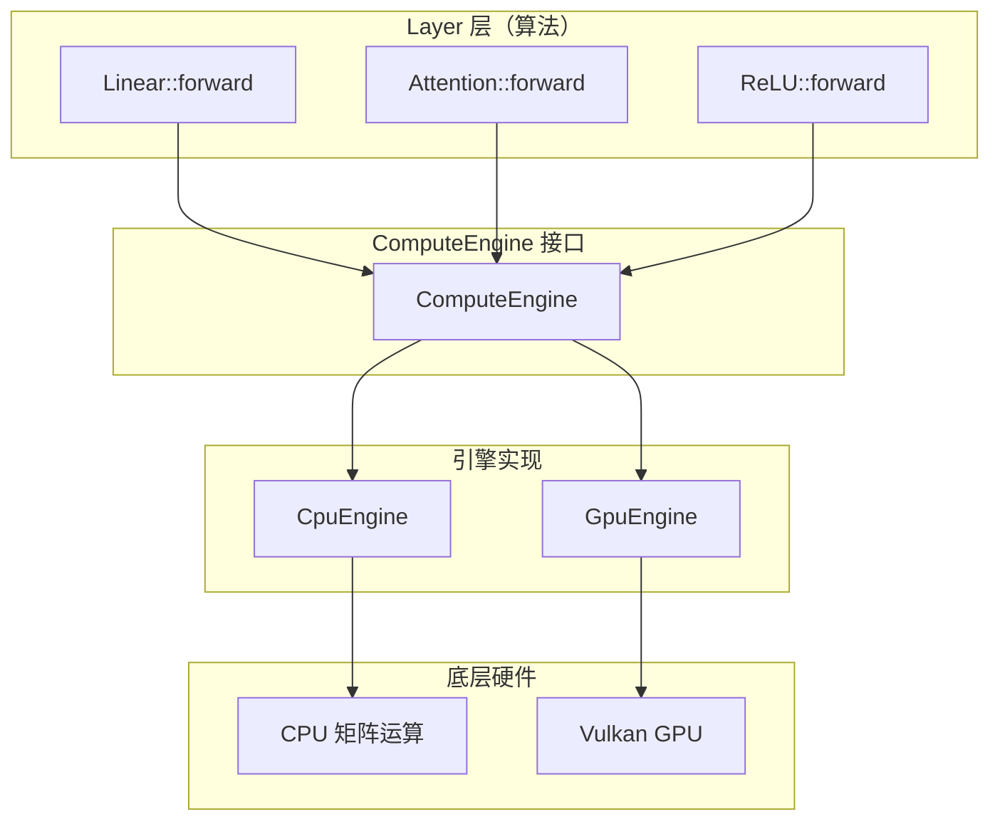

# 计算引擎开发指南

> 面向想要理解或修改计算引擎实现的开发者。本文覆盖 ComputeEngine 接口全解、CPU / GPU 实现模式、以及添加新原语的完整方法。

## 目录

1. [引擎架构概览](#引擎架构概览)
2. [ComputeEngine 接口详解](#computeengine-接口详解)
3. [CPU 引擎实现](#cpu-引擎实现)
4. [GPU 引擎实现](#gpu-引擎实现)
5. [添加新原语](#添加新原语)
6. [性能优化考虑](#性能优化考虑)
7. [测试策略](#测试策略)
8. [常见问题](#常见问题)

---

## 引擎架构概览

### 设计原则



**核心思想**：
1. **接口与实现分离**：Layer 只依赖 `ComputeEngine` 接口
2. **算法与原语分离**：引擎只提供基础操作，不含算法逻辑
3. **一次编写，多后端运行**：同一个 Layer 代码自动适配 CPU/GPU

### 文件结构

```
include/neuralnet.cpp/
├── compute_engine.hpp          # 抽象接口定义
├── compute_cpu_engine.hpp      # CPU 实现
├── compute_gpu_engine.hpp      # GPU 实现（Vulkan）
├── compute_tensor.hpp          # Tensor 类定义
├── core_config.hpp             # 常量配置
└── core_errors.hpp             # 错误处理
```

---

## ComputeEngine 接口详解

### 1. 设备查询

```cpp
[[nodiscard]] virtual Device device() const noexcept = 0;
```

**作用**：返回引擎运行的设备类型（CPU/GPU）

**实现要求**：
- 必须是 `noexcept`
- 返回值在引擎生命周期内不变

### 2. 批处理控制

```cpp
[[nodiscard]] virtual Result<void> begin_batch() = 0;
[[nodiscard]] virtual Result<void> end_batch() = 0;
[[nodiscard]] virtual Result<void> flush_batch() { return {}; }
```

**CPU 引擎**：
- 全部为 no-op（操作立即同步执行）

**GPU 引擎**：
- `begin_batch()`：开始录制 command buffer
- `end_batch()`：提交 command buffer + 等待完成
- `flush_batch()`：中间提交（防 TDR）

**使用模式**：
```cpp
engine.begin_batch();
// ... 执行多次操作 ...
engine.end_batch();  // 提交并等待
```

> **接口分层（NVI，P-1/P1 之后）**：引擎的**公共入口全部非虚**——承载边界 cast
> （f16 抬 f32 算→按 P 落回，15 §4.1）、`bind_check_`（跨引擎检查，15 §4.3 D3）
> 与 `stamp_`（张量出生绑定，15 §3.1）；**引擎实现侧是 protected 的虚 `*_impl`**。
> 下文各"原语"清单列出的就是引擎需要实现的 `*_impl` 签名；调用方（Layer/测试）
> 永远调用**同名公共入口**（不带 `_impl`）。

### 3. 张量工厂

```cpp
// 公共非虚入口（包装在尾部统一 stamp 出生绑定，15 §3.1）：
[[nodiscard]] Tensor create_tensor(std::size_t rows, std::size_t cols,
                                   Precision P = Precision::F32);
// M2（17 §4.4）：声明式创建/初始化——层算分布参数、引擎填数
//（基类 host 生成 + from_matrix 上传；seed 与引擎内创建序号混流）：
[[nodiscard]] Tensor create_tensor(std::size_t rows, std::size_t cols, Precision P,
                                   const InitSpec& spec);
[[nodiscard]] Result<Tensor> from_matrix(const Matrix& m, Precision P = Precision::F32);
// to_matrix 输出宿主 Matrix，仍为纯虚（不参与 stamp）：
[[nodiscard]] virtual Result<Matrix> to_matrix(const Tensor& t, Precision P = Precision::F32) = 0;
// M3（17 §4.3 D3/D9）：批量读写 I/O 分组——基类非虚，复用 to_matrix/copy_from：
template <class T> Result<void> read(const Tensor& t, std::span<T> dst);
template <class T> Result<void> write(Tensor& t, std::span<T> src);  // 覆盖既有存储、不替换对象
Result<Scalar> get_index(const Tensor& t, std::size_t row, std::size_t col); // 语法糖
Result<void> set_index(Tensor& t, std::size_t row, std::size_t col, Scalar v);

// 引擎实现侧（protected 虚；默认实参只写在公共入口上）：
[[nodiscard]] virtual Tensor create_tensor_impl(std::size_t rows, std::size_t cols, Precision P) = 0;
[[nodiscard]] virtual Result<Tensor> from_matrix_impl(const Matrix& m, Precision P) = 0;
```

**作用**：
- `create_tensor`（3 参）：纯分配（CPU 分配零填充、GPU 分配未初始化——需要零的调用方显式 `zero`）
- `create_tensor`（4 参，`InitSpec`）：声明式初值（Uninitialized/Zero/Constant/Uniform/Normal），
  层算分布参数、引擎填数；策略（host 生成上传 vs 将来设备端原生）由引擎自选（17 §4.4 D6）
- `from_matrix`：CPU Matrix → Tensor（按 P 分配存储；可能拷贝）
- `to_matrix`：Tensor → CPU Matrix（按 P 转换；可能下载）
- `read/write`：批量 span 进出**本体**——元素类型与 `precision()` 精确匹配（U2：错配运行期
  错误、类型非法编译期 static_assert）；GPU `read` 隐含 flush + 同步（走 `to_matrix` 同路）、
  `write` 走 `copy_from` 既有 drain 语义（17 §4.3/§7-4）
- `get_index/set_index`：语法糖——宿主直读写、GPU 走批量 read/write（每次一整轮 staging，
  不承诺热循环性能，17 §7-1）
- **L2+ 宿主桥（M4，17 §3 D11 / AGENTS.md 铁律 #12）**：`nn::detail::upload_span(engine,
  rows, cols, P, span)`（标量缓冲 → 新建张量，f16 目标按 RHE，等价 `from_matrix` 的
  span 形态）、`download_span(engine, t, span)` 与 `download_vector(engine, t)`（张量 →
  标量缓冲，f16 存储先升 f32，等价 `to_matrix(t, F32)`）。定义在 `compute_engine.hpp`
  尾部，内部只用 `write/read`、不加虚函数。**Layer/Loss/Optimizer/Model 里只准用这三个
  与 `create_tensor`+`InitSpec`/`zero`**，不得出现 `Matrix` 或 `from_matrix/to_matrix/copy_from`
  ——审计：`pwsh -File bench\doc_inventory.ps1` 第 [4] 节，`L2-VIOLATIONS` 必须为 0。

**实现注意**：
- `from_matrix_impl` 应返回拷贝，避免外部修改影响
- `to_matrix` 应返回拷贝，避免内部状态泄露
- `create_tensor_impl` 失败时可返回 `Tensor()` 空槽——公共入口的 `stamp_`
  只 stamp 有效张量，空槽保持不绑定（15 §3.1）

### 4. 矩阵级原语

```cpp
// 矩阵乘法（实现侧；公共入口 matmul 带 bind_check_ + stamp_，下同）
[[nodiscard]] virtual Result<Tensor> matmul_impl(
    const Tensor& A, const Tensor& B,
    bool transA, bool transB,
    Precision P) = 0;

// 批量矩阵乘法
[[nodiscard]] virtual Result<Tensor> batched_matmul_impl(
    const Tensor& A, const Tensor& B,
    std::size_t batch,
    bool transA, bool transB,
    Scalar alpha,
    Precision P) = 0;

// 矩阵乘 + bias 广播（默认实现 = matmul + 逐行加 bias）
[[nodiscard]] virtual Result<Tensor> matmul_with_bias_impl(
    const Tensor& A, const Tensor& B, const Tensor& bias,
    bool transA, bool transB,
    Precision P);

// 就地加法
[[nodiscard]] virtual Result<void> add_inplace_impl(Tensor& A, const Tensor& B) = 0;

// 就地缩放
[[nodiscard]] virtual Result<void> scale_inplace_impl(Tensor& A, Scalar s) = 0;

// 置零
[[nodiscard]] virtual Result<void> zero_impl(Tensor& A) = 0;
```

> 梯度累加 `accumulate` **不是引擎实现接口**——它是公共入口，内部经
> `add_inplace_impl` 完成（f16 时基类先做边界 cast）。

**矩阵乘法细节**：

| 参数 | 含义 |
|------|------|
| `transA` | 是否转置 A |
| `transB` | 是否转置 B |
| `batch` | 批量大小（batched_matmul） |
| `alpha` | 输出缩放系数（batched_matmul） |
| `P` | 计算精度（F32 默认；F16 走 f16 GEMM），由 Layer 按 `PrecisionProfile.compute` 显式传入 |

**batched_matmul 语义**：
- A: `(batch * A_rows, A_cols)` 按 batch 切分
- B: `(batch * B_rows, B_cols)` 按 batch 切分
- 输出: `(batch * M, N)` 垂直堆叠

### 5. 归约原语

```cpp
// 按行求和: (rows, cols) → (rows, 1)
[[nodiscard]] virtual Result<Tensor> row_reduce_sum_impl(const Tensor& A, Precision P) = 0;

// 按列求和: (rows, cols) → (1, cols)
[[nodiscard]] virtual Result<Tensor> col_reduce_sum_impl(const Tensor& A, Precision P) = 0;

// 按列求最大值: (rows, cols) → (1, cols)
[[nodiscard]] virtual Result<Tensor> col_reduce_max_impl(const Tensor& A, Precision P) = 0;

// 分组归约（segmented reduce，沿行方向每连续 R 行为一组）：
//   x: (G*R, N) → out: (G, N)，把"逐通道/逐头一次 dispatch"的层内循环压成单次调用
[[nodiscard]] virtual Result<Tensor> grouped_reduce_sum_impl(
    const Tensor& x, std::size_t G, std::size_t R, Precision P) = 0;
[[nodiscard]] virtual Result<Tensor> grouped_reduce_max_impl(
    const Tensor& x, std::size_t G, std::size_t R, Precision P) = 0;
```

> 按行求最大值**不走引擎算子**——用 DSL 归约叶子 `dsl::row_reduce_max(...)`（详见 `expr_dsl.hpp`）。
> 归约表达式在 Layer 里统一走 `dsl::compute_reduce`。

### 6. 广播 / 逐元素 / 条件选择：一律走表达式 DSL

引擎**没有**逐元素/广播/条件选择类原语（`UnaryOp`/`BinaryOp`/`CompareOp` 枚举也不存在）——这类运算统一用表达式 DSL 表达（单 kernel、无中间张量）：

```cpp
auto y  = dsl::compute(engine, dsl::exp(dsl::leaf(*a)), a->rows(), a->cols());          // 一元
auto z  = dsl::compute(engine, dsl::leaf(*a) + dsl::leaf(*b), a->rows(), a->cols());   // 二元
auto w  = dsl::compute_into(engine, dsl::leaf(*a) * dsl::rparam(0.1f), *a);            // 原地+标量
auto rg = dsl::compute(engine,                                                          // 条件选择
    dsl::select(dsl::leaf(*x) > Scalar{0}, dsl::leaf(*g), dsl::rparam(0)),
    x->rows(), x->cols());
```

> 理由：DSL 与逐元素算子能力完全重叠，且天然融合为单 kernel。
> 引擎原语盘点见 `development/12-compute-engine-inventory.md`；
> 逐元素算子收敛的历史演进记录见 `docs/history.md`。

### 9. 数据操作原语

```cpp
// 行切片
[[nodiscard]] virtual Result<Tensor> slice_rows_impl(
    const Tensor& src, std::size_t start_row, std::size_t count) = 0;

// 行插入
[[nodiscard]] virtual Result<void> insert_rows_impl(
    Tensor& dst, std::size_t dst_start_row, const Tensor& src) = 0;

// 行收集（embedding 查表）
[[nodiscard]] virtual Result<Tensor> gather_rows_impl(
    const Tensor& table, const Tensor& indices) = 0;

// 行散列累加（embedding 梯度）
[[nodiscard]] virtual Result<void> scatter_add_rows_impl(
    Tensor& dst, const Tensor& indices, const Tensor& grad) = 0;

// 3D 重排
[[nodiscard]] virtual Result<Tensor> rearrange_3d_impl(
    const Tensor& x, std::size_t M, std::size_t B, std::size_t N,
    bool inverse) = 0;

// 转置
[[nodiscard]] virtual Result<Tensor> transpose_impl(const Tensor& A) = 0;

// 卷积/池化窗口展开与其伴随散射（纯数据搬运）
[[nodiscard]] virtual Result<Tensor> im2col_impl(
    const Tensor& x, std::size_t C, std::size_t H, std::size_t W,
    std::size_t k, std::size_t stride, std::size_t pad,
    std::size_t OH, std::size_t OW) = 0;
[[nodiscard]] virtual Result<Tensor> col2im_impl(
    const Tensor& col, std::size_t C, std::size_t H, std::size_t W,
    std::size_t k, std::size_t stride, std::size_t pad,
    std::size_t OH, std::size_t OW) = 0;

// CPU Matrix → 已有张量（序列化加载、优化器参数写回）
[[nodiscard]] virtual Result<void> copy_from_impl(Tensor& dst, const Matrix& src) = 0;

// 深拷贝
[[nodiscard]] virtual Result<Tensor> clone_impl(const Tensor& src) = 0;
```

### 10. 表达式求值

```cpp
// 逐元素表达式融合（输出 (rows, cols)，P 为输出精度）
[[nodiscard]] virtual Result<Tensor> eval_expr_impl(
    const ExprSpec& spec,
    std::span<const Tensor> inputs,
    std::size_t rows, std::size_t cols,
    Precision P) = 0;

// 目标传递：结果直接写入 out（不分配新张量，表达"原地更新"）
[[nodiscard]] virtual Result<void> eval_expr_into_impl(
    const ExprSpec& spec, std::span<const Tensor> inputs,
    std::size_t rows, std::size_t cols, Tensor& out);

// 归约向量原生形状输出（行归约 → (rows,1)；列归约 → (1,cols)）
[[nodiscard]] virtual Result<Tensor> eval_expr_reduce_impl(
    const ExprSpec& spec, std::span<const Tensor> inputs,
    std::size_t rows, std::size_t cols, Precision P);
```

**作用**：将多个逐元素操作合并为一次调用，减少临时张量。Layer 侧一般经 `dsl::compute` / `dsl::compute_into` / `dsl::compute_reduce` 间接使用，不手写 `ExprSpec`。

### 11. 扫描级原语（RLA / RAPT）

```cpp
// 前缀扫描（RLA forward / backward pass 1 / forward_step）：
//   causal=true : A_t = A0 + Σ_{i≤t, 同文档} k_i·k_i^T（文档边界处清零）
//   causal=false: 全集常数（无边界重置）
// 输出 (B·H·5·d_k, seq)：[0) B·P  [1) A·P  [2) B^T·R  [3) s  [4) r
[[nodiscard]] virtual Result<Tensor> scan_prefix_outer_impl(
    const Tensor& K, const Tensor& V, const Tensor& P, const Tensor& R,
    const Tensor& A0, const Tensor& B0, bool has_state,
    std::size_t dk, std::size_t heads, bool causal,
    const Tensor& boundary, bool has_bnd,
    Precision prec) = 0;

// 后缀扫描（RLA backward pass 2）：
//   causal=true : S_i = Σ_{t≥i, 同文档} D_t
//   causal=false: S_i = D_i（Layer 已把全集梯度沿 seq 广播）
// 输出 (B·H·3·d_k, seq)：[0) S·X  [1) S·Y  [2) S^T·Y
[[nodiscard]] virtual Result<Tensor> scan_suffix_outer_impl(
    const Tensor& D, const Tensor& X, const Tensor& Y,
    std::size_t dk, std::size_t heads, bool causal,
    const Tensor& boundary, bool has_bnd,
    Precision prec) = 0;

// 逐列外积（RLA backward 物化 dL/dA、dL/dB）：
// 输出 (B·H·d_k², seq)：out = P·R^T（has_scale 时逐列乘 S[t]）
[[nodiscard]] virtual Result<Tensor> outer_col_impl(
    const Tensor& P, const Tensor& R, const Tensor& S,
    std::size_t dk, bool has_scale,
    Precision prec) = 0;
```

**形状约定**：batch-major `i = b*seq+t`；头 (b,h) 行块起点 `r0=(b*H+h)*d_k`；K/V/P/R（X/Y）`(B·H·d_k, seq)`、D `(B·H·d_k², seq)`、A0/B0 `(H·d_k, d_k)`；boundary `(1, B·seq)`（1=文档起点）；空参数用 (1,1) dummy + bool 标志（规避 0 字节 GPU buffer）；`d_k ≤ 64`（GPU MAX_DK）；标量块 s/r 头内逐行重复（实现写全部行，调用方读任一行）。

**使用方**：`ReLULinearAttention`（RAPT 层）——shader 只含"带状态的顺序归约 + matvec 读出 / 外积"，算法（L2 分母 / ReLU 门控 / 梯度公式 / 文档重置）全部由 Layer 用原语组合表达（见 `06-rapt-algorithm.md` §4）。

---

## CPU 引擎实现

### 文件位置

`include/neuralnet.cpp/compute_cpu_engine.hpp`

### 实现模式

```cpp
class CpuEngine final : public ComputeEngine {
public:
    // 1. 设备查询
    [[nodiscard]] Device device() const noexcept override {
        return Device::CPU;
    }

    // 2. 批处理控制（no-op）
    [[nodiscard]] Result<void> begin_batch() override { return {}; }
    [[nodiscard]] Result<void> end_batch() override { return {}; }

    // 3. 张量工厂（实现侧；公共入口 create_tensor 负责 stamp 出生绑定）
    [[nodiscard]] Tensor create_tensor_impl(std::size_t rows, std::size_t cols, Precision P) override {
        if (P == Precision::F16) return Tensor::cpu<Precision::F16>(rows, cols);
        return Tensor::cpu(rows, cols);
    }

    // 4. 矩阵乘法（委托给 Matrix::multiply；公共入口 matmul 带 bind_check_+stamp_）
    [[nodiscard]] Result<Tensor> matmul_impl(
        const Tensor& A, const Tensor& B,
        bool transA, bool transB, Precision P) override {
        // 实现细节...
    }
};
```

### 关键实现细节

#### 1. 错误处理

```cpp
[[nodiscard]] Result<Tensor> matmul_impl(...) override {
    if (!A.is_cpu() || !B.is_cpu())
        return std::unexpected(Error{"matmul: tensors are not CPU"});
    // ...
}
```

**原则**：
- 检查输入设备类型
- 返回 `Result<T>` 而不是抛异常
- 错误信息清晰明确

#### 2. 并行化

```cpp
[[nodiscard]] Result<Tensor> gather_rows_impl(...) override {
    const std::size_t total = num * D;
    if (total >= PARALLEL_THRESHOLD && num > 1) {
        // 行块并行
        auto row_indices = std::views::iota(std::size_t{0}, num);
        nn::for_each(row_indices.begin(), row_indices.end(), [...](std::size_t i) {
            // 每行独立查表，无数据竞争
        });
    } else {
        // 串行路径
    }
}
```

**并行策略**：
- 行块并行：每行独立，无数据竞争
- 阈值控制：小任务串行，避免调度开销

#### 3. 表达式求值

```cpp
[[nodiscard]] Result<Tensor> eval_expr_impl(
    const ExprSpec& spec,
    std::span<const Tensor> inputs,
    std::size_t rows, std::size_t cols, Precision P) override {
    // CPU：IR 解释器求值（含归约/matmul 视图）；
    // 逐元素模板路径在公共 dsl::compute 的 CPU 分支，不经过本函数
}
```

---

## GPU 引擎实现

### 文件位置

`include/neuralnet.cpp/compute_gpu_engine.hpp` + `backend/compute_vk_backend.hpp`

### 实现模式

```cpp
class GpuEngine final : public ComputeEngine {
private:
    VkBackend backend_;  // Vulkan 后端

public:
    // 1. 设备查询
    [[nodiscard]] Device device() const noexcept override {
        return Device::GPU;
    }

    // 2. 批处理控制（录制 command buffer）
    [[nodiscard]] Result<void> begin_batch() override {
        return backend_.begin_recording();
    }

    [[nodiscard]] Result<void> end_batch() override {
        return backend_.end_recording_and_submit();
    }

    // 3. 矩阵乘法（dispatch shader）
    [[nodiscard]] Result<Tensor> matmul_impl(...) override {
        // 选择 matmul shader（naive/tiled/batched）
        // dispatch compute shader
    }
};
```

### 关键实现细节

#### 1. Command Buffer 录制

```cpp
[[nodiscard]] Result<void> begin_batch() override {
    // 开始录制 Vulkan command buffer
    VkCommandBufferBeginInfo beginInfo{};
    beginInfo.flags = VK_COMMAND_BUFFER_USAGE_ONE_TIME_SUBMIT_BIT;
    vkBeginCommandBuffer(commandBuffer_, &beginInfo);
    return {};
}

[[nodiscard]] Result<void> end_batch() override {
    // 结束录制 + 提交 + 等待完成
    vkEndCommandBuffer(commandBuffer_);
    vkQueueSubmit(queue_, 1, &submitInfo, fence_);
    vkWaitForFences(device_, 1, &fence_, VK_TRUE, UINT64_MAX);
    return {};
}
```

#### 2. Shader 选择

```cpp
[[nodiscard]] Result<Tensor> matmul_impl(...) override {
    // 根据矩阵大小选择 shader
    if (M < 64 || N < 64 || K < 64) {
        // 小矩阵：naive shader
        return dispatch_matmul_naive(A, B, transA, transB);
    } else {
        // 大矩阵：tiled shader
        return dispatch_matmul_tiled(A, B, transA, transB);
    }
}
```

#### 3. 内存管理

```cpp
[[nodiscard]] Tensor create_tensor_impl(std::size_t rows, std::size_t cols, Precision P) override {
    // 从显存池分配
    auto buffer = backend_.allocate_buffer(rows * cols * sizeof(Scalar));
    return Tensor::from_gpu(std::move(buffer));
}
```

**内存池策略**：
- 预分配大块显存
- 按需切分给张量
- 延迟销毁（`pending_destroys_`）

---

## 添加新原语

> 前置判断：新需求若是**逐元素 / 广播 / 条件选择**类，不要加引擎原语——用表达式 DSL（§6），
> 融合为单 kernel、零临时张量。值得新增原语的是**数据搬运 / 结构类**能力（如 `im2col`、
> `grouped_reduce_*` 这类"一次 dispatch 消灭层内循环"的原语）。
> 下文以假想原语为例，仅演示"接口 → CPU → GPU → shader → 测试 → 文档"的接线模式。

### 步骤 1：在接口中声明

在 `compute_engine.hpp` 中按 NVI 模式声明**两件套**：公共非虚入口
（`bind_check_` 跨引擎检查 + `stamp_` 出生绑定）+ protected 纯虚实现
（引擎真正 `override` 的）：

```cpp
// 新原语（示意；逐元素类需求见上方前置判断，一律走 DSL）
// 1) 公共入口（非虚）
[[nodiscard]] Result<Tensor> elementwise_abs_diff(
    const Tensor& A, const Tensor& B)
{
    if (auto ec = bind_check_({&A, &B}); !ec)
        return std::unexpected(ec.error());
    return stamp_(elementwise_abs_diff_impl(A, B));
}
// 2) protected 虚实现（引擎侧实现这个）
[[nodiscard]] virtual Result<Tensor> elementwise_abs_diff_impl(
    const Tensor& A, const Tensor& B) = 0;
```

### 步骤 2：在 CPU 引擎中实现

在 `compute_cpu_engine.hpp` 中添加实现：

```cpp
[[nodiscard]] Result<Tensor> elementwise_abs_diff_impl(
    const Tensor& A, const Tensor& B) override {
    if (!A.is_cpu() || !B.is_cpu())
        return std::unexpected(Error{"elementwise_abs_diff: tensors are not CPU"});
    if (A.rows() != B.rows() || A.cols() != B.cols())
        return std::unexpected(Error{"elementwise_abs_diff: shape mismatch"});

    Matrix result(A.rows(), A.cols());
    auto a_span = A.cpu_matrix().span();
    auto b_span = B.cpu_matrix().span();
    auto r_span = result.span();

    for (std::size_t i = 0; i < a_span.size(); ++i) {
        r_span[i] = std::abs(a_span[i] - b_span[i]);
    }

    return Tensor::from_matrix(std::move(result));
}
```

### 步骤 3：在 GPU 引擎中实现

在 `compute_gpu_engine.hpp` 中添加实现：

```cpp
[[nodiscard]] Result<Tensor> elementwise_abs_diff_impl(
    const Tensor& A, const Tensor& B) override {
    // 1. 选择或创建 shader
    // 2. 准备 push constants
    // 3. dispatch compute shader
    // 4. 返回结果张量
}
```

### 步骤 4：创建 GPU Shader（可选）

在 `shaders/` 目录创建 `.comp` 文件：

```glsl
#version 450

layout(local_size_x = 64) in;

layout(push_constant) uniform PushConstants {
    uint rows;
    uint cols;
};

layout(binding = 0) readonly buffer BufferA { float A[]; };
layout(binding = 1) readonly buffer BufferB { float B[]; };
layout(binding = 2) writeonly buffer BufferR { float R[]; };

void main() {
    uint idx = gl_GlobalInvocationID.x;
    if (idx >= rows * cols) return;
    R[idx] = abs(A[idx] - B[idx]);
}
```

### 步骤 5：添加测试

在 `test/` 目录创建测试文件：

```cpp
TEST_CASE("elementwise_abs_diff") {
    CpuEngine engine;

    Matrix a(2, 2);
    Matrix b(2, 2);
    // ... 初始化 ...

    auto ta = engine.from_matrix(a);
    auto tb = engine.from_matrix(b);

    auto result = engine.elementwise_abs_diff(*ta, *tb);
    REQUIRE(result);

    auto r_matrix = engine.to_matrix(*result);
    // ... 验证结果 ...
}
```

### 步骤 6：更新文档

1. 更新 `compute_engine.hpp` 的注释
2. 更新本文档的原语列表
3. 更新架构文档的原语分类表

---

## 性能优化考虑

### 1. 内存分配

**问题**：频繁分配/释放显存会导致碎片和性能下降

**解决方案**：
```cpp
// 使用内存池
class GpuEngine {
    MemoryPool pool_;  // 显存池

    [[nodiscard]] Tensor create_tensor_impl(std::size_t rows, std::size_t cols, Precision P) {
        auto buffer = pool_.allocate(rows * cols * sizeof(Scalar));
        return Tensor::from_gpu(std::move(buffer));
    }
};
```

### 2. Kernel 融合

**问题**：多个小操作导致多次 kernel launch 开销

**解决方案**：
```cpp
// 使用表达式 DSL：一条表达式 = 一个融合 kernel（无中间张量）
auto result = dsl::compute(engine,
    dsl::leaf(*a) + dsl::leaf(*b) * dsl::leaf(*c),
    rows, cols);
```

### 3. 并行化

**问题**：串行执行浪费多核 CPU

**解决方案**：
```cpp
// 使用行块并行
if (total_work >= PARALLEL_THRESHOLD) {
    nn::for_each(row_indices.begin(), row_indices.end(),
        [&](std::size_t i) {
            // 每行独立处理，无数据竞争
        });
}
```

### 4. 缓存友好

**问题**：随机内存访问导致 cache miss

**解决方案**：
```cpp
// 行主序存储 + 顺序访问
for (std::size_t r = 0; r < rows; ++r) {
    for (std::size_t c = 0; c < cols; ++c) {
        // 顺序访问 data_[r * cols + c]
    }
}
```

---

## 测试策略

### 1. 单元测试

每个原语必须有对应的单元测试：

```cpp
TEST_CASE("matmul") {
    CpuEngine engine;

    Matrix a(2, 3);
    Matrix b(3, 2);
    // ... 初始化 ...

    auto ta = engine.from_matrix(a);
    auto tb = engine.from_matrix(b);

    auto result = engine.matmul(*ta, *tb);
    REQUIRE(result);

    auto r_matrix = engine.to_matrix(*result);
    // ... 验证结果 ...
}
```

### 2. 数值精度测试

使用 `gradcheck` 验证梯度计算：

```cpp
TEST_CASE("linear_gradcheck") {
    CpuEngine engine;
    Linear layer(10, 5);

    Matrix input(10, 1);
    // ... 初始化 ...

    bool ok = gradcheck(engine, layer, input);
    REQUIRE(ok);
}
```

### 3. 性能测试

使用 `layer_bench`（`src/layer_bench.cpp`）验证性能：

```bash
# 单算子（默认 CPU，--gpu 走 Vulkan）；调参前务必 --warmup 等时钟爬坡（见 AGENTS §12）
./build/layer_bench --op matmul --m 1024 --n 1024 --k 1024 --warmup 20
```

### 4. GPU 特定测试

```bash
./build/gpu_test
```

**注意**：无 Vulkan 时返回 77（跳过）。

---

## 常见问题

### Q1: 为什么使用 `Result<T>` 而不是异常？

**A**: 项目禁止使用异常（`-fno-exceptions` 编译选项）。`Result<T>` 提供类似的错误处理能力，但不需要异常支持。

### Q2: 如何调试 GPU 问题？

**A**:
1. 启用 Vulkan 验证层
2. 使用 `gpu_test` 运行测试
3. 检查 `VK_ERROR_DEVICE_LOST` 错误
4. 使用 RenderDoc 捕获 frame

### Q3: 如何添加新的激活函数？

**A**:
1. 在 Layer 中用表达式 DSL 组合表达（绝大多数激活 = 一条表达式，参照 `ReLU::forward`：`dsl::max(dsl::leaf(x), Scalar{0})`）
2. 在 Layer 中实现 forward/backward（backward 同样是 DSL 表达式）
3. 添加 gradcheck 测试
4. 引擎与 shader 不认识"激活函数"——**绝不**在引擎侧加算法名算子（铁律 3）

### Q4: 如何优化矩阵乘法？

**A**:
1. 使用 `matmul_tiled` shader（分块优化）
2. 调整 `BLOCK_SIZE`（缓存分块大小）
3. 使用 `batched_matmul`（批量运算）
4. 启用 `自适应并行`（自适应并行）

### Q5: 为什么 `begin_batch/end_batch` 在 CPU 上是 no-op？

**A**: CPU 操作是同步的，立即执行。GPU 操作是异步的，需要录制 command buffer 后统一提交。