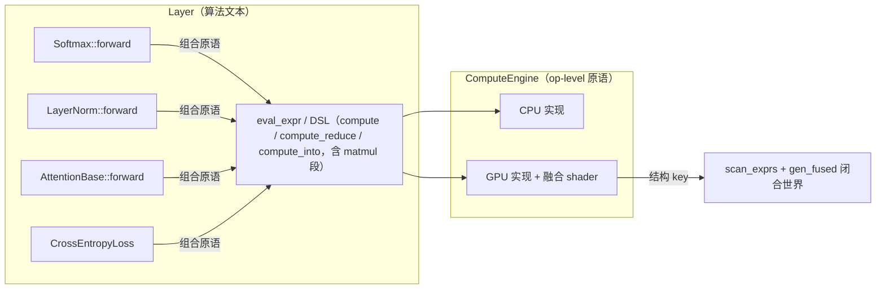

# 算子融合（Operator Fusion）—— 显存下探与手写算子收敛为 IR 融合

> 本文把算子融合两期工作整合为一条完整主线：一期（M1-M7）用**手写 op 级融合原语**解决 GPT+Vulkan 训练显存/开销问题；二期（S1-S7）把 **matmul 纳入 IR 融合**、实现跨 kernel 自动融合（以图级缓存为落地方案），最终删除一期手写融合原语。两期均服务于同一目标：减少 GPT+Vulkan 训练显存，同时严格遵循分层铁律。
>
> 状态：一期已实施完成（M4-M6 手写原语已由二期 IR 融合取代）；二期 S1-S5、S7 已实施，S6 自动窗口因用户决策搁置、由 P2-12 图级缓存替代。
> 关联文档：`../development/03-ir-optimization.md`（IR-A/B/C/D）、`../13-optimize-proposal-list.md`（P2-05 / P2-10 / P7-01）。

## 目录

1. [背景与目标](#背景与目标)
2. [合规红线](#合规红线)
3. [总体架构与核心机制](#总体架构与核心机制)
4. [IR 扩展：归约语义与 matmul 参与融合](#ir-扩展归约语义与-matmul-参与融合)
5. [表达式录制与融合边界](#表达式录制与融合边界)
6. [关键算法：两趟式注意力与稀疏交叉熵](#关键算法两趟式注意力与稀疏交叉熵)
7. [CPU / GPU 实现](#cpu--gpu-实现)
8. [跨 kernel 自动融合](#跨-kernel-自动融合)
9. [Layer 迁移](#layer-迁移)
10. [构建工具链与闭合世界](#构建工具链与闭合世界)
11. [二期 S1-S7：手写算子迁移与删除](#二期-s1-s7手写算子迁移与删除)
12. [里程碑与实施记录](#里程碑与实施记录)
13. [显存收益与风险](#显存收益与风险)

---

## 背景与目标

### 现象与根因

GPT+Vulkan 训练显存远高于 PyTorch，根因有四：

1. **注意力分数矩阵全量物化**：`scores / masked / attn_cache_` 各一份 `H·batch·seq²`，且 `attn_cache_` 永久缓存供反向。
2. **无算子融合**：Softmax/LayerNorm/RMSNorm 用多次原语 + 多次 `clone`，产生多份全尺寸中间 Tensor。
3. **损失侧全量 softmax over vocab**：`logits` + `softmax` 各 `vocab×seq·batch`。
4. 内存池 first-fit 碎片化 + 永不归还（该问题单独由显存优化文档跟踪，不在本融合范围）。

### 目标

在**严格不违反分层铁律**的前提下，通过"原语进引擎 + 算法留 Layer + 结构融合"实现：

- Softmax / LayerNorm / RMSNorm / CrossEntropy 融为单 kernel，消除全尺寸中间 Tensor。
- 注意力采用**两趟式内存高效算法**，不物化 `O(seq²)` 分数矩阵。
- 二期进一步让 **matmul 参与 IR 融合**，跨 kernel 融合自动化，最终删除手写融合原语。
- 完全兼容现有 `eval_expr` AOT 闭合世界机制，不引入运行时编译。

---

## 合规红线

> 本设计成立的前提是以下红线被严格尊重，任何改动不得跨越。

| 红线 | 说明 |
|------|------|
| **引擎只提供 op-level 原语** | `ComputeEngine` 只能有 `matmul`/`reduce`/`broadcast`/`elementwise` 这类通用原语；**绝不允许出现 `softmax`/`attention`/`layernorm` 命名的接口** |
| **算法文本只在 Layer** | ReLU/GeLU/Softmax/LayerNorm/Attention/CrossEntropy 的公式只写在 `compute_layer.hpp` / `compute_loss.hpp` |
| **融合逻辑归工具/引擎内部** | `glsl_gen` / `gen_fused` / 各引擎实现负责"怎么融"，Layer 只写"是什么" |
| **Shader 是引擎内部实现** | 融合 shader 只存在于 `shaders/` + 各引擎，用户不可见 |

> 设计原则：**原语可以多、可以专（matmul+归约、matmul+exp+sum 都是合法原语），但原语必须"通用可复用、不叫算法名"。** 引擎可以认"结构"（`reduce(matmul(A,B))`、`matmul→softmax→matmul`），绝不认"算法名"。

---

## 总体架构与核心机制



**核心机制**：Layer 用 `dsl::compute` / `compute_reduce` / `compute_into`（GPU 上折叠为 `ExprSpec`）表达算法；引擎/工具按**结构**合成融合 kernel。所有中间 Tensor 由融合 kernel 内部消解，不落 VRAM。一期依赖手写融合原语承载两趟注意力/稀疏 CE；二期把这些结构降级为 IR 表达，让 `glsl_gen` 从 IR 结构统一合成。**"跨表达式融合"曾被设计为 IR-C（`begin_expr/end_expr` 录制图），因无收益点已于 2026-09-19 移除，见 §表达式录制与融合边界（已移除）。**

---

## IR 扩展：归约语义与 matmul 参与融合

### 归约语义（一期 M1 地基）

让现有逐元素 `ExprSpec` 能表达"按列/按行归约出小标量 → 广播回各元素"，从而表达 Softmax/LayerNorm。**这是录制融合和两趟注意力的共同地基。**

**归约视图**（输入按行/列归约后广播，`expr_spec.hpp`）：

```cpp
enum class ExprViewKind : uint8_t
{
    Linear       = 0,   // 现有
    RotateHalf   = 1,   // 现有
    RowMod       = 2,   // 现有
    // ── 归约视图（输出为每列/每行一个标量，供广播）──
    ColReduceSum = 3,   // 该输入按列求和 → (1, cols)
    ColReduceMax = 4,   // 该输入按列求 max → (1, cols)
    RowReduceSum = 5,   // 该输入按行求和 → (rows, 1)
    RowReduceMax = 6,   // 该输入按行求 max → (rows, 1)
};
```

语义：当某输入视图是归约视图时，求值期代表一个"每列/每行一个标量"的广播向量。对输出元素 `(r,c)`，读取的是归约向量在 `r`（行归约）或 `c`（列归约）处的标量。

**归约指令**（供"表达式内部归约"使用，如 `exp(shifted)` 求和）：

```cpp
enum class ExprOp : uint8_t
{
    // ...现有...
    // ── 归约指令（dst 为归约结果标量向量）──
    ColSum    = 20,  // dst[c] = Σ_r a[r][c]
    ColMax    = 21,  // dst[c] = max_r a[r][c]
    RowSum    = 22,  // dst[r] = Σ_c a[r][c]
    RowMax    = 23,  // dst[r] = max_c a[r][c]
};
```

归约指令的 `dst` 是一个"隐式张量"（每列/每行一个标量），后续指令可通过**广播操作数**引用它。`ExprOperandKind` 增加 `Reduce = 4` 引用某归约指令 dst（按行或按列广播）。

DSL 层提供 `col_reduce_sum(x)` / `col_reduce_max(x)` / `row_reduce_sum(x)` / `row_reduce_max(x)` 自由函数，返回可参与后续算术的"归约叶子"。

### matmul 参与 IR 融合（二期 S1）

一期后 matmul 仍是引擎原语（`matmul_gpu` dispatch），`scan_exprs` 不收集。二期让 `ExprSpec` 表达 `matmul(A,B)` 作为逐元素链的起始段：

```cpp
// 前置 matmul 段：C(rows, cols) = op(A, B)，结果作为逐元素链的"寄存器 0"
struct MatmulSpec {
    std::uint8_t a_input = 0;   // A 是第几个输入（0-based，指向 views/inputs）
    std::uint8_t b_input = 0;   // B 是第几个输入
    std::uint8_t transA  = 0;   // 1 = A 存储为 (K, M)，按 A^T 使用
    std::uint8_t transB  = 0;   // 1 = B 存储为 (N, K)，按 B^T 使用
    std::uint32_t k      = 0;   // 求和维度（形状参数，运行时 push constant）
};
```

- **语义**：`C[r][c] = Σ_k opA(r,k) * opB(k,c)`，输出 `(rows, cols)`。
- **逐元素链引用**：新增操作数 kind `Matmul = 5`（引用 matmul 结果寄存器，按 `(r,c)` 读取），供 `Add/Sub/Mul/…` 消费。
- **形状语义**：matmul 的 A/B 形状 `(M,K)/(K,N)` 与逐元素输出网格 `(M,N)` 不同，这是对"所有输入同形状"假设的定向放宽。其余逐元素输入（如 bias、残差）仍要求 `(M,N)`。运行时 dispatch 由 `GpuEngine::eval_expr` 从输入张量推导 M/N/K，与 `k`（v-p 形状参数）一起填充。

**key 与形状无关**：`transA/transB` 是结构，进 `expr_spec_key`；`k` 是形状参数，**不进 key**，作为 push constant `vp` 槽运行时填充——同一结构不同 K 共享一个融合 shader。

二期另扩展了批量语义：`MatmulSpec.batch`（形状参数不进 key，dispatch z=batch）、`ExprOperandKind::Row/Col/Batch`（网格索引操作数）、`ExprViewKind::RowGather/BatchMod/BatchCol`（标签行收集 / 按批次索引 / 按批次列切片），用于表达稀疏交叉熵与注意力结构。

---

## 表达式录制与融合边界（已移除）

> **状态（2026-09-19）：本节描述的显式录制 API 已全部删除。** 保留本节是为了记录"曾经这样设计过、
> 为什么不用"——设计完整度不等于价值。完整取舍依据见 `03-ir-optimization.md` §5.3。

一期曾用 `begin_expr/end_expr` 作为"计算级融合"入口（`begin_batch/end_batch` 是提交级）：`begin_expr`
进入录制、`end_expr` 做融合分析（构建虚拟寄存器 DAG + 判定融合边界）——小中间量留寄存器、逐元素链
并入同一 kernel、大张量 spill 成下一 kernel 输入。CPU 端为 no-op。

**为什么最终不用它**（逐条经代码核对）：

1. 融合条件要求"**两节点均无归约、同形状、tail 恰好一个消费者**"；而 LayerNorm/RMSNorm/Softmax/
   Attention 的骨架恰恰是"归约 → 逐元素 → 归约"，**归约处即中断**，可融的地方本就不存在。
2. 需要融的层都要为 backward 缓存中间量（`normalized_cache_` / `normed_cache_` /
   `residual2_cache_` / `W_re`）——**缓存就是图外的第二个消费者**，录制图看不见它；补上逃逸检测
   的代价（Tensor 拷贝钩子 + 自动作用域 + ~22 个 flush 点）远超收益。
3. 能融的"长逐元素链"本来就可以直接写成**一个** `dsl::compute` 表达式（单个 AOT 融合 kernel）。
4. 唯一使用方是演示层 `FusedChainLayer`，**无生产调用方**。

**删除项**：`expr_graph.hpp`、`ComputeEngine::begin_expr/end_expr`、`dsl::start_expr/end_expr`
（`ExprBlock`）、`FusedChainLayer`、`Tensor::virtual_tag_`。**保留** `run_fused_gpu` 的
`output_override`（现服务于 `dsl::compute_into` 原地目标传递，与图 IR 无关）。

---

## 关键算法：两趟式注意力与稀疏交叉熵

### 两趟式注意力（Forward）

一期通过三个 op 级融合原语实现（M4/M6，二期 S7 后由 IR 链替代，见下）。Forward 三步不物化 `(BH·seq, seq)` 得分/概率矩阵：

```cpp
// Q_cache,K_cache,V_cache: (BH*d_k, seq)，按 batch*H 切块
const std::size_t BH = batch * num_heads_;

// Pass 1a：m = 行 max of (alpha*QᵀK)   —— 不物化 scores
auto m = engine.batched_matmul_reduce(
    Q_cache_, K_cache_, BH, ReduceOp::Max, /*transA=*/true, /*transB=*/false,
    scale_, /*reduce_cols=*/true);

// Pass 1b：l = Σ exp(alpha*QᵀK - m)   —— 重算 QᵀK，仍不物化
auto l = engine.batched_matmul_softmax_denom(
    Q_cache_, K_cache_, *m, BH, /*transA=*/true, /*transB=*/false, scale_);

// Pass 2：O = W·V，W 为行 softmax，逐 tile 累加，不物化
auto concat_out = engine.batched_matmul_softmax_apply(
    Q_cache_, K_cache_, V_cache_, *m, *l, BH,
    /*transA=*/true, /*transB=*/false, scale_);
```

**显存收益**：`scores`/`masked`/`attn_cache_` 三份 `BH·seq×seq` 全部消失，只剩 `m`/`l`（`BH·seq`）与 `O`（`BH·d_k·seq`）。每层从 ~3×`BH·seq²` 降到 `O(BH·seq·d_k)`。代价：`QᵀK` 计算两遍（2× FLOPs），对训练可接受。

Backward 采用**反向重算 W**（不缓存 `attn_cache_`），用 `batched_matmul_softmax_backward_q/kv` 两个融合原语同时算 `grad_Q` 与 `grad_K/grad_V`，kernel 内部重算 `W[i][j] = exp(alpha·op(A,B)+mask−row_max)/denom`，绝不物化 `(M,N)` 概率矩阵。

**掩码处理**：因果掩码对 row-max 的修正是常数（`-inf` 屏蔽列）；ALiBi 线性偏置 `m_i = max_j(alpha*scores_ij + slope*|i-j|)` 折进 `alpha` 与 mask 修正；文档块对角掩码按 doc_id 分组。掩码逻辑一律在 **Layer**（`apply_mask_` 钩子，`two_pass_mask_` 决策钩子返回 `{use_two_pass, bias}` 组合式 `AttnBias` 描述子），引擎只认"matmul+reduce"结构。

### 稀疏交叉熵（M5）

大词表稀疏交叉熵（vocab≈25k）不再物化 `(classes, total)` 全 softmax / 不再整张下载到 CPU。一期用 `col_softmax_denom` + `col_softmax_sparse_forward` 两个原语，单 kernel 同时算稠密梯度与标签位置 loss_vec，labels 以 `(1, N)` 浮点打包（vocab_size ≤ 2^24 可精确表示）。二期 S7 后用 `col_reduce_max + exp + row_gather` 的 IR 结构表达。

---

## CPU / GPU 实现

| 后端 | 文件 | 实现 |
|------|------|------|
| CPU | `cpu_engine.hpp` | `eval_expr` 扩展归约语义与 matmul 段（matmul 预计算 + 逐元素链，`eval_expr_reduce` 经归约指令消费 matmul 输出）；`dsl::compute` 的纯逐元素路径走编译期模板内联 |
| GPU (Vulkan) | `gpu_engine.hpp` + `shaders/*.comp` + `vk_backend.hpp` | `eval_expr` 查 `fused_registry`；`glsl_gen` 生成归约/两趟/matmul 结构 shader |

> 注：CUDA 后端已停用（v1.0.0），此处不再列为后端。

所有原语遵循现有约定：`Result<T>` 返回、batch 录制可组合、失败回退到组合路径。

### glsl_gen 生成

- `generate_glsl_reduce`：工作组级归约融合 kernel。每个工作组（256 线程）协作处理一行（行归约）/一列（列归约）：shared memory 树形归约（每归约槽 256 槽位），随后输出该行/列全部元素。push constants 增加 `uint rows`；dispatch 行归约 `(rows,1,1)`、列归约 `(cols,1,1)`。
- `generate_glsl_matmul`：共享内存分块 + vec4；支持 `linear+bias+activation`、`matmul+归约`（`row_max(matmul)`、`row_sum(exp(matmul-rm))`）经 `generate_glsl_reduce` 内联点积。

---

## 跨 kernel 自动融合（已评估，不采用）

一期曾规划用 `begin_expr/end_expr` 做跨表达式融合（仅演示 Layer `FusedChainLayer` 使用；真实 Layer
每表达式独立 dispatch）。二期 S6（P2-10 自动窗口）方案为：`GpuEngine` 维护线程局部 `std::optional<ExprGraph>`
窗口，`eval_expr/eval_expr_reduce` 调用时尝试并入、不兼容时 flush——**该方案搁置**；随后落地的 P2-12
图级缓存（`graph_cache_key` / `plan_from_kernel` / `instantiate_plan`，跨 step 复用融合分析结果）也随
IR-C 一起**于 2026-09-19 删除**（见 §表达式录制与融合边界（已移除）、`03-ir-optimization.md` §5.3）。

**当前结论**：跨表达式融合不接线；能融的表达式直接写成单个 `dsl::compute`。重新立项的前提写在
`03-ir-optimization.md` §5.3 末段。

---

## Layer 迁移

### 归一化层（M3）

`Softmax::forward` 改为单 DSL 归约表达式（算法公式不变）：

- forward: `exp(x - row_max) / row_sum(exp(x - row_max))`
- backward: `out * (grad - row_dot(out * grad))`

`LayerNorm` / `RMSNorm` 同理用 DSL 归约表达式表达：均值/方差归约 → 归一化 → γ/β 逐元素，归约中间量（每行标量）留寄存器。Backward 若写成单表达式会因重复子表达式（`grad*gamma` 出现 3 次）超出 8 输入上限，因此拆成 mean_g/mean_gn 两个归约向量输出 + 一个逐元素 grad_x。

### 线性层（二期 S4）

`Linear::forward` 改走 `dsl::compute(matmul(W,x) + row_broadcast(b))`，含 matmul 段的融合。

### 注意力（M6 → S7）

一期用 `bmm_reduce→bmm_denom→bmm_apply`（forward）与 `bmm_softmax_backward_q/kv`（backward）实现两趟式；二期 S7 用 S5 的 `matmul → 归约 → matmul` IR 链重写，并删除手写原语。

---

## 构建工具链与闭合世界

构建期两步（CMake 自动编排，改 Layer 内联表达式后重跑构建即可）：

1. **`tools/scan_exprs.cpp`**：dry-run 跑各 Layer forward/backward，收集折叠出的 `ExprSpec` 结构（去重）→ `build/generated/expr_specs.bin`。
2. **`tools/gen_fused.cpp`**：读 bin → `glsl_gen` 生成 GLSL → glslc → 内联 SPIR-V → `build/generated/fused_registry.hpp`。

`scan_exprs` 需覆盖所有 Layer 的 DSL 路径（Softmax/LN/RMSNorm fwd+bwd、CrossEntropy softmax 结构、Attention 两趟结构、Linear 的 matmul 段、optimizer 的 `compute_into` 原地表达式），使融合结构被收集。未命中 → `eval_expr` 现有"硬报错"逻辑，提示补进扫描（保持项目"GPU 硬报错、不降级"哲学）。

---

## 二期 S1-S7：手写算子迁移与删除

二期按阶段收敛手写融合原语，里程碑：

| 阶段 | 内容 | 交付物 / 验证 |
|------|------|----------------|
| **S1 IR 地基** | `ExprSpec` 增加 `MatmulSpec` + `ExprOperandKind::Matmul`；`validate_expr_spec`/`expr_spec_key`/`expr_spec_reduce_axis` 兼容 matmul 段；key 与形状无关（`k` 不进 key，`transA/transB/a_input/b_input` 进 key） | 构建通过；`expr_spec_test`/`expr_opt_test` 回归绿 |
| **S2 CPU 正确性** | `CpuEngine::eval_expr` 支持 matmul 段（matmul 预计算 + 逐元素链，`eval_expr_reduce` 经归约指令消费 matmul 输出） | 新增 `expr_matmul_test`：`matmul+bias` 融合 vs 参考；CPU err=0 |
| **S3 GLSL 生成** | `generate_glsl_matmul`（共享内存分块 + vec4）；`gen_fused`/`scan_exprs`/`run_fused_gpu` 接入 | `fused_gpu_test` matmul 融合用例（GPU vs CPU）；AOT 命中 |
| **S4 Layer 迁移（线性）** | `Linear`/`FeedForward` 的 `matmul+bias+activation` 改走 `dsl::compute`（含 matmul 段） | `gpt_gradcheck` / MNIST/GPT 训练回归 |
| **S5 跨归约/跨 matmul 链** | 融合分块矩阵乘法（16×16 线程/64×64 块/4×4 寄存器分块/vec4 转置共享内存 + `eval_tail` 函数）；matmul+归约（`row_max(matmul)`、`row_sum(exp(matmul-rm))`）经 `generate_glsl_reduce` 内联点积；图融合允许 matmul 节点拼接尾逐元素节点 | 注意力相关 gradcheck 全绿 |
| **S6 自动窗口（P2-10）** | 搁置（用户决策）；其替代方案 P2-12 图级缓存亦随 IR-C 于 2026-09-19 删除 | — |
| **S7 删除 M4-M6** | 全面替换并删除：`batched_matmul_reduce/softmax_denom/softmax_apply`（M4）、`batched_matmul_softmax_backward_q/kv`（M6）、`col_softmax_denom/col_softmax_sparse_forward`（M5）7 个原语（接口 + CPU/GPU/CUDA 实现 + 7 个手写 shader + vk pipeline + 测试改造）。IR 扩展：`MatmulSpec.batch`、`ExprOperandKind::Row/Col/Batch`、`ExprViewKind::RowGather/BatchMod/BatchCol` | 全量 ctest；训练冒烟（CPU+GPU） |

**依赖关系**：S1→S2→S3 串行（IR → CPU → GPU 生成）；S4 依赖 S3；S5 依赖 S3；S7 依赖 S5。

**删除顺序**：先删 GPU shader（`bmm_*.comp` / `col_softmax_*.comp`），再删 `ComputeEngine` 虚接口，最后删 CPU/CUDA 实现与 `vk_backend` dispatch。每步删除前对应 IR 融合路径已在测试覆盖。

### 二期关键教训（改融合/IR 代码前必读）

1. **运行时值禁进表达式常量池**（进 `expr_spec_key` 会破坏闭合世界）：`scale` 折进 Q（forward `scale_inplace` + backward 补乘）、`inv_num_valid` 后置 `scale_inplace`。
2. **BatchCol 视图要求 `(1, BH*seq)`**（doc_ids 按 (b,h) 块重复），`(1, batch*seq)` 会越界。
3. **RowGather 主输入行数≠网格行数**（loss_vec 在 (1,N) 读 (C,N) logits），校验只查 cols。
4. `gen_fused` `emit_spec` 的 ±inf 常量必须用 `numeric_limits`。
5. matmul + 列归约不支持（gen_fused 跳过）。
6. **PS 删大文件段行号易漂移**、`-replace` 多行静默失败——先 read 再 edit，删前 `git diff` 核对。
7. `dispatch_compute` 误删后从调用点重建。
8. **IR 扩展**：MatmulSpec.batch（不进 key，dispatch z）、Row/Col/Batch 操作数(6/7/8)、RowGather(9)/BatchMod(10)/BatchCol(11)；注意力 fwd=m/l/W 表达式+bm(W,V_t)，bwd=R/X 表达式+3 个 bm；CE 稠密 `denom=col_sum(exp(logits-cb(col_max)))`，稀疏 grad/loss_vec 用 Row+RowGather。
9. **CpuEmitter 产物从不编译**（gen_fused 硬编码 glsl），缺陷全隐性（见多精度文档 §11）。

---

## 里程碑与实施记录

### 一期 M1-M7

| 里程碑 | 内容 | 验证 |
|--------|------|------|
| M1 ✅ | `ExprSpec` 加归约视图/指令 + CPU `eval_expr` 扩展 | `expr_reduce_test` 全过 + `expr_dsl_test` 回归 |
| M2 ~~✅~~ | `begin_expr/end_expr` 录制框架 + CPU no-op | **2026-09-19 移除**（IR-C 整体删除，见 `03-ir-optimization.md` §5.3） |
| M3 ✅ | Softmax/LayerNorm/RMSNorm fwd/bwd 改 DSL 归约表达式 + GPU 归约融合 shader | `fused_gpu_test` 全过 + gradcheck 系列 |
| M4 ✅ | 三个 matmul 融合原语（bmm_reduce/bmm_denom/bmm_apply，CPU+GPU，可选掩码） | `matmul_fusion_test`（CPU err=0 / GPU err≤1.9e-6） |
| M5 ✅ | CrossEntropyLoss 稀疏融合（不物化全 softmax） | `ce_fusion_test`（CPU err=0 / GPU err≤4.8e-7） |
| M6 ✅ | Attention 两趟式（forward + 反向重算 W，不物化 `(BH·seq, seq)`） | `matmul_fusion_test` 扩展（8 用例）+ gradcheck + 训练 |
| M7 ✅ | 文档与 `DEVELOPMENT_STANDARDS.md` 补"原语可专、不叫算法名"约定 | 全套测试 |

### 一期关键实施细节与坑

**M1**：
- **固定 DSL 折叠求值顺序**：`Binary`/`Select::to_spec` 先求值操作数到局部变量再 `add_instr`——C++ 函数实参求值顺序未指定，直接 `add_instr(op, l.to_spec(b), r.to_spec(b))` 会让 views/inputs 登记顺序随编译器漂移，破坏 key 跨编译器稳定性。已修复。
- 归约指令源允许引用更早归约结果（转递依赖），按指令序预计算。
- GPU 尚未支持归约结构时，含归约表达式走闭合世界硬报错。

**M3（实训关键坑）**：
- **全部归约必须同轴**（行或列）才能单 kernel 融合；混合轴（归一化 backward 的 `grad_gamma` 行归约 + `grad_x` 列归约）拆成多个表达式/原语。
- 归约 shader 的寄存器声明直接放 for 循环体（勿用额外 `{}` 包裹，否则源寄存器越作用域）；sum 用中缀 `+`，max 用函数 `max(acc, v)`。
- **归约向量原生输出 `eval_expr_reduce`/`dsl::compute_reduce`**：表达式在 (rows,cols) 网格求值但输出为归约向量本身。用于归一化的 (1,B) 统计量与 (F,1) 梯度归约。
- **融合表达式保持 F 无关结构（关键）**：`inv_features=1/F`、`epsilon` 等形状相关常量若折进表达式，key 随 F 漂移 → 硬报错。解法：融合表达式只含 F 无关结构，形状相关标量用引擎原语（运行时标量）施加。

**M4（掩码约定）**：掩码用共享 (M,N) 张量（`-inf` 屏蔽 + 有限偏置），而非在引擎中硬编码因果/ALiBi——保持"引擎只认 op-level 结构"。`bmm_apply` 共享内存存 W 行（N≤4096），Phase1 算 W、Phase2 累加 O，不物化 `(M,N)` 权重。

**M5（稀疏 CE 坑）**：
- **labels 浮点打包**：以 `(1, N)` float 上传；vocab_size ≤ 2^24 时 float 可精确表示类别索引，kernel 内 `uint(labels[i])` 读取。越界/被 mask 列整列置 0。
- **`dispatch_bmm_generic` 输出约定**：返回张量（grad）必须在最后一个 binding，out 参数（loss_vec）倒数第二。
- 融合路径与回退路径的 num_valid 判定必须一致。

**M6（两趟式坑）**：
- `dispatch_bmm_generic` 输出约定：返回张量永远是最后一个 binding，out 参数张量倒数第二（曾写反导致 GPU grad_K 与 grad_V 互换）。
- **kv_backward 的 `A_b[:,i]` 索引**：`transA` 时 `A_b[k][i] = flat[b*K*M + k*M + i]`；`!transA` 时为 `A_b[i][k] = flat[b*M*K + i*K + k]`。CPU 参考曾把两分支写反（shader 对），以 shader/前向 dot_ab 约定为准。
- **V/G 布局转换**：`transpose` 是全矩阵转置，`transpose → rearrange_3d(seq, BH, d_k, false)` 实现按 batch 转置（同 trick 用于 O 转回）。

### 形状无关融合 ✅（任意 d_k 适配）

**问题**：`RowMod`（周期=d_k）与 `RotateHalf`（块=d_k）的 `param` 以结构常量折进 `expr_spec_key` → 每换一个 d_k 就要新 shader → 闭合世界无法穷举所有 d_k。

**方案（把形状参数从 key 里拿到运行时）**：
1. `expr_spec_key` 剔除 RowMod/RotateHalf 的 param（保留 kind 与 negate_first_half）→ 同结构不同 d_k 共享一个 shader。
2. `glsl_gen` 把这两个参数作为 push constant `vpN` 槽读取。
3. `gen_fused`/`vk_backend` 记录并传递 vp 槽数（FusedShader 增 `view_param_count`）。
4. `GpuEngine::eval_expr`/`eval_expr_reduce` 按实际 spec 提取 vp 参数（`expr_spec_runtime_view_params`）传入 dispatch。
5. 未命中硬报错，不静默回退 CPU。

**效果**：扫描表达式从 24 → 18 条（RoPE 的 4×dk 去重为同构）；`fused_gpu_test` 用 d_k ∈ {16, 40, 64, 96, 128}（含非 2 的幂）全部命中同一 shader，err≤1.2e-7。零额外显存。二期对 matmul 的 `k` 采用同样的形状无关处理。

---

## 显存收益与风险

### 显存收益估算（示例：batch=32, H=8, seq=1024, fp32）

| 项目 | 现状 | 融合后 |
|------|------|--------|
| 注意力分数/缓存（每层） | ~3×`BH·seq²` ≈ 3.2 GB | `O(BH·seq·d_k)` ≈ 0.2 GB |
| 注意力缓存（8 层） | ~8.6 GB | ~1.6 GB |
| 损失全 softmax（vocab=25k） | `logits`+`softmax` ≈ 6.6 GB | 仅标签 gather ≈ 0 |
| Softmax/LN 中间量 | 每 op 全尺寸中间 | 融合消除 |

> 注意：以上为**激活路径**收益。参数/优化器状态（Adam m/v = 2×params）不受影响；内存池碎片化由显存优化文档另案处理。

### 风险与开放问题

1. **glsl_gen 融合工作量**：两趟注意力的 tile 化代码生成是最大工作量。一期 M4-M6 曾用手写固定 shader 验证收益，二期由结构生成统一。
2. **闭合世界 vs 形状变化**：已通过"形状无关融合"解决。彻底无法覆盖的结构在 `eval_expr` 未命中时硬报错。
3. **反向重算 vs 缓存**：默认反向重算 `W`（省显存），提供缓存开关。
4. **不引入运行时编译**：所有融合 kernel AOT 预编译；运行时只做 key 查表 + dispatch。
5. **上限压力**：matmul + 尾链可能超输入/寄存器上限 → 融合分析保守放弃（回退独立 kernel）。

### 正确性与回退策略

1. **CPU 正确性基准**：CPU 实现先按"多次原语"正确实现，作为融合 kernel 的参考。
2. **gradcheck**：Softmax/LayerNorm/RMSNorm/Attention/CrossEntropy 中心差分 gradcheck。
3. **GPU 回退**：融合 kernel 未命中/失败时回退"原语组合"路径，保证训练不中断、结果不变。
4. **数值稳定性**：保留 `-max` 平移（`alpha*QᵀK - m`）。
5. **两趟一致性**：两趟重算的 m/l 在同一 kernel 内共享，无漂移。