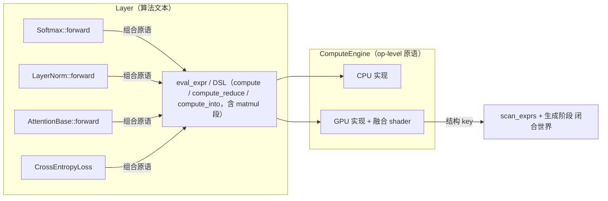

# 算子融合（Operator Fusion）—— 显存下探与手写算子收敛为 IR 融合

> 本文记录算子融合的**当前形态与设计约束**：一期（M1-M7）建立归约语义 IR 与注意力 / 稀疏 CE 的融合结构，二期（S1-S7）把 **matmul 纳入 IR 融合**，让手写融合原语收敛为 IR 表达——**一期的手写融合原语（M4-M6）已不存在，其结构一律由 IR / fold 承载**。两期服务同一目标：减少 GPT+Vulkan 训练显存，同时严格遵循分层铁律。
>
> 状态：二期范围 = S1-S5、S7（**S6 自动窗口不接线**，见 §跨 kernel 自动融合）；**注意力 forward 是单 fold kernel（FoldSpec 分块流式求值）——见"关键算法"章，S7 的 IR 链现仅存于 backward**。分期实施流水、删除清单与否决方案的演进记录见 `docs/history.md`。
> 关联文档：`03-ir-optimization.md`（IR-A/B/D；IR-C 不存在）。

**怎么读本文（3 条路径）**：

- **只想知道"融合现在怎么工作"** → §总体架构与核心机制 + §构建工具链与闭合世界（现在的机制）；
- **要改融合/IR 代码** → §合规红线 + §二期关键教训（改前必读） + `03-ir-optimization.md` §5.3；
- **查历史决策/为什么这么走** → `docs/history.md`（本文摘出的分期实施记录、两趟式设计与否决方案）。

## 目录

1. [背景与目标](#背景与目标)
2. [合规红线](#合规红线)
3. [总体架构与核心机制](#总体架构与核心机制)
4. [IR 扩展：归约语义与 matmul 参与融合](#ir-扩展归约语义与-matmul-参与融合)
5. [表达式录制与融合边界](#表达式录制与融合边界)
6. [关键算法：注意力与稀疏交叉熵](#关键算法注意力与稀疏交叉熵)
7. [CPU / GPU 实现](#cpu--gpu-实现)
8. [跨 kernel 自动融合](#跨-kernel-自动融合)
9. [Layer 迁移](#layer-迁移)
10. [构建工具链与闭合世界](#构建工具链与闭合世界)
11. [二期 S1-S7：手写算子收敛为 IR 融合](#二期-s1-s7手写算子收敛为-ir-融合)
12. [阶段代号与关键教训](#阶段代号与关键教训)
13. [显存收益与风险](#显存收益与风险)

---

## 背景与目标

### 现象与根因

优化前 GPT+Vulkan 训练显存远高于 PyTorch，根因有四（本设计针对的问题；前三项现由 fold/融合/稀疏 CE 消除，见 §显存收益与风险，第四项由显存优化文档另案跟踪）：

1. **注意力分数矩阵全量物化**：`scores / masked / attn_cache_` 各一份 `H·batch·seq²`，且 `attn_cache_` 永久缓存供反向。
2. **无算子融合**：Softmax/LayerNorm/RMSNorm 用多次原语 + 多次 `clone`，产生多份全尺寸中间 Tensor。
3. **损失侧全量 softmax over vocab**：`logits` + `softmax` 各 `vocab×seq·batch`。
4. 内存池 first-fit 碎片化 + 永不归还（该问题单独由显存优化文档跟踪，不在本融合范围）。

### 目标

在**严格不违反分层铁律**的前提下，通过"原语进引擎 + 算法留 Layer + 结构融合"实现：

- Softmax / LayerNorm / RMSNorm / CrossEntropy 融为单 kernel，消除全尺寸中间 Tensor。
- 注意力采用**单遍分块流式（fold）内存高效算法**，不物化 `O(seq²)` 分数矩阵。
- **matmul 参与 IR 融合**（matmul 段进 `ExprSpec`），手写融合原语一律收敛为 IR 表达；跨表达式融合不接线（见 §跨 kernel 自动融合）。
- 完全兼容现有 `eval_expr` AOT 闭合世界机制，不引入运行时编译。

---

## 合规红线

> 本设计成立的前提是以下红线被严格尊重，任何改动不得跨越。

| 红线 | 说明 |
|------|------|
| **引擎只提供 op-level 原语** | `ComputeEngine` 只能有 `matmul`/`reduce`/`broadcast`/`elementwise` 这类通用原语；**绝不允许出现 `softmax`/`attention`/`layernorm` 命名的接口** |
| **算法文本只在 Layer** | ReLU/GeLU/Softmax/LayerNorm/Attention/CrossEntropy 的公式只写在 `compute_layer.hpp` / `compute_loss.hpp` |
| **融合逻辑归工具/引擎内部** | `glsl_gen` / 生成阶段 / 各引擎实现负责"怎么融"，Layer 只写"是什么" |
| **Shader 是引擎内部实现** | 融合 shader 只存在于 `shaders/` + 各引擎，用户不可见 |

> 设计原则：**原语可以多、可以专（matmul+归约、matmul+exp+sum 都是合法原语），但原语必须"通用可复用、不叫算法名"。** 引擎可以认"结构"（`reduce(matmul(A,B))`、`matmul→softmax→matmul`），绝不认"算法名"。

---

## 总体架构与核心机制


```mermaid
graph LR
    subgraph L2[Layer（算法文本）]
        A[Softmax::forward] -->|组合原语| E
        B[LayerNorm::forward] -->|组合原语| E
        C[AttentionBase::forward] -->|组合原语| E
        D[CrossEntropyLoss] -->|组合原语| E
    end
    subgraph Eng[ComputeEngine（op-level 原语）]
        E[eval_expr / DSL（compute / compute_reduce / compute_into，含 matmul 段）]
        F[CPU 实现]
        G[GPU 实现 + 融合 shader]
    end
    E --> F & G
    G -->|结构 key| I[scan_exprs + 生成阶段 闭合世界]
```

**核心机制**：Layer 用 `dsl::compute` / `compute_reduce` / `compute_into`（GPU 上折叠为 `ExprSpec`）表达算法；引擎/工具按**结构**合成融合 kernel。所有中间 Tensor 由融合 kernel 内部消解，不落 VRAM。注意力 / 稀疏 CE 等结构一律由 IR 表达（`MatmulSpec` 段、归约视图与归约指令、`FoldSpec` fold 段），`glsl_gen` 从 IR 结构统一合成。**不存在"跨表达式融合"**——运行时没有跨表达式录制机制（IR-C 不在库中，见 §表达式录制与融合边界）。

---

## IR 扩展：归约语义与 matmul 参与融合

### 归约语义（一期 M1 地基）

让现有逐元素 `ExprSpec` 能表达"按列/按行归约出小标量 → 广播回各元素"，从而表达 Softmax/LayerNorm。**这是注意力 fold 单遍结构与归一化融合的共同地基。**

**归约视图**（输入按行/列归约后广播，`expr_spec.hpp`）：

```cpp
enum class ExprViewKind : uint8_t
{
    Linear       = 0,   // 索引映射
    RotateHalf   = 1,   // RoPE 半转
    RowMod       = 2,   // 行内取模
    // ── 归约视图（输出为每列/每行一个标量，供广播）──
    ColReduceSum = 3,   // 该输入按列求和 → (1, cols)
    ColReduceMax = 4,   // 该输入按列求 max → (1, cols)
    RowReduceSum = 5,   // 该输入按行求和 → (rows, 1)
    RowReduceMax = 6,   // 该输入按行求 max → (rows, 1)
};
```

语义：当某输入视图是归约视图时，求值期代表一个"每列/每行一个标量"的广播向量。对输出元素 `(r,c)`，读取的是归约向量在 `r`（行归约）或 `c`（列归约）处的标量。

**归约指令**（供"表达式内部归约"使用，如 `exp(shifted)` 求和）：

```cpp
enum class ExprOp : uint8_t
{
    // ...现有...
    // ── 归约指令（dst 为归约结果标量向量）──
    ColSum    = 20,  // dst[c] = Σ_r a[r][c]
    ColMax    = 21,  // dst[c] = max_r a[r][c]
    RowSum    = 22,  // dst[r] = Σ_c a[r][c]
    RowMax    = 23,  // dst[r] = max_c a[r][c]
};
```

归约指令的 `dst` 是一个"隐式张量"（每列/每行一个标量），后续指令可通过**广播操作数**引用它。`ExprOperandKind` 增加 `Reduce = 4` 引用某归约指令 dst（按行或按列广播）。

DSL 层提供 `col_reduce_sum(x)` / `col_reduce_max(x)` / `row_reduce_sum(x)` / `row_reduce_max(x)` 自由函数，返回可参与后续算术的"归约叶子"。

### matmul 参与 IR 融合（二期 S1）

让 `ExprSpec` 表达 `matmul(A,B)` 作为逐元素链的起始段（op 级 `matmul_gpu` dispatch 仍用于非融合路径）：

```cpp
// 前置 matmul 段：C(rows, cols) = op(A, B)，结果作为逐元素链的"寄存器 0"
struct MatmulSpec {
    std::uint8_t a_input = 0;   // A 是第几个输入（0-based，指向 views/inputs）
    std::uint8_t b_input = 0;   // B 是第几个输入
    std::uint8_t transA  = 0;   // 1 = A 存储为 (K, M)，按 A^T 使用
    std::uint8_t transB  = 0;   // 1 = B 存储为 (N, K)，按 B^T 使用
    std::uint32_t k      = 0;   // 求和维度（形状参数，运行时 push constant）
};
```

- **语义**：`C[r][c] = Σ_k opA(r,k) * opB(k,c)`，输出 `(rows, cols)`。
- **逐元素链引用**：新增操作数 kind `Matmul = 5`（引用 matmul 结果寄存器，按 `(r,c)` 读取），供 `Add/Sub/Mul/…` 消费。
- **形状语义**：matmul 的 A/B 形状 `(M,K)/(K,N)` 与逐元素输出网格 `(M,N)` 不同，这是对"所有输入同形状"假设的定向放宽。其余逐元素输入（如 bias、残差）仍要求 `(M,N)`。运行时 dispatch 由 `GpuEngine::eval_expr` 从输入张量推导 M/N/K，与 `k`（v-p 形状参数）一起填充。

**key 与形状无关**：`transA/transB` 是结构，进 `expr_spec_key`；`k` 是形状参数，**不进 key**，作为 push constant `vp` 槽运行时填充——同一结构不同 K 共享一个融合 shader。

二期另扩展了批量语义：`MatmulSpec.batch`（形状参数不进 key，dispatch z=batch）、`ExprOperandKind::Row/Col/Batch`（网格索引操作数）、`ExprViewKind::RowGather/BatchMod/BatchCol`（标签行收集 / 按批次索引 / 按批次列切片），用于表达稀疏交叉熵与注意力结构。

---

## 表达式录制与融合边界

本文的"表达式录制"指**构建期收集**：`scan_exprs` 收集各 Layer 折叠出的 `ExprSpec`——**结构**由 `FusedAnchor<Expr>` 在静态初始化期按表达式类型自登记（编译期可达），**精度签名**由 dry-run / 模型 pass 执行产生（见 §构建工具链与闭合世界与 §自登记锚点）——这是库里唯一的表达式收集机制。

**运行时没有跨表达式录制**：`ComputeEngine::begin_expr/end_expr`、`dsl::start_expr/end_expr`、`expr_graph.hpp`、演示层 `FusedChainLayer` 均不存在（IR-C 已移除；取舍记录见 `docs/history.md`，另见 `03-ir-optimization.md` §5.3）。融合边界 = 单个表达式的输入/输出；需要融合的长链直接写成**一个** `dsl::compute` 表达式（单个 AOT 融合 kernel）。CPU 侧表达式求值只有两套机制：**DSL 编译期模板路径 + IR 解释器**（见 `12-compute-engine-inventory.md`）。

---

## 关键算法：注意力与稀疏交叉熵

### 注意力：forward = 单 fold kernel（`FoldSpec`）

现行 forward 是**单 fold kernel 分块流式求值**：QKᵀ / 掩码 / online softmax / ΣwV 在同一 kernel 内逐 `EXPR_FOLD_BLOCK=128` 块完成，`S` 矩阵绝不物化；`tri_skip` 把被屏蔽区整块钳成空转（NR=2，每 WG 两行）。

- **构造位置**：`make_fold_attn_o` 与掩码种类 `AttnMaskKind`（Plain/Causal/CausalDoc）定义在 `compute_layer_attention.hpp`（漏登记任一组合即 GPU 闭合世界硬报错）；位置偏置（ALiBi）是**正交的第二入参** `bool score_bias`，实际登记 5 个组合（3 掩码 × 2 偏置 − 1）。通用 fold 样例在 `expr_fold.hpp`。注意力 forward 直调 `engine.eval_expr(make_fold_attn_o(...))`，**不经 DSL 钩子——scan 的显式登记块是 fold spec 唯一注册来源**。
- **掩码处理**：因果掩码对 row-max 的修正是常数（`-inf` 屏蔽列）；文档块对角掩码按 doc_id 分组；ALiBi 线性偏置折进链内加项。**掩码与位置偏置是两件正交的事、各有策略对象**：`AttnScoreMask` 族（`PlainScoreMask`/`CausalScoreMask`/`CausalDocScoreMask`，**只做掩码**）各自实现 `mask_kind()`（类级常量）+ `prepare()`（构建 doc_col/doc_ids 输入张量）+ `masked_scores()`（反向重算 S 的 DSL 文本），由 `AttentionBase::make_score_mask_()` 在配置期工厂化定型；位置偏置由 `PositionEncoder::apply_score_bias()` 在 **backward** 的"掩码之后、softmax 之前"独立叠加（非 ALiBi = no-op）。引擎只认"matmul+reduce/fold"结构、绝不认算法名。
- **显存**：`scores`/`masked`/`attn_cache_` 全部不物化，每层注意力激活从 ~3×`BH·seq²` 降到 `O(BH·seq·d_k)`（fold 单遍每块只算一次 QKᵀ，S 从不存在）。
- **backward**：`recompute_W_` 两步重算 W——① `S = masked(Q·Kᵀ)`（掩码树与 forward 的 fold 变体同构，matmul 分块快路径，S 瞬时物化一遍）② `W = softmax(S)`（单归约表达式，m/l 在 kernel 内部归一化、不作为输入/缓存）；随后 R/X 表达式 + 3×`batched_matmul` 得 grad_Q/K/V，绝不物化概率矩阵。

> 两趟式 forward（`batched_matmul_reduce` / `_softmax_denom` / `_softmax_apply` 三个手写原语）与组合式 `AttnBias` 掩码描述子均不存在，演进记录见 `docs/history.md`。

### 稀疏交叉熵

大词表稀疏交叉熵（vocab≈25k）不物化 `(classes, total)` 全 softmax、不整张下载到 CPU。当前结构 = IR 表达：稠密 denom 用 `col_reduce_max + exp + col_sum`，稀疏 grad / loss_vec 用 `Row` + `RowGather`（`compute_loss.hpp` 内的 DSL 表达式）。labels 与 loss_mask 以 `(1, total)` 浮点张量上传（vocab_size ≤ 2^24 时索引可精确表示；越界标签修正为 0、被 mask 列整列置 0）。

---

## CPU / GPU 实现

| 后端 | 文件 | 实现 |
|------|------|------|
| CPU | `compute_cpu_engine.hpp` | `eval_expr` 扩展归约语义与 matmul 段（matmul 预计算 + 逐元素链，`eval_expr_reduce` 经归约指令消费 matmul 输出）；`dsl::compute` 的纯逐元素路径走编译期模板内联 |
| GPU (Vulkan) | `compute_gpu_engine.hpp` + `shaders/*.comp` + `backend/compute_vk_backend.hpp` | `eval_expr` 查 `fused_registry`；`glsl_gen` 生成归约 / fold（分块流式）/ matmul 结构 shader |

> 注：CUDA 后端已整体移除（`cuda/`、`NN_HAS_CUDA` 均不存在），本文只覆盖 CPU / GPU（Vulkan）两后端。

所有原语遵循现有约定：`Result<T>` 返回、batch 录制可组合、失败回退到组合路径。

### glsl_gen 生成

- `generate_glsl_reduce`：工作组级归约融合 kernel。每个工作组（256 线程）协作处理一行（行归约）/一列（列归约）：shared memory 树形归约（每归约槽 256 槽位），随后输出该行/列全部元素。push constants 增加 `uint rows`；dispatch 行归约 `(rows,1,1)`、列归约 `(cols,1,1)`。
- `generate_glsl_matmul`：共享内存分块 + vec4；支持 `linear+bias+activation`、`matmul+归约`（`row_max(matmul)`、`row_sum(exp(matmul-rm))`）经 `generate_glsl_reduce` 内联点积。

---

## 跨 kernel 自动融合

**当前结论：不接线。** 运行时没有跨表达式融合机制——`eval_expr` / `eval_expr_reduce` 每次调用独立 dispatch，`GpuEngine` 不维护跨表达式的并入窗口，也没有图级融合计划缓存；能融的表达式直接写成**单个** `dsl::compute`（单个 AOT 融合 kernel，只有 input/output 落显存）。二期 S6（自动窗口）与 P2-12（图级缓存）两个方案的取舍记录见 `docs/history.md`；重新立项的前提见 `03-ir-optimization.md` §5.3（记录在 `docs/history.md`）。

---

## Layer 迁移

### 归一化层

`Softmax::forward` 是单 DSL 归约表达式（算法公式不变）：

- forward: `exp(x - row_max) / row_sum(exp(x - row_max))`
- backward: `out * (grad - row_dot(out * grad))`

`LayerNorm` / `RMSNorm` 同理用 DSL 归约表达式表达：均值/方差归约 → 归一化 → γ/β 逐元素，归约中间量（每行标量）留寄存器。Backward 拆成 mean_g/mean_gn 两个归约向量输出 + 一个逐元素 grad_x——避免重复子表达式（`grad*gamma` 出现 3 次）把输入绑定顶到上限 `EXPR_MAX_INPUTS=16`。

### 线性层

`Linear::forward` 走 `dsl::compute(matmul(W,x) + row_broadcast(b))`，含 matmul 段的融合；`FeedForward` 同构。

### 注意力

forward = 单 fold kernel（`FoldSpec` 分块流式，见 §关键算法）；backward = S7 的 `matmul → 归约 → matmul` IR 链（`recompute_W_` 掩码 matmul + softmax 归约、R/X 表达式、3×`batched_matmul`）。

---

## 构建工具链与闭合世界

构建期**一步**（CMake 自动编排，改 Layer 内联表达式后重跑构建即可）：

1. **`tools/scan_exprs.cpp`**（收集 + 生成同一进程）：
   · **收集**：`FusedAnchor<Expr>` 在静态初始化期按表达式**类型**登记结构（编译期可达），再由 dry-run per-layer 块 + 模型级配置矩阵补精度签名；每个 `dsl::compute*` 在记录模式下把折叠出的 `ExprSpec` 登记进注册表（按 key 去重）。
   · **生成**：`tools/fused_generate.hpp`（原独立工具 `gen_fused`，现已并入本工具）对每条 spec 出 `glsl_gen` GLSL → glslc → 内联 SPIR-V → `build/generated/fused_registry.hpp`。
   · **不经 `.bin` 中间序列化**（`expr_registry.hpp` 的 `write_registry/read_registry/kExprBinVersion` 已删除）。

`scan_exprs` 需覆盖所有 Layer 的 DSL 路径（Softmax/LN/RMSNorm fwd+bwd、CrossEntropy softmax 结构、**Attention fold 结构**——层 forward 直调 `engine.eval_expr(make_fold_attn_o(...))` 不经 DSL 钩子，scan 的显式登记块（3 掩码 × 2 偏置的 5 个组合）是 fold spec 唯一注册来源、漏组合即 GPU 闭合世界硬报错、Linear 的 matmul 段、optimizer 的 `compute_into` 原地表达式），使融合签名被收集。**结构**已由自登记锚点保证（见下节），未命中 → `eval_expr` 硬报错（保持项目"GPU 硬报错、不降级"哲学）。

### 自登记锚点：结构覆盖不再依赖手写清单（2026-10-01）

手写 dry-run 清单只覆盖**跑到的**路径；配置分支没被跑到就漏（`MaxPool2D(pool≠2)` 曾如此）。为此 `expr_dsl.hpp` 增加 `FusedAnchor<Expr>`：每个 `dsl::compute/_into/_reduce` 实例化 odr-use 一个锚点，其**静态初始化期**把"从表达式类型默认构造的符号实例"折叠出的结构登记进注册表。

- **前提 = "结构 = 表达式类型"**：为此步骤①②③把 `consts` 值、`matmul.transA/transB`、`GroupedReduce.R` 逐出 key（分别改走 push constant），并把 `GroupedReduceRef` 的 `is_max`（决定视图 kind）提为模板参数。
- **覆盖语义**：调用点在函数体里，**函数被编译即实例化**——与运行期是否走到该分支无关，因此是"编译期可达"而非"运行期可达"。A/B 实测（`-DNN_SCAN_NO_ANCHOR`）：结构数 **72（仅 dry-run）→ 84（+锚点）**，多出的 12 条都是编译进来的真实调用点（3 条含 matmul、1 条归约、1 条 16 个 vp 槽的宽表达式、其余逐元素）。
- **常驻台账**：锚点登记进独立注册表 `anchor_registry()`，`scan_exprs` 末尾合并并打印来源分项（见下）。**锚点独有数突然变大 = 有新的层路径没纳入任何驱动**（回归信号）。
- **只登记结构（sig=0）**：⚠ **精度签名登记不出来**——同一个表达式里"哪些输入是 f16"由运行期张量精度决定（类型层面不可见）。实测扫描出的 60 个带类型变体里只有 16 个是"全 f16 输入+输出"，其余 44 个是混合签名（`0x0001/0x0003/0x10005…`）。故 f16 带类型变体**必须**由 profile_f32/profile_f16 两遍 dry-run（或运行期 `NN_PREC_TRACE` + `prec_backfill.txt`）产生，**自登记无法取代它**。
- **模型级签名 pass**（补签名覆盖）：per-layer dry-run 块只覆盖"层被单独造出来"的路径；有些调用点只在**完整模型**里才执行（GPT/RAPT 的 LM head、PatchEmbedding、模型级位置编码等）。`scan_exprs` 因此在两个 profile 下各跑一遍**配置矩阵**：`mnist_mlp`×{LayerNorm,RMSNorm,BatchNorm}、`mnist_transformer`(ViT)、`cnn`×{pool2,pool3}、`gpt`×{Learned,ALiBi,Sinusoidal,RoPE}×{GeLU,SwiGLU}×{LayerNorm,RMSNorm}、`rapt`×{causal,bidir}（小配置 vocab=64/d_model=16/seq=8/H=2/d_ff=32/L=2；id 输入须填合法 token 值）。该 pass 失败只打 `[scan][warn]` 不中断构建（它是增量，主路径已由 dry-run + 锚点覆盖）。
- **已验证可删：13 个 per-layer dry-run 块（−223 行）**。模型 pass 覆盖了这些层路径后，`scan_exprs` 里 ReLU/SwiGLU/GeLU/Softmax/RMSNorm/LayerNorm/RLA(causal+bidir)/GPTBlock/TransformerEncoderLayer/Linear/Conv2D/MaxPool2D 的独立 dry-run 块**已删除**，判据是两条硬证据：
  1. **结构集合逐字节不变**（84 条，bin 内容一致）；
  2. **运行时 miss 集合不变**：`NN_PREC_TRACE=1 mem_probe --f16` 的 5 个工作负载（默认 / `--doc-mask` / `--checkpoint-every 2` / `--optimizer muon` / `--activation-offload`）在删除前后都是同一个 miss（仅 fold doc-mask 一条，见下）。
  保留的是**整模型跑不到**的来源：优化器（5 变体）、损失（MSE / CE 稠密 / CE 稀疏）、RoPE `apply_step`（增量推理）、CSA×4（掩码/偏置组合，含模型未覆盖的 doc 变体）、MHA、以及 `scan_exprs` 内的**显式测试覆盖登记**（matmul+bias+relu / bmm_reduce / reduce_consts）。
- **常驻分项台账**（每次构建打印）：
  ```
  [scan] 结构来源：dry-run 38（含模型 pass +25、显式登记 +8） + 锚点 59 → 合并 84（锚点独有 13）
  [scan] 签名来源：dry-run 32 + 模型 pass 34 + 显式登记 0 = 66
  ```
  A/B 开关：`-DNN_SCAN_NO_ANCHOR`（关锚点）/ `-DNN_SCAN_NO_DRYRUN`（关手写块），均只影响登记集合、不改语义。
- **run-only 签名回填仍是兜底**：`--f16` 下有些签名只有真实训练才暴露，靠 `NN_PREC_TRACE=1` 的 `[prec][miss]` 收集后写进 `tools/prec_backfill.txt`。已完成两批：
  1. 注意力 forward 单 fold kernel 的**文档掩码** 5 输入形态（`74a6eaacc0e5d766 10007`，`[f16,f16,f16,f32,f32] out=f16`），复现 `mem_probe --f16 --doc-mask`；
  2. **MNIST/CNN f16 训练**的 8 条（`59e079001367d11b 10000`、`fe93c0d99c16113f 10000/10002`、`cb3d830f25b84895 10001`、`b7e6d363af1963ac 10000/10002`、`8a29d02213a0e196 10003`、`27c7edd7a0a4f808 10007`）。成因：MLP/CNN 的输入与部分中间张量在 master-weights 配方下是 **f32 存储** → 出现"f32 入 + f16 出"的混合签名，占位张量按 compute 精度造的 dry-run 预测不到；这些 miss 正是 `--f16` 训练里边界 cast（物化 f32 副本）的大头。
  逐条复现命令写在清单注释里。**验证**：`mnist_train --arch {mlp,cnn,transformer} --f16` × `mem_probe --f16`（默认 / `--doc-mask`）共 5 个负载 **miss 全为 0**。
- **契约回归**：上述三条 key 语义 + "符号实例 key ≡ 真实实例 key" 由
  `src/expr_fused_key_test.cpp` 锁定（并入 `expr_cpu_test` 聚合目标，ctest 目标数不变）。
  任一条被违反（有人重新引入"运行期值决定结构"）→ 运行时 key 与登记 key 不一致
  → 闭合世界 miss；测试会立刻红。
- **运行时证据（2026-10-01）**：关掉锚点（`-DNN_SCAN_NO_ANCHOR`，结构 84 → 71）后，`text_train` / `mnist_train --f16` / `gpu_stability_probe` 全部照常通过，但 **`text_infer`（KV-cache 增量解码）在 GPU 上闭合世界硬报错**：

  ```
  GpuEngine::eval_expr: 未找到该内联表达式的 AOT 融合 shader（闭合世界）；…
  key=9ca81b4967cdfa20
  ```

  该 key = `mm=1 + rparam×1 + 两个 Linear 输入`，即 `forward_step` 的注意力打分链——**手写 dry-run 从未覆盖过的路径**。打开锚点后同一命令正常（8 tokens / 0.2s）。⇒ 锚点不是纯理论安全网：它挡住了一个**已发布负载**的硬报错。（闭合世界报错现在都会打印 `key=` 以便定位。）
- 非法结构（裸视图作根 → 空指令表）在构建期即 `_Exit(3)`，与 dry-run 同一闸门。
- `-DNN_SCAN_NO_ANCHOR` 可关掉锚点做 A/B（只影响登记集合，不影响语义）。

---

## 二期 S1-S7：手写算子收敛为 IR 融合

二期把一期的手写融合原语收敛为 IR 表达（阶段代号在代码注释与测试头注释中仍被引用）：

| 阶段 | 内容（当前形态） | 验证 |
|------|------|----------------|
| **S1 IR 地基** | `ExprSpec` 增加 `MatmulSpec` + `ExprOperandKind::Matmul`；`validate_expr_spec`/`expr_spec_key`/`expr_spec_reduce_axis` 兼容 matmul 段；key 与形状无关（`k` 不进 key，`transA/transB/a_input/b_input` 进 key） | 现行；相关子测试并入聚合目标 `expr_cpu_test` |
| **S2 CPU 正确性** | `CpuEngine::eval_expr` 支持 matmul 段（matmul 预计算 + 逐元素链，`eval_expr_reduce` 经归约指令消费 matmul 输出） | `expr_matmul_test`（`expr_cpu_test` 内）：`matmul+bias` 融合 vs 参考 |
| **S3 GLSL 生成** | `generate_glsl_matmul`（共享内存分块 + vec4）；生成阶段/`scan_exprs`/`run_fused_gpu` 接入 | `expr_gpu_test`（`fused_gpu_test` 并入其中）matmul 融合用例（GPU vs CPU）；AOT 命中 |
| **S4 Layer 迁移（线性）** | `Linear`/`FeedForward` 的 `matmul+bias+activation` 走 `dsl::compute`（含 matmul 段） | gradcheck / MNIST/GPT 训练回归 |
| **S5 跨归约/跨 matmul 链** | 融合分块矩阵乘法（16×16 线程/64×64 块/4×4 寄存器分块/vec4 转置共享内存 + `eval_tail` 函数）；matmul+归约（`row_max(matmul)`、`row_sum(exp(matmul-rm))`）经 `generate_glsl_reduce` 内联点积 | 注意力相关 gradcheck |
| **S6 自动窗口** | **不接线**——运行时没有跨表达式并入窗口（见 §跨 kernel 自动融合） | — |
| **S7 手写融合原语收敛** | 7 个手写融合原语（`batched_matmul_reduce/softmax_denom/softmax_apply`、`batched_matmul_softmax_backward_q/kv`、`col_softmax_denom/col_softmax_sparse_forward`）**均不存在**——结构由 IR 表达。IR 扩展：`MatmulSpec.batch`、`ExprOperandKind::Row/Col/Batch`、`ExprViewKind::RowGather/BatchMod/BatchCol` | 全量 ctest；训练冒烟（CPU+GPU） |

> S1-S7 的实施顺序、依赖关系、删除顺序与当时验收流水见 `docs/history.md`。

### 二期关键教训（改融合/IR 代码前必读）

1. **运行时值禁进表达式常量池**：常量池的值虽已不进 `expr_spec_key`（只喂个数，`glsl_gen` 经 push constant `c<i>` 读取），但**个数**仍进 key，而 canonicalize 会**按值去重**常量——把运行期标量塞进常量池会让同一结构的 key 随取值漂移，等于每个取值组合一份 shader。运行时标量一律用 **`rparam`** 承载——注意力 `scale_`（1/√d_k）折进 Q：`dsl::compute_into(engine, leaf(Q) * rparam(scale_), Q)`（backward 的 grad_Q 相应补乘），使表达式结构与 d_k 无关；稀疏 CE 的 `inv_num_valid` 用 `dsl::rparam(inv_num_valid)` 尾链。rparam 值不进 key、个数固定，同结构不同值共享一个 shader。
2. **BatchCol 视图要求 `(1, BH*seq)`**（doc_ids 按 (b,h) 块重复），`(1, batch*seq)` 会越界。
3. **RowGather 主输入行数≠网格行数**（loss_vec 在 (1,N) 读 (C,N) logits），校验只查 cols。
4. 生成阶段 `emit_spec` 的 ±inf 常量必须用 `numeric_limits`。
5. **matmul + 列归约已支持**：`generate_glsl_reduce` 列归约分支按元素分解 batch（`batch = row/m_per`，列归约遍历全部 `rows = batch*m_per` 行，与 CPU `matmul_out` 逐列归约语义一致），生成阶段 不跳过该形态（扫描到的 spec 全部生成）；`expr_cpu_test::col_max(matmul)`（独立标量参考，batch=2）+ `expr_gpu_test::col_max(matmul)` 广播/归约向量/batch=2 对拍锁死（err≈1e-7）。
6. **PS 删大文件段行号易漂移**、`-replace` 多行静默失败——先 read 再 edit，删前 `git diff` 核对。
7. `dispatch_compute`（`compute_vk_backend.hpp` 的融合 dispatch 分发函数）有多处调用点——改签名或删除时按调用点逐一核对重建。
8. **IR 扩展**：MatmulSpec.batch（不进 key，dispatch z）、MatmulSpec.transA/transB（不进 key，运行期 operand layout → PC `mm_trans`；见"运行期 operand layout"节）、Row/Col/Batch 操作数(6/7/8)、RowGather(9)/BatchMod(10)/BatchCol(11)；注意力 forward 现为单 fold kernel（`FoldSpec`，掩码 `AttnScoreMask::mask_kind()` × 位置偏置 `PositionEncoder::has_score_bias()` 两个正交入参），bwd=掩码 → 位置偏置（独立一步）→ softmax 的 R/X 表达式+3 个 `batched_matmul`（m/l/W 表达式+bm(W,V_t) 的 S7 forward 结构已删）；CE 稠密 `denom=col_sum(exp(logits-cb(col_max)))`，稀疏 grad/loss_vec 用 Row+RowGather。
   ⚠ `dsl::row()` 是"批内行号"，其分解来自**同一 spec 里的 matmul 段**；把原本融在 matmul 表达式里的项拆成独立一步后 batch 退化为 1、`row()` 变全局行号 → 静默错值。需要批内位置时用 `(rows,1)` 行表 + `dsl::row_broadcast`（`AlibiPositionEncoder::apply_score_bias` 即此写法）。
9. **IR-D 现只有 `GlslEmitter` 一个注册后端**（`scan_exprs --list-backends` 可列）；`cpu_emitter.hpp` 不存在。

---

## 阶段代号与关键教训

### 阶段代号（当前对照）

代码注释与测试头注释用这些代号指向本文：

| 代号 | 含义（当前） |
|------|--------------|
| **M1** | `ExprSpec` 归约视图 / 归约指令 + CPU `eval_expr` 归约语义（见 §IR 扩展：归约语义） |
| **M2** | 跨表达式录制框架——**不存在**（IR-C 已移除，见 §表达式录制与融合边界） |
| **M3** | Softmax/LayerNorm/RMSNorm fwd/bwd 的 DSL 归约表达式 + GPU 归约融合 shader（见 §Layer 迁移） |
| **M4 / M6** | 手写注意力融合原语——**不存在**；forward 由 fold 承载、backward 由 IR 链承载（见 §关键算法） |
| **M5** | 稀疏交叉熵——现为 IR 表达（见 §关键算法） |
| **M7** | "原语可专、不叫算法名"约定（`10-development-standards.md`） |
| **S1–S7** | 二期阶段，见 §二期 S1-S7：手写算子收敛为 IR 融合 |

> 分期实施流水、当时验收与被删原语的实施坑见 `docs/history.md`。

### 仍然适用的实施教训（折叠与归约）

**DSL 折叠**：

- **固定 DSL 折叠求值顺序**：`Binary`/`Select::to_spec` 先求值操作数到局部变量再 `add_instr`——C++ 函数实参求值顺序未指定，直接 `add_instr(op, l.to_spec(b), r.to_spec(b))` 会让 views/inputs 登记顺序随编译器漂移，破坏 key 跨编译器稳定性。
- 归约指令源允许引用更早归约结果（转递依赖），按指令序预计算。
- 含归约的表达式若结构未被生成器覆盖 → `eval_expr` 闭合世界硬报错（不降级）。

**归约融合**：

- **全部归约必须同轴**（行或列）才能单 kernel 融合；混合轴（归一化 backward 的 `grad_gamma` 行归约 + `grad_x` 列归约）拆成多个表达式/原语。
- 归约 shader 的寄存器声明直接放 for 循环体（勿用额外 `{}` 包裹，否则源寄存器越作用域）；sum 用中缀 `+`，max 用函数 `max(acc, v)`。
- **归约向量原生输出 `eval_expr_reduce`/`dsl::compute_reduce`**：表达式在 (rows,cols) 网格求值但输出为归约向量本身。用于归一化的 (1,B) 统计量与 (F,1) 梯度归约。
- **融合表达式保持 F 无关结构（关键）**：`inv_features=1/F`、`epsilon` 等形状相关常量若折进表达式，key 随 F 漂移 → 硬报错。解法：融合表达式只含 F 无关结构，形状相关标量用引擎原语/`rparam`（运行时值）施加。

> M4/M5/M6 手写原语期的掩码约定、`dispatch_bmm_generic` binding 顺序、kv_backward 索引等实施坑属于已不存在的原语，见 `docs/history.md`。

### 形状无关融合（任意 d_k 适配）

**机制**：形状相关的视图参数不进 `expr_spec_key`——`RowMod`（周期=d_k）与 `RotateHalf`（块=d_k）的 `param` 若按结构常量折进 key，每换一个 d_k 就要新 shader，闭合世界无法穷举。处理方式（把形状参数从 key 拿到运行时）：

1. `expr_spec_key` 剔除 RowMod/RotateHalf 的 param（保留 kind 与 negate_first_half）→ 同结构不同 d_k 共享一个 shader。
2. `glsl_gen` 把这两个参数作为 push constant `vpN` 槽读取。
3. 生成阶段/`vk_backend` 记录并传递 vp 槽数（FusedShader 带 `view_param_count`）。
4. `GpuEngine::eval_expr`/`eval_expr_reduce` 按实际 spec 提取 vp 参数（`expr_spec_runtime_view_params`）传入 dispatch。
5. 未命中硬报错，不静默回退 CPU。

**效果（当前）**：闭合世界不随 d_k 穷举（RoPE 的 4×dk 去重为同构）；`expr_gpu_test` 用 d_k ∈ {16, 40, 64, 96, 128}（含非 2 的幂）全部命中同一 shader，err≤1.2e-7。零额外显存。matmul 段的 `k`/`batch` 与 `rparam` 运行时标量采用同样的形状无关处理。

### 运行期 operand layout：matmul 转置（2026-10-01）

`MatmulSpec.transA/transB` 原先按"结构"进 key，同一表达式的 4 种转置组合各占一份 shader。而 DSL 的 `dsl::matmul(A,B,transA,transB)` 在**类型层面看不出转置差异**（四个组合同类型）——这正是"结构 = 表达式类型"（AOT 按类型实例化自登记的前提）的障碍。

处理方式与形状参数同源（把结构信息从 key 拿到运行时）：

1. `expr_spec_key` 剔除顶层 `matmul.transA/transB`（`a_input/b_input` 仍进 key）；`expr_spec_runtime_matmul_trans` 把两位打包成 push constant `mm_trans`（bit0=transA，bit1=transB）。
2. `generate_glsl_matmul` 的 `load_tiles` **两条加载路径都发射**，外层套 `if ((mm_trans & 1u/2u) != 0u)`（分支按 dispatch 统一 = uniform，预测代价≈0）；`generate_glsl_reduce` 的内联点积把两种索引折算成 `base + kk*stride`，循环体内无分支。
3. `run_fused_gpu` 的 PC 形态随之扩 1 个 uint（matmul 5→6、matmul+归约 6→7；fold 形态不在此列）——**创建侧 `pc_base` 与写入侧必须逐形态同改**（见 `compute_vk_backend.hpp` 的告警）。
4. ⚠ **双域 fold 自带的 matmul 段不在此列**：fold 的转置仍进 key（生成期定死），`mm_trans` 恒传 0。

**效果**：扫描结构 77 → 72（5 个"仅转置不同"的结构合并；`dsl::matmul` 的 4 组合由 4 份 shader 收敛为 1 份），并让 matmul 段成为"纯类型决定"的结构——AOT 自登记的前提之一。

---

## 显存收益与风险

### 显存收益估算（示例：batch=32, H=8, seq=1024, fp32）

| 项目 | 融合前 | 融合后 |
|------|------|--------|
| 注意力分数/缓存（每层） | ~3×`BH·seq²` ≈ 3.2 GB | `O(BH·seq·d_k)` ≈ 0.2 GB |
| 注意力缓存（8 层） | ~8.6 GB | ~1.6 GB |
| 损失全 softmax（vocab=25k） | `logits`+`softmax` ≈ 6.6 GB | 仅标签 gather ≈ 0 |
| Softmax/LN 中间量 | 每 op 全尺寸中间 | 融合消除 |

> 注意：以上为**激活路径**收益。参数/优化器状态（Adam m/v = 2×params）不受影响；内存池碎片化由显存优化文档另案处理。

### 风险与开放问题

1. **glsl_gen 代码生成**：注意力的 tile 化代码生成由 fold 生成器 `generate_glsl_fold` / `generate_glsl_fold_v2`（`expr_glsl_gen.hpp`）承担；M4-M6 的手写 shader 不存在。
2. **闭合世界 vs 形状变化**：已通过"形状无关融合"解决。彻底无法覆盖的结构在 `eval_expr` 未命中时硬报错。
3. **反向重算 vs 缓存**：反向重算 `W` 省显存，m/l 也不外溢缓存（`recompute_W_` 内部 softmax 归一化），无缓存开关。
4. **不引入运行时编译**：所有融合 kernel AOT 预编译；运行时只做 key 查表 + dispatch。
5. **上限压力**：matmul + 尾链可能超输入/寄存器上限 → 融合分析保守放弃（回退独立 kernel）。

### 正确性与回退策略

1. **CPU 正确性基准**：CPU 实现先按"多次原语"正确实现，作为融合 kernel 的参考。
2. **gradcheck**：Softmax/LayerNorm/RMSNorm/Attention/CrossEntropy 中心差分 gradcheck。
3. **GPU 未命中策略**：融合 shader 未命中 = **硬报错**（铁律 7，无回退路径）——修复方式是把该结构纳入 `scan_exprs` 覆盖，绝不静默降级。
4. **数值稳定性**：保留 `-max` 平移（`alpha*QᵀK - m`）。
5. **fold 分块一致性**：fold 的 m/l/向量状态在单 kernel 内跨块进位，CPU/GPU 共享 `EXPR_FOLD_BLOCK` 分块常量，无跨 kernel 漂移；backward 重算的 W 与 forward 的 fold 掩码树同构同序（同源生成，天然一致）。