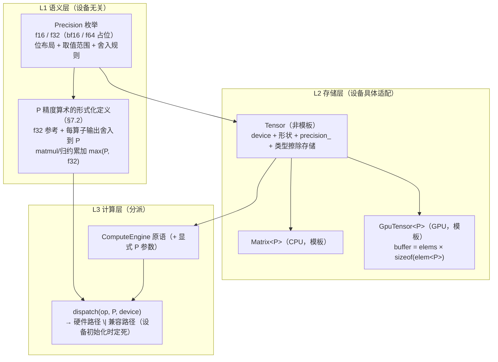

# 多精度计算改造（f16 / 混合精度）设计

> **状态**：设计定稿（2026-09-08），Phase 1 未启动。
> **范围**：f16 + f32（bf16 / f64 仅枚举占位）。
> **来源**：docs/13 P4-03「半精度训练」（显存减半 + 带宽翻倍）。
> **配套**：`../development/01-compute-engine-development.md`（引擎开发）、`../28-compute-engine-usage.md`（引擎使用）、`../08-pitfalls-and-lessons.md`（踩坑）、`../30-code-review-2026-09-04.md`（CpuEmitter 隐性缺陷与本文 §11.1 相关）。

## 目录

1. [概述](#1-概述)
2. [需求追溯](#2-需求追溯)
3. [决策记录](#3-决策记录)
4. [核心概念：三层分离](#4-核心概念三层分离)
5. [精度类型系统](#5-精度类型系统)
6. [存储层：Tensor 与类型化存储](#6-存储层tensor-与类型化存储)
7. [计算层：能力、语义、分派、f16 GEMM](#7-计算层能力语义分派f16-gemm)
8. [精度推导规则（resolve）](#8-精度推导规则resolve)
9. [模型级控制：PrecisionProfile](#9-模型级控制precisionprofile)
10. [全链路走查](#10-全链路走查)
11. [对现有架构的影响](#11-对现有架构的影响)
12. [分期](#12-分期)
13. [测试计划](#13-测试计划)
14. [风险与对策](#14-风险与对策)
15. [涉及文件（模块级）](#15-涉及文件模块级)
16. [开放问题](#16-开放问题)

---

## 1. 概述

### 1.1 一句话目标

**把精度变成数据的一等属性（存储）+ 算子的一等参数（计算）**：张量创建时显式指定存储精度，算子调用时显式指定计算精度，模型级默认值在构造器一行给全；设备只决定**执行路径**（硬件加速 / 兼容路径），不改变精度语义。

### 1.2 现状（改造前）

| 现状 | 位置 | 含义 |
|---|---|---|
| `Scalar = float` 编译期全局别名 | `core_config.hpp` | 一个 build 只有一种精度 |
| `Matrix` = `std::vector<Scalar>` | `algebra_matrix.hpp` | 存储无精度维度 |
| `GpuTensor` buffer 尺寸硬编码 `sizeof(float)` | `backend/compute_vk_backend.hpp` | GPU 存储无精度维度 |
| `Tensor` = device + 形状 + 类型擦除存储 | `compute_tensor.hpp` | 容器无精度属性 |
| `ComputeEngine` 原语以 `Tensor` 为参数 | `compute_engine.hpp` | 算子无精度概念 |
| 序列化 1B 全局 tag（f32/f64） | `model_serialization.hpp` | 文件级、非张量级，校验编译期 `Scalar` |
| AOT 融合 shader 按 `expr_spec_key` 匹配 | `expr_spec.hpp` | key 无精度维度 |

### 1.3 目标（G）与非目标

**目标**

- **G1** 存储精度是 Tensor 的类型参数，设备具体适配（`Matrix` / `GpuTensor` 各自实现）
- **G2** 精度与设备无关；设备支持硬件加速则启用，否则走兼容路径
- **G3** 计算精度：不指定 = 所有操作数中最高；指定 = 指定值
- **G4** 代码显式指定（张量创建 + 计算算子），**不存在隐式精度推导**（无隐藏全局状态）
- **G5** 默认配置（全 f32）= 今天的行为，零回归

**非目标（Phase 1）**：bf16、f64 计算路径、in-kernel f16 融合（fused shader 的 f16 变体）、loss scaling、per-layer 精度覆盖、f16 权重镜像缓存。

---

## 2. 需求追溯

| # | 原始需求 | 落地章节 |
|---|---|---|
| 1 | 存储精度是 Tensor 类型参数，具体设备具体适配（matrix、gputensor） | §5 + §6：`Tensor` 携带 `precision_` 属性；CPU 侧 `Matrix<P>` 模板、GPU 侧 `GpuTensor<P>` 模板，元素字节数由 P 决定 |
| 2 | 精度与设备无关；设备支持硬件加速则启用，否则使用兼容方案 | §7：P 精度算术有**唯一的、设备无关的形式化定义**（§7.2）；`(算子, P, 设备)` 能力表在设备初始化时定死分派到 {硬件路径, 兼容路径} |
| 3 | 计算不指定精度 = 操作数中最高；指定 = 指定值 | §8：`P_op = 调用点显式 P，否则 max(操作数精度)`；显式 P 的语义 = **整个算子在该精度下做**（决策 Q3-A：操作数 cast、计算、输出存储全在 P） |
| 4 | （补充）代码显式指定精度（算子 + 张量创建），不存在隐式精度推导 | §8.5 + §9：所有 P 实参在调用点可见；值统一来自 `PrecisionProfile`（模型构造器一行）；唯一兜底 `Auto = max(操作数)` 是**可见操作数的纯函数**；引擎无任何隐藏的精度状态 |

---

## 3. 决策记录

全部选项与结论（讨论于 2026-09-08，用户逐项确认）。

| ID | 决策 | 结论 | 关键理由 |
|---|---|---|---|
| Q1 | 精度集合 | **f16 + f32**；bf16 移出范围（GPU 上 bf16 无硬件 ALU，永远兼容路径，价值仅在存储/带宽，留 Phase 2）；f64 枚举占位不实现（消费级 GPU 无 f64 ALU） | 范围最小且覆盖 f16 训练主诉求 |
| Q2 | "Tensor 类型参数"的落地方式 | **运行时 tag + 内部类型化**：`Tensor` 非模板（运行时 `precision_` + 类型擦除存储），`Matrix<P>` / `GpuTensor<P>` 为存储/代数层模板 | 全模板方案会迫使 `ComputeEngine` 虚接口、所有 Layer、dsl 路径按 P 分裂，与"Layer 只写一次"铁律冲突 |
| Q3 | 指定精度的语义 | **A：指定 = 整个算子的精度**——操作数升/降 cast 到 P、在 P 下计算、输出存 P。配套：① matmul/归约累加 = `max(P, f32)`；② 数值敏感算子（softmax/LayerNorm/loss）的 P 由 `stable` 参数显式给（默认 F32） | 语义单一可预测；"f32 算存 f16"不塞进算子参数，用显式 `cast` 表达 |
| Q4 | 兼容路径（无 P 硬件加速时）的语义 | **f32 参考计算 + 每个算子输出舍入到 P**（round-half-to-even）。P 精度算术的形式化定义 = f32 参考 + 每算子输出舍入；matmul/归约另加累加 `max(P, f32)` | 硬件路径与兼容路径**语义等价**；差异仅在归约内累加顺序 → 跨设备同精度**容差内相等，不字节一致** |
| Q5 | 精度控制层级 | **显式 + `Model` 构造器 `PrecisionProfile`（4 参数：param / compute / stable / optimizer）**；每算子调用点显式传 P（值来自 profile） | 比"引擎级隐式 target"更干净；Layer 仍只写一次（P 是可见实参） |
| Q6 | GPU 融合 / AOT 路线 | **分期**：Phase 1 = f32 融合世界 + 边界显式 cast + f16 GEMM（`expr_spec_key` 不变）；Phase 2 = in-kernel f16 融合（key 加 1B 精度维度，glsl_gen f16 变体） | Phase 1 改动面最小 |
| D7 | P 参数形式 | `std::optional<Precision> p = std::nullopt`；`nullopt = Auto = max(操作数)`；代码库约定 Layer/工厂/优化器/loss 调用**永远显式传** | 数据操作类算子的 Auto = 源精度，自然语义 |
| D8 | "张量精度"的拆分 | 用户提的"张量精度"落为 **`param`**（权重/参数存储精度）；激活/梯度精度**不设独立参数** | 激活/梯度精度由产生它的算子参数决定 |
| D9 | loss 的 backward 输出精度 | **= `stable`**（loss 前向 + backward 全链路同一 P，默认 F32） | loss 链 f32 是数值安全默认 |
| D10 | Profile 默认值 | **全 F32** = 今天的行为，零回归 | G5 |
| D11 | 提升序 | **F16 < F32**；BF16 / F64 为保留值，Phase 1 使用 → `Result` 清晰报错"精度未实现" | 无 bf16 后无不可公度问题 |

---

## 4. 核心概念：三层分离

> **精度是数据的属性（存储）+ 操作的参数（计算）；设备只决定执行路径，不改变语义。**



- **L1** 保证"精度与设备无关"：任何算子在任何精度下的**含义**唯一（§7.2），设备只是提供实现。
- **L2** 落实需求 1：存储精度是 `Tensor` 的属性，`Matrix` / `GpuTensor` 各自类型化承载。
- **L3** 落实需求 2：`(算子, P, 设备)` 查能力表分派，硬件加速优先，否则兼容路径。

---

## 5. 精度类型系统

### 5.1 枚举

```cpp
enum class Precision : uint8_t
{
    F16  = 0,   // IEEE half（binary16），2 字节
    F32  = 1,   // 参考精度（reference）
    BF16 = 2,   // 保留（Phase 2；使用 → 清晰报错）
    F64  = 3,   // 保留（使用 → 清晰报错）
};
```

- `F16 < F32`（提升序，D11）；`max()` 有定义。
- 序列化 tag 沿用 v4 数值：**0=f32、1=f64（占位，不改动，避免 v4 文件误读）、2=f16、3=bf16（保留）**（§11.3）。

### 5.2 元素类型

| P | 元素类型 | 字节 | 说明 |
|---|---|---|---|
| F16 | `nn::f16`（新增） | 2 | IEEE binary16 位布局（uint16 存储的 value type）；与 GPU 内存中的 f16 / R16F 布局一致（little-endian）→ **同精度 CPU↔GPU 传输 = 原始字节拷贝** |
| F32 | `nn::f32 = float` | 4 | 现状 |

- `elem<P>` = 上述映射（`f16` / `float`）。
- `nn::f16` 语义：trivially copyable、无异常；构造/比较经 f32 转换；**一切 f16↔f32 转换与 f16 输出舍入统一 round-half-to-even**（与 IEEE / GPU 硬件一致，Q4 依赖此一致性）。
- f16 数值事实（写进预期）：最大 65504，最小正规数 2⁻¹⁴，相对精度 2⁻¹⁰——**范围远窄于 f32，溢出是 f16 训练的首要数值风险**（§12.4 已知限制）。

### 5.3 `Scalar` 的去留

`using Scalar = float` **保留**，含义收窄为：**参考精度（Q4 的 f32 参考）+ 宿主标量类型**（`lr` / `wd` / `epsilon` / `alpha` 等 f32 常量）。`BLOCK_SIZE` 的 64KB 栈预算 static_assert 维持按 f32 核算。

---

## 6. 存储层：Tensor 与类型化存储

### 6.1 Tensor（非模板，Q2）

现状：`device_ + rows_/cols_ + 每设备一个 shared_ptr 存储成员（互斥）`（曾有 `virtual_tag_`，已随 IR-C 于 2026-09-19 删除）。

改造：

| 成员 | 现状 | 改造后 |
|---|---|---|
| `precision_` | 无 | `Precision`，新增 |
| `cpu_data_` | `shared_ptr<Matrix>` | `variant<shared_ptr<Matrix<F16>>, shared_ptr<Matrix<F32>>>`（Phase 1 两候选；未来加 f64 只加候选） |
| `gpu_data_` | `shared_ptr<GpuTensor>` | `variant<shared_ptr<GpuTensor<F16>>, shared_ptr<GpuTensor<F32>>>` |
| `cuda_data_` | （CUDA 后端已停用） | Phase 1 不动 |
| 其余 | `device_` / `rows_` / `cols_` / 拷贝语义 | 不变（存储仍 shared_ptr 共享，廉价拷贝） |

- `precision_` 即"激活候选"的标记，与 `device_` 共同唯一确定存储的有效类型。
- **无裸指针**（铁律 2）：类型擦除用 `std::variant` of 类型化 `shared_ptr`，不做 `shared_ptr<void>` + 强转。
- 访问器按 P 模板化：`Matrix<P>& cpu_matrix<P>()`，P 与 `precision_` 不符 → `NN_ASSERT`（编程错误）。
- `TensorRef`（`reference_wrapper`）不变。
- **图 IR 录制（原 `virtual_tag_`）与本文正交**：Phase 1 融合世界保持 f32（Q6）；该机制已于 2026-09-19 随 IR-C 删除，本文不受影响。

### 6.2 Matrix&lt;P&gt;（L1 代数层）

- `std::vector<elem<P>> data_`；现有全部运算代码**模板化到 P**（代数层是纯 CPU、无虚接口，模板化零成本）。
- Phase 1 只实例化 **F32 / F16**；**F32 实例化必须与现状逐字节一致**（验收 A/B 测试，§13.1）。
- dsl / 表达式模板链（`algebra_expr.hpp` / `expr_dsl.hpp`）随 P 实例化。

### 6.3 GpuTensor&lt;P&gt;（L0 GPU 存储）

- `buffer 字节数 = elems × sizeof(elem<P>)`（消除现状 `sizeof(float)` 硬编码）；分配对齐 ≥ 4 字节（向量宽度）。
- `GpuBuffer::create_device_local / create_host_visible` 的 `elem_count` 语义改为**字节数**（或 (elem_count, P) 双参，工程细节）。

### 6.4 创建 API（P 显式；无 Auto——创建无操作数可推导）

```cpp
Tensor::cpu(rows, cols, P)                    // CPU 空张量
engine.create_tensor(rows, cols, P)           // 设备张量
GpuTensor<P>::create_empty(rows, cols, backend)
Matrix<P>(rows, cols[, value])
engine.from_matrix(const Matrix<P>& m)        // 每个支持的 P 一个重载；
                                             // P 由 Matrix 类型带出，无二义
```

### 6.5 读取 / 传输 API

```cpp
engine.to_matrix(const Tensor& t, P)          // 重载；P ≠ t.precision() → Result 硬错误
                                             // "需要别的精度" → 先显式 cast（§7 的 cast 原语）
```

- **同精度跨设备**（CPU f16 ↔ GPU f16）= 原始字节拷贝（`vkCmdCopyBuffer` / memcpy），零转换——f16 位布局 CPU/GPU 一致。
- **跨精度跨设备** = 逐元素 `cast`。
- `reshape`（零拷贝视图）继承精度（同一底层存储）；CPU 侧 reshape 的复制语义不变。

### 6.6 内存约定

- `b_block` 64KB 栈预算（`BLOCK_SIZE² × sizeof(Scalar)`）按 P 重核：f16 同块元素数可 ×2，或保持块数不变（工程选择，§16）。
- activation offload slab 的偏移单位现注释为 "float 单位" → **统一改为"元素单位"**（P 决定每元素字节数）。

---

## 7. 计算层：能力、语义、分派、f16 GEMM

### 7.1 能力矩阵（设备初始化时一次查定，运行期不变）

| P | CPU | GPU（Vulkan） |
|---|---|---|
| F32 | 硬件（现状） | 硬件（`shaderFloat32` 必有） |
| F16 | **看 ISA**：AVX512-FP16 / AVX10 / ARMv8.2-AFP（编译期宏探测）→ 硬件；否则兼容 | **看特性**：`shaderFloat16`（Vulkan 1.2 核心 / 对应扩展）→ 硬件；否则兼容 |

Phase 1 只有两个精度，"兼容路径"实际只有两种情形：**① CPU 无 f16 ISA；② GPU 无 `shaderFloat16`**。

> 前瞻（Phase 2 的 bf16）：任何已知 CPU/GPU 均无 bf16 硬件 ALU → bf16 永远是兼容路径精度，其价值在存储/带宽减半而非算术加速。

### 7.2 P 精度算术的形式化定义（Q4，本文最核心的语义锚）

```
对 P ≠ F32：
  P 精度算术 := 以 f32 参考精度计算 + 每个算子输出舍入到 P（round-half-to-even）
  matmul / 归约类算子额外：累加精度 = max(P, f32)
P = F32：参考即自身，不舍入（= 现状行为）
```

- **硬件路径 ≡ 兼容路径（语义等价）**：硬件 f16 运算的输出本来就舍入到 f16；tensor core 点积用 f32 累加，与"累加 max(P, f32)"一致。两路径差异仅在归约内部累加顺序 → 同精度跨设备结果**容差内相等（最后几个 ulp），不字节一致**。
- 该定义使"精度与设备无关"（需求 2）**严格成立**：任何 (算子, P) 的含义唯一，设备只是实现差异。
- 兼容性推论：CPU 无 f16 ISA 时的 f16 = 逐元素 decode→f32 计算→encode 舍入（慢，但语义精确；**省内存不省时间**，§12.4）。

### 7.3 分派规则

- 分派粒度 = **`(算子, P, 设备)` 三元组**；设备初始化时建表（GPU：特性查询；CPU：编译期 ISA 宏），运行期只查表。
- **确定性**：同一 `(算子, P, 设备)` 永远走同一路径（无容器迭代顺序依赖，铁律 8 满足）。
- Phase 1 逐算子路径（工程落地表）：

| 算子 | CPU f16（无 ISA） | GPU f16（无特性） | GPU f16（有特性） |
|---|---|---|---|
| 逐元素（融合链内） | f32 参考 + 逐元素舍入（dsl f16 实例化） | 边界 cast→f32 融合世界→边界 cast 回 f16（Q6 Phase 1） | 同左（Phase 1 不用 f16 ALU 做逐元素，in-kernel f16 留 Phase 2） |
| matmul | f16 读 / f32 累加 / f16 写（tiled，f16 版） | 同左（u8 对软件解码，§7.4 变体①） | f16 GEMM（f16vec 加载，§7.4 变体②） |
| 归约 | f32 累加 + 输出舍入 | 同左 | 同左（即便有 f16 特性，归约仍 f32 参考：无 f16 归约硬件） |
| 数据操作（clone/slice/gather…） | 按 P 字节拷贝 | 按 P 字节拷贝 | 同左 |

### 7.4 f16 GEMM（Phase 1 计算侧的唯一收益点）

定义（Q4 特化）：**f16 输入、f32 累加、f16 输出（round-half-to-even）**。变体：

| 变体 | 加载 | 乘加 | 依赖 | 阶段 |
|---|---|---|---|---|
| ① u8 对软件解码 | 2×u8 载入，位运算解出 f32 | f32 FMA | 无（设备无关） | **Phase 1（首选，单一实现）** |
| ② f16vec 加载 | `f16vec4` 直接载入转 f32 | f32 FMA | `shaderFloat16` | Phase 1（特性可用时选②） |
| ③ tensor core f16 FMA | f16 | f16 FMA + f32 累加 | f16 ALU + f32 累加 | Phase 2（部分积舍入到 f16，与参考差最后几 ulp，仍在容差契约内） |

- GPU 侧为**手写原语 shader**（仿现有 `matmul` / `matmul_tiled`，`shaders/matmul_f16*.comp`），**不进融合 spec** → `expr_spec_key` 不受影响（Q6）。
- CPU 侧为 `matmul` 的 f16 实例化（f16 读 / f32 `b_block` / f16 写）。
- 分派：同一 `matmul` 调用按 `(P, 设备能力)` 选 ①/②；上层无感知。

### 7.5 cast 原语（新）

```cpp
engine.cast(const Tensor& src, Precision dst) → Result<Tensor>
```

- 唯一"变精度"算子，**永远显式**。升 cast 精确（f16→f32 无损）；降 cast round-half-to-even。
- 用途：① 混合精度算子的操作数转换由引擎在 dispatch 内完成（§8）；② 用户 "f32 算存 f16" = 算子（f32）+ `cast`（f16）；③ 跨精度跨设备传输。

---

## 8. 精度推导规则（resolve）

### 8.1 形式化定义

```
对算子 op，张量操作数 t1..tn，调用点显式参数 p（std::optional，D7）：

  P_op = *p（调用点显式指定）
       否则  max(P(t1), …, P(tn))      // Auto = 用户规则：操作数中最高，
                                       // 纯函数、输入全部可见，非隐藏状态
  每个操作数：若 P(ti) ≠ P_op 则 ti ← cast(ti, P_op)   // 引擎 dispatch 内完成
  计算：逐元素按 P_op；matmul/归约累加 = max(P_op, f32)
  输出：存 P_op
```

### 8.2 标量操作数不参与推导

`lr` / `wd` / `epsilon` / `alpha` 等宿主 f32 常量**不进 max**（否则 `scale_inplace(f16 张量, 1e-4)` 会把整个张量顶成 f32）；标量在算子边界 cast 到 `P_op`。

### 8.3 in-place 算子特例（必须写进 API 注释）

in-place 算子（`add_inplace` / `scale_inplace` / `axpy_inplace` / `zero`…）的输出即操作数本身，**存储精度不可变**。显式 P 只改变**计算/累加路径**，结果舍回原存储精度。例：`add_inplace(A_f16, B, P = F32)` = f32 计算、结果舍回 f16。想改变张量精度 = 显式 `cast`。

### 8.4 数据操作类算子

`clone / transpose / slice_rows / insert_rows / gather_rows / scatter_add_rows / rearrange_3d / zero / scan_*` 的 `Auto` = **源精度**（单操作数时"操作数中最高"的自然语义）；也可显式指定 P（例：`gather_rows(f32 嵌入表, idx, P = F16)` → f16 输出）。

### 8.5 "无隐式推导"声明（G4）

P 的来源只有两个：

1. **调用点显式参数**（值可追溯到模型构造器的 `PrecisionProfile`，§9）；
2. **Auto = max(操作数)**——可见操作数的纯函数。

**不存在第三个来源**：引擎无任何默认精度状态，Layer 无任何隐藏策略。唯一"非用户选择"的精度是**设备能力分派**（硬件/兼容，§7.3）——那是设备物理事实而非语义选择，且 Q4 保证两路径语义等价。代码库约定：**Layer / 工厂 / 优化器 / loss 的所有引擎调用显式传 P**（可见实参，如 `p_.compute`），Auto 只留给用户直调引擎与数据操作的自然语义。

---

## 9. 模型级控制：PrecisionProfile

### 9.1 定义

```cpp
struct PrecisionProfile
{
    Precision param     = F32;  // 权重 / 嵌入表 / 参数存储（工厂创建时指定）
    Precision compute   = F32;  // 常规算子的显式 P（matmul/逐元素/gather/scan/数据操作…）
    Precision stable    = F32;  // 数值敏感算子的显式 P（softmax / LayerNorm / RMSNorm / loss，
                                //    含 loss backward 输出，D9）
    Precision optimizer = F32;  // 优化器状态（m / v / momentum）创建精度
};
// 默认全 F32（D10）→ 默认 profile = 今天的行为，零回归（G5）
```

**参数映射说明（D8）**：用户原始三参数"张量精度 / 计算精度 / 优化器精度"中——

- "张量精度"拆为 **`param`**（工厂创建的权重）；**激活/梯度不设独立参数**：按 Q3-A，算子输出存储精度 = 该算子的 P，激活由 `compute` 产生、梯度由反向算子（`compute`）与 loss backward（`stable`）产生；
- "计算精度" = `compute`；
- 新增 **`stable`**：f16 范围溢出（65504）风险集中在 softmax / loss / 归一化，显式化为构造器参数；
- "优化器精度" = `optimizer`（与计算精度解耦；f16 训练下 Adam 的 m/v 必须 f32，否则状态被 f16 舍入污染）。

### 9.2 注入机制（Layer 只写一次，P 可见）

```cpp
class Layer
{
    PrecisionProfile p_;   // Model 在 add / 构造 Layer 时注入（每层一份）
};

// Layer 代码仍只写一次，每个调用点的 P 是可见实参（值来自构造器）：
Tensor Linear::forward(const Tensor& x)
{
    return engine_.matmul(x, W_, false, false, p_.compute);
}
Tensor LayerNorm::forward(const Tensor& x)
{
    auto mean = engine_.row_reduce_sum(x, p_.stable);
    // …（该层全部原语调用用 p_.stable）
}
```

### 9.3 构造 API

```cpp
Model model(engine, PrecisionProfile{F32, F16, F32, F32});          // 显式
Model model(engine);                                                 // 默认全 F32 = 现状
auto m = build_gpt_model(engine, vocab, d, s, h, f, L, profile);    // 工厂透传
auto opt = create_optimizer("adamw", engine, params, grads, lr, wd,
                            /*state_p =*/ Precision::F32);           // 显式
loss = ce.forward_sparse(engine, logits, labels, mask, vocab,
                         /*P =*/ stable);                            // 显式（= 模型 stable）
```

- 权重/嵌入表由工厂按 `param` 创建；优化器状态按 `optimizer` 创建。
- 优化器更新算子全部显式：参数更新 P = `param`（in-place，存储不变），状态更新 P = `optimizer`。
- **per-layer 覆盖 = Phase 2**：`p_` 本就是每层成员，改成员即覆盖（如末层 head 强制 F32），纯增量。
- CLI 入口可选新增 `--f16` 标志 = master-weights 配方 `{param=F32, compute=F16, stable=F32, optimizer=F32}`（§9.4 第 3 行）。

### 9.4 典型配方

| 配方 | param | compute | stable | optimizer |
|---|---|---|---|---|
| 全 f32（现状） | F32 | F32 | F32 | F32 |
| 全 f16（激进） | F16 | F16 | F32 | F32 |
| **master-weights（经典混合精度，推荐默认 f16 配方）** | F32 | F16 | F32 | F32 |

（`stable` 可放宽为 F16，用户自担溢出风险，见 §12.4。）

---

## 10. 全链路走查

**配置**：`{param=F32, compute=F16, stable=F32, optimizer=F32}`（master-weights 配方）。

| 环节 | Layer 内实际调用（P 可见） | P_op | 存储 |
|---|---|---|---|
| 批次上传 | 用户 `from_matrix(batch_f16)` | — | f16 |
| embedding | `gather_rows(W_f32, idx, p_.compute)` | F16 | f16（W 按 op 降 cast） |
| QKᵀ / AV | `batched_matmul(…, p_.compute)` | F16 | f16，f16 GEMM（f32 累加，§7.4） |
| softmax / LayerNorm | `…(p_.stable)` | F32 | f32（输入升 cast） |
| FFN | `matmul(…, p_.compute)` | F16 | f16 |
| loss 及梯度 | `forward_sparse(…, p_.stable)` | F32 | loss f32，grad f32（D9） |
| 反向 matmul | `matmul(grad_f32, x_f16, p_.compute)` | F16 | grad 降 cast f16（经典 f16 训练形态） |
| 优化器 | `axpy_inplace(m_f32, β, g)` | F32（optimizer） | 权重 f32 更新 |

**两个可见的推论**（写入文档防止误解）：

1. **激活"弹跳"**：`stable` 算子按 Q3-A 输出存 F32 → 激活在层边界 f16→f32→f16 弹跳；f32 中间量最多多一个张量的显存，可接受。
2. **权重按 op cast**：f32 权重每个 matmul 降 cast（功能正确，有带宽开销）；**f16 权重镜像缓存 = Phase 2 优化（D 类），语义不变**。

---

## 11. 对现有架构的影响

### 11.1 AOT 闭合世界（铁律 7，Q6 分期）

- **Phase 1：`expr_spec_key` 不变。** 融合世界保持全 f32：f16 张量进出融合链时走**显式边界 cast**（cast 可融入首/尾 kernel 的 load/store，或独立小 kernel——工程选择）；f16 GEMM 是手写原语，不进 spec。GPU f16 训练在 Phase 1 的收益 = 显存减半 + 带宽减半 + GEMM 提速，**逐元素链的 in-kernel f16 收益 Phase 2 再拿**。
- **Phase 2**：in-kernel f16 融合 → key 加 1B 精度维度；`glsl_gen` 生成 f16 变体（GLSL `f16vec*`，explicit arithmetic 扩展）；`CpuEmitter` 产物必须可编译并按 P 实例化——**CpuEmitter 现有隐性缺陷（BatchMod/BatchCol 未声明 batch、操作数走 default 等）必须在 Phase 2 前修复**，否则 f16 CPU 融合链不可信。

### 11.2 确定性契约（修订版）

| 场景 | 契约 |
|---|---|
| f32，同设备 | **不变**：并行 = 单线程逐字节（现状契约） |
| f16，同 (设备, P, 路径) | 串行确定性；并行容差 = 与现有 f32 并行同级 |
| f16，CPU vs GPU | **容差内相等**（建议 rtol 1e-2 / atol 1e-2，待实测校准），不字节一致 |
| f16 路径 vs f32 路径 | 不可比（不同语义，Q4） |

- gradcheck 容差**按 P 分级**（f32 沿用现值；f16 用 f16 表）。
- 现有"并行非逐字节"的已知项（col_reduce 并行）不在本文范围，f16 不使其恶化。

### 11.3 序列化 v4 → v5

- **v4**：全局 1B tag（0=f32 / 1=f64），校验编译期 `Scalar`。
- **v5**：**每张量 1B tag**：0=f32、1=f64（占位，**不改动数值**，避免 v4 f64 文件被误读为 f16）、2=f16、3=bf16（保留）。
- v4 文件读入 = 全 f32，向后兼容；v5 读 v4 自动按全 f32。
- `model_spec.hpp` 每参数增加精度字段。
- 附带收益：f16 权重入 `.nnpkg` 体积减半。

### 11.4 优化器

- 状态精度独立于模型计算精度（D8/D10）；全部更新算子显式 P（§9.3）。
- 禁止隐含假设：f16 参数 + f32 状态时，`axpy` 的 P 显式传 `optimizer`（f32），参数存储精度不变（§8.3 in-place 规则）。

### 11.5 dsl / CPU 表达式

- dsl 模板按 P 实例化（L1 代数层模板化后自然跟随）；F32 实例化 = 现状，F16 实例化 = §7.2 定义（无 f16 ISA 时逐元素 decode→f32→encode，**慢**）。
- 融合 IR（`expr_spec` / `expr_opt`）Phase 1 不动；Phase 2 的 key 扩展在 §11.1。（`expr_graph` / IR-C 已于 2026-09-19 删除）

### 11.6 Vulkan 细节

- 设备初始化查询 `shaderFloat16`（`VkPhysicalDeviceVulkan12Features` 或对应扩展），进入 §7.3 分派表。
- Phase 1 GPU f16 路径只用：边界 cast（f32 融合世界）+ f16 GEMM（变体① u8 对 / 变体② f16vec，§7.4）——**GLSL `f16` 算术类型 Phase 1 不引入**（变体② 只用 `f16vec` 加载/存储，计算全 f32）。
- 无 `shaderFloat16` 的设备：GPU f16 = 兼容路径（功能正确，无加速），**平滑降级正是"设备无关"（G2）的含义**——能力表自动处理，上层无感知。
- `GpuBuffer` 创建参数化（§6.3）；`MemoryPool` 块大小按字节，不受 P 影响。

### 11.7 其他

- `BLOCK_SIZE = 64` 与 `PARALLEL_THRESHOLD`（按元素数）不变；f16 GEMM 分块是否放大（f16 同块 ×2 元素）= 工程问题（§16）。
- 大词表 one-hot 禁止、batch-major 布局等铁律与 P 正交，全部沿用。

---

## 12. 分期

### 12.1 Phase 1 交付物

| # | 交付物 | 涉及 |
|---|---|---|
| D1 | `Precision` 枚举 + `nn::f16` 类型 + `elem<P>` | `core_config.hpp` / 新 `precision.hpp` |
| D2 | 存储类型化：`Matrix<P>` 模板化（F32 实例化逐字节不变）、`GpuTensor<P>`、`GpuBuffer` 字节数参数化 | `algebra_matrix.hpp`、`backend/compute_vk_backend.hpp` |
| D3 | `Tensor` 精度属性 + variant 存储 + 显式创建/读取 API | `compute_tensor.hpp` |
| D4 | 能力查询：CPU ISA 宏（编译期）、GPU `shaderFloat16`（运行期）→ 分派表 | `compute_cpu_engine.hpp`、`GpuBackend` |
| D5 | 引擎原语 `P` 参数 + `cast` 原语 + `from/to_matrix` 按 P 重载 | `compute_engine.hpp` + 两引擎 |
| D6 | f16 计算实现：CPU（f32 参考 + 舍入；有 ISA 则向量化）；GPU（边界 cast 路径 + **f16 GEMM** 变体①，特性可用加变体②） | 两引擎 + `shaders/matmul_f16*.comp` |
| D7 | `PrecisionProfile` + Model/Layer/Loss/Optimizer/工厂接线（全部显式 P） | `model_container.hpp`、`compute_layer_*.hpp`、`compute_loss.hpp`、`compute_optimizer.hpp`、`domain_*.hpp` |
| D8 | 序列化 v5（每张量 tag）+ `model_spec` 精度字段 | `model_serialization.hpp`、`model_spec.hpp` |
| D9 | gradcheck / 测试容差按 P 分级 + 新增测试集 | `tests/` |

### 12.2 Phase 1 验收标准

1. **回归 A/B**：现有 ctest 全量（f32 默认路径）改造前后**逐字节一致**；`Scalar` 相关行为零变化。
2. **cast 往返**：f32→f16→f32 误差 ≤ 1 ulp(f16)（相对 2⁻¹⁰）。
3. **f16 GEMM**：CPU/GPU 各自 vs "f32 GEMM 后舍入 f16" 参考在 f16 容差内；CPU vs GPU 同容差。
4. **逐元素 / 归约**：四组合（CPU 有/无 f16 ISA × GPU 有/无特性）vs §7.2 参考实现（宿主 f32 参考）在容差内。
5. **端到端**：MNIST MLP 按 master-weights 配方 f16 训练收敛，逐步 loss 与 f32 基线在 f16 容差内。
6. **in-place 语义**：P 参数不改变存储精度，只改计算路径（§8.3 用例）。
7. **布局**：batch > 1 的序列/注意力 f16 用例（铁律 5：batch=1 测不出布局 bug）。
8. **确定性**：同 (设备, P, 路径) 串行 3 次运行逐字节一致。
9. **序列化**：v5 f16 模型 save/load 往返逐字节；v4 文件按全 f32 读入；tag 互锁校验生效。
10. **错误路径**：BF16 / F64 使用 → 清晰 `Result` 报错（"精度未实现"）。

### 12.3 Phase 2（列出，不在本期）

1. in-kernel f16 融合：`expr_spec_key` 加精度维度、`glsl_gen` f16 变体、CpuEmitter 按 P 实例化（**前提：先修 CpuEmitter 既有缺陷**）。
2. per-layer `PrecisionProfile` 覆盖（`p_` 成员已就位，纯增量）。
3. bf16（兼容路径精度，§7.1 注）。
4. f16 权重镜像缓存（消除按 op cast 的带宽开销）。
5. tensor core f16 FMA GEMM（§7.4 变体③）。
6. f64（若出现需求）。
7. loss scaling（若 f16 溢出监控显示必要）。

### 12.4 已知限制（显式，写入用户预期）

1. **无 loss scaling**：f16 范围 65504，f16 matmul 输出 / 大归约可能溢出 inf。`stable = F32` 把 loss / softmax / LayerNorm 移出 f16 是第一道防线；训练侧应监控 inf/nan；loss scaling 列 Phase 2。
2. **CPU f16（无 f16 ISA）省内存不省时间**（逐元素 decode/encode 开销）。
3. **跨设备 f16 容差内相等，不字节一致**（§11.2）——不要写"CPU f16 与 GPU f16 逐字节对拍"的测试。
4. **bf16 / f64 未实现**，使用 → 清晰报错。

---

## 13. 测试计划

| # | 测试 | 说明 |
|---|---|---|
| T1 | 回归 A/B（§12.2-1） | 改造前后全量 ctest 输出逐字节 diff |
| T2 | cast 往返 / 舍入 | f32→f16→f32；round-half-to-even 边界值（midpoint、denormal、±65504、inf/nan 传播） |
| T3 | f16 GEMM 对拍 | 小/中/大尺寸；CPU vs GPU；变体①/② 一致（同设备内逐字节，跨设备容差） |
| T4 | 逐元素 / 归约四组合 | 对照 §7.2 宿主 f32 参考实现 |
| T5 | 端到端 MNIST f16 | master-weights 配方；loss 曲线 vs f32 基线（f16 容差）；**batch > 1** |
| T6 | in-place 语义 | §8.3 用例：P 不改变存储精度 |
| T7 | 布局 | batch > 1 注意力/序列 f16（铁律 5） |
| T8 | 确定性 | 同 (设备, P, 路径) 串行 3 次逐字节 |
| T9 | 序列化 v5 | f16 模型 save/load 往返；v4 读入 = 全 f32；tag 互锁 |
| T10 | 能力分派 | 无 f16 ISA 的 CPU 构建 / 无 `shaderFloat16` 的 GPU（真实设备或 mock 能力表）走兼容路径，功能正确 |
| T11 | 错误路径 | BF16 / F64 → 清晰 `Result` 错误；`to_matrix` 精度不符 → 硬错误 |

---

## 14. 风险与对策

| 风险 | 等级 | 对策 |
|---|---|---|
| L1 代数层模板化改动面大（`algebra_matrix.hpp` ~1000 行） | 高 | Phase 1 只实例化 F32 / F16；T1 A/B 测试强制 F32 逐字节不变；改动分批 |
| GPU f16 GEMM 是新代码路径 | 中 | 小矩阵先行 vs CPU f16 对拍；变体①（u8 对，设备无关）单一实现起步 |
| `shaderFloat16` 设备覆盖不全 | 低 | 无特性 = 兼容路径，功能正确（Q4），平滑降级 |
| AOT 世界被破坏 | 低 | Phase 1 key 不变（f16 GEMM 手写原语）；Phase 2 的 key 扩展单独评审 |
| f16 溢出导致训练发散 | 中 | `stable = F32` + §12.4 明示 + 训练 inf/nan 监控；loss scaling 留 Phase 2 |
| CpuEmitter 既有隐性缺陷拖累 Phase 2 | 中 | 列 Phase 2 前置条件 |
| f16 容差取值不当（过松掩盖 bug / 过紧误报） | 中 | T4/T5 实测校准后定默认，gradcheck 按 P 表分级 |

---

## 15. 涉及文件（模块级）

> 模块级清单（设计用途），非实现分工。

| 文件 | 影响 |
|---|---|
| `core_config.hpp` / 新 `precision.hpp` | `Precision`、`nn::f16`、`elem<P>`；`Scalar` 保留（参考精度，§5.3） |
| `algebra_matrix.hpp` | `Matrix<P>` 模板化（F32 实例化逐字节不变） |
| `compute_tensor.hpp` | `Tensor` 精度属性 + variant 存储 + 显式创建/读取 API |
| `backend/compute_vk_backend.hpp` | `GpuTensor<P>`、`GpuBuffer` 字节数参数化、`shaderFloat16` 查询、f16 GEMM pipeline |
| `compute_engine.hpp` + `compute_cpu_engine.hpp` + `compute_gpu_engine.hpp` | 原语 `P` 参数、`cast`、`from/to_matrix` 重载、f16 实现、能力分派表 |
| `shaders/` | `matmul_f16*.comp`（手写原语，仿 `matmul_tiled`） |
| `algebra_expr.hpp` / `expr_dsl.hpp` / `expr_*` | 按 P 实例化（F32 不变 + F16）；Phase 2 的 key 扩展另行评审 |
| `compute_layer_*.hpp` | `p_` 成员 + 全部原语调用显式 P |
| `compute_loss.hpp` / `compute_optimizer.hpp` | 显式 P（loss = stable；状态 = optimizer；参数 = param） |
| `model_container.hpp` / `model_spec.hpp` | `PrecisionProfile` 持有与透传 |
| `model_serialization.hpp` | v5（每张量 tag） |
| `src/`（CLI 入口） | 可选 `--f16`（master-weights 配方） |
| `tests/` | §13 测试集 + gradcheck 容差按 P 分级 |

---

## 16. 开放问题（Phase 1 实现期定）

1. f16 容差默认值（当前建议 rtol 1e-2 / atol 1e-2）——T4/T5 实测后校准。
2. f16 GEMM 分块尺寸：复用 `BLOCK_SIZE = 64` 还是放大（f16 同块 ×2 元素，64KB 预算下可 128）——bench 定。
3. 边界 cast 的实现形态：独立小 kernel vs 融入首/尾融合 kernel 的 load/store——GPU 侧工程选择。
4. CLI `--f16` 的确切标志名与组合形式（与 `--device` 等现有标志的关系）。
5. `nn::f16` 的 denormal 处理：按 IEEE 全精度 denormal 还是 flush-to-zero（GPU 硬件行为不一致处需统一；默认全精度，性能敏感路径再议）。