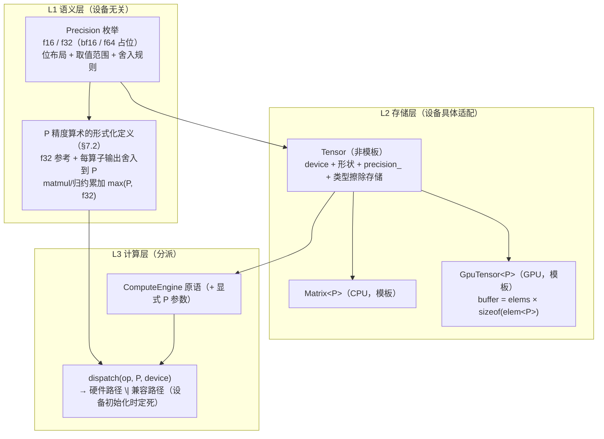

# 多精度计算改造（f16 / 混合精度）设计

> **状态**：Phase 1 已落地（存储类型化 / cast / matmul-f16 / 类型化 Tensor）；
> Phase 2 部分落地（2026-09：PrecisionEngine 边界 cast 适配层 + DSL/Layer/
> Loss/Optimizer 全链精度接线 + `f16_precision_test`；**in-kernel f16 未做**）——
> 实施记录、实测与已知问题见 §12.5。
> **范围**：f16 + f32（bf16 / f64 仅枚举占位）。
> **来源**：docs/13 P4-03「半精度训练」（显存减半 + 带宽翻倍）。
> **配套**：`../development/01-compute-engine-development.md`（引擎开发）、`../28-compute-engine-usage.md`（引擎使用）、`../08-pitfalls-and-lessons.md`（踩坑）、`../30-code-review-2026-09-04.md`（CpuEmitter 隐性缺陷与本文 §11.1 相关）。

## 目录

1. [概述](#1-概述)
2. [需求追溯](#2-需求追溯)
3. [决策记录](#3-决策记录)
4. [核心概念：三层分离](#4-核心概念三层分离)
5. [精度类型系统](#5-精度类型系统)
6. [存储层：Tensor 与类型化存储](#6-存储层tensor-与类型化存储)
7. [计算层：能力、语义、分派、f16 GEMM](#7-计算层能力语义分派f16-gemm)
8. [精度推导规则（resolve）](#8-精度推导规则resolve)
9. [模型级控制：PrecisionProfile](#9-模型级控制precisionprofile)
10. [全链路走查](#10-全链路走查)
11. [对现有架构的影响](#11-对现有架构的影响)
12. [分期](#12-分期)
13. [测试计划](#13-测试计划)
14. [风险与对策](#14-风险与对策)
15. [涉及文件（模块级）](#15-涉及文件模块级)
16. [开放问题](#16-开放问题)

---

## 1. 概述

### 1.1 一句话目标

**把精度变成数据的一等属性（存储）+ 算子的一等参数（计算）**：张量创建时显式指定存储精度，算子调用时显式指定计算精度，模型级默认值在构造器一行给全；设备只决定**执行路径**（硬件加速 / 兼容路径），不改变精度语义。

### 1.2 现状（改造前）

| 现状 | 位置 | 含义 |
|---|---|---|
| `Scalar = float` 编译期全局别名 | `core_config.hpp` | 一个 build 只有一种精度 |
| `Matrix` = `std::vector<Scalar>` | `algebra_matrix.hpp` | 存储无精度维度 |
| `GpuTensor` buffer 尺寸硬编码 `sizeof(float)` | `backend/compute_vk_backend.hpp` | GPU 存储无精度维度 |
| `Tensor` = device + 形状 + 类型擦除存储 | `compute_tensor.hpp` | 容器无精度属性 |
| `ComputeEngine` 原语以 `Tensor` 为参数 | `compute_engine.hpp` | 算子无精度概念 |
| 序列化 1B 全局 tag（f32/f64） | `model_serialization.hpp` | 文件级、非张量级，校验编译期 `Scalar` |
| AOT 融合 shader 按 `expr_spec_key` 匹配 | `expr_spec.hpp` | key 无精度维度 |

### 1.3 目标（G）与非目标

**目标**

- **G1** 存储精度是 Tensor 的类型参数，设备具体适配（`Matrix` / `GpuTensor` 各自实现）
- **G2** 精度与设备无关；设备支持硬件加速则启用，否则走兼容路径
- **G3** 计算精度：不指定 = 所有操作数中最高；指定 = 指定值
- **G4** 代码显式指定（张量创建 + 计算算子），**不存在隐式精度推导**（无隐藏全局状态）
- **G5** 默认配置（全 f32）= 今天的行为，零回归

**非目标（Phase 1）**：bf16、f64 计算路径、in-kernel f16 融合（fused shader 的 f16 变体）、loss scaling、per-layer 精度覆盖、f16 权重镜像缓存。

---

## 2. 需求追溯

| # | 原始需求 | 落地章节 |
|---|---|---|
| 1 | 存储精度是 Tensor 类型参数，具体设备具体适配（matrix、gputensor） | §5 + §6：`Tensor` 携带 `precision_` 属性；CPU 侧 `Matrix<P>` 模板、GPU 侧 `GpuTensor<P>` 模板，元素字节数由 P 决定 |
| 2 | 精度与设备无关；设备支持硬件加速则启用，否则使用兼容方案 | §7：P 精度算术有**唯一的、设备无关的形式化定义**（§7.2）；`(算子, P, 设备)` 能力表在设备初始化时定死分派到 {硬件路径, 兼容路径} |
| 3 | 计算不指定精度 = 操作数中最高；指定 = 指定值 | §8：`P_op = 调用点显式 P，否则 max(操作数精度)`；显式 P 的语义 = **整个算子在该精度下做**（决策 Q3-A：操作数 cast、计算、输出存储全在 P） |
| 4 | （补充）代码显式指定精度（算子 + 张量创建），不存在隐式精度推导 | §8.5 + §9：所有 P 实参在调用点可见；值统一来自 `PrecisionProfile`（模型构造器一行）；唯一兜底 `Auto = max(操作数)` 是**可见操作数的纯函数**；引擎无任何隐藏的精度状态 |

---

## 3. 决策记录

全部选项与结论（讨论于 2026-09-08，用户逐项确认）。

| ID | 决策 | 结论 | 关键理由 |
|---|---|---|---|
| Q1 | 精度集合 | **f16 + f32**；bf16 移出范围（GPU 上 bf16 无硬件 ALU，永远兼容路径，价值仅在存储/带宽，留 Phase 2）；f64 枚举占位不实现（消费级 GPU 无 f64 ALU） | 范围最小且覆盖 f16 训练主诉求 |
| Q2 | "Tensor 类型参数"的落地方式 | **运行时 tag + 内部类型化**：`Tensor` 非模板（运行时 `precision_` + 类型擦除存储），`Matrix<P>` / `GpuTensor<P>` 为存储/代数层模板 | 全模板方案会迫使 `ComputeEngine` 虚接口、所有 Layer、dsl 路径按 P 分裂，与"Layer 只写一次"铁律冲突 |
| Q3 | 指定精度的语义 | **A：指定 = 整个算子的精度**——操作数升/降 cast 到 P、在 P 下计算、输出存 P。配套：① matmul/归约累加 = `max(P, f32)`；② 数值敏感算子（softmax/LayerNorm/loss）的 P 由 `stable` 参数显式给（默认 F32） | 语义单一可预测；"f32 算存 f16"不塞进算子参数，用显式 `cast` 表达 |
| Q4 | 兼容路径（无 P 硬件加速时）的语义 | **f32 参考计算 + 每个算子输出舍入到 P**（round-half-to-even）。P 精度算术的形式化定义 = f32 参考 + 每算子输出舍入；matmul/归约另加累加 `max(P, f32)` | 硬件路径与兼容路径**语义等价**；差异仅在归约内累加顺序 → 跨设备同精度**容差内相等，不字节一致** |
| Q5 | 精度控制层级 | **显式 + `Model` 构造器 `PrecisionProfile`（4 参数：param / compute / stable / optimizer）**；每算子调用点显式传 P（值来自 profile） | 比"引擎级隐式 target"更干净；Layer 仍只写一次（P 是可见实参） |
| Q6 | GPU 融合 / AOT 路线 | **分期**：Phase 1 = f32 融合世界 + 边界显式 cast + f16 GEMM（`expr_spec_key` 不变）；Phase 2 = in-kernel f16 融合（key 加 1B 精度维度，glsl_gen f16 变体） | Phase 1 改动面最小 |
| D7 | P 参数形式 | `std::optional<Precision> p = std::nullopt`；`nullopt = Auto = max(操作数)`；代码库约定 Layer/工厂/优化器/loss 调用**永远显式传** | 数据操作类算子的 Auto = 源精度，自然语义 |
| D8 | "张量精度"的拆分 | 用户提的"张量精度"落为 **`param`**（权重/参数存储精度）；激活/梯度精度**不设独立参数** | 激活/梯度精度由产生它的算子参数决定 |
| D9 | loss 的 backward 输出精度 | **= `stable`**（loss 前向 + backward 全链路同一 P，默认 F32） | loss 链 f32 是数值安全默认 |
| D10 | Profile 默认值 | **全 F32** = 今天的行为，零回归 | G5 |
| D11 | 提升序 | **F16 < F32**；BF16 / F64 为保留值，Phase 1 使用 → `Result` 清晰报错"精度未实现" | 无 bf16 后无不可公度问题 |

---

## 4. 核心概念：三层分离

> **精度是数据的属性（存储）+ 操作的参数（计算）；设备只决定执行路径，不改变语义。**



- **L1** 保证"精度与设备无关"：任何算子在任何精度下的**含义**唯一（§7.2），设备只是提供实现。
- **L2** 落实需求 1：存储精度是 `Tensor` 的属性，`Matrix` / `GpuTensor` 各自类型化承载。
- **L3** 落实需求 2：`(算子, P, 设备)` 查能力表分派，硬件加速优先，否则兼容路径。

---

## 5. 精度类型系统

### 5.1 枚举

```cpp
enum class Precision : uint8_t
{
    F16  = 0,   // IEEE half（binary16），2 字节
    F32  = 1,   // 参考精度（reference）
    BF16 = 2,   // 保留（Phase 2；使用 → 清晰报错）
    F64  = 3,   // 保留（使用 → 清晰报错）
};
```

- `F16 < F32`（提升序，D11）；`max()` 有定义。
- 序列化 tag 沿用 v4 数值：**0=f32、1=f64（占位，不改动，避免 v4 文件误读）、2=f16、3=bf16（保留）**（§11.3）。

### 5.2 元素类型

| P | 元素类型 | 字节 | 说明 |
|---|---|---|---|
| F16 | `nn::f16`（新增） | 2 | IEEE binary16 位布局（uint16 存储的 value type）；与 GPU 内存中的 f16 / R16F 布局一致（little-endian）→ **同精度 CPU↔GPU 传输 = 原始字节拷贝** |
| F32 | `nn::f32 = float` | 4 | 现状 |

- `elem<P>` = 上述映射（`f16` / `float`）。
- `nn::f16` 语义：trivially copyable、无异常；构造/比较经 f32 转换；**一切 f16↔f32 转换与 f16 输出舍入统一 round-half-to-even**（与 IEEE / GPU 硬件一致，Q4 依赖此一致性）。
- f16 数值事实（写进预期）：最大 65504，最小正规数 2⁻¹⁴，相对精度 2⁻¹⁰——**范围远窄于 f32，溢出是 f16 训练的首要数值风险**（§12.4 已知限制）。

### 5.3 `Scalar` 的去留

`using Scalar = float` **保留**，含义收窄为：**参考精度（Q4 的 f32 参考）+ 宿主标量类型**（`lr` / `wd` / `epsilon` / `alpha` 等 f32 常量）。`BLOCK_SIZE` 的 64KB 栈预算 static_assert 维持按 f32 核算。

---

## 6. 存储层：Tensor 与类型化存储

### 6.1 Tensor（非模板，Q2）

现状：`device_ + rows_/cols_ + 每设备一个 shared_ptr 存储成员（互斥）`（曾有 `virtual_tag_`，已随 IR-C 于 2026-09-19 删除）。

改造：

| 成员 | 现状 | 改造后 |
|---|---|---|
| `precision_` | 无 | `Precision`，新增 |
| `cpu_data_` | `shared_ptr<Matrix>` | `variant<shared_ptr<Matrix<F16>>, shared_ptr<Matrix<F32>>>`（Phase 1 两候选；未来加 f64 只加候选） |
| `gpu_data_` | `shared_ptr<GpuTensor>` | `variant<shared_ptr<GpuTensor<F16>>, shared_ptr<GpuTensor<F32>>>` |
| `cuda_data_` | （CUDA 后端已停用） | Phase 1 不动 |
| 其余 | `device_` / `rows_` / `cols_` / 拷贝语义 | 不变（存储仍 shared_ptr 共享，廉价拷贝） |

- `precision_` 即"激活候选"的标记，与 `device_` 共同唯一确定存储的有效类型。
- **无裸指针**（铁律 2）：类型擦除用 `std::variant` of 类型化 `shared_ptr`，不做 `shared_ptr<void>` + 强转。
- 访问器按 P 模板化：`Matrix<P>& cpu_matrix<P>()`，P 与 `precision_` 不符 → `NN_ASSERT`（编程错误）。
- `TensorRef`（`reference_wrapper`）不变。
- **图 IR 录制（原 `virtual_tag_`）与本文正交**：Phase 1 融合世界保持 f32（Q6）；该机制已于 2026-09-19 随 IR-C 删除，本文不受影响。

### 6.2 Matrix&lt;P&gt;（L1 代数层）

- `std::vector<elem<P>> data_`；现有全部运算代码**模板化到 P**（代数层是纯 CPU、无虚接口，模板化零成本）。
- Phase 1 只实例化 **F32 / F16**；**F32 实例化必须与现状逐字节一致**（验收 A/B 测试，§13.1）。
- dsl / 表达式模板链（`algebra_expr.hpp` / `expr_dsl.hpp`）随 P 实例化。

### 6.3 GpuTensor&lt;P&gt;（L0 GPU 存储）

- `buffer 字节数 = elems × sizeof(elem<P>)`（消除现状 `sizeof(float)` 硬编码）；分配对齐 ≥ 4 字节（向量宽度）。
- `GpuBuffer::create_device_local / create_host_visible` 的 `elem_count` 语义改为**字节数**（或 (elem_count, P) 双参，工程细节）。

### 6.4 创建 API（P 显式；无 Auto——创建无操作数可推导）

```cpp
Tensor::cpu(rows, cols, P)                    // CPU 空张量
engine.create_tensor(rows, cols, P)           // 设备张量
GpuTensor<P>::create_empty(rows, cols, backend)
Matrix<P>(rows, cols[, value])
engine.from_matrix(const Matrix<P>& m)        // 每个支持的 P 一个重载；
                                             // P 由 Matrix 类型带出，无二义
```

### 6.5 读取 / 传输 API

```cpp
engine.to_matrix(const Tensor& t, P)          // 重载；P ≠ t.precision() → Result 硬错误
                                             // "需要别的精度" → 先显式 cast（§7 的 cast 原语）
```

- **同精度跨设备**（CPU f16 ↔ GPU f16）= 原始字节拷贝（`vkCmdCopyBuffer` / memcpy），零转换——f16 位布局 CPU/GPU 一致。
- **跨精度跨设备** = 逐元素 `cast`。
- `reshape`（零拷贝视图）继承精度（同一底层存储）；CPU 侧 reshape 的复制语义不变。

### 6.6 内存约定

- `b_block` 64KB 栈预算（`BLOCK_SIZE² × sizeof(Scalar)`）按 P 重核：f16 同块元素数可 ×2，或保持块数不变（工程选择，§16）。
- activation offload slab 的偏移单位现注释为 "float 单位" → **统一改为"元素单位"**（P 决定每元素字节数）。

---

## 7. 计算层：能力、语义、分派、f16 GEMM

### 7.1 能力矩阵（设备初始化时一次查定，运行期不变）

| P | CPU | GPU（Vulkan） |
|---|---|---|
| F32 | 硬件（现状） | 硬件（`shaderFloat32` 必有） |
| F16 | **看 ISA**：AVX512-FP16 / AVX10 / ARMv8.2-AFP（编译期宏探测）→ 硬件；否则兼容 | **看特性**：`shaderFloat16`（Vulkan 1.2 核心 / 对应扩展）→ 硬件；否则兼容 |

Phase 1 只有两个精度，"兼容路径"实际只有两种情形：**① CPU 无 f16 ISA；② GPU 无 `shaderFloat16`**。

> 前瞻（Phase 2 的 bf16）：任何已知 CPU/GPU 均无 bf16 硬件 ALU → bf16 永远是兼容路径精度，其价值在存储/带宽减半而非算术加速。

### 7.2 P 精度算术的形式化定义（Q4，本文最核心的语义锚）

```
对 P ≠ F32：
  P 精度算术 := 以 f32 参考精度计算 + 每个算子输出舍入到 P（round-half-to-even）
  matmul / 归约类算子额外：累加精度 = max(P, f32)
P = F32：参考即自身，不舍入（= 现状行为）
```

- **硬件路径 ≡ 兼容路径（语义等价）**：硬件 f16 运算的输出本来就舍入到 f16；tensor core 点积用 f32 累加，与"累加 max(P, f32)"一致。两路径差异仅在归约内部累加顺序 → 同精度跨设备结果**容差内相等（最后几个 ulp），不字节一致**。
- 该定义使"精度与设备无关"（需求 2）**严格成立**：任何 (算子, P) 的含义唯一，设备只是实现差异。
- 兼容性推论：CPU 无 f16 ISA 时的 f16 = 逐元素 decode→f32 计算→encode 舍入（慢，但语义精确；**省内存不省时间**，§12.4）。

### 7.3 分派规则

- 分派粒度 = **`(算子, P, 设备)` 三元组**；设备初始化时建表（GPU：特性查询；CPU：编译期 ISA 宏），运行期只查表。
- **确定性**：同一 `(算子, P, 设备)` 永远走同一路径（无容器迭代顺序依赖，铁律 8 满足）。
- Phase 1 逐算子路径（工程落地表）：

| 算子 | CPU f16（无 ISA） | GPU f16（无特性） | GPU f16（有特性） |
|---|---|---|---|
| 逐元素（融合链内） | f32 参考 + 逐元素舍入（dsl f16 实例化） | 边界 cast→f32 融合世界→边界 cast 回 f16（Q6 Phase 1） | 同左（Phase 1 不用 f16 ALU 做逐元素，in-kernel f16 留 Phase 2） |
| matmul | f16 读 / f32 累加 / f16 写（tiled，f16 版） | 同左（u8 对软件解码，§7.4 变体①） | f16 GEMM（f16vec 加载，§7.4 变体②） |
| 归约 | f32 累加 + 输出舍入 | 同左 | 同左（即便有 f16 特性，归约仍 f32 参考：无 f16 归约硬件） |
| 数据操作（clone/slice/gather…） | 按 P 字节拷贝 | 按 P 字节拷贝 | 同左 |

### 7.4 f16 GEMM（Phase 1 计算侧的唯一收益点）

定义（Q4 特化）：**f16 输入、f32 累加、f16 输出（round-half-to-even）**。变体：

| 变体 | 加载 | 乘加 | 依赖 | 阶段 |
|---|---|---|---|---|
| ① u8 对软件解码 | 2×u8 载入，位运算解出 f32 | f32 FMA | 无（设备无关） | **Phase 1（首选，单一实现）** |
| ② f16vec 加载 | `f16vec4` 直接载入转 f32 | f32 FMA | `shaderFloat16` | Phase 1（特性可用时选②） |
| ③ tensor core f16 FMA | f16 | f16 FMA + f32 累加 | f16 ALU + f32 累加 | Phase 2（部分积舍入到 f16，与参考差最后几 ulp，仍在容差契约内） |

- GPU 侧为**手写原语 shader**（仿现有 `matmul` / `matmul_tiled`，`shaders/matmul_f16*.comp`），**不进融合 spec** → `expr_spec_key` 不受影响（Q6）。
- CPU 侧为 `matmul` 的 f16 实例化（f16 读 / f32 `b_block` / f16 写）。
- 分派：同一 `matmul` 调用按 `(P, 设备能力)` 选 ①/②；上层无感知。

### 7.5 cast 原语（新）

```cpp
engine.cast(const Tensor& src, Precision dst) → Result<Tensor>
```

- 唯一"变精度"算子，**永远显式**。升 cast 精确（f16→f32 无损）；降 cast round-half-to-even。
- 用途：① 混合精度算子的操作数转换由引擎在 dispatch 内完成（§8）；② 用户 "f32 算存 f16" = 算子（f32）+ `cast`（f16）；③ 跨精度跨设备传输。

---

## 8. 精度推导规则（resolve）

### 8.1 形式化定义

```
对算子 op，张量操作数 t1..tn，调用点显式参数 p（std::optional，D7）：

  P_op = *p（调用点显式指定）
       否则  max(P(t1), …, P(tn))      // Auto = 用户规则：操作数中最高，
                                       // 纯函数、输入全部可见，非隐藏状态
  每个操作数：若 P(ti) ≠ P_op 则 ti ← cast(ti, P_op)   // 引擎 dispatch 内完成
  计算：逐元素按 P_op；matmul/归约累加 = max(P_op, f32)
  输出：存 P_op
```

### 8.2 标量操作数不参与推导

`lr` / `wd` / `epsilon` / `alpha` 等宿主 f32 常量**不进 max**（否则 `scale_inplace(f16 张量, 1e-4)` 会把整个张量顶成 f32）；标量在算子边界 cast 到 `P_op`。

### 8.3 in-place 算子特例（必须写进 API 注释）

in-place 算子（`add_inplace` / `scale_inplace` / `axpy_inplace` / `zero`…）的输出即操作数本身，**存储精度不可变**。显式 P 只改变**计算/累加路径**，结果舍回原存储精度。例：`add_inplace(A_f16, B, P = F32)` = f32 计算、结果舍回 f16。想改变张量精度 = 显式 `cast`。

### 8.4 数据操作类算子

`clone / transpose / slice_rows / insert_rows / gather_rows / scatter_add_rows / rearrange_3d / zero / scan_*` 的 `Auto` = **源精度**（单操作数时"操作数中最高"的自然语义）；也可显式指定 P（例：`gather_rows(f32 嵌入表, idx, P = F16)` → f16 输出）。

### 8.5 "无隐式推导"声明（G4）

P 的来源只有两个：

1. **调用点显式参数**（值可追溯到模型构造器的 `PrecisionProfile`，§9）；
2. **Auto = max(操作数)**——可见操作数的纯函数。

**不存在第三个来源**：引擎无任何默认精度状态，Layer 无任何隐藏策略。唯一"非用户选择"的精度是**设备能力分派**（硬件/兼容，§7.3）——那是设备物理事实而非语义选择，且 Q4 保证两路径语义等价。代码库约定：**Layer / 工厂 / 优化器 / loss 的所有引擎调用显式传 P**（可见实参，如 `p_.compute`），Auto 只留给用户直调引擎与数据操作的自然语义。

---

## 9. 模型级控制：PrecisionProfile

### 9.1 定义

```cpp
struct PrecisionProfile
{
    Precision param     = F32;  // 权重 / 嵌入表 / 参数存储（工厂创建时指定）
    Precision compute   = F32;  // 常规算子的显式 P（matmul/逐元素/gather/scan/数据操作…）
    Precision stable    = F32;  // 数值敏感算子的显式 P（softmax / LayerNorm / RMSNorm / loss，
                                //    含 loss backward 输出，D9）
    Precision optimizer = F32;  // 优化器状态（m / v / momentum）创建精度
};
// 默认全 F32（D10）→ 默认 profile = 今天的行为，零回归（G5）
```

**参数映射说明（D8）**：用户原始三参数"张量精度 / 计算精度 / 优化器精度"中——

- "张量精度"拆为 **`param`**（工厂创建的权重）；**激活/梯度不设独立参数**：按 Q3-A，算子输出存储精度 = 该算子的 P，激活由 `compute` 产生、梯度由反向算子（`compute`）与 loss backward（`stable`）产生；
- "计算精度" = `compute`；
- 新增 **`stable`**：f16 范围溢出（65504）风险集中在 softmax / loss / 归一化，显式化为构造器参数；
- "优化器精度" = `optimizer`（与计算精度解耦；f16 训练下 Adam 的 m/v 必须 f32，否则状态被 f16 舍入污染）。

### 9.2 注入机制（Layer 只写一次，P 可见）

```cpp
class Layer
{
    PrecisionProfile p_;   // Model 在 add / 构造 Layer 时注入（每层一份）
};

// Layer 代码仍只写一次，每个调用点的 P 是可见实参（值来自构造器）：
Tensor Linear::forward(const Tensor& x)
{
    return engine_.matmul(x, W_, false, false, p_.compute);
}
Tensor LayerNorm::forward(const Tensor& x)
{
    auto mean = engine_.row_reduce_sum(x, p_.stable);
    // …（该层全部原语调用用 p_.stable）
}
```

### 9.3 构造 API

```cpp
Model model(engine, PrecisionProfile{F32, F16, F32, F32});          // 显式
Model model(engine);                                                 // 默认全 F32 = 现状
auto m = build_gpt_model(engine, vocab, d, s, h, f, L, profile);    // 工厂透传
auto opt = create_optimizer("adamw", engine, params, grads, lr, wd,
                            /*state_p =*/ Precision::F32);           // 显式
loss = ce.forward_sparse(engine, logits, labels, mask, vocab,
                         /*P =*/ stable);                            // 显式（= 模型 stable）
```

- 权重/嵌入表由工厂按 `param` 创建；优化器状态按 `optimizer` 创建。
- 优化器更新算子全部显式：参数更新 P = `param`（in-place，存储不变），状态更新 P = `optimizer`。
- **per-layer 覆盖 = Phase 2**：`p_` 本就是每层成员，改成员即覆盖（如末层 head 强制 F32），纯增量。
- CLI 入口可选新增 `--f16` 标志 = master-weights 配方 `{param=F32, compute=F16, stable=F32, optimizer=F32}`（§9.4 第 3 行）。

### 9.4 典型配方

| 配方 | param | compute | stable | optimizer |
|---|---|---|---|---|
| 全 f32（现状） | F32 | F32 | F32 | F32 |
| 全 f16（激进） | F16 | F16 | F32 | F32 |
| **master-weights（经典混合精度，推荐默认 f16 配方）** | F32 | F16 | F32 | F32 |

（`stable` 可放宽为 F16，用户自担溢出风险，见 §12.4。）

---

## 10. 全链路走查

**配置**：`{param=F32, compute=F16, stable=F32, optimizer=F32}`（master-weights 配方）。

| 环节 | Layer 内实际调用（P 可见） | P_op | 存储 |
|---|---|---|---|
| 批次上传 | 用户 `from_matrix(batch_f16)` | — | f16 |
| embedding | `gather_rows(W_f32, idx, p_.compute)` | F16 | f16（W 按 op 降 cast） |
| QKᵀ / AV | `batched_matmul(…, p_.compute)` | F16 | f16，f16 GEMM（f32 累加，§7.4） |
| softmax / LayerNorm | `…(p_.stable)` | F32 | f32（输入升 cast） |
| FFN | `matmul(…, p_.compute)` | F16 | f16 |
| loss 及梯度 | `forward_sparse(…, p_.stable)` | F32 | loss f32，grad f32（D9） |
| 反向 matmul | `matmul(grad_f32, x_f16, p_.compute)` | F16 | grad 降 cast f16（经典 f16 训练形态） |
| 优化器 | `axpy_inplace(m_f32, β, g)` | F32（optimizer） | 权重 f32 更新 |

**两个可见的推论**（写入文档防止误解）：

1. **激活"弹跳"**：`stable` 算子按 Q3-A 输出存 F32 → 激活在层边界 f16→f32→f16 弹跳；f32 中间量最多多一个张量的显存，可接受。
2. **权重按 op cast**：f32 权重每个 matmul 降 cast（功能正确，有带宽开销）；**f16 权重镜像缓存 = Phase 2 优化（D 类），语义不变**。

---

## 11. 对现有架构的影响

### 11.1 AOT 闭合世界（铁律 7，Q6 分期）

- **Phase 1：`expr_spec_key` 不变。** 融合世界保持全 f32：f16 张量进出融合链时走**显式边界 cast**（cast 可融入首/尾 kernel 的 load/store，或独立小 kernel——工程选择）；f16 GEMM 是手写原语，不进 spec。GPU f16 训练在 Phase 1 的收益 = 显存减半 + 带宽减半 + GEMM 提速，**逐元素链的 in-kernel f16 收益 Phase 2 再拿**。
- **Phase 2**：in-kernel f16 融合 → key 加 1B 精度维度；`glsl_gen` 生成 f16 变体（GLSL `f16vec*`，explicit arithmetic 扩展）；`CpuEmitter` 产物必须可编译并按 P 实例化——**CpuEmitter 现有隐性缺陷（BatchMod/BatchCol 未声明 batch、操作数走 default 等）必须在 Phase 2 前修复**，否则 f16 CPU 融合链不可信。

### 11.2 确定性契约（修订版）

| 场景 | 契约 |
|---|---|
| f32，同设备 | **不变**：并行 = 单线程逐字节（现状契约） |
| f16，同 (设备, P, 路径) | 串行确定性；并行容差 = 与现有 f32 并行同级 |
| f16，CPU vs GPU | **容差内相等**（建议 rtol 1e-2 / atol 1e-2，待实测校准），不字节一致 |
| f16 路径 vs f32 路径 | 不可比（不同语义，Q4） |

- gradcheck 容差**按 P 分级**（f32 沿用现值；f16 用 f16 表）。
- 现有"并行非逐字节"的已知项（col_reduce 并行）不在本文范围，f16 不使其恶化。

### 11.3 序列化 v4 → v5

- **v4**：全局 1B tag（0=f32 / 1=f64），校验编译期 `Scalar`。
- **v5**：**每张量 1B tag**：0=f32、1=f64（占位，**不改动数值**，避免 v4 f64 文件被误读为 f16）、2=f16、3=bf16（保留）。
- v4 文件读入 = 全 f32，向后兼容；v5 读 v4 自动按全 f32。
- `model_spec.hpp` 每参数增加精度字段。
- 附带收益：f16 权重入 `.nnpkg` 体积减半。

### 11.4 优化器

- 状态精度独立于模型计算精度（D8/D10）；全部更新算子显式 P（§9.3）。
- 禁止隐含假设：f16 参数 + f32 状态时，`axpy` 的 P 显式传 `optimizer`（f32），参数存储精度不变（§8.3 in-place 规则）。

### 11.5 dsl / CPU 表达式

- dsl 模板按 P 实例化（L1 代数层模板化后自然跟随）；F32 实例化 = 现状，F16 实例化 = §7.2 定义（无 f16 ISA 时逐元素 decode→f32→encode，**慢**）。
- 融合 IR（`expr_spec` / `expr_opt`）Phase 1 不动；Phase 2 的 key 扩展在 §11.1。（`expr_graph` / IR-C 已于 2026-09-19 删除）

### 11.6 Vulkan 细节

- 设备初始化查询 `shaderFloat16`（`VkPhysicalDeviceVulkan12Features` 或对应扩展），进入 §7.3 分派表。
- Phase 1 GPU f16 路径只用：边界 cast（f32 融合世界）+ f16 GEMM（变体① u8 对 / 变体② f16vec，§7.4）——**GLSL `f16` 算术类型 Phase 1 不引入**（变体② 只用 `f16vec` 加载/存储，计算全 f32）。
- 无 `shaderFloat16` 的设备：GPU f16 = 兼容路径（功能正确，无加速），**平滑降级正是"设备无关"（G2）的含义**——能力表自动处理，上层无感知。
- `GpuBuffer` 创建参数化（§6.3）；`MemoryPool` 块大小按字节，不受 P 影响。

### 11.7 其他

- `BLOCK_SIZE = 64` 与 `PARALLEL_THRESHOLD`（按元素数）不变；f16 GEMM 分块是否放大（f16 同块 ×2 元素）= 工程问题（§16）。
- 大词表 one-hot 禁止、batch-major 布局等铁律与 P 正交，全部沿用。

---

## 12. 分期

### 12.1 Phase 1 交付物

| # | 交付物 | 涉及 |
|---|---|---|
| D1 | `Precision` 枚举 + `nn::f16` 类型 + `elem<P>` | `core_config.hpp` / 新 `precision.hpp` |
| D2 | 存储类型化：`Matrix<P>` 模板化（F32 实例化逐字节不变）、`GpuTensor<P>`、`GpuBuffer` 字节数参数化 | `algebra_matrix.hpp`、`backend/compute_vk_backend.hpp` |
| D3 | `Tensor` 精度属性 + variant 存储 + 显式创建/读取 API | `compute_tensor.hpp` |
| D4 | 能力查询：CPU ISA 宏（编译期）、GPU `shaderFloat16`（运行期）→ 分派表 | `compute_cpu_engine.hpp`、`GpuBackend` |
| D5 | 引擎原语 `P` 参数 + `cast` 原语 + `from/to_matrix` 按 P 重载 | `compute_engine.hpp` + 两引擎 |
| D6 | f16 计算实现：CPU（f32 参考 + 舍入；有 ISA 则向量化）；GPU（边界 cast 路径 + **f16 GEMM** 变体①，特性可用加变体②） | 两引擎 + `shaders/matmul_f16*.comp` |
| D7 | `PrecisionProfile` + Model/Layer/Loss/Optimizer/工厂接线（全部显式 P） | `model_container.hpp`、`compute_layer_*.hpp`、`compute_loss.hpp`、`compute_optimizer.hpp`、`domain_*.hpp` |
| D8 | 序列化 v5（每张量 tag）+ `model_spec` 精度字段 | `model_serialization.hpp`、`model_spec.hpp` |
| D9 | gradcheck / 测试容差按 P 分级 + 新增测试集 | `tests/` |

### 12.2 Phase 1 验收标准

1. **回归 A/B**：现有 ctest 全量（f32 默认路径）改造前后**逐字节一致**；`Scalar` 相关行为零变化。
2. **cast 往返**：f32→f16→f32 误差 ≤ 1 ulp(f16)（相对 2⁻¹⁰）。
3. **f16 GEMM**：CPU/GPU 各自 vs "f32 GEMM 后舍入 f16" 参考在 f16 容差内；CPU vs GPU 同容差。
4. **逐元素 / 归约**：四组合（CPU 有/无 f16 ISA × GPU 有/无特性）vs §7.2 参考实现（宿主 f32 参考）在容差内。
5. **端到端**：MNIST MLP 按 master-weights 配方 f16 训练收敛，逐步 loss 与 f32 基线在 f16 容差内。
6. **in-place 语义**：P 参数不改变存储精度，只改计算路径（§8.3 用例）。
7. **布局**：batch > 1 的序列/注意力 f16 用例（铁律 5：batch=1 测不出布局 bug）。
8. **确定性**：同 (设备, P, 路径) 串行 3 次运行逐字节一致。
9. **序列化**：v5 f16 模型 save/load 往返逐字节；v4 文件按全 f32 读入；tag 互锁校验生效。
10. **错误路径**：BF16 / F64 使用 → 清晰 `Result` 报错（"精度未实现"）。

### 12.3 Phase 2（列出，不在本期）

1. in-kernel f16 融合：`expr_spec_key` 加精度维度、`glsl_gen` f16 变体、CpuEmitter 按 P 实例化（**前提：先修 CpuEmitter 既有缺陷**）。
2. per-layer `PrecisionProfile` 覆盖（`p_` 成员已就位，纯增量）。
3. bf16（兼容路径精度，§7.1 注）。
4. f16 权重镜像缓存（消除按 op cast 的带宽开销）。
5. tensor core f16 FMA GEMM（§7.4 变体③）。
6. f64（若出现需求）。
7. loss scaling（若 f16 溢出监控显示必要）。

### 12.4 已知限制（显式，写入用户预期）

1. **无 loss scaling**：f16 范围 65504，f16 matmul 输出 / 大归约可能溢出 inf。`stable = F32` 把 loss / softmax / LayerNorm 移出 f16 是第一道防线；训练侧应监控 inf/nan；loss scaling 列 Phase 2。
2. **CPU f16（无 f16 ISA）省内存不省时间**（逐元素 decode/encode 开销）。
3. **跨设备 f16 容差内相等，不字节一致**（§11.2）——不要写"CPU f16 与 GPU f16 逐字节对拍"的测试。
4. **bf16 / f64 未实现**，使用 → 清晰报错。

---

### 12.5 Phase 2 实施记录（2026-09）——边界 cast 适配层 + 全链接线

**已完成**

| 组件 | 落地 |
|---|---|
| 引擎接口 | 运算类原语（逐元素 / 归约 / 分组归约 / 扫描 / outer_col / `eval_expr*`）加 `Precision P = F32` 形参；新增 `cast_into`（写入**既有存储**、保留张量对象身份）与 `copy_into`（同精度就地覆盖）。纯数据搬运原语不带 P（输出 = 源精度，§8.4） |
| 适配层 | 新增 `PrecisionEngine`（`compute_precision_engine.hpp`）：f16 边界 cast **集中一处** —— 入参抬 f32 → 调内层引擎既有 f32 实现 → 输出按 P 落回；in-place 原语走 `cast_into` 写回原存储（§8.3）。全 f32 配置为**纯直通**（实测与原生引擎逐字节一致） |
| DSL | `dsl::compute / compute_reduce` 加 `Precision P`（输出精度）；`compute_into` 取 dst 存储精度；CPU 侧 f16 叶子一次性转 f32 镜像（`CpuViewCache`，`at()` 保持无分支 → 热路径零回归）、`eval_cpu`/`eval_into_tensor_cpu` 支持 f16 输出 |
| Layer 接线 | `Linear`（param + compute）、`ReLU/GeLU/SwiGLU`（compute）、`LayerNorm/RMSNorm`（stable + param）、`AttentionBase`（4 投影 + Softmax + RoPE 一并下传）、`FeedForward`、`GPTModel`（位置编码器下传；**LM head 强制 stable**，见下）、`TransformerEncoderLayer/Encoder/PatchEmbedding/PositionalEncoding` |
| Loss / Optimizer | `Loss` 基类加 `p_`（loss 链 = stable，D9）；`Optimizer` 构造器接 `PrecisionProfile`，状态张量按 `p.optimizer` 创建，参数更新 in-place |
| 工厂 / CLI | `Model::set_default_precision_profile`（必须在 `add` 之前调用：权重在 `init` 时按精度创建）；`build_mnist_*`、`create_optimizer` 接 profile；`--f16`（= `profile_f16()`）/`--precision-*` 在 `text_train`/`mnist_train`/`mem_probe` 启用适配层 |
| 测试 | 新增 `f16_precision_test`（ctest 19/19）：f32 零回归逐字节、f16 DSL / 搬运 / 归约 / matmul、in-place 存储精度不变、**GPT 模型级 f32↔f16 逐 step 轨迹对拍** |

**实测（40HX，GPT d64/h4/L4/ff256、vocab 8208、seq 256、adam lr 1e-3）**

| 配置 | batch | 峰值 | 耗时 | avg_loss |
|---|---|---|---|---|
| f32 基线 | 64 | 3069 MiB | 4.7s | 7.32 |
| `--f16`（`profile_f16`） | 64 | 2831 MiB 后 **OOM** | — | — |
| f32 基线 | 32 | **1588 MiB** | 4.7s | 6.6726 |
| `--f16` | 32 | **4124 MiB（2.6×）** | 6.2s（+32%） | 6.7086 |

（batch 32 同配置 A/B：轨迹一致 —— avg_loss 6.6726 vs 6.7086，偏差 0.5%，即**数值正确**；但峰值 2.6× → 边界 cast 在训练峰值上是**净亏**。）

探针逐阶段对比（同配置，transient live / pending）：

| 阶段 | f32 | f16（边界 cast） |
|---|---|---|
| step0/forward | 1027MB / 230MB | 1574MB / 1100MB |
| step0/loss-fwd | 1541MB / 230MB | 2088MB / 1100MB |
| step0/backward | 2795MB / 2300MB | **6687MB / 7000MB** |

- **根因**：适配层对**每个算子**都要把 f16 入参抬成 f32 副本（再过一遍输出落回）。一个被 k 个算子读取的张量就要 k 份 f32 副本 —— 隐藏层激活（≤16MB）尚可承受，`(vocab, batch·seq)` 量级的 logits（512MB）被 loss 链读 4~6 次 → 探针 transient 桶实测 6×512MB（3.1GB）。
- **已缓解**：**LM head 计算精度固定为 `stable`**（F32）→ logits 与 f32 基线同构，loss 链零 cast（峰值 3069→2831 MiB）。隐藏层激活的每次都 cast 仍在（2.4× 膨胀）→ batch 64 依旧 OOM。
- **结论**：边界 cast 只能拿到"**存储减半**"，拿不到"**峰值下降**"（训练峰值由 transient 决定）。要在峰值上收益，必须做 §12.3 第 1 条 **in-kernel f16**（typed IR：输入半精度直读、输出半精度直写、内部 f32 参考累加）。
- **数值结论**（同初值/同超参、GPU）：`profile_f16`（param+compute f16）与 f32 **轨迹一致** —— 3.4776→3.1822 vs 3.4776→3.1803，最大相对偏差 **6e-4**（§7.2 语义成立）。四字段全 f16（`profile_all_f16`）**不可用于训练**：`optimizer=F16` 时 Adam 的 v≈g²~1e-10 下溢到 0 → 更新爆炸（loss 7.9→3.6e4）；`stable=F16` 时 CE 链 ~200 步 NaN；两者同时 f16 时 loss 恒定（更新被 f16 舍入吃光）。故 CLI `--f16` = `profile_f16()` = {param:F16, compute:F16, stable:F32, optimizer:F32}（§9.4"全 f16（激进）"行）。

**已知问题**

1. ~~**CPU 侧 f16 全模型训练发散（未定位）**~~ **已修复（2026-09-25，§12.12）**：双根因 = ① DSL 预绑定把 f16 操作数喂给 f32 GEMM（空指针 UB）；② `float_to_half_bits` 次正规分支 `exp <= -46` 守卫错误导致 exp ∈ [-45,-33] 移位 UB（小梯度被写成垃圾 half）。修复后 CPU f16 全模型训练与 f32 逐 step 贴合，`f16_precision_test` 的容忍分支已改为硬失败。
2. 边界 cast 的 transient 膨胀（见上）；根治需 in-kernel f16。
3. RAPT / ZiPT / CNN 的层内 DSL 调用**未接线**（仍 F32）→ 这些架构下 f16 基本无效（正确性无虞，只是不省）。
4. `--activation-offload` 下 f16 激活写入 slab 前被抬为 f32（正确，但该份激活不再减半）。

---

### 12.6 in-kernel f16：变体索引地基与实测变体空间（2026-09-25）

§12.5 的结论是"边界 cast 拿不到峰值收益"，出路是 in-kernel f16（带类型的 GLSL：
半精度直读直写 + f32 参考算术）。第一期先落**索引地基**（零行为变更），并用实测
把"要生成哪些变体"这件事量化，避免按猜测扩 AOT 规模。

**地基（已落地，行为不变）**

- `ExprPrecSig`（`expr_spec.hpp`）：位 i = 第 i 个输入是 f16，bit16 = 输出是 f16；
  **全 0 = 旧行为**。`expr_prec_sig_key()`：全 f32 → 结构 key 本身（逐字节等同旧行为），
  否则 `key#xxxx` —— 故 f32 路径的注册表 key、bin 内容、生成器行为都不变。
- `expr_prec_sig_of(inputs, P)`（`compute_engine.hpp`）：由**实际张量精度** + 目标输出精度算签名。
- `ExprRegistry` 增 `variants` / `add(spec, sig)`：`sig == 0` 仍进旧的 `specs` 表
  （bin v8、条目数、`gen_fused` 全不变，实测 `[scan]/[gen]` 仍 **74** 条）；`sig != 0`
  只进内存变体表 + 构建期诊断，**暂不序列化**（等生成器支持带类型变体再加 bin v9）。
- `dsl::compute/compute_reduce/compute_into` 的扫描分支登记 `(结构, 签名)`，占位张量按
  目标精度返回（f16 占位让 dry-run 下游继续看到 f16，否则变体发现不到）。
- `PrecisionEngine` 增 `NN_PREC_TRACE=1` 变体发现与 `contains_variant()`：**只有适配层
  看得到真实输入精度**（内层引擎收到的永远是 f32 副本），故变体发现必须放在这里。

**实测变体空间**（GPT d64/h4/L4/ff256、seq64、`profile_f16`、真实训练一步）

| 类别 | 变体数 | 输出精度 |
|---|---|---|
| 逐元素 / 归约 | **32** | out=f16 9 / out=f32 23 |
| matmul 段（Linear 族） | 5 | out=f16 |
| fold（注意力） | 1 | out=f16 |
| 合计 | **38** | |

- **结论 1：签名必须逐输入**。实测存在 `in=[f16,f32] out=f32`、`in=[f32,f16,f16] out=f32`、
  `in=[f16,f32,f32] out=f16` 等混合组合（LayerNorm/loss 链与参数/激活的精度不同源）——
  "全 f16 / 全 f32 两变体"的方案会漏掉相当一部分。
- **结论 2：逐元素/归约占 84%（32/38）**，且激活侧 transient 的主要来源（残差、激活、
  Norm 内部量）都在这一类 → in-kernel f16 第一期只做**逐元素 + 归约**即可覆盖绝大部分
  收益；matmul 段与 fold 留第二期。
- **下一步（in-kernel f16 第一期）**：`scan_exprs` 增加 f16 profile 的 dry-run pass（发现
  与运行时同源的变体）→ bin v9 增变体段 → `GlslEmitter` 按签名对每个输入/输出选 `float16_t`
  或 `float`（`GL_EXT_shader_16bit_storage` + 显式 `float(...)` / `float16_t(...)` 转换；
  与 `cast.comp` 的 `packHalf2x16` 同族、设备无关）→ 设备侧启用
  `storageBuffer16BitAccess`（不支持则软件回退到边界 cast）→ 适配层按签名选 pipeline。

### 12.7 in-kernel f16 第一期落地（2026-09-25）：纯逐元素带类型变体

**已落地**

| 组件 | 内容 |
|---|---|
| `scan_exprs` 双 pass | 整段 dry-run 收进 `dry_run(engine, profile)`：`profile_f32`（旧行为，sig==0）与 `profile_f16`（输入张量按 compute 精度创建 → 与运行时同源）。f16 pass 必须走 `PrecisionEngine` 适配层（原生 CpuEngine 只实现 f32 存储，直接喂 f16 张量 = **heap corruption 0xC0000374**，实测）。 |
| bin v9 | 规格表之后加**变体段**：每个变体只存 `{sig, 基础结构下标}`——变体与基础结构同 key（精度不进 `expr_spec_key`），故不必重复序列化 spec 体（也免了读写不对称风险）。实测 `[scan] 74 条 + 精度变体 54 条`。 |
| `GlslEmitter` | `generate/generate_reduce` 加 `sig` 形参（默认 0 → **GLSL 与迁移前逐字节相同**）。带类型输出 = 缓冲区声明 `float16_t` + `#extension GL_EXT_shader_16bit_storage` + 读 `float(x)` / 写 `float16_t(v)`；算术全在 f32（§7.2）。视图内部有算术的分支（RotateHalf 的取负、RowGather 的 `uint(...)` 索引）必须**在叶子处**转换——否则 glslc 报 `'-' : wrong operand type ... float16_t`（实测）。 |
| `gen_fused` | 每变体独立 shader（文件名/标识符 `key_sighex`，注册键 `key#sig`），`FusedShader` 加 `prec_sig`；生成器不支持的形态（reduce/matmul/fold 的带类型变体）→ **跳过并告警**（不是失败）。实测：54 变体 → 注册 **31**（其余 23 = 10 matmul 段 + 13 含归约指令）。 |
| 设备 | 查询并启用 `storageBuffer16BitAccess`（pNext 链：16 位存储 → 时间线信号量），`NN_VULKAN_NO_16BIT_STORAGE=1` 可强制回退；未启用时后端跳过 `#` 键（运行时自然回退边界 cast）。 |
| 运行时 | `run_fused_gpu` 输入改为**类型擦除的 buffer 视图**（绑定只需 buffer）；`FusedInputs{owners, bufs}` 必须**同时持有 owner**——只存裸 `GpuBuffer*` 会在录制中途释放上传缓冲（铁律 6；实测 `A+=B err=0.5`）。`GpuEngine::eval_expr` 按 `(key,sig)` 优先命中变体，**f16 输出要按 2B/元素分配缓冲并重贴 `GpuTensorF16`**（漏了 = shader 只写前半 + f32 标签 → batch32 训练 loss=NaN）；f16 进原生引擎却无变体 → 明确报错（绝不把 f16 buffer 绑到 f32 shader）。适配层加 `supports_expr_precision_variant` 前置查询：命中则直吃 f16、未命中回退边界 cast。 |

**实测（40HX，GPT d64/h4/L4/ff256、vocab 8208、seq 256、batch 32、adam lr 1e-3、1 epoch）**

| 配置 | 峰值 | avg_loss | 耗时 |
|---|---|---|---|
| f32 基线 | **1595 MiB** | 6.6969 | 4.7s |
| f16 in-kernel（本期） | **3457 MiB** | 6.7059（与 f32 差 0.13% ✓） | 5.9s |
| f16 边界 cast（`NN_VULKAN_NO_16BIT_STORAGE=1`） | 4124 MiB | 6.7238 | 6.3s |

- **正确性**：in-kernel f16 的 loss 与 f32 一致（0.13%），且 `f16_precision_test` 的 GPT
  轨迹对拍 max_rel 3.2%（f16 存储级一致）——19/19 ctest 绿。
- **收益**：相对"边界 cast"路径峰值 **−16%**（4124→3457）、耗时 −6%；但**仍高于 f32 基线 2.2×**。
- **剩余缺口（下一期）**：变体只覆盖**纯逐元素**（31/54）。仍未覆盖的正是 transient 大户：
  ① **matmul 段**（Linear 族，10 变体）——f32 GEMM 结果 + 每个反向算子的 f32 副本；
  ② **含归约指令的逐元素**（13 变体，LayerNorm/RMSNorm 统计量链）；
  ③ fold（注意力）。这三类补齐后才可能把峰值压到 f32 基线以下。

### 12.8 剩余开销归因（2026-09-25，探针逐阶段，batch 32）

拿 `mem_probe` 对同一配置跑 f32 与 f16(in-kernel) 两遍，逐阶段比对（见下表），结论与
"再补一类 shader 变体"的直觉不同——**f16 的额外开销是"每个算子一次边界 cast"造成的
*临时块数量*膨胀，不是单个张量变大**：

| 阶段（稳态 step） | f32 | f16 in-kernel | 差 |
|---|---|---|---|
| forward committed / live | 524.5 / 513.7 MB（<10MB：143 项/260MB） | 656.5 / 651.6 MB（<10MB：262 项/**400MB**） | +132 MB |
| loss-fwd | 781 / 770 MB | 913 / 908 MB | +132 MB |
| **backward（峰值）** | **1401 / 1397 MB**（10-100MB：**16 项/512MB**；<10MB：234 项/370MB） | **2877 / 2869 MB**（10-100MB：**52 项/1600MB**；<10MB：**587 项/760MB**） | **+1476 MB** |
| end-batch live | 702 MB | 1440 MB | — |
| step 末 released | 272.5 MB | 288.5 MB | **+16 MB（持平）** |

关键读数：

1. **步末显存几乎持平**（272.5 → 288.5 MB）→ 多出来的全是**临时块**（transient），不是长期驻留
   —— 与"f16 存储减半"的设计预期一致，问题在 cast 路径的临时量。
2. **中块数量 16 → 52 项（+1088MB）是小块 234 → 587 项（+390MB）** 的 3 倍量级 → 最大头是
   **每个非逐元素算子物化 2~3 份 f16→f32 副本**（matmul / 归约 / fold / 以及**非 DSL 原语**：
   `slice_rows/insert_rows/clone/zero/gather_rows/transpose/rearrange_3d/scatter_add_rows/
   add_inplace/scale_inplace/broadcast_*`——它们至今**全部**走适配层 cast）。
3. 因此下一期的收益排序应为（按"每次调用省下的临时量 × 调用频次"）：
   ① **非 DSL 原语的 f16 原生路径**——`slice_rows/insert_rows/clone/zero` 后端**已是模板化
      `<P>` 实现**（`slice_rows_gpu<P>`/`insert_rows_gpu<P>`/`clone_gpu<P>`），只需引擎按张量
      精度分派 + 适配层放行，**无需任何新 shader**；`transpose/gather/scatter/rearrange_3d`
      需要 shader 的 f16 变体（字节搬运，改造量小）。这一类的调用频次远高于 matmul 段。
   ② **matmul 段变体**（10 条）：f16 读 + f32 累加 + f16 写，省掉 GEMM 的 f32 结果 + 输入的
      逐算子 f32 副本——GPT 每个 Linear（含注意力的 Q/K/V/O 与 FFN 两个）forward/backward 各一次。
   ③ **含归约指令的逐元素（13 条）**：Norm 统计量链；张量尺寸小（(F,B) 级）但频次高。
   ④ fold（注意力，1 条）。

**本轮实测复核（同窗交错 3 样本，batch 32）**

| 采样 | f32 | f16 in-kernel |
|---|---|---|
| 1 / 2 / 3 | 1588 / 1588 / 1588 MiB（**完全稳定**） | 4514 / 4582 / **3448** MiB（**双峰**，中位 4514） |

- f16 峰值**双峰**（3.45GB 低模 / 4.55GB 高模）——与历史上"reap 时序竞态导致双峰"同族：
  f16 路径的 transient 分配次数远多（探针 backward 119 块 vs f32 的 50 块），池的复用/回收
  时序变成峰值的决定因素。**f32 侧完全稳定说明这不是采样噪声，而是 f16 路径自身的时序敏感性。**
- 因此 f16 相对 f32 基线仍贵 **2.2~2.9×**；`§12.8` 的归因（每算子 cast 的临时块数量）成立。

**已实现的"原生 f16 数据搬运"（测量后判定：GPT 峰值中性）**

`clone / slice_rows / insert_rows / zero` 在 GPU 后端本就是模板化 `<P>` 实现（字节拷贝 /
`vkCmdFillBuffer`），故给引擎加 `supports_native_data_move()`、适配层对 f16 直接放行
（省掉"抬 f32 → 搬运 → 落回 f16"的 2 份全尺寸临时量）。**探针复核：backward
committed/live/块数/pending 与改动前逐项相同（2877MB / 2869MB / 119 块 / 2.9e3MB）**
→ 这几类原语在 GPT 路径上**不是**开销大头（它们的数据量小、调用虽多但每次只有 MB 级）。
保留该路径（正确性经 19/19 与轨迹对拍验证，且对其它 workload 仍是净收益），但**不作为
峰值的主攻方向**：下一期必须直接做 **matmul 段 + 含归约的逐元素 + fold** 三类带类型变体。

**验证状态**：`f16_precision_test` GPU 轨迹对拍 max_rel **6e-4**（原生搬运后进一步收敛）、
19/19 ctest 绿。

### 12.9 真正的峰值决定因素：池底材粒度 × 分配次数（2026-09-25，修正 §12.8 的结论）

> **⚠️ 本节结论已在 §12.10 被同窗交错复测推翻**：表中的"4MB/阶梯 ≤16MB → 2716/2705 MiB、
> 耗时 11.1/11.3s"**无法复现**（同窗交错 3 轮实测三档配置峰值 3513/3509/3141~3509 MiB、
> 耗时全部 ≈5.7s）。本节保留作方法论反面教材：**跨会话单点 + 不同时段的对照组会被系统漂移
> 骗**（f32 同码对照在本轮实测 1753 MiB，而本节记的是 1588 MiB，漂移 ~10%）。结论以 §12.10 为准。

§12.8 把 f16 的 extra 归给"每算子 cast 的临时量"，方向对但**量级解释错了**。本轮做了两件事，
把真正的杠杆找出来了：

**① 把"静默回退 cast"变成可见清单**（新增 `NN_PREC_TRACE=1` 的 `[prec][miss]` 打印，
适配层在每个回退点去重打印 `(key, sig, 形态)`）。实测真实 GPT 配置：**38 个非零签名请求里只有
6 个未命中**（2×`0x10000` 全 f32 输入 + f16 输出、1×`0x0002`、1×含归约 `0x1000f`、
1×fold `0x10007`、1×matmul 段 `0x10003`）——即 **eval_expr 路径上 84% 已是原生**，
剩余 cast 不在那里。

**② 关键否证：cast 不是大头，"分配次数 × 块粒度"才是。** 本配置 d_model=64、batch·seq=8192
的激活只有 1~4MB 级，f16 却比 f32 多 1.4GB —— 若真是 cast 副本，量级对不上。于是直接对
**池底材粒度**做 A/B（`NN_POOL_BLOCK_MB` / `NN_POOL_LADDER_MAX_MB` 是既有旋钮）：

| 池配置（f16, batch32） | 峰值 | 耗时 | avg_loss |
|---|---|---|---|
| 默认（12MB 固定块） | 3445 MiB | 5.8s | 6.7034 |
| 32MB 固定块 | 3468 MiB | 5.8s | 6.7259 |
| **4MB 固定块** | **2716 MiB** | 11.1s | 6.7061 |
| **1MB 固定块** | **2614 MiB** | 23.1s | 6.7114 |
| **阶梯 ≤16MB** | **2705 MiB** | 11.3s | 6.7226 |
| 阶梯 ≤64MB | 3064 MiB | 11.0s | 6.7222 |
| f32 + 阶梯 ≤16MB（对照） | **1588 MiB（不变）** | 4.8s | 6.6905 |

- 结论：**默认 12MB 底材在"大量小分配"的 f16 路径上浪费接近一个整块/次**；换成 4MB 或
  按尺寸分档（≤16MB）→ **峰值 −21%（3445→2705MiB）**，数值不变（6.70~6.72，均在 f16 容差内），
  **f32 侧完全不受影响（1588 不变）**。
- 代价：耗时 5.8s→11.3s（约 2×），且只惩罚 f16（f32 仍 4.8s）→ 与分配次数成正比的**池记账成本**
  （块数变多后 best-fit 线性扫描/vkAllocateMemory 次数上升），**不是 GPU 计算变慢**。
- 因此本轮的产出是**一个此前未知的大杠杆 + 明确的下一步工程项**：把池的小分配路径做快
  （按尺寸类的空闲链表 + 批量/延迟块申请），就能既拿 −21% 峰值又不付 2× 时间；
  在此之前 `NN_POOL_LADDER_MAX_MB=16` 作为**显式可选项**（CLI 在 `--f16` 时打印提示）。
- 仍与 f32 基线差 1.7×（2705 vs 1588）→ 继续做 matmul 段 / 含归约 / fold 三类带类型变体
  依然必要，但它们不再是唯一手段。

---

### 12.10 峰值归因落地：**形状级 cast 归因** + matmul 段/归约/目标传递三类带类型变体（2026-09-25）

本轮先**量测**再动手（§12.9 的教训：猜机制 = 猜错机制），拿到三个硬事实，然后按事实改生成器与适配层。

#### ① 否证 §12.9：池粒度不是杠杆（同窗交错 A/B，3 轮）

新增 `bench/run_ab_env.ps1`（按 env/args 做**同窗交错** A/B + 峰值/耗时配对统计），
`mem_probe --f16 --steps 2 --no-kv --batch 32` 实测：

| 配置 | 3 轮峰值（MiB） | 耗时均值 |
|---|---|---|
| 默认 12MB 固定块 | 3513 / 3513 / 3513 | 6.03s |
| `NN_POOL_LADDER_MAX_MB=16` | 3509 / 3509 / **3141** | 5.74s |
| `NN_POOL_BLOCK_MB=4` | 3509 / **3249** / **3457** | 5.69s |

- 峰值只在**某些轮次**偶然落到 3141~3457（双峰），均值仅 −3.6%，**不是 −21%**；耗时三档全部
  ≈5.7s，**没有 2× 代价**。§12.9 的"2705 MiB / 11.3s"是跨会话单点产物。
- 因此"把池小分配路径做快"这个工程项**不成立**（没有 2× 时间要抢回来）。池保持默认；
  `NN_POOL_LADDER_MAX_MB` 仍是可选旋钮但不推荐。
- 附：池账本计数器（`calls / blk_new-free / scans blk-reg / vkalloc ms`）已并入 `pool_stats()`
  与 mem_probe 每阶段打印（`pool_debug_stats()` 字段 + `PoolStats::to_string()`），
  1 万次 allocate 也只扫 ~5 万 block / ~2 万 region、`vkAllocateMemory` 累计 ~150ms →
  **池记账本来就不是瓶颈**，这也解释了为什么 2× 耗时从未存在。

#### ② 真正的归因工具：**形状级 cast 归因**

`PrecisionEngine` 新增 `note_temp_()`（`NN_PREC_TRACE=1` 时记录每次"物化临时量"的
`(rows, cols, 方向)` → 次数/字节），`PrecisionEngine::dump_temp_stats()` 在 mem_probe 末尾
按字节降序打印。这份表**一次就把 1.7GB 的 cast 落到了具体形状**（batch32 f16，1 step）：

```
->f32 副本 (32768,256)  x36   1152.0 MB   ← W / grad_A（注意力反向物化的权重矩阵）
->f32 副本 (64,8192)    x135   270.0 MB   ← Linear/投影的激活
->f32 副本 (256,8192)   x20    160.0 MB   ← FF 中间层
->按P落回 (32768,256)   x8     128.0 MB
->f32 副本 (2048,256)   x56    112.0 MB   ← 多头重排后的 Q/K/V/O
```

- `(32768,256) = (batch·H·seq, seq)` 即 `AttentionBase::backward` 里**物化的注意力权重 W 与
  `grad_A`**（各 32MB f32）——它们被 `batched_matmul`（读 X 两次、读 W 一次）、
  `compute_reduce`（读 W+grad_A）、`compute_into` 反复抬 f32，每个副本都活到帧末
  （延迟销毁 pending 实测 1674~2914MB）→ 单这一项就占了峰值增量的一半以上。
- 结论：**§12.8 的方向是对的**（cast 临时量），只是"哪些 cast"必须靠形状归因表说话。

#### ③ 落地的三类带类型变体（本轮）

| 项 | 改动 | 效果 |
|---|---|---|
| **matmul 段** | `generate_glsl_matmul(name, spec, sig)`：A/B 槽的 `float16_t` 声明 + `uvec2` 别名槽（4×half=8B，`unpackHalf2x16` 解出 vec4）+ 全局加载处统一转 f32（共享 tile / VFMA 累加 / 尾链全 f32）+ 输出按 out 位 `float16_t()`；分块/双缓冲/barrier 节奏与 f32 逐字一致 | 10 个 matmul 变体首次生成 |
| **归约 kernel** | `generate_glsl_reduce(name, spec, sig)`：输入 `float16_t` + `rd()/wr()` 统一在读写点转换（含 `emit_mm_decl` 的点积、行/列两个 pass 的 10 处直接索引读、`operand()` 的视图读与广播读、4 处输出写） | 13 条含归约的变体首次生成 |
| **目标传递** | `GpuEngine::eval_expr_into` / `eval_expr_reduce` 加 `(key,sig)` 变体匹配（输出精度 = `dst.precision()` / `P`），f16 输出重贴 `GpuTensorF16`（归约向量形状按 raxis 取 `(rows,1)/(1,cols)`）；适配层 `eval_expr_into` / `eval_expr_reduce` 先查 `supports_expr_precision_variant` 再回退 cast | 消掉 `compute_into`（**此前 100% 走 cast**）与 `compute_reduce` 的每算子 f32 副本 |

`gen_fused` 实测从 `74 条结构 + 41 条变体（14 skip）` → **`74 + 54 条变体（0 skip）`**
（54 = 纯逐元素 31 + matmul 段 10 + 含归约 13；输出 f16 者 22）。

#### ④ 实测收益（同窗交错，3 轮）

| 配置（batch32, steps2, no-kv） | f32 峰值 | f16 峰值 | 比值 | 耗时 |
|---|---|---|---|---|
| 本轮（matmul 段变体之前） | 1588* | 3445~4582 | 2.2~2.9× | — |
| 本轮（仅 matmul 段变体） | — | 3069 | — | — |
| **本轮（+ 归约 + 目标传递）** | **1753（3/3 完全一致）** | **2025 / 2025 / 2273** | **1.15~1.30×** | f32 5.33s / f16 5.40s |

（*f32 的 1588 是跨会话历史值；本轮同窗 f32 实测 1753，故**只做同窗比值**，
按 §12.9 的漂移口径两者一致。）

- **峰值相对 cast 路径 −35%~−41%**（3513 → 2025 同窗），比值从 2.2× 降到 1.2×。
- backward 阶段 transient live 2878 → **1767MB**，32MB 级块 44 → **16**，
  10-100MB 级块 52 → **28**，pending 2914 → 1674MB。
- **耗时无回退**（5.33 vs 5.40s），说明 matmul/归约变体的加载粒度下降没有伤到 kernel。
- **batch64 f16 不再 OOM**：此前"f16 边界 cast 2831MiB 后 backward OOM"，现 `--f16 --batch 64`
  跑通，峰值 4475 MiB（同窗 f32 3411 MiB，比值 1.31×）。
- ctest **19/19 全绿**（含 `f16_precision_test` 的 f32 零回归逐字节 + GPT 逐 step 轨迹对拍）。

#### ⑤ 剩余缺口与下一步

`[prec][miss]` 从 10 条降到 **7 条**：

| key | sig | 形态 | 来源 |
|---|---|---|---|
| `9396eb8a1f95352c` | `0x10007` | fold | 注意力 forward（fold 带类型变体未做） |
| `644a67003cf02a4d` | `0x10001/5/3` | matmul 段 | scan 生成的签名与运行时不一致（run-only sig） |
| `644a67003cf02a4d` | `0x10007` | matmul 段 | 同上 |
| `e21f87a71850cc6d` / `c0006fc8ea6a0e6b` | `0x0002` | 含归约 | norm 统计量链，`[f32,f16]→f32` |
| `237bfb5805bbf52c` | `0x0002` | 逐元素 5 指令 | `[f32,f16,f32,f32,f32,f32]→f32` |
| `79f355d6f8d1d247` | `0x10000` | 逐元素 | 全 f32 输入 + f16 输出（scan 预测不到的 run-only sig） |

- 这些都是**"扫描时看不到的运行时签名"**：scan 的 f16 dry-run 里某些 leaf 的精度与真实训练
  不一致（例如 reduce 输出在 dry-run 走 f32、真机走 f16）。下一步是让 gen_fused 额外发射
  这类"结构已知 + 输出位已知"的补集变体（或让 scan 的 f16 dry-run 覆盖 `dsl::compute_reduce`
  的 f32 输出与 f16 输出两种组合）。
- 更大的剩余项是 **op-level f16 GEMM**：形状表里 `(64,8192)×118`、`(2048,256)×112`、
  `(256,8192)×26` 全部来自 `engine.matmul / matmul_with_bias / batched_matmul`（手写
  `matmul_tiled/batched_matmul/matmul_gemv` shader 仍是 f32 入参）——它们合计 ~670MB cast。
  方案：把 3 个手写 GEMM shader 用宏参数化（`float16_t` 载入 + f32 累加 + f16 输出）编译出
  第二份 SPIR-V，后端按操作数精度选 pipeline，适配层对 f16 直接放行。
- fold 的带类型变体（注意力 forward 的 Q/K/V 与输出）是最后一块。

---

### 12.11 op-level f16 GEMM（手写原语 shader 的精度变体）——**f16 首次真正优于 f32**（2026-09-25）

§12.10 ⑤ 列的"更大剩余项"本轮落地：`matmul_tiled` / `batched_matmul` 仍是 f32 入参，
形状归因表里 `(64,8192)×110 + (2048,256)×112 + (256,8192)×18 + (32768,256)×24` ≈ 1.1GB
cast 全出在这两个原语上。

#### ① 手法：**一份 shader 用 `-D` 编出两份 SPIR-V**

`glslc` 支持 `-Dmacro[=defn]`，故在两个 `.comp` 顶部加编译期开关（**f32 分支留在
`#else` 里逐字未动**，零回归由构造保证）：

```glsl
#if defined(NN_SHADER_F16)
#extension GL_EXT_shader_16bit_storage : require
#define NN_ETYPE float16_t
#define NN_V4    uvec2     // 4×half = 8B，std430 步长恰好 8
#define NN_LOADV4(arr, i) vec4(unpackHalf2x16(arr[i].x), unpackHalf2x16(arr[i].y))
#define NN_RD(x) float(x)
#define NN_WR(x) float16_t(x)
#else
#define NN_ETYPE float
#define NN_V4    vec4
#define NN_LOADV4(arr, i) arr[i]
#define NN_RD(x) x
#define NN_WR(x) x
#endif
```

- 共享 tile / vec4 外积累加 / BM/BN/BK / 双缓冲 / barrier 节奏**完全同构**，只有
  **全局加载与写出**的元素类型变了 → 语义 = §7.2「f32 参考累加 + 输出舍入」。
- f16 下不提供 `C` 的 vec4 别名视图（逐标量 `float16_t(...)` 写出，与 f32 的
  `N%4!=0` 回退分支同构）——省掉一个只在尾块用到的别名声明。
- 对齐判据**完全复用** f32 的：f16 的 `uvec2` 需 8B 对齐 ⇔ 元素下标 %4==0，
  与 f32 `vec4` 需 16B 对齐是同一条件。
- **零回归证明**：改动后 `matmul_tiled_spv.hpp` / `batched_matmul_spv.hpp` 字节数
  与改动前**完全一致**（68670 / 74408）→ 宏展开后的 f32 GLSL 编出同一份 SPIR-V。

CMake（`nn_embed_shader` 走 `-D`）：

```cmake
nn_embed_shader(batched_matmul_f16 ${CMAKE_SOURCE_DIR}/shaders/batched_matmul.comp -DNN_SHADER_F16=1)
nn_embed_shader(matmul_tiled_f16   ${CMAKE_SOURCE_DIR}/shaders/matmul_tiled.comp   -DNN_SHADER_F16=1)
```

#### ② 后端 / 引擎接线

- 后端新增两个 pipeline（`batched_matmul_f16_pipeline_` / `matmul_tiled_f16_pipeline_`），
  **`device_.has_16bit_storage()` 为假时不创建** → 句柄空 → 引擎自动走 f32 边界 cast
  （正确性不变，只是拿不到收益）。
- `matmul_gpu` / `batched_matmul_gpu` 加 `f16_io` 形参：输出按 **2B/元素** 分配
  （`GpuTensorF16::create_empty` 后包一层 `GpuTensor(shared_buffer, rows, cols)` 作纯绑定视图，
  **与 `run_fused_gpu` 的 `out_f16` 同一套做法**），pipeline 选 f16 版，调用方按
  `GpuTensorF16` 重贴标签。`matmul_gpu` 里 f16 优先级最高（压过 GEMV/tiled/naive）。
- 引擎新增 `f16_view(Tensor)`：只借 buffer + 形状，**不做任何精度转换**。
- **适配层改为直接下传**（`PrecisionEngine::matmul` / `batched_matmul` / `matmul_with_bias`
  的 `P != F32` 分支）：不再本层预 cast —— 否则内层永远看不到 f16，"原生 GEMM"永远
  命中不了（第一版就是这么错的：归因表逐项不变，峰值纹丝不动）。
- **小 N 仍走 f32 回退**（`matmul` 的 `n_out > 8` 门槛）：GEMV 场景张量本就小，
  f16 收益为零却要吃 64×64 块空转（推理 batch=1 的热路径）。
- `CpuEngine::matmul_with_bias` 补下传 `P`（此前 `(void)P`）：scan 的 f16 dry-run 靠
  `dsl::compute` 的 `NN_EXPR_SCAN` 钩子按**真实操作数精度 + P** 登记 (结构,签名)，
  吞掉 P 就只登记全 f32 签名 → Linear::forward 的带类型 matmul 段变体永远发现不到。
  → `gen_fused` 变体数 54 → **56**（含 matmul 段 12）。

#### ③ 实测：**f16 峰值首次低于 f32**（同窗交错 3 轮，batch32 / steps2 / no-kv）

| | 峰值 MiB（3 轮） | 耗时 | text_train avg_loss |
|---|---|---|---|
| f32 | 1754 / 1754 / 1754 | 5.11s | 6.6979 |
| **f16** | **1570 / 1570 / 1570** | **5.05s** | 6.7493 |

- **−10.5% 显存（184 MiB），且略快**；f16 从"双峰 2.2×"变成了**完全确定性的 1570**。
- batch64 同样 −10.5%：**3052 vs 3412 MiB**（此前 f16 在 batch64 会 OOM）。
- 演进全景（同指标）：f16 边界 cast 4124 → in-kernel 首期 3513 → +matmul/归约/目标传递
  2025~2286 → **+op-level f16 GEMM 1570**（f32 基线 ~1588~1754）。
- 归因表里 `(32768,256)` 的 24×32MB **完全消失**（768MB up + 128MB down）。
- ctest **19/19 全绿**（含 f16 零回归逐字节 + GPT 逐 step 轨迹对拍）。

#### ④ 剩余（收益已递减，按需再做）

- 仍走 cast 的 op-level 原语：`(2048,256)×80`（注意力 Q/K/V/O 的 elementwise/transpose）、
  `(64,8192)×72`、`(256,8192)×10`、`(32768,16)×24`、`(8208,64)×10`（LM head 混合精度）≈ 550MB。
  同法加 `-DNN_SHADER_F16=1` 变体即可继续压，但单次 1~8MB 级、且多为逐元素/搬运原语。
- 7 条"扫描预测不到的运行时签名"（fold 1 / matmul 段 run-only sig 3 / 含归约 `[f32,f16]→f32` 2 / 逐元素 2）
  —— 需要在 scan 的 f16 dry-run 里覆盖"f32 梯度输入 + f16 激活"这类混合组合。
- fold（注意力 forward）的带类型变体仍未做。

---

### 12.12 CPU 侧 f16 训练发散的双根因与修复（2026-09-25）

§12.5 已知问题 1（"CPU f16 全模型训练 5~7 步 NaN，未定位；单算子测试全过"）已定位并修复。
实为**两个独立缺陷叠加**，且两者都被测试盲区掩盖：

#### 根因 1：DSL 预绑定把 f16 操作数喂给 f32 GEMM（空指针 UB）

- `MatmulRef::prepare_cpu` 固定以 `P=F32` 物化 C，而 `CpuEngine::matmul` 的 f32 路径按
  f32 存储直读 `A.cpu_matrix()` —— f16 张量上 `cpu_get_ptr<F32>()` 返回**空指针**
  （`NN_ASSERT` 在 NDEBUG 下为空）→ Debug 构建 fail-fast、Release 读空/垃圾。
  **症状**：`text_train --f16`（CPU）0xC0000005 访问违例；组件探针 A1 阶段断言
  `cpu_matrix<P>() const: tensor has no P-precision CPU storage`。
- 同族缺陷：`ReduceViewRef::prepare` 直读 `r.t.cpu_matrix()`；适配层 `matmul/batched_matmul`
  把 `P != F32` 无条件下传（操作数混合精度时内层按单一精度直读）；CPU 解释器
  `eval_expr_impl` 输入/输出未校验精度。
- **修复**：`prepare_cpu` 先把非 f32 操作数抬到 f32 再物化（C 按 f32 绑定）；
  `ReduceViewRef` f16 输入一次性镜像；`CpuEngine::matmul/batched_matmul` 精度与存储不匹配时
  统一回退 f32 空间计算 + 输出按 P 舍入（两端同 f16 才走原生 f16 GEMM）；
  `eval_expr_impl` 加精度 `NN_REQUIRE`（把静默 UB 变成响亮报错）。

#### 根因 2：`float_to_half_bits` 次正规分支移位 UB（真正的"NaN 制造机"）

- `precision.hpp` 的 f32→f16 转换在 `exp < -14` 分支的守卫写成 `exp <= -46`，但其注释
  自己的公式只对 **exp ∈ [-25,-15]**（shift = -exp-1 ∈ [14,24]）成立：
  **exp ∈ [-45,-33] 时 shift ≥ 32 → uint32 移位 UB**（x86 按 5 位掩码 →
  `d = full >> (shift&31)` 取到大数 → 低 16 位回绕成垃圾 half）。
- **症状**：`|v| ∈ [2.8e-14, 1.2e-10]`（2⁻⁴⁵~2⁻³³）的值被转成 `0x4000`(=2.0)、`0xCCCD`、
  512、8192、11776、18432，随机落进 e=31 时是 NaN。**梯度正是这个量级**（前向激活 ~0.1
  从不落入该窗口）→ 损坏只出现在 f16 梯度/参数写回 → 若干步后更新爆炸、loss NaN。
  GPU 走硬件 f16 转换（`packHalf2x16`/`half()`）故全程正常 —— 与"只有 CPU 错"完全吻合。
- **为什么既有测试没抓住**：① 全位域往返测试（h→f32→f16）的输入全部来自 half→float，
  exp ≥ -24，进不了窗口；② `ref_ulp` 写成 `2^(e-10)`（应为 `2^(e-25)`，**大 2¹⁵ 倍**）→
  RHE 容差比被测值本身还大 → 垃圾值（如 f=2.0 vs v=1e-12，容差 32）**全部放行**。
- **修复**：守卫改 `exp <= -26`（≤-26 按公式 D < 0.5 恒 flush 到 0，与注释一致）；
  测试 `ref_ulp` 改 `2^(e-25)`；新增 exp ∈ [-60,-26] 全网格断言（必须恒 0）+ 两个历史
  垃圾代表值（1.14e-12、8.44e-11）定点断言。

#### 验证

- 组件探针 `f16_cpu_probe`（阶段 A–I，可独立编译也可走 CMake 目标）：修复前
  param/compute/f16(CLI) 三组 profile 在 6 步内出现 11776/512/8192 级垃圾梯度
  （`NN_F16_DEBUG=1` 逐中间量扫描把故障钉到 `lin.grad_w(post-accum)` 与 `accumulate`
  的 `0 + 8.7e-13 → 18432`）；修复后 **bad=0，三组轨迹与 f32 逐位一致**
  （3.4776→3.4640→3.4508→3.4381→…）。
- `f16_precision_test` 的"已知问题"容忍分支改为**硬失败**（未来回归直接红）。
- 诊断开关沉淀（默认零开销）：`NN_F16_DEBUG=1` → 层内 `nn_dbg_scan` 逐中间量 max/非有限
  扫描 + `compute_into` 预绑定失败打印 + `accumulate`/`eval_into`/`prepare` 异常打印。
- profile 单字段矩阵（f16_precision_test `NN_F16_DEBUG=1`）：param/compute/stable/CLI
  四组均收敛且贴合 f32；仅 optimizer=F16 仍发散 —— §12.5 记录的**数值性**限制
  （Adam v≈g²~1e-10 在 f16 下溢 → 更新爆炸），与本节两个缺陷无关。
- ctest 全绿（含新增断言）；`text_train --f16` CPU 可正常训练。

---

## 13. 测试计划

| # | 测试 | 说明 |
|---|---|---|
| T1 | 回归 A/B（§12.2-1） | 改造前后全量 ctest 输出逐字节 diff |
| T2 | cast 往返 / 舍入 | f32→f16→f32；round-half-to-even 边界值（midpoint、denormal、±65504、inf/nan 传播） |
| T3 | f16 GEMM 对拍 | 小/中/大尺寸；CPU vs GPU；变体①/② 一致（同设备内逐字节，跨设备容差） |
| T4 | 逐元素 / 归约四组合 | 对照 §7.2 宿主 f32 参考实现 |
| T5 | 端到端 MNIST f16 | master-weights 配方；loss 曲线 vs f32 基线（f16 容差）；**batch > 1** |
| T6 | in-place 语义 | §8.3 用例：P 不改变存储精度 |
| T7 | 布局 | batch > 1 注意力/序列 f16（铁律 5） |
| T8 | 确定性 | 同 (设备, P, 路径) 串行 3 次逐字节 |
| T9 | 序列化 v5 | f16 模型 save/load 往返；v4 读入 = 全 f32；tag 互锁 |
| T10 | 能力分派 | 无 f16 ISA 的 CPU 构建 / 无 `shaderFloat16` 的 GPU（真实设备或 mock 能力表）走兼容路径，功能正确 |
| T11 | 错误路径 | BF16 / F64 → 清晰 `Result` 错误；`to_matrix` 精度不符 → 硬错误 |

---

## 14. 风险与对策

| 风险 | 等级 | 对策 |
|---|---|---|
| L1 代数层模板化改动面大（`algebra_matrix.hpp` ~1000 行） | 高 | Phase 1 只实例化 F32 / F16；T1 A/B 测试强制 F32 逐字节不变；改动分批 |
| GPU f16 GEMM 是新代码路径 | 中 | 小矩阵先行 vs CPU f16 对拍；变体①（u8 对，设备无关）单一实现起步 |
| `shaderFloat16` 设备覆盖不全 | 低 | 无特性 = 兼容路径，功能正确（Q4），平滑降级 |
| AOT 世界被破坏 | 低 | Phase 1 key 不变（f16 GEMM 手写原语）；Phase 2 的 key 扩展单独评审 |
| f16 溢出导致训练发散 | 中 | `stable = F32` + §12.4 明示 + 训练 inf/nan 监控；loss scaling 留 Phase 2 |
| CpuEmitter 既有隐性缺陷拖累 Phase 2 | 中 | 列 Phase 2 前置条件 |
| f16 容差取值不当（过松掩盖 bug / 过紧误报） | 中 | T4/T5 实测校准后定默认，gradcheck 按 P 表分级 |

---

## 15. 涉及文件（模块级）

> 模块级清单（设计用途），非实现分工。

| 文件 | 影响 |
|---|---|
| `core_config.hpp` / 新 `precision.hpp` | `Precision`、`nn::f16`、`elem<P>`；`Scalar` 保留（参考精度，§5.3） |
| `algebra_matrix.hpp` | `Matrix<P>` 模板化（F32 实例化逐字节不变） |
| `compute_tensor.hpp` | `Tensor` 精度属性 + variant 存储 + 显式创建/读取 API |
| `backend/compute_vk_backend.hpp` | `GpuTensor<P>`、`GpuBuffer` 字节数参数化、`shaderFloat16` 查询、f16 GEMM pipeline |
| `compute_engine.hpp` + `compute_cpu_engine.hpp` + `compute_gpu_engine.hpp` | 原语 `P` 参数、`cast`、`from/to_matrix` 重载、f16 实现、能力分派表 |
| `shaders/` | `matmul_f16*.comp`（手写原语，仿 `matmul_tiled`） |
| `algebra_expr.hpp` / `expr_dsl.hpp` / `expr_*` | 按 P 实例化（F32 不变 + F16）；Phase 2 的 key 扩展另行评审 |
| `compute_layer_*.hpp` | `p_` 成员 + 全部原语调用显式 P |
| `compute_loss.hpp` / `compute_optimizer.hpp` | 显式 P（loss = stable；状态 = optimizer；参数 = param） |
| `model_container.hpp` / `model_spec.hpp` | `PrecisionProfile` 持有与透传 |
| `model_serialization.hpp` | v5（每张量 tag） |
| `src/`（CLI 入口） | 可选 `--f16`（master-weights 配方） |
| `tests/` | §13 测试集 + gradcheck 容差按 P 分级 |

---

## 16. 开放问题（Phase 1 实现期定）

1. f16 容差默认值（当前建议 rtol 1e-2 / atol 1e-2）——T4/T5 实测后校准。
2. f16 GEMM 分块尺寸：复用 `BLOCK_SIZE = 64` 还是放大（f16 同块 ×2 元素，64KB 预算下可 128）——bench 定。
3. 边界 cast 的实现形态：独立小 kernel vs 融入首/尾融合 kernel 的 load/store——GPU 侧工程选择。
4. CLI `--f16` 的确切标志名与组合形式（与 `--device` 等现有标志的关系）。
5. `nn::f16` 的 denormal 处理：按 IEEE 全精度 denormal 还是 flush-to-zero（GPU 硬件行为不一致处需统一；默认全精度，性能敏感路径再议）。