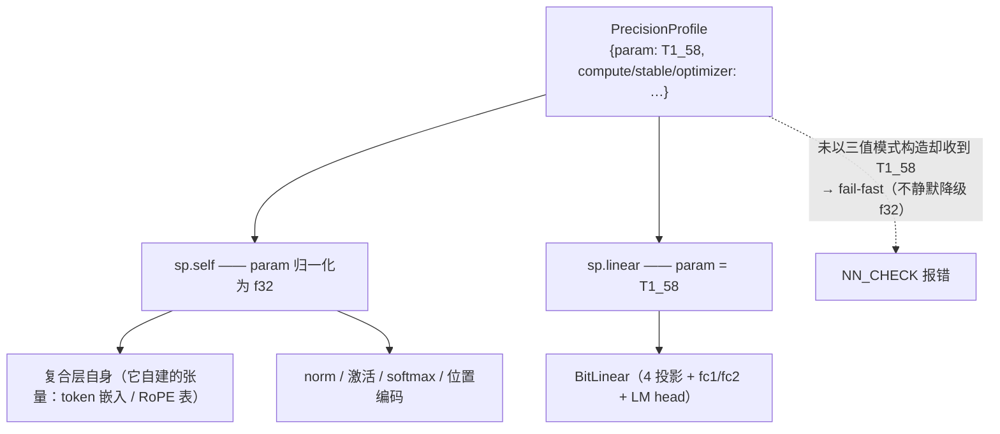
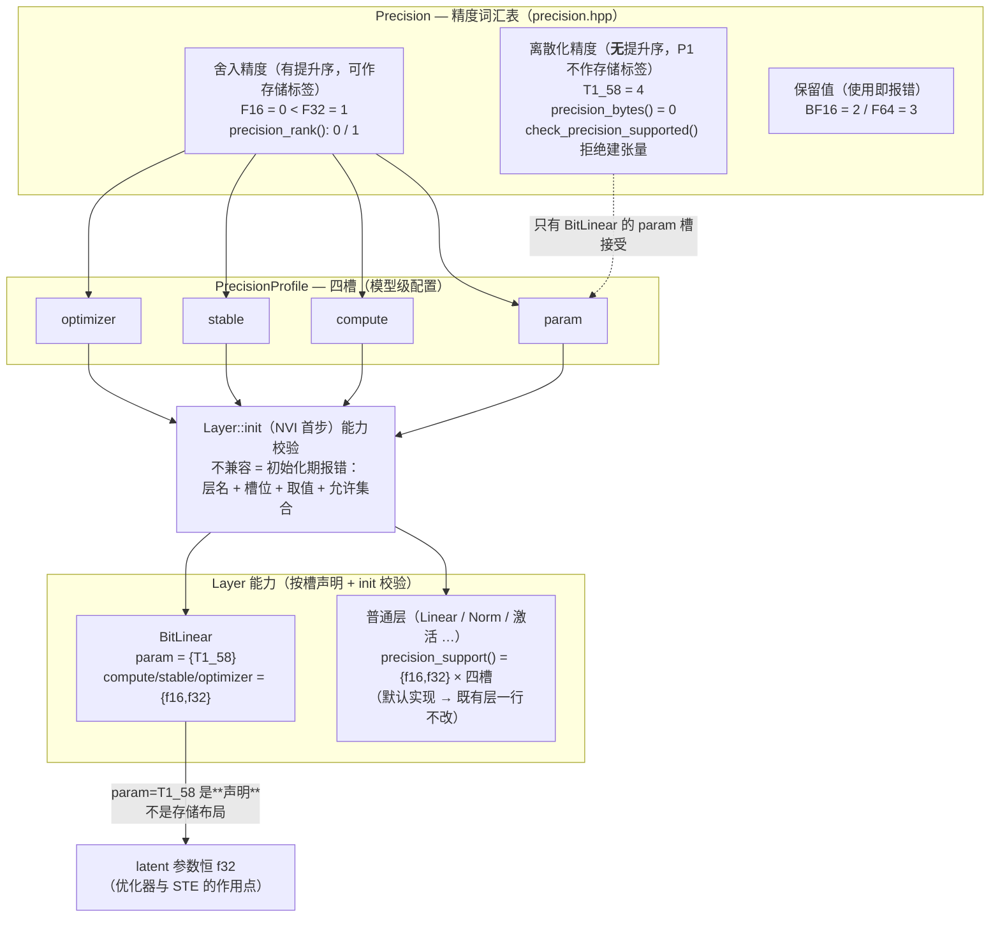
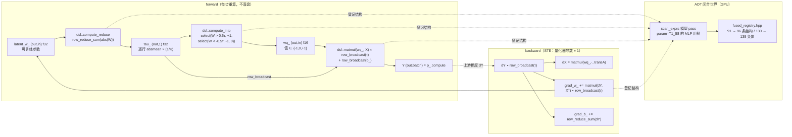
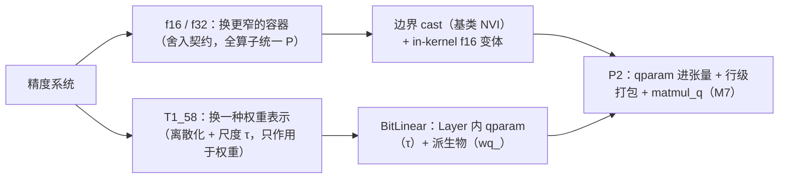

# 三值（1.58-bit）量化权重与 BitLinear 设计

> **状态**：**P1 已实施**（2026-10-09 起草；2026-10-10 裁定尺度 / 打包 / 命名；
> 2026-10-10 落地 P1 全部 5 步并提交，见 §9 提交清单与 §7 实施清单末列）。
> 本文现在同时是**实现依据**与**实现说明**：§4 是设计，§4.9 是"实现与设计的差异"，
> §5 是分期与验收（P1 ✅），§7 是文件级实施清单，§8 是架构图。
> D1–D6 全部裁定：D3 = (a)+(b)（§4.3.2）、D5 = ③（P1 只覆盖 MLP 路径，§4.8.3）、
> D6 属 P2（§6 待定项，实施前再定）。
> **落地分支**：`dev/t1_58`（P1 五个提交，未 push）。
> **关联**：`05-mixed-precision.md`（Precision 语义契约 §7.2）、
> `17-unified-tensor-engine.md` §5 M7（存储多态——本文给出它的第一个触发条件）、
> `18-roadmap.md` §1.1 立项三问 + §3.1 C2/C3（"可选但静默失效"缺陷类）、
> `20-custom-layer-ergonomics.md`（自定义层的四条接入契约）。
> **参考实现**：`~/codes/Lumina-Engine`（llama.cpp b10991 分支）的 `GGML_TYPE_TQ1_0`。
> 本文 §3 是该格式与内核的完整拆解；§4 记录**哪些照搬、哪些必须重选**。
> **前置证据**：`research/ternary_ste/REPORT.md`（CPU 端三值/二值 STE 训练实测；两者都能把
> 教师权重模式 100% 还原，说明 P1 的算法路径无障碍）；
> `research/ternary_scale/REPORT.md`（**D1 实测**：三个真实模型上 absmean vs absmax × 五种粒度的
> 零化率 / 重构误差 / 信息熵——absmax 只有 0.13~1.29 bit，absmean 命中 `log2 3 = 1.585 bit`）。

---

## 0. 裁决记录（2026-10-09 起草；2026-10-10 尺度 / 打包 / 命名裁定）

| # | 议题 | 裁决 |
|---|------|------|
| 1 | 三值是否进 `Precision` 枚举 | **进**。枚举是"精度词汇表"，三值应当在其中（`Precision::T1_58`；C++ 标识符不能以数字开头） |
| 2 | 其他模型能否选三值 | **能选**。效果差是使用者自己的事，不靠文档劝阻、不靠运行期拒绝 |
| 3 | 那如何避免"可选但静默失效" | **Layer 声明支持的精度集合**：不兼容组合 = **构建期报错**，而不是静默降级（这正是 18 §3.1 C2/C3 登记的两类缺陷） |
| 4 | `BitLinear` | 新增层，声明**只支持** `param=T1_58`；量化进 forward，STE 进 backward |
| 5 | 其余层 | 默认声明支持 `{f16, f32}`（= 现状），**一行代码都不用改** |
| 6 | 声明粒度 | **按槽**（param / compute / stable / optimizer）分别声明，不是扁平集合（§4.2，R1） |
| 7 | P1 是否做打包存储 | **不做**。P1 的量化缓冲用 f16（`{-1,0,1}` 在 f16 下精确可表示），只交付架构统一与功能正确 |
| 8 | P1 里 `T1_58` 能否建张量 | **不能**。`check_precision_supported(T1_58)` 在 P1 明确拒绝；此时它只是 **profile 声明**，不是存储标签 |
| 9 | 性能 | P2（打包存储 + 专用 GEMM）才有；P3 才是激活量化 |
| 10 | 本轮范围 | 只写本文 + `research/ternary_ste/`（前置证据）；不改库代码 |
| 11 | 实测机器 | D1 实测跑在 `ethan@192.168.1.102`（Windows + LLVM clang 23，比本机稳）；证据归档 `research/ternary_scale/` |
| 12 | **D1 统计量** | **absmean**（`τ = 组内 mean\|w\|`）。实测 absmax 把 64%–98% 的权重归零、信息熵掉到 0.13–1.29 bit/权重；absmean 命中 `log2 3 = 1.585` 上限 |
| 13 | **D1 粒度** | **per-row（输出通道）**。实测 absmean 下 `tensor/row/blk256/blk128/blk64` 的质量相差不到 2 个百分点 → **粒度按工程约束挑**；per-row 还避开了 `TQ1_0` 的"行宽必须整除 256"约束 |
| 14 | **D2 打包** | **照抄 `TQ1_0` 的编码与解码**（base-3 5-per-byte + `qh` 尾巴 + 定点 `(s·3^n·3)>>8`），**但块粒度 = 行、尺度 = absmean**；不采用它的 per-256 fp16 absmax 尺度 |
| 15 | **D4 命名** | 枚举 `Precision::T1_58`、`precision_name` = `"t1_58"`、CLI 词法 `t1_58`（**无别名**）、序列化 tag 4、层名保持 **`BitLinear`** |
| 16 | **D3 落地口径** | **(a)+(b)** 都做：补 `GPTModel`/`RAPTModel`（+ 两个 Block）的 `set_precision_profile` override，并让 `set_precision_profile` 在**已 init** 时 fail-fast（§4.3.2） |
| 17 | **D5 落地口径** | **③**：P1 只覆盖 MLP；`BitLinear` 在 GPT/RAPT 的接线留 P1.5（照 `make_norm_layer` 先例走 `make_linear_layer` + `unique_ptr<Layer>`） |
| 18 | **层能力的实现形态** | `PrecisionSet`（uint32 位掩码）+ `Layer::precision_support()` 默认 `{f16,f32}×四槽` + 校验落在 `Layer::init` NVI 首步（**既有层一行不改**） |
| 19 | **CLI 粒度（实现期细化）** | `--precision-param` 收 `t1_58`；`--precision-{compute,stable,optimizer}` **在参数解析处**就拒绝 `t1_58`（三值只描述权重；拖到 init 期才报是坏 UX）。帮助行同步：只有 param 行写 `<f16\|f32\|t1_58>` |
| 20 | **"非存储精度"硬化** | `create_tensor`/`from_matrix`/`dsl::compute`/`compute_reduce` 一律拒绝 BF16/F64/T1_58 作为**存储/输出**精度；Adam 的"更新量精度"在 param 槽非存储精度时回落到**目标张量自身**（否则 BitLinear 在 GPU 上 step 失败） |
| 21 | **CNN 的诚实提示** | CNN 构建器目前不接收精度 profile（roadmap P2）→ CLI 显式打印"本选项未生效"，不静默失效（三值消息在 CNN 下也不再误报"已启用"） |
| 22 | **精度预设 `--t1_58`（2026-10-10 追加）** | **加**。用户裁定："就是 `t1_58` 模式，其他默认 f16，模型参数 1.58"。`profile_t1_58()` = `{param=T1_58, compute=F16, stable=F32, optimizer=F32}`，实现上 = `profile_f16()` 改 `param`（另三槽同源派生）；CLI `--t1_58`、GUI 两训练页的"精度预设"下拉各一项。词法仍唯一 `t1_58`（预设是"整份 profile 的快捷方式"，不是 `--precision-param` 的别名） |

---

## 1. 一句话

三值权重在本项目分三条腿落地：

1. `Precision::T1_58` 进枚举 —— **词汇表**统一（"这个模型用什么精度"有了唯一说法）；
2. 每个 `Layer` 声明自己支持的精度槽位，框架在 `init` 时**构建期**拒绝不兼容组合；
3. `BitLinear` 把三值量化做进 `forward`、把 STE 做进 `backward`。

P1 只交付 1/2/3 的架构与正确性，**不交付性能**。性能在 P2。

**非目标**（本文明确不做）：三值作为 `compute` / `stable` 槽的取值；量化激活（P3）；
打包存储与专用内核（P2）；改动 f16/f32 的任何既有路径；CUDA（本项目无此后端）。

---

## 2. 现状缺口：为什么需要"Layer 声明支持精度"

### 2.1 `Precision` 现在的语义是一元的舍入契约

`05-mixed-precision.md` §7.2 的形式化定义：**P 精度算术 := 以 f32 参考精度计算 + 每个算子输出舍入到 P**；
matmul / 归约类额外规定累加精度 = `max(P, f32)` = f32。全精度系统（提升序 `max_precision`、
`precision_bytes`、`cast`、`expr_prec_sig_*` 的 1 bit/操作数 ABI）都建立在这条定义上。

三值不满足这条定义：量化到 `{-1,0,+1}` **需要一个尺度 γ**，而 γ 是整张张量的统计量，
`Precision` 枚举里没有地方承载它。所以"三值精度"必须同时引入**谁能声明它**的规则——
这就是 §4.2 的 `precision_support()`。

### 2.2 现状是"任何 profile × 任何模型"都能组合

今天的 `PrecisionProfile` 四个字段对全部模型、全部层一视同仁：CLI 的
`--precision-param/compute/stable/optimizer <f16|f32>` 在 `mnist_train` 与 `text_train` 各 4 个 flag、
`gui.py` 的 `PRECISION_OPTIONS` 与 5 个控件、以及 `bench/gui_cli_audit.py` 的审计基线里一致展开。
`Precision::` 在 **43 个文件里出现 788 次**。

于是"加一个枚举值"= 让**所有模型的所有槽位**都多出一个可选项。这个可选项当且仅当层真的实现了它才有意义,
否则就是 18 §3.1 登记的缺陷类（C2："用户可组合出必崩配置，且无任何启动期提示"；C3："静默回落到另一个实现，
无告警无日志"）。

### 2.3 结论

把"能不能选"交给**层自己声明**，由框架在 `init` 时校验。这样：

- 加枚举值不再等于"到处多一个坑"——它只对声明支持的层生效；
- 读到不兼容组合时是**构建期/初始化期报错**，带层名、槽位、取值；
- 默认声明 = `{f16, f32}`，既有层的语义与代码**零变化**。

---

## 3. 参考实现：Lumina-Engine 的三值权重设计

`Lumina-Engine` 是 llama.cpp 的一个分支，为 **Bonsai 系列 1-bit 模型（GGUF `Q1_0`）** 做纯 CPU 推理优化。
它的优化只覆盖 `Q1_0`（二值）；仓库内同时保留了 llama.cpp 上游的 **`TQ1_0`（三值）** 与 `TQ2_0`。
**`TQ1_0` 就是我们说的 1.58-bit 权重格式**，且是"格式 + 量化 + 反量化 + 点积内核"全套在树内的参考实现。

### 3.1 三种格式对照

| 类型 | 取值 | 块大小 | 块布局 | 位宽 | 尺度 |
|---|---|---|---|---|---|
| `Q1_0`（二值） | `{-1,+1}` | 128 | `fp16 d` + `u8 qs[16]`（符号位） | **1.125 bpw** | per-128 absmax |
| **`TQ1_0`（三值）** | `{-1,0,+1}` | 256 | `u8 qs[48]` + `u8 qh[4]` + `fp16 d` | **1.6875 bpw** | per-256 absmax |
| `TQ2_0`（三值） | `{-1,0,+1}` | 256 | `u8 qs[64]`（2 bit/元素）+ `fp16 d` | 2.0625 bpw | per-256 absmax |

Bonsai-8B 全权重 `Q1_0`：8.19B 参数 ≈ 1.15 GB（相对 FP16 缩小 14.2×），除 RMSNorm 外**每一个张量**都是
`Q1_0`——这是"1-bit 模型"的完整形态参考。

### 3.2 `TQ1_0` 的块布局与编解码（最值得抄的一段）

```c
// ggml-common.h：1.6875 bpw
typedef struct {
    uint8_t   qs[(QK_K - 4 * QK_K / 64) / 5];  // QK_K=256 → 48 字节，每字节 5 个三进制位（3^5 = 243 < 256）
    uint8_t   qh[QK_K / 64];                   // 4 字节，每字节 4 个三进制位
    ggml_half d;                               // fp16 尺度
} block_tq1_0;                                 // 54 字节 / 256 权重
```

**编码**（`quantize_row_tq1_0_ref`）：

```
trit xi = lroundf(v / d) + 1           // {-1,0,+1} → {0,1,2}
code c  = ((((xi0*3 + xi1)*3 + xi2)*3 + xi3)*3 + xi4)     // 5 位三进制，c ∈ [0,242]
存盘 s  = (c * 256 + 242) / 243                            // 定点"预乘"到 8 位空间
```

**解码**（`dequantize_row_tq1_0` / 内核内联）：

```
q  = s * pow3[n]        // pow3 = {1,3,9,27,81}；uint8 乘法按 256 回绕，这是刻意的
xi = (q * 3) >> 8       // 取出第 n 个 trit，无除法
值 = (xi - 1) * d
```

**为什么这么绕**：朴素做法是 `c / 3^n mod 3`（除法）或查表（访存）。预乘 `256/243` 之后，
`s·3^n·3>>8` 就是"除以 3 的幂并取整"的定点等价形式——**编码期一次性付出，解码期每个权重只剩乘法与移位**。
这就是三值格式在 CPU 上能跑得动的根本原因。

**布局**：`qs` 的字节 `m`（0..31）承载权重 `{m, m+32, m+64, m+96, m+128}` 的 5 个 trit；
解码按 n 外层、m 内层展开成连续的 32 个权重——正好匹配 AVX2 一次 32 字节 load 的节奏。
剩余 240..255 这 16 个权重走 `qh`（每字节 4 个 trit），尾巴单独处理。

**⚠ 块大小不可照搬**：ggml 的块类型要求**行宽整除块大小**（`quantize_row_tq1_0_ref` 里直接
`assert(k % QK_K == 0)`，`ggml_row_size` 也按整除算行步长）。我们的 K 常见为 **64 / 128 / 784 / 10**
（GPT d_model、MNIST 输入维等），都不是 256 的倍数——照搬 256 块要么把行补齐（K=10 时浪费 26×），
要么让块跨输出行（尺度语义变糊）。所以 D2 的结论是**照抄编码与解码、块粒度改行级**（见 §3.3）。

### 3.3 尺度规则：per-256 absmax 是为"事后量化"选的

`quantize_row_tq1_0_ref` 的尺度是块内 **绝对最大**：`d = amax; xi = lroundf(v/d) + 1`。
注意这不是 BitNet 论文的 per-tensor **absmean**——llama.cpp 的量化器面对的是**任意给定的 f32 权重**，
per-block absmax 才能让逐块相对误差可控。代价是：当块内只有一个离群值时，多数权重会被舍到 0
（`|v| < 0.5·amax` → trit 0）。

**实测裁定（2026-10-10，三模型；完整数据见 `research/ternary_scale/REPORT.md`）**：

| 模型 | absmean@row 零化% / 重构% / **信息熵** | absmax@row 零化% / 重构% / **信息熵** |
|---|---|---|
| GPT d128（3.18M 权重） | 32.7% / 50.4% / **1.585 bit** | 77.4% / 61.4% / 0.997 bit |
| MNIST ViT d64（198K） | 26.1% / 42.9% / **1.567 bit** | 67.0% / 66.3% / 1.244 bit |
| MNIST CNN（108K） | 27.6% / 45.8% / **1.574 bit** | 84.1% / 80.8% / 0.791 bit |

**看"信息熵"那一列**：absmean 让三值分布恰好携带 `1.567~1.585 bit/权重`（≈ `log2 3`，三值编码的
理论上限），而 absmax 只有 `0.13~1.29 bit`——**用 1.6875 bpw 的存储装不到 1 bit 的信息**。
原因是 absmax 的阈值 `0.5·max|w|` 被单个离群值支配，绝大多数权重被归零；absmean 的阈值
`0.5·mean|w|` 自适应地把权重摊到三个码位上（三项近等概率 ⇒ 熵取满）。

粒度则是**次要变量**：absmean 下 `row / blk64 / blk128 / blk256` 几乎同分（零化率与重构误差相差
不到 2 个百分点），`tensor` 只略差。**所以粒度按工程约束挑**——本项目取 **per-row**：
没有"行宽整除块大小"的约束（§3.2 的 256 块要求 K%256==0，而我们的 K 常见 64/128/784/10），
尺度就是每行一个 fp16（O(rows) 个字节），且与 §4.4 的 `row_reduce_sum` 形状天然对齐。

`TQ1_0` 选 absmax 有其语境：它是"事后量化别人训好的 f32 权重"，没有训练去适应量化误差，
逐块 absmax 至少保证**相对**误差有界。我们做 QAT / 从头训，权重会适应量化，此时该关心的是
"三值码位的信息容量"——absmean 完胜。

### 3.4 点积的整数化：`{0,1,2}` + 每 16 个激活修正一次

`ggml_vec_dot_tq1_0_q8_K`（激活侧是 `Q8_K`：256 个 int8 + fp32 尺度 + 每 16 个 int16 的和 `bsums`）：

```
sum(int32) = Σ_j xq_j · a_j          // xq ∈ {0,1,2}（不是 {-1,0,1}）
结果        = (sum - Σ_j a_j) · d_w · d_a
           = Σ_j (xq_j - 1) · a_j · d_w · d_a
```

关键在于**三值被存成 `{0,1,2}`**：这样才能用无符号 × 有符号的乘加（`maddubs` / `vpdpbusd`），
代价是每个块多减一次"激活和"。`Σ a_j` 不需要重新算——`Q8_K` 的 `bsums` 本来就按每 16 个激活记录，
**一次减法就修正 16 个权重**，成本可忽略。

这条设计与 §3.2 的编码互为因果：`{0,1,2}` 正是"三进制码位"的自然取值。

### 3.5 AVX2 内核的两个手法

1. **乘 3 的幂用字节加/移位树**：`3x = x+x`；`9x = (x<<3 & 0xF8) + x`；`3·9x`、`9·9x` 同理——
   每个 trit 的 `s·3^n` 都是 2~3 条字节指令，不是乘法。
2. **`3x/256` 用 `avg_epu8` 逼近**：`avg(a,b) = (a+b+1)>>1`，组合两次再加 `srli 6` 得到高 2 bit；
   前置 `subs_epu8(1)` 抵消 `avg` 的 +1 舍入。于是"乘 3 再取第 8 位以上"全程无乘除。

累加在 int16 → 末尾 `madd_epi16` 一次升到 int32 → `cvtepi32_ps` 后乘 `d_w·d_a`。

### 3.6 二值能查表、三值不能（Q1LUT 给我们的警告）

Lumina 的主力优化是 **二值激活侧查表（Q1LUT）**：4 个连续二值权重只有 16 种符号组合，
为 4 个激活预计算 16 项表 → 一次 `vpshufb` 出 4 个权重的部分点积，且利用二值对称性
`T[c ^ 0xf] = -T[c]` 只算一半表项。实测 tg 约 +30%（已到单通道带宽上限），pp2048 +57%。

wiki 里对三值的判断值得原文照录（§7）：**BitNet 的三值 `{-1,0,+1}` 无法用单条 `vpsignb` 表达**，
而按 BitNet TL 的思路"每权重一张 16 字节表"会变成 **16 字节/权重（约 128 倍膨胀）**，
在带宽受限的 CPU 上必输。所以：

- 三值**不能**照搬二值的查表法，也不能照搬 TL 的每权重查表；
- 三值的正道是 §3.2~§3.5 的**打包位域 + 整数乘加**，或（GPU 侧）解包成 int8 后走整数点积。

### 3.7 照搬 / 必须重选

| 项目 | 处置 | 理由 |
|---|---|---|
| 5-per-byte base-3 编码 + `(s·3^n·3)>>8` 解码 | **照搬（D2 已定）** | 无除法；字节回绕是编码的一部分，必须逐位复刻。块粒度改行级后位宽 ≈ `log2 3 + 16/K`（1.59~1.71 bpw） |
| `{0,1,2}` 存储 + `Σa` 修正 | **照搬** | 是无符号乘加能用三值的前提；修正粒度对齐已有的按块激活和 |
| 每 32 权重成组的字节布局 | **照搬** | 与 32 字节 SIMD load / GPU workgroup 节奏对齐 |
| per-256 absmax 尺度 | **重选：absmean + 行级**（D1/D2 已定，实测见 §3.3） | absmax 把 64~98% 权重归零、信息熵只有 0.13~1.29 bit；absmean 命中 `log2 3 = 1.585` |
| Q1LUT / VNNI / 14 个 CPU 变体 | **不适用** | x86 CPU 专用；本项目 CPU 侧可参考但收益有限，主战场在 Vulkan |
| 无损容器 `.gguf.lumina` / QLoRA 训练引擎 | **不适用** | 与本设计的权重量化正交（QLoRA 训练的是 LoRA 适配器，不动量化权重） |

---

## 4. 本项目设计

### 4.1 `Precision::T1_58` 与提升序（R4）

```cpp
enum class Precision : std::uint8_t {
    F16 = 0, F32 = 1, BF16 = 2, F64 = 3,
    T1_58 = 4,          // 三值 {-1,0,+1}（1.58 bit/权重）；P2 起才有打包存储
};
```

- `precision_name` 返回 `"t1_58"`；`precision_tag` / `precision_from_tag` 追加 `4 = t1_58`
  （0..3 已被 f32/f64/f16/bf16 占满）。
- **命名口径（D4 已定，要求全局统一）**：`T` 表示**类型**（三值），不是"量化"——类型前缀
  回答"是什么"（`F`=float、`BF`=bfloat、`T`=ternary），与现有 `F16/F32/BF16/F64` 同构。
  "量化"保留为**操作名**（`quantize`：f32 latent 投影到三值确实是量化，有尺度、有舍入）；
  两件事分开，不冲突。

  | 位置 | 定名 |
  |---|---|
  | 枚举 | `Precision::T1_58` |
  | `precision_name` | `"t1_58"` |
  | CLI 词法 | `t1_58`（**无别名**——不提供 `1_58`/`t158` 等变体） |
  | CLI 帮助 | `--precision-param <f16\|f32\|t1_58>`；其余三行 `<f16\|f32>`（实现期细化，见 §0 第 19 条）；另有精度预设 `--t1_58`（§0 第 22 条） |
  | 序列化 tag | `4` |
  | 层名 | **`BitLinear`**（保留 BitNet 专名，便于检索） |
  | 存储格式 | "T1_58 打包（编码参照 llama.cpp `TQ1_0`，尺度 = 行级 absmean）" |
  | 文档口径 | 三值（T1_58） |

  另注：`--precision-*` 接受 `t1_58` 之后，**普通模型选它会在 `init` 校验处报错**（§4.3），
  这是设计意图而非缺陷；CLI 不需要为它加模型白名单。
- **`max_precision` 必须显式处理**：它现在直接比较枚举值（`F16=0 < F32=1 < BF16=2 < F64=3`），
  加 `T1_58=4` 会变成"比 F64 还高"。做法二选一：① `max_precision` 对非"舍入精度"的值 fail-fast；
  ② 把序从枚举值里拆成独立的 `precision_rank()`。**推荐 ②**——枚举值从此只是标签，
  任何依赖"枚举值大小 = 精度高低"的代码都会被编译器/测试逼出来。
- `precision_bytes(T1_58)`：P1 返回 0（同 BF16/F64 的"非存储精度"口径）；P2 落地打包后，
  位宽由打包格式表达：行级 base-3（5 trit/字节 + 尾巴）= `log2 3 + 16/K` ≈ **1.59~1.71 bpw**
  （K 为行宽；K=128 → 1.71、K=784 → 1.61），**且必须另算对齐填充**——若为 vec4 快路径把每行
  pad 到 16 B，K=128 会从 26 字节涨到 32 字节 = **2.0 bpw，收益被填平**（§5 的 P2 待定项）。
  **不要**试图把位宽塞进"整数字节/元素"。
- `check_precision_supported(T1_58)`：**P1 拒绝**（清晰报错："t1_58 不是存储精度"）。
  这条保证 P1 里不会有任何代码无意间拿 `T1_58` 去建张量。P2 再按新的存储类型放宽。

### 4.2 `PrecisionSet` + `Layer::precision_support()`（R1）

声明**按槽**给出，而不是一个扁平集合——因为 `BitLinear` 需要的是
`param ∈ {T1_58}`、而 `compute/stable/optimizer ∈ {f16, f32}`。
扁平 `{T1_58}` 会让 `{param:T1_58, compute:T1_58}` 通过校验，然后**每个激活算子都被要求输出三值**。

```cpp
// L0：位掩码，无分配、可平凡拷贝、留足未来扩展（uint32 支持 32 种精度）
struct PrecisionSet {
    std::uint32_t mask = 0;
    constexpr bool has(Precision p) const noexcept {
        return (mask & (1u << static_cast<std::uint32_t>(p))) != 0;
    }
    static constexpr PrecisionSet of(std::initializer_list<Precision>);
};

// L2 基类：默认 = 现状（f16/f32 全槽），故既有层零改动
struct PrecisionSupport {
    PrecisionSet param, compute, stable, optimizer;
};
[[nodiscard]] virtual PrecisionSupport precision_support() const;
[[nodiscard]] virtual const char* layer_name() const noexcept { return "Layer"; }
```

- 默认实现返回 `{f16,f32}` × 4 槽 → **所有既有层一行不改**（这是"不影响其他层"的落实方式）。
- `BitLinear` override 为 `param={T1_58}`、其余三槽 `{f16,f32}`。
- 错误信息要能定位：**层名 + 槽位 + 取值 + 该槽允许的集合**。
  `layer_name()` 是新增的小设施（现在 `Layer` 没有任何名称设施，诊断只能靠 file:line）。

### 4.3 校验点与语义（R3）

- **校验点** = `Layer::init(engine)` 这个 NVI（`compute_layer_base.hpp`）。
  它是唯一咽喉：`Model::add<T>()` 先注入 profile 再 `init`；工厂路径
  （`build_gpt_model` 把 `cfg.precision` 传进 `GPTModel` 构造器）也在 `init` 前完成注入；
  复合层的 `init_impl` 会逐个 `init` 子层 → **叶子层各自校验即可，不需要任何聚合逻辑**。

#### 4.3.1 现状：三条 profile 注入路径，只有一条能到 GPT/RAPT 的子层（D3）

| 路径 | 语义 | 能否到 GPT/RAPT 子层 |
|---|---|---|
| ① 工厂构造器：`build_gpt_model(..., cfg.precision)` / `build_mnist_model_from_spec(engine, spec, precision)` | 复合层在**构造器**里对自身 + 子层逐个 `set_precision_profile`（`compute_layer_gpt.hpp:54-58/282-313`、`compute_layer_rapt.hpp:849-853/1050-1066`） | **✅** |
| ② `Model::set_default_precision_profile(p)` | 只在**之后 `add()` 的层**上注入（文档要求"须在 add 之前调用"） | 取决于被 add 的层 |
| ③ `Model::set_precision_profile(p)` | 只遍历**顶层** `layers_`（`model_container.hpp:125-129`） | **❌** 对 GPT/RAPT 只打到复合层自己 |

override 了 `set_precision_profile` 的只有 `MultiHeadAttention`（`compute_layer_attention.hpp:483`）、
`FeedForward`（`compute_layer_feedforward.hpp:74`）、`TransformerEncoderLayer/Encoder/Classifier`
（`compute_layer_transformer.hpp:145/309/494`）；**`GPTModel` / `GPTBlock` / `RAPTModel` 没有 override**，
它们只在构造器里向下传。两个 CLI 的实际用法：`text_train` 只走路径 ①；`mnist_train` 额外调了一次
路径 ③（`src/mnist_train.cpp:678`，对 MLP 是冗余——`build_mnist_mlp_model` 已用路径 ② 在 add 前注入）。

**结论**：校验放 `init` 的前提是"profile 在 `init` 前定稿"，这条前提**今天只在路径 ① 成立**；
路径 ③ 上 GPT 的子层拿不到新 profile，校验会被绕过。

#### 4.3.2 建议（待批）

**（a）+（b）组合，两条都做**：

- **（a）补 override**：给 `GPTModel` / `RAPTModel` 补 `set_precision_profile` override（照
  `TransformerEncoder` 的写法，逐子层下传），让树内两条复合路径语义一致。顺带删掉
  `src/mnist_train.cpp:678` 的冗余调用。
- **（b）把契约写死**：`set_precision_profile` 在 `engine_ != nullptr`（已 init）时 **fail-fast**——
  "profile 在 init 后不可变"。这样"profile 何时有效"从"三条约定的交集"变成一个可判定的规则，
  校验不再可能被旁路。

被否决的（c）：校验放 `init` + 让每个复合层聚合子层的 capability 声明。它把 `precision_support()`
从"每层的静态声明"变成"递归求交"，复杂度上一个量级，而收益只是省掉（a）的几行 override。
- **语义（关键）**：`param = T1_58` 表示"**该层 forward 的有效权重精度是三值**"，
  **不是**"参数张量的存储布局是三值"。因此：
  - `BitLinear` 的 `parameters()` 仍返回 **f32 latent**（优化器与 STE 的作用点）；
    `create_tensor` 永远不用 `p_.param` 当实参（P1 里 `p_.param=T1_58` 只是一句声明）；
  - 若不这样定义，就会掉进死角：优化器要 `step()` 一个三值张量，而没有 f32 latent 就没有 STE。

### 4.4 `BitLinear`（P1 形态）

```cpp
class BitLinear final : public Layer {
    // latent_w_ : f32 参数（优化器更新对象；STE 梯度落点）→ parameters()
    // wq_       : 量化缓冲，f16 存储、值 ∈ {-1,0,1}（f16 精确可表示）——不落盘，每步重算
    // tau_      : (out,1) f32，逐行 absmean —— 由 DSL 归约算出，不回读宿主（铁律 #12）
};
```

**forward**（两处 `dsl::compute`，AOT 锚点自动登记；库内还需在 `tools/scan_exprs.cpp`
的 per-layer dry-run 里补一个 `BitLinear`，理由见 `AGENTS.md` §7——dry-run 是结构的主要来源）：

```
tau  = row_reduce_sum(|latent_w_|) * (1/in_features)                       // (out,1)
wq   = select(w > 0.5·tau, +1, select(w < -0.5·tau, -1, 0))                // 逐元素
Y    = matmul(wq, X) * row_broadcast(tau) + row_broadcast(b)
```

（`select` 链就是 BitNet 的 `RoundClip(w/τ, -1, 1)`：DSL 没有 `round`/`floor`，
但在 `[-1,1]` 区间内它与阈值 `0.5` 的 select 等价。激活量化才需要新增 `round`/`floor` 算子，见 P3。）

**backward**（STE = 把 `wq` 当常数求导；与现有 `Linear::backward` 同形，只是权重换成 `wq`）：

```
dX     = matmul(wq_scaled, dY, transA=true)        // wq_scaled = wq 逐行乘 τ（与 forward 复用）
dW_lat = matmul(dY, X^T) * row_broadcast(tau)      // 恒等 STE × 去量化尺度
db     = row_reduce_sum(dY)
```

（`τ` 是逐输出通道的，所以它会分别落到 `dX` 的左乘侧与 `dW` 的右乘侧——不能只在一处补。）

**可行性的前置证据**：`research/ternary_ste/REPORT.md` 的两个 PoC 用**现有公开 API**
（`dsl::compute` + `select` + `rparam` + `matmul` + `compute_into`，零库改动）在 CPU 上跑通了三值与二值
STE 训练：三值 MSE 14.207 → 0.000000、教师模式（含零）**1370/1370 全对**；
二值 MSE 20.949 → 0.000000、**2048/2048 全对**。

### 4.5 γ 的归宿（R2）与存储演进

`(rows, cols, T1_58)` **不足以描述一个张量**——还需要尺度（同一个三值矩阵配 γ=0.5 与配 γ=2.0
是两个不同的映射）。因此"三值作为存储精度"必然要求张量带上 qparam，这正是
`17-unified-tensor-engine.md` §5 **M7 存储多态**的第一个真实触发条件（原文裁定是"第三后端出现前不立项"，
现在触发条件是**出现了需要非均匀布局的存储**，应当据此更新 18 号路线图）。

分期因此是干净的：**P1 不需要 M7**（量化缓冲是 f16，qparam 就是那张 `(out,1)` 的 τ），
**P2 才需要**（打包字节 + 逐行尺度 + `matmul_q` 原语）。

### 4.6 约束：`T1_58` 张量只进量化 GEMM

规定 **`T1_58` 存储张量只能进入量化 GEMM 原语**（`matmul_q` 及其转置），
其余一切算子入口遇到它走既有的 `unsupported precision` 错误路径。效果：

`P == Precision::F32` / `P == Precision::F16` 的**二分支不需要逐个改成三分支**——
它们本来就以 `NN_FAIL` 收尾；加上 §4.3 的构建期校验，用户永远看不到那条运行期错误。
这把"788 处分支"的爆炸半径压回到"一个原语 + 一处校验"。

### 4.7 序列化

- `save_model` 写的是 `model.parameters()` 的扁平序列 + `extra_state()`；`BitLinear` 的
  latent 是 f32，**三值缓冲是派生物，不落盘**（加载后重算），τ 同理。
- 但**加载时必须重建出 `BitLinear` 而不是 `Linear`**，所以 `ModelSpec` 需要记住"这个模型用了量化层"：
  追加 `weight_quant`（`None` / `T1_58`）字段，**缺键 = `None` → 旧文件零破坏**
  （与 `norm_place` 的缺键处理同款）。参数条数/顺序不变的模型不需要升 `MODEL_VERSION`，
  纯追加字段按现有惯例判定（见 `19-unified-dataset.md` 的模型版本分派）。

### 4.8 `BitLinear` 的接入位置（D5，建议待批）

#### 4.8.1 现状：GPT/RAPT 不是用 `model.add<Linear>()` 拼的

MLP 路径（`build_mnist_mlp_model`）确实是 `model.add<Linear>(...)` 一条条拼的 → 换成 `BitLinear`
等于换一个模板实参，**零结构改动**。但 GPT/RAPT 的内部是**硬编码的 `Linear` 成员**：

| 复合层 | 持有的线性层 | 位置 |
|---|---|---|
| `CausalSelfAttention` | `Linear w_q_ / w_k_ / w_v_ / w_o_` | `compute_layer_attention.hpp:409-412` |
| `FeedForward` | `Linear fc1_ / fc2_` | `compute_layer_feedforward.hpp:24-25` |
| `GPTModel` | `Linear lm_head_` | `compute_layer_gpt.hpp:248` |
| `RAPTModel` | 同上（`attn_` / `ff_` / `lm_head_`） | `compute_layer_rapt.hpp` |

所以"1.58-bit GPT"必须先决定这三条里的成员怎么办。

#### 4.8.2 三条路

| 方案 | 内容 | 代价 |
|---|---|---|
| ① 模板化 | 把 `CausalSelfAttention<LinearT>` / `FeedForward<LinearT>` 参数化 | 改动最大：4 个层头 + 所有实例化点；但最彻底 |
| ② 工厂 + 基类指针 | `std::unique_ptr<Layer> fc1_ = make_linear_layer(kind, ...)`，运行期选 `Linear` / `BitLinear` | 中等；改成员类型与初始化路径 |
| ③ P1 只覆盖 MLP | P1 交付 `model.add<BitLinear>` 可用 + 能力校验 + 训练闭环；GPT/RAPT 留 P1.5 | 最小；P1 不含 GPT 端到端 |

#### 4.8.3 建议（待批）

- **P1 走 ③**：P1 的目标是"架构统一 + 功能正确"（§1），把 GPT/RAPT 的接线拖进 P1 会让
  "契约先行"变成"契约 + 大重构"。`research/ternary_ste/REPORT.md` 已在单层层面证明算法路径可行，
  端到端 GPT 的三值训练属于 P1.5。
- **P1.5 走 ②，并照抄仓库自己的先例**：归一化层已经是这个模式——`make_norm_layer(NormType)`
  返回 `unique_ptr<Layer>`，`GPTBlock` 持有 `std::unique_ptr<Layer> norm1_/norm2_`
  （`compute_layer_gpt.hpp:56-58` 的 `if (norm1_) norm1_->set_precision_profile(...)` 就是证据）。
  照此引入 `make_linear_layer(...)`，把 4 处 `Linear` 成员换成 `unique_ptr<Layer>`，
  即可让 `ModelSpec` 的一个开关同时切换 GPT/RAPT 的线性层类型。
- **不建议 ①**：模板化会把"层类型是编译期决定"这件事扩散到 attention/feedforward/GPT/RAPT
  四个头与全部实例化点，收益只是省掉一次虚调用——与 `docs/development/20-custom-layer-ergonomics.md`
  里"层接入四条契约"的方向相反。

---

### 4.9 实现与设计的差异（P1 落地记录，2026-10-10）

设计定稿后实施时，有 5 处**细化**（不改设计意图，只把口径写死；§0 表 16–21 条是同一批裁定）：

1. **CLI 粒度**：设计写的是 `--precision-* <f16|f32|t1_58>`（四行都列 t1_58）。实现改为
   **只有 `--precision-param` 列 t1_58**，其余三行保持 `<f16|f32>`，且
   `--precision-{compute,stable,optimizer} t1_58` 在**参数解析处**就报错
   （`三值权重只适用于 --precision-param`）而不是拖到 init 期能力校验。理由：三值描述的是
   **权重**，把它列进 compute/stable/optimizer 的帮助行等于鼓励一个必然失败的组合；
   词法本身仍是**唯一词法 `t1_58`（无别名）**。**（2026-10-10 追加）**"想一次性开三值 +
   f16 存储"的需求由**精度预设 `--t1_58` = `profile_t1_58()`** 承接（§0 第 22 条），
   而不是把 `t1_58` 塞进 compute 帮助行 —— 预设是"整份 profile 的快捷方式"，与"哪个槽
   可以取三值"是两件事。
2. **`scan_exprs` 的登记位置**：设计写"per-layer dry-run 补一个 `BitLinear`"；实现落在
   **模型 pass**（新增一条 `param=T1_58` 的 MLP 用例）。理由：`BitLinear` 的真实使用路径是
   MLP 工厂（`param=T1_58` → `BitLinear`），模型 pass 能一次覆盖 forward/backward/量化三段结构，
   且与既有的"按运行期配置枚举变体"分工一致。实测 **91 → 96 条结构**、精度变体 130 → 135。
3. **非存储精度硬化扩到引擎与 DSL**：设计只规定 `check_precision_supported(T1_58)` 拒绝。
   实现额外在 `ComputeEngine::create_tensor`/`from_matrix`、`dsl::compute`/`compute_reduce`
   入口拒绝"非存储精度"，并修掉 Adam 用 `p_.param` 建更新量张量的隐患
   （BitLinear 下 param 槽是 T1_58 → GPU 硬报错、CPU 静默按 f32 走 = 两端不一致；
   由 `t1_58_test --gpu` 抓到）。**这是本设计"保证没人拿 T1_58 建张量"的完整落实**。
4. **`Model::add_layer(unique_ptr, profile)` 重载**：三值 MLP 里 `BitLinear` 要 `param=T1_58`，
   而 norm/激活层的 param 槽无意义（拿 T1_58 会被能力校验误报）→ 工厂给两类层注入不同 profile。
   为此新增一个显式注入的重载（原 `add_layer` 语义与调用点零变化）。
5. **CNN 的诚实提示**：CNN 构建器目前根本不接收精度 profile（roadmap P2「RAPT/CNN f16」），
   所以 `--arch cnn --precision-param t1_58` 是**静默无效**。实现选择显式打印
   "本选项未生效（run at f32）"而不是改成硬报错（后者会改既有 f16+CNN 的行为）。

**验证证据（本机 clang 24 / Vulkan(glslc) / `-Werror`，`build_t`）**：

| 项 | 结果 |
|---|---|
| `t1_58_test`（CPU） | ALL PASSED：τ/wq 逐位、STE 三项梯度、f16 混合精度、规格往返、端到端 loss 0.981→0.025 |
| `t1_58_test --gpu`（llvmpipe） | ALL PASSED，且 loss 轨迹与 CPU **逐位相同** ⇒ 5 条新结构确实命中 AOT 融合注册表 |
| `ctest` | 28 项（库内口径）；本机唯一不稳定项是**软件 Vulkan 的 teardown 段错**（`fused_gpu_test`），基线 worktree 实测同样复现，与本文无关 |
| CLI 端到端 | `--precision-param t1_58 --arch mlp`：训练跑通（2000 样本 / 1 epoch → test_acc 77.98%）；`--resume` 正确还原 BitLinear；`--arch transformer + t1_58` 明确报错"层 PatchEmbedding 不支持 param=t1_58" |
| `gui_cli_audit.py` | PASS（可行动问题 0）；GUI 只在 param 下拉加入 `t1_58` |

### 4.10 P1.5 落地记录（GPT 的线性层接线，2026-10-10）

§4.8.3 的 P1.5 已按方案 ② 落地（三步：W1 工厂 + 注意力/FFN、W2 GPT/规格/CLI/扫描、W3 验收）。
P1 只覆盖 MLP 的那条界线（`--arch mlp`）从此消失：**三值 GPT 与新结构三项正交组合**。

**接线点**（`Linear` 成员 → `std::unique_ptr<Layer>` + `make_linear_layer`）：

| 持有者 | 成员 | 备注 |
|---|---|---|
| `AttentionBase`（`MultiHeadAttention` / `CausalSelfAttention` 继承） | `w_q_ / w_k_ / w_v_ / w_o_` | GQA 只收窄 K/V 的**输出**宽度，与三值正交 |
| `FeedForward` | `fc1_ / fc2_` | `fc1_` 宽度随 GeLU/SwiGLU/ReLU² 变化，与三值正交 |
| `GPTModel` | `lm_head_` | `tie_embeddings=true` 时不 init、不进 `parameters()`（head 就是嵌入） |

**开关的唯一判据**：`effective_weight_quant(precision, weight_quant)`
—— `precision.param == T1_58` **等价于** `weight_quant = T1_58`。三条注入路径（库 API 的
`PrecisionProfile`、CLI 的 `--precision-param t1_58`、`ModelSpec.weight_quant`）因此收敛到
同一个判据，不存在"声明了三值却构造出普通 Linear"的组合。构造期定型（不是运行期分支）：
`weight_quant` 是尾参默认 `None` → **既有 f16/f32 路径的成员构造、参数顺序、求值结构逐位不变**。

**profile 分流（`TernaryProfileSplit` + `split_ternary_profile`）**：`param = T1_58` 只对
**线性子层（BitLinear）**有意义，因此持有线性子层的复合层把一次 profile 拆两份：



非三值入参（`param != T1_58`）时 `self == linear == 入参`（恒等）→ 既有路径零变化。
**这条规则同时修掉一个真实缺陷**：GPTModel 构造器原本把 `precision` 原样再注入
`ln_f_` 与**位置编码表**，三值模式下会让 RMSNorm/Learned 编码表拿 T1_58 去建张量
（"不是存储精度"）——由构建期扫描用例当场抓到（见下）。

**CLI / 规格 / 扫描**：

- `build_gpt_model_from_spec` 补 `weight_quant → precision.param` 映射（规格是加载时的权威，
  与 `build_mnist_model_from_spec` 同款）；`text_train` 保存规格时写 `spec.weight_quant`
  并打印三值启用行。`--arch rapt --precision-param t1_58` **前置拒绝**（见下"仍未接线"）。
- **精度预设 `--t1_58`**（2026-10-10 追加，§0 第 22 条）：`text_train` / `mnist_train` 各加
  一行 preset 解析（`cfg.precision = profile_t1_58()`），GUI 两训练页的"精度预设"下拉加
  `"t1_58 (BitLinear + f16 存储)"`、控制器发出 `--t1_58`。三条命令因此等价：
  `--t1_58` == `--f16 --precision-param t1_58` == `--precision-param t1_58 --precision-compute f16`；
  范围与前置拒绝**完全复用**既有规则（无需新白名单：GPT 全接线，`--model rapt` 前置拒绝，
  `--arch transformer/cnn` 由层能力校验报错）。`--t1_58` 与 `--precision-*` 是同一份 profile
  的两种写法，按参数出现顺序后者覆盖前者（与 `--f16` 同款语义）。
  **等价性实测（102/40HX，2026-10-10）**：三种写法各跑
  `text_train datasets/tinystories_bench40.nndataset --gpu … --lr 0 --max-steps 5 --save …`
  → 产物 SHA256 **逐字节相同**（`5CF7F0E9…CF6B9`，同一条命令重复跑亦相同）。
  为什么用 `--lr 0`：更新量恒 0 ⇒ 产物 = 确定性初值（`InitSpec.seed` 默认 42 + 创建序号混流，
  跨进程同序），从而把"profile 等价"与"训练噪声"分离 —— **注意** `text_train` 每个 epoch 用
  `std::random_device` 播种 shuffle 样本顺序（`src/text_train.cpp:1010/1053`），两次真实训练
  的权重并不可复现，用产物哈希判等价会得出假阴性。
- `scan_exprs` 模型 pass 增加两条三值 GPT（`gpt_learned_gelu_ln_t1_58`、
  `gpt_rope_relu2_rms_gqa_subln_tied_t1_58`）。**结构数不变（107 → 107）**：BitLinear 的三段
  结构（τ 的 absmean 归约 / wq 的阈值 select / 去量化点积与 STE 累加）已由 MLP 用例登记。
  保留它们的价值是**构建期 smoke test**：模型 pass 会真的把三值 GPT 构造 + 跑一遍 fwd/bwd，
  上面那个 `ln_f_`/位置编码表的缺陷就是这里报出来的（`LearnedPositionEncoder: 初始化失败`
  + `层 RMSNorm 不支持 param=t1_58`）。

**验收（102 实测：Windows + LLVM clang 23 + 真实 GPU NVIDIA CMP 40HX）**：

| 项 | 结果 |
|---|---|
| 构建 | 零告警（`-Werror`）；`[scan] 收集到 107 条融合表达式`（与 P2 持平，可解释） |
| `ctest`（W2 状态） | **30/30 全绿** |
| `bitnet_struct_test` [14] | 三值 GPT 参数张量 36 张 / 21376 标量，与 f32 基线**逐张量形状相同**；一步真实 sparse-CE 反向后 **36/36** 参数张量梯度非零（max\|g\|=3.81） |
| `bitnet_struct_test` [15]（CPU） | 2B4T 形状（RoPE+ReLU²+RMSNorm+**SubLN+GQA+tied**+三值）200 步 CE+AdamW：三值+tied **3.469 → 0.018**、三值+BitLinear head **3.582 → 0.0064**、f32 基线 3.893 → 0.0045（随机基线 ln 32 = 3.466） |
| `bitnet_struct_test_gpu` [15] | 同一配置在真实 GPU 上跑通，CPU/GPU 末步 loss 差 < 1e-3（断言） |
| **真实数据 + 真实 GPU**（CLI，`--model gpt --precision-param t1_58`） | TinyStories 40MB（`.nndataset`，vocab 8192）/ d256·h8·L4·ff688 / seq 256 / batch 8 / AdamW 3e-3 / RoPE + ReLU² + RMSNorm（CLI 可表达的 2B4T 子集）：三值 **6.069 → 4.164**（150 步，17.3 s，NVIDIA CMP 40HX）；同配置 f32 基线 **5.815 → 4.327**（14.9 s）。两条曲线同量级下降 —— 这是"真实语料 + 真实 GPU 能训"的证据，**不是**精度结论（同一量级、未做超参扫描）；步时 +16% 来自每步重算 τ/wq，P2 的打包 GEMM 才是针对它的优化 |
| **精度预设 `--t1_58`**（本机 clang + Vulkan GPU NVIDIA GTX 850M） | `precision_test` / `t1_58_test`（含 `--gpu`）全绿；新增用例 [9] 钉死预设四字段、"普通 Linear + 预设必须报错（不静默降级 f32）"、"预设构建的 MLP 线性层**全为 BitLinear**"、CPU/GPU 各 60 步 loss 下降到一半以下（CPU 0.654366→0.166908、GPU 0.654366→0.176052）；CLI `text_train datasets/tinystories_200mb.nndataset --gpu --t1_58`（d128·h4·L2·ff344·seq128·batch4、20 步）跑通并打印 `精度配置: param=t1_58 compute=f16 stable=f32 optimizer=f32` |

**仍未接线（诚实边界）**：

1. **RAPT**：`ReLULinearAttention` 自持 4 个 `Linear` 且当前**不转发**精度 profile
   （roadmap P2「RAPT/CNN f16」同源）——接三值必须同时补 profile 下传，会改变既有 f16 RAPT 的
   数值行为，属独立一步。CLI 侧对 `--arch rapt --precision-param t1_58` **前置拒绝**。
2. **ViT / MNIST Transformer**：`TransformerEncoderLayer` 的 `MultiHeadAttention`/`FeedForward`
   已经能承载 BitLinear（同一个工厂），但补丁式/池化侧的张量仍拿 `p_.param` 建表 →
   现在会以"层 PatchEmbedding 不支持 param=t1_58"报错（诚实失败，不静默跑 f32）。
3. **P2 性能**（行级打包 + `matmul_q`）与 **HF 权重转换器**：与本文 P2 同期，未动。

### 4.11 P1 实测：**不省显存**（反而略增）与步时（2026-10-10，102 / 40HX）

**结论先行**：三值在 P1 **没有任何显存收益**，且在 `--f16` 这个它派生自的配方上**略微增加**
峰值显存。这不是实现缺陷，而是 P1 的形态决定的（§0 裁决 7：P1 不做打包存储）：`param=T1_58` 只改
**forward 的有效权重**，存储仍是"稠密 latent + 稠密量化缓冲"。

逐元素构成（每权重元素字节）：

| 配方 | latent/权重 | 梯度 | 量化缓冲 `wq_` | 合计 |
|---|---|---|---|---|
| `--f32`（Linear） | f32 4 | f32 4 | — | **8** |
| `--f16`（Linear） | f16 2 | f16 2 | — | **4** |
| `--t1_58`（BitLinear） | **恒 f32** 4 | **恒 f32** 4 | f16 2 | **10** |

`latent`/`grad` 被硬钉在 f32 是**训练正确性**要求（STE 落点 + 优化器状态；`05-mixed-precision.md`
实测 stable/optimizer 取 f16 会 NaN/下溢），所以三值层比同配方的 f16 普通层**多 2.5 倍**参数显存；
另外每步重算 τ/wq 还多出三份逐元素中转张量（`|W|`、`lo/hi`、`select` 输出）与 3 次 kernel 启动。

**实测（`bench/run_with_vram.ps1`：nvidia-smi 200 ms 采样整卡峰值；同机顺序、每档 60 步、同一份 40MB `.nndataset`）**：

| 模型 | `--f32` | `--f16` | `--t1_58` | t1_58 vs f16 |
|---|---|---|---|---|
| 小（d64·h4·L4·ff256·seq128·b64） | 1164 MiB | **908 MiB** | 1202 MiB | **+32%** |
| 中（d512·h8·L8·ff2048·seq256·b8） | 2858 MiB | **1882 MiB** | 2254 MiB | **+20%** |

小模型一档 `t1_58` 甚至高于 `f32`（参数太小、中转张量与池底材粒度占比更大）。
步时（同机 150 步 wall-clock：f32 75.9 s / f16 80.6 s / t1_58 81.4 s，含一次性数据集装载，
故只看差值）：`f16 → t1_58` 差 **+1%**，与真实语料 150 步旧实测的 **+16% vs f32**（§4.10 表）
同一数量级 —— 来源是"每步重算 τ/wq 的三次额外 pass + 权重带宽"，不是打包还没做这个变量。

**那省显存在哪？** 两条路，各自的量级完全不同：

1. **训练期**（P2 打包）：打包只压缩 `wq_` 那一项（2 B → 行级 base-3 ≈ 1.7 bpw），总账
   **10 → ~8.3 B/元素（−17%）**；想再往下必须动 latent/优化器（f16 master、8-bit Adam），
   与三值本身无关。**所以"训练更省显存"不是三值的卖点**——`docs/development/22` 的 2B4T 目标里
   显存收益来自 GQA（K/V 头收窄）+ tied embedding（省一份 head），不是 BitLinear。
2. **推理/部署期**（P2 之后 + 去掉 latent/grad/optimizer）：1.7 bpw vs f16 的 16 bpw ≈ **9.4×**，
   这才是 1.58-bit 的名义收益；本项目当前没有单独的推理权重格式（`load_model` 仍读 latent）。

⚠ 因此**不要把"省显存"写成 P1/P1.5 的能力**：`--t1_58` 在本仓的实测口径是"**质量/语义对齐
BitNet，训练能吃下三值权重**"，省显存与加速留给 P2/P3、以及推理侧。

---

## 5. 分期与验收

| 阶段 | 内容 | 落点 | 验收 |
|---|---|---|---|
| **P1 ✅（2026-10-10 落地）** 架构统一 + 功能正确<br>（**范围 = MLP 路径**，D5 建议③） | `Precision::T1_58`（含 R4 的序处理、tag 4、`check_precision_supported` 拒绝）；`PrecisionSet` + `Layer::precision_support()` + `init` 校验 + `layer_name()`；`BitLinear`（量化 forward + STE backward）；D3 的 (a)+(b)（§4.3.2）；`scan_exprs` 补 dry-run；spec 的 `weight_quant` 字段；2 个 CLI × 4 flag 的词法 + GUI + `gui_cli_audit` | `precision.hpp` / `compute_layer_base.hpp` / 新 `compute_layer_bitlinear.hpp` / `tools/scan_exprs.cpp` / `model_spec.hpp` / `src/*` / `gui.py` | ① 不兼容组合**初始化期报错**（含 `param=T1_58` + 普通 `Linear` 的反例用例）✅；② latent 权重的 STE 梯度 = 解析式（量化器不可微 → 不做数值 gradcheck，改与宿主参考逐项对拍）✅；③ CPU/GPU 各一个端到端小训练收敛（loss 0.981→0.025，两端逐位相同）✅；④ 既有 ctest 全绿（本机唯一不稳定 = 软件 Vulkan teardown）、L2 审计 0 ✅。**逐文件清单见 §7；逐条差异见 §4.9** |
| **P2** 真性能 | Tensor qparam（M7）+ **行级打包**（`TQ1_0` 编码：base-3 5-per-byte + `qh` 尾巴 + 定点解码；尺度 = 行级 absmean，**无 per-256 尺度**；行步长/对齐待定）+ `matmul_q` / `matmul_q_t`（CPU 微内核 + Vulkan shader）+ `layer_bench` A/B + 序列化打包 | `compute_tensor.hpp` / `compute_engine.hpp` / `compute_cpu_engine.hpp` / `compute_gpu_engine.hpp` / 新 `.comp` | ① `layer_bench --op matmul` 配对 A/B 报告（含"当前 matmul 是带宽受限还是延迟受限"的判定）；② 打包往返逐字节；③ 数值与 P1 的 f16 缓冲路径一致（同 latent 权重下逐位）；④ 与 llama.cpp `TQ1_0` 的反量化对拍（**只对编码/解码**——尺度规则不同，块内容不互通） |
| **P1.5 ✅（2026-10-10 落地）** GPT 接入<br>（**范围 = GPT**，RAPT/ViT 见 §4.10 边界） | `make_linear_layer` + `unique_ptr<Layer>` 替换 GPT 侧全部 `Linear` 成员：`AttentionBase` 4 投影、`FeedForward` fc1/fc2、`GPTModel` LM head；`TernaryProfileSplit` 分流规则；`effective_weight_quant` 唯一判据；规格/CLI/扫描同步 | `compute_layer_base.hpp` / `compute_layer_attention.hpp` / `compute_layer_feedforward.hpp` / `compute_layer_gpt.hpp` / `domain_gpt.hpp` / `src/text_train.cpp` / `tools/scan_exprs.cpp` | ① 三值 GPT 端到端训练（2B4T 形状 3.469→0.018；MLP 之外的路径首次可用）✅；② 参数张量形状与 f32 基线逐一相同 + 梯度非零 ✅；③ 既有 f32/f16 路径零回归（`split` 恒等 + ctest 30/30）✅；④ **RAPT/ViT 明确拒绝**而非静默半三值 ✅。逐条记录见 §4.10 |
| **P3** 计算侧收益 | 激活 int8 量化 + 整数点积（GPU 需 `GL_EXT_shader_integer_dot_product` 的设备特性探测；CPU 侧参考 §3.4/§3.5）；DSL 新增 `round`/`clamp` 算子（三处同步：`ExprOp` + CPU 求值 + GLSL emitter） | `expr_spec.hpp` / `expr_dsl.hpp` / `expr_glsl_gen.hpp` / 新 `.comp` | 与 PyTorch 参考实现对拍（`compare_with_torch/`） |

> **性能预期必须先量后承诺**：本项目主线模型 `d_model` 只有 64–256（GPT d64/h4/L4/ff256），
> matmul 很可能落在 **kernel 启动延迟区而不是带宽区**——打包省下的权重带宽未必能兑现成墙钟时间。
> `layer_bench` 的配对 A/B 是 P2 的准入门槛，不是收尾动作。

---

## 6. 风险 / 已否决 / 待定

**已否决**

1. **扁平能力集合**（`BitLinear` 声明 `{T1_58}` 一个集合）：会被 `compute=T1_58` 穿透，
   导致激活全变三值。→ 改按槽声明（§4.2）。
2. **"能选但静默出垃圾"**：18 §3.1 C2/C3 已把这类"可选但无提示"登记为缺陷。
   → 校验提前到 `init`，且报错要带层名/槽位/取值。
3. **把三值当作 `compute`/`stable` 的值**：损失链（softmax / LayerNorm / CE）被三值化必然崩，
   与 `05-mixed-precision.md` §12.5 记录的"全 f16 不可训练"同一性质、更严重。
4. **照搬 BitNet TL 的每权重查表**：16 字节/权重，带宽上必输（§3.6，Lumina 已有结论）。
5. **在 P1 里用 `T1_58` 建张量**：P1 拒绝，避免"半实现的存储类型"散进引擎。
   实现期把这条从"`check_precision_supported` 一处"扩到引擎/DSL 四个入口（§4.9-3）。
6. **把 `t1_58` 列进 compute/stable/optimizer 的 CLI 帮助与解析**：三值只描述权重；
   这三个槽收 `t1_58` 是"鼓励一个必然失败的组合"→ 解析期直接拒绝（§4.9-1）。
7. **给 CNN 硬报错**（而非提示）：CNN 目前完全不接精度 profile（roadmap P2），
   改硬报错会连带改掉既有 `--f16 --arch cnn` 的行为 → 取"显式提示未生效"（§4.9-5）。

**风险**

- **梯度与量化器不可微**：STE 的正确性无法用数值 gradcheck 验证（量化器导数恒 0）。
  测试只能覆盖"latent 梯度 = STE 公式"，以及"量化输出逐位符合 τ 规则"。
- **优化器状态必须留 f32**：`research/f16_weight_decay/REPORT.md` 已证 f16 状态会被舍入吃掉；
  三值训练同理，`optimizer` 槽不允许 `T1_58`（校验会拦）。
- **闭合世界**：新层的表达式若没进 `scan_exprs` 的 dry-run，GPU 会以"闭合世界硬报错"暴露，
  且离根因很远（AGENTS §7 已有先例）。

**已裁定（2026-10-10）**

- **D1 = absmean + per-row**：实测见 §3.3 与 `research/ternary_scale/REPORT.md`。
  absmax 把 64~98% 的权重归零（信息熵 0.13~1.29 bit），absmean 命中 `log2 3 = 1.585 bit`；
  粒度在 absmean 下不敏感，取 per-row 是因为它同时满足"无 256 整除约束"与"尺度只占 O(rows)"。
- **D2 = `TQ1_0` 的编码与解码 + 行级块**：照抄 base-3 5-per-byte、`qh` 尾巴与定点
  `(s·3^n·3)>>8`；不采用它的 per-256 fp16 尺度（与 D1 冲突，且要求 K%256==0）。
  与 llama.cpp `TQ1_0` **块内容不互通**（尺度规则不同），只保证编解码逐位等价。
- **D4 = `T1_58`**：CLI 词法 `t1_58`、无别名、tag 4、层名 `BitLinear`（见 §4.1 的命名表）。

**待定**

- **D6 行步长与对齐**（P2 编码前定案，唯一仍待定项）—— 行连续打包（`ceil(5K/… )` 字节/行，允许非对齐标量读）
  vs 每行 pad 到 16 B（换 vec4 快路径，但 K=128 时位宽从 1.71 回到 2.0）。
  本文倾向**先按行连续、不 pad**：P2 的第一目标是拿到真实的带宽/时间数据（§5 的 `layer_bench`），
  对齐优化应在数据之后。

**已裁定并落地（2026-10-10，P1）**

- **D3 = (a)+(b)**：`GPTBlock`/`GPTModel`/`RAPTBlock`/`RAPTModel` 补 `set_precision_profile`
  override 逐子层下传；`Layer::set_precision_profile` 在已 init 时 fail-fast
  （"profile 在 init 后不可变"）；删掉 `mnist_train` 的冗余注入。否决了"复合层递归求交"。
- **D5 = ③**：P1 只覆盖 MLP（`param=T1_58` → `BitLinear`）；P1.5 再照 `make_norm_layer`
  先例引入 `make_linear_layer` + `unique_ptr<Layer>` 覆盖 GPT/RAPT。否决了模板化（①）。

---

## 7. 实施清单（P1，文件级）

按依赖顺序；每项给出"改什么 / 为什么"。**P1 不含 GPT/RAPT 三值训练**（§4.8.3 ③）——
GPT 侧已于 **P1.5 落地**（§4.10），RAPT/ViT 仍拒绝（§4.10 边界）。

| # | 文件 | 改动 | 落地 |
|---|---|---|---|
| 1 | `include/neuralnet.cpp/precision.hpp` | 加 `Precision::T1_58 = 4`；`precision_name` → `"t1_58"`；`precision_tag`/`precision_from_tag` 加 `4`；`precision_bytes` 返回 0 并注明"非存储精度，位宽由打包格式表达"；`check_precision_supported` 拒绝 `T1_58`；**把"序"从枚举值拆出**（`precision_rank()`，见 §4.1 R4） | ✅ 步骤 1 |
| 2 | `include/neuralnet.cpp/compute_layer_base.hpp` | 加 `PrecisionSet` / `PrecisionSupport`（§4.2 骨架）；`virtual precision_support()` 默认 `{f16,f32}×4`；`virtual const char* layer_name()`；在 `Layer::init` NVI 内做校验（层名 + 槽位 + 取值 + 允许集合）；按 D3(b) 在已 init 时拒绝 `set_precision_profile` | ✅ 步骤 2（+ `layer_name()` 铺开在步骤 4） |
| 3 | 新 `include/neuralnet.cpp/compute_layer_bitlinear.hpp` | `BitLinear`：`latent_w_`(f32) + `wq_`(f16 缓冲) + `tau_`((out,1) f32)；`forward` = `compute_reduce(row_reduce_sum(abs(W)))` → `select` 量化 → `matmul+row_broadcast(τ)`；`backward` = STE（`dX`/`dW_lat`/`db`，§4.4）；`precision_support()` = `param={T1_58}` 其余 `{f16,f32}`；`layer_name()` = `"BitLinear"` | ✅ 步骤 3 |
| 4 | `tools/scan_exprs.cpp` | per-layer dry-run 补一个 `BitLinear`（否则 GPU 闭合世界硬报错；dry-run 是结构的主要来源，见 `AGENTS.md` §7） | ✅ 步骤 3（落在**模型 pass**，见 §4.9-2；91 → 96 条结构） |
| 5 | `include/neuralnet.cpp/model_spec.hpp` + `model_serialization.hpp` | `ModelSpec` 加 `weight_quant`（`None`/`T1_58`，缺键 = `None`）；`save/load` 往返；`spec_summary` 与校验同步 | ✅ 步骤 3（KV 读写）+ 步骤 4（往返测试 [8]） |
| 6 | `src/mnist_train.cpp`、`src/text_train.cpp` | `parse_precision` 接受 `t1_58`（**无别名**）；帮助行写明 `t1_58`（实现期细化为只挂 param 行，见 §4.9-1）；删掉 `mnist_train:678` 的冗余 `set_precision_profile`（D3(a) 的连带） | ✅ 步骤 2（删冗余）+ 步骤 4 |
| 7 | `gui.py` + `bench/gui_cli_audit.py` | 参数精度下拉加 `"t1_58"`（实现期拆成 `PRECISION_PARAM_OPTIONS`，只挂 param 行）；审计脚本跑一遍确认仍退 0（只加**取值**、不加 flag，flag 面无变化） | ✅ 步骤 4 |
| 8 | 新测试 | ① 能力校验：`param=T1_58` + 普通 `Linear` → **初始化期报错**（反向用例）；`BitLinear` + `param=f16` → 报错；② `BitLinear` 的 latent 梯度 = STE 公式（量化器不可微 → 与宿主解析式对拍）；③ 量化输出逐位符合 τ 规则；④ MLP 端到端小训练收敛（CPU + GPU 各一） | ✅ 步骤 2/3（`src/t1_58_test.cpp`：[1]–[8]）+ 步骤 4（[8] 规格往返） |
| 9 | 文档 | `AGENTS.md` §3/§4/§11/§12 同步 + `docs/usage/03-compute-engine-usage.md` 的精度表（"仅 F16/F32 可用"）+ `docs/history.md` 条目 + 本文 §8 架构图 | ✅ 步骤 5 |

**验收口径**（沿用仓库四件套 + 本设计的专属项）：

1. 构建零告警；`ctest` 全绿（新增 `t1_58_test` + `t1_58_test_gpu` → 本机 28 项；
   GPU 用例按既有 `77 = skip` 口径如实记录）；
   `pwsh -File bench/doc_inventory.ps1` 第 [4] 节 `L2-VIOLATIONS: 0`；
   scan 产物 hash 的变化**必须**是"新增 T1_58 相关结构"可解释的（逐条核对来源，见 `AGENTS.md` §7）。
2. 能力校验的反例必须**在构建/初始化期**报错，且错误信息含层名 + 槽位 + 取值。
3. CPU 与 GPU 各跑通一个 `BitLinear` MLP 端到端训练，loss 收敛（不设精度门槛，P1 不比性能）。
4. `f32`/`f16` 既有路径**零回归**：全 f32 配置下 `Layer::init` 的校验是只读的、无额外分配。

---

## 8. 架构图（P1 落地后）

### 8.1 精度词汇表与层能力（谁可以声明 T1_58）



### 8.2 BitLinear 的数据流（量化 forward / STE backward）



### 8.3 与 f16 的关系（两条正交的腿）



---

## 9. 附录：与 f16 的正交性

| 维度 | f16/f32（现有） | 三值（本文） |
|---|---|---|
| 语义 | **舍入**：f32 参考计算 + 输出舍入到 P | **离散化**：按统计尺度投影到 `{-1,0,+1}` |
| 需要的元数据 | 无（精度即全部信息） | **尺度 γ**（统计量，随张量/行/块） |
| 适用算子 | 全部（统一 P） | 只适用于权重；激活保持 f16/f32（P3 才 int8） |
| 累加 | `acc<P> = f32` | 恒 f32（`{-1,0,1}` 累加无意义） |
| 与提升序的关系 | 有（F16 < F32） | **无**（必须排除，见 §4.1 R4） |

**一句话**：f16 是"同一算法换更窄的容器"，三值是"换一种权重表示"。二者正交，
所以三值进的是"精度词汇表"，而它的实现落在 `Layer` 与（P2 起的）专用原语上。

---

## 10. P1 提交清单（分支 `dev/t1_58`）

| # | 提交 | 内容 |
|---|---|---|
| 0 | `构建解阻` | `examples/` 已被删除但 CMake 样例块仍引用旧路径 → 加存在性守卫（否则「Vulkan + `NN_ENABLE_TESTS=ON`」配置期即失败，无法跑 ctest） |
| 1 | `P1-步骤1` | `Precision::T1_58` 进枚举 + 提升序与枚举值解耦（`precision_rank()`）+ tag 4 + `check_precision_supported` 拒绝 |
| 2 | `P1-步骤2` | `PrecisionSet`/`PrecisionSupport` + `Layer::layer_name()` + `init` 能力校验 + D3(a)/(b)（复合层 profile 下传 + init 后不可变；删 `mnist_train` 冗余注入） |
| 3 | `P1-步骤3` | `BitLinear` 层 + MLP 工厂接线 + `ModelSpec.weight_quant` + `scan_exprs` 模型 pass + 三处"非存储精度"硬化（引擎/DSL/优化器） + `t1_58_test`[1–7] |
| 4 | `P1-步骤4` | CLI/GUI 接入 `t1_58`（param 行）+ `gui_cli_audit` PASS + 规格往返测试 [8] + 层名铺开 |
| 5 | `P1-步骤5` | 本文（状态/差异/清单/架构图）+ `AGENTS.md` §3/§4/§11/§12 + `docs/usage/03` 精度表 + `docs/history.md` 条目 |

**未做（明确留待后续）**：P2（行级打包 + `matmul_q` + M7 张量 qparam + `layer_bench` A/B）、
P1.5 的**剩余边界**（RAPT 的 `ReLULinearAttention`、ViT/MNIST Transformer 的补丁/池化侧张量
——两者现在都**明确拒绝**而不是静默跑 f32，见 §4.10）、
P3（激活 int8 + 整数点积 + DSL `round`/`clamp`）。

### 10.1 P1.5 提交（同一分支）

| # | 提交 | 内容 |
|---|---|---|
| W1 | `P1.5-W1 线性层工厂 + Attention/FeedForward 三值接线` | `make_linear_layer`；`AttentionBase` 4 投影与 `FeedForward` fc1/fc2 → `unique_ptr<Layer>`；`split_ternary_profile`（含"未以三值模式构造却收到 T1_58 → fail-fast"） |
| W2 | `P1.5-W2 GPT 三值接线：投影/FFN/LM head + 规格·CLI·扫描登记` | `GPTBlock`/`GPTModel` 开关传播 + `lm_head_`；`effective_weight_quant`；`build_gpt_model_from_spec` 映射；`text_train` 写规格 + RAPT 前置拒绝；scan 两条三值 GPT 用例（结构数 107 持平）+ 修掉构造器把 T1_58 打进 `ln_f_`/位置编码表 |
| W3 | `P1.5-W3 验收：三值 GPT 接线 + 真实 BitNet（2B4T 形状）端到端训练` | `bitnet_struct_test` [14] 接线（形状一致 + 36/36 梯度非零）、[15] 真实 BitNet 训练（三配置收敛数字 + CPU/GPU 末步 loss 差 < 1e-3） |
