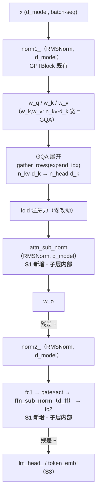
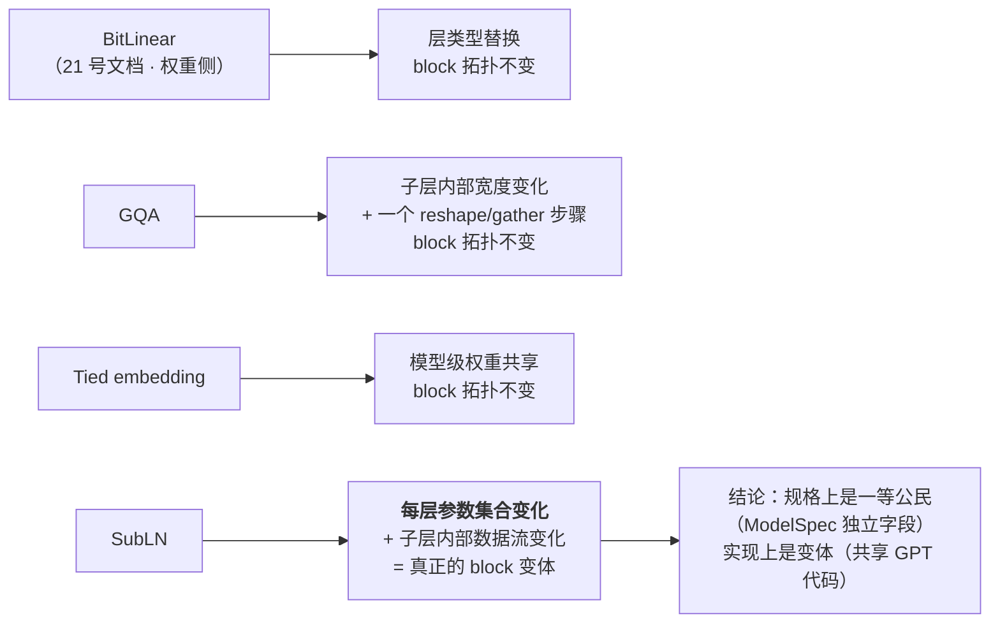
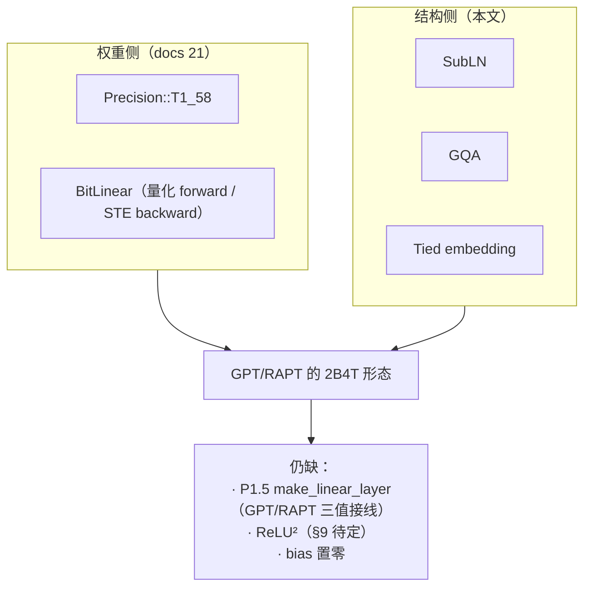

# BitNet b1.58 2B4T 的结构对齐：SubLN / GQA / Tied Embedding

> **状态**：**立项 + 实施中**（2026-10-10 立项）。
> 本文是"BitNet 结构"的唯一入口；权重侧（`T1_58` + `BitLinear`）在
> `21-quantized-weights.md`，两者是**两条正交的腿**（§8）。
> **落地分支**：`dev/t1_58`（承接 P1，延续"一步一测试一提交"）。
> **关联**：`21-quantized-weights.md`（权重侧 P1 ✅ / P1.5 待做）、
> `18-roadmap.md` §1.1 立项三问。
> **参考实现**：两个独立来源在本轮**互相印证**——
> `~/codes/Lumina-Engine/llama.cpp-b10991`（`src/models/bitnet.cpp` 的 BITNET arch、
> `ggml/src/ggml-cpu/ops.cpp` 的 GQA 头映射）与官方 `transformers` 的
> `BitNetForCausalLM` 建模代码（`repeat_kv` 的 `kv = h // n_rep`）。

---

## 0. 裁决记录（2026-10-10）

| # | 议题 | 裁决 |
|---|------|------|
| 1 | BitNet 的"新结构"到底是什么 | **不是 BitLinear**（那是层），是 **SubLN**——三值丢信息，必须靠改 block 补偿；量化与架构是**协同设计** |
| 2 | BitNet 做成新模型容器？ | **不**。规格/CLI 层面可作一等公民，实现层面是 **GPT 的变体**（共享 `GPTModel`/`GPTBlock` 代码） |
| 3 | SubLN 的封装位置 | **子层内部**（`AttentionBase` / `FeedForward` 的可选成员），**不是** `GPTBlock` 的第三个 norm |
| 4 | SubLN 是不是新的 `NormType` | **不是**。`NormType` = "哪种归一化"（LayerNorm/RMSNorm/BatchNorm），SubLN 用的就是 RMSNorm；它属于"**挂载位置**"这一轴 |
| 5 | SubLN 的归一化类型 | **跟随模型的 `norm_type`**（2B4T = RMSNorm）；经 `make_norm_layer(width, norm_type)` 构造，零新代码 |
| 6 | GQA 的头映射约定 | **`kv_head = h / (n_head / n_head_kv)`**（块映射）。llama.cpp 的 FA 内核 `ik2 = iq2 / rk2` 与 HF `repeat_kv` 的 `reshape(n_kv*n_rep)` 一致 |
| 7 | GQA 的实现形态 | **显式展开 K/V 头**（`gather_rows` 前向 / `scatter_add_rows` 反向），fold 注意力与 AOT 注册表**零改动**；in-kernel 版留 P2 |
| 8 | Tied embedding 的实现形态 | `GPTModel` 内一个开关（`tie_embeddings`）：head 复用 `token_emb_`，梯度累加进 `grad_token_emb_`（与 `scatter_add_rows` 的嵌入梯度**共存累加**） |
| 9 | CLI 预设 | **不加**。不引入 `--model bitnet`；三个开关先只到库 API + `ModelSpec`（GUI 预设留待以后） |
| 10 | ReLU² 激活 | **待定**（§9）：需先确认官方 `config.json` 的 `hidden_act`；llama.cpp 明确不支持 gated squared relu（`llama-graph.cpp:2293` `GGML_ABORT`），因此这条路没有 llama.cpp 可对拍 |
| 11 | 范围 | 本轮只做 **GPT**；RAPT（ReLU 线性注意力）**不**挂这三项——它的注意力不是 softmax 注意力，做三值权重可以，但那不叫 BitNet |
| 12 | 序列化 | `ModelSpec` 追加 `subln` / `n_head_kv` / `tie_embeddings` **三个键**，缺键 = 旧语义 → **不升 `MODEL_VERSION`**（与 `weight_quant`、`norm_place` 同款） |

**为什么"BitLinear 不是新结构"**：`make_norm_layer` 一个开关在 LayerNorm/RMSNorm/BatchNorm
之间切，没人因此建了三种模型；层的替换 ≠ 新模型。**为什么"BitNet 仍然是新结构"**：
SubLN 改变了每个 block 的**参数集合**（每层多 2 个 norm 权重）与数据流，这是真实的 block 级差异。

---

## 1. 一句话

2B4T 相对本项目 GPT 的差距只有三项：**SubLN**（结构）、**GQA**（结构）、**tied embedding**（结构）。
三项都是"可选配置"，默认全关 → **既有 GPT/RAPT/MLP/CNN/ViT 路径零改动、零回归**。

**目标**：让本项目**能表达** 2B4T 的 block（结构与数值定义对齐官方实现）。
**非目标**：① 复现官方 PPL（本项目 `d_model` 只有 64–256，规模差 3 个数量级）；
② CLI/GUI 暴露（留给后续轮次）；③ 从 HuggingFace 直接加载 2B4T 权重（需要权重转换器，另立）；
④ KV-cache 增量推理的性能（正确性对齐即可）。

---

## 2. 依据：2B4T 的结构拆解

### 2.1 与"标准 LLaMA 式解码器"的差异

2B4T 的拓扑就是 decoder-only Transformer（pre-norm RMSNorm、RoPE、GQA、gated FFN、
embedding 与 head **权重绑定**），"1.58-bit"只作用在**权重取值**上。差异共五处：

| # | 差异 | 性质 | 本项目现状 |
|---|---|---|---|
| 1 | Q/K/V/O + FFN gate/up/down **7 个投影**三值（absmean 尺度 + STE） | 权重表示 | ✅ P1 的 `BitLinear`（**接线到 GPT 属 P1.5**） |
| 2 | **SubLN**：attention 输出后（宽 `d_model`）、FFN 中间激活后（宽 `d_ff`）各一个 RMSNorm | **结构** | ❌ 本文 |
| 3 | **GQA**：20 query heads / 5 KV heads | **结构** | ❌ 本文 |
| 4 | **tied embedding**：head 复用 `tok_embd`（GGUF 张量表里没有 `OUTPUT`） | **结构** | ❌ 本文 |
| 5 | 投影无 bias；FFN 激活（口径待确认为 ReLU²） | 数值 | ⚠️ §9 待定 |

### 2.2 证据（两个独立来源互证）

| 证据 | 位置 | 说明 |
|---|---|---|
| BITNET arch 张量表 | `gguf-py/gguf/constants.py:4075` | `TOKEN_EMBD, OUTPUT_NORM, ATTN_NORM, ATTN_{Q,K,V,OUT}, FFN_NORM, FFN_{GATE,DOWN,UP}, ATTN_SUB_NORM, FFN_SUB_NORM`——**无 `OUTPUT`**（= tied head）、**恰有 2 个 sub-norm** |
| BITNET 图构造 | `src/models/bitnet.cpp:47-157` | 图 = llama 图逐行照抄 + 两次 `build_norm`：attention 输出之后、`wo` 之前；FFN 中间之后、`ffn_down` 之前 |
| SubLN 张点名 | `gguf-py/gguf/tensor_mapping.py:1168,1172` | `self_attn.inner_attn_ln` / `mlp.ffn_layernorm`（HF 原名） |
| 三值化范围 | `conversion/bitnet.py:34-49` | "BitNet 化" = 对一个**张点名集合**做 `weight_quant`（Q/K/V/O + gate/up/down），架构本身不动 |
| GQA 头映射 | `ggml/src/ggml-cpu/ops.cpp:8766-8768` | `rk2 = neq2/nek2`；`ik2 = iq2 / rk2` → `kv = h / (n_head/n_head_kv)` |
| GQA 头映射（HF） | `repeat_kv` | `expand(n_kv, n_rep).reshape(n_kv*n_rep)` → `kv = h // n_rep`。**与上式同一约定** |

---

## 3. 三项设计

### 3.1 SubLN = 子层的可选 Norm（**不是** `NormType` 新值）

**挂载点**（由张量形状反推，唯一可能的位置）：

| SubLN | 输入 | 宽度 | 插入点（代码坐标） |
|---|---|---|---|
| `attn_sub_norm` | attention 输出（softmax 之后、输出投影之前） | `d_model` | `compute_layer_attention.hpp` 的 `return w_o_.forward(concat);` **之前** |
| `ffn_sub_norm` | FFN 中间激活（gate×激活之后、down 之前） | `d_ff` | `compute_layer_feedforward.hpp` 的 `return fc2_.forward(*h2);` **之前** |

**为什么不能挂到 `GPTBlock`**：`norm1_/norm2_` 是 block 级兄弟节点，它们的输入输出都是
`(d_model, batch*seq)`；而 SubLN 的输入在**子层内部**（attention 输出 / FFN 中间），
宽度也不同（`d_model` / `d_ff`）。block 看不到这两个张量。

**为什么不能进 `NormType`**：`NormType` 的语义是"**哪种**归一化"（LayerNorm/RMSNorm/BatchNorm）。
SubLN 用的就是 RMSNorm —— 它是**挂载位置**的不同，不是归一化算子的不同。

**实现形态**（照抄仓库自己的先例）：

- `FeedForward` 已经持有可选子层 `GeLU gelu_` / `SwiGLU swiglu_`（`use_swiglu_` 开关）；
  `AttentionBase` 已经持有可选策略 `pos_` / `mask_`。SubLN 就是再加一个
  `std::unique_ptr<Layer> *_sub_norm_`（默认 `nullptr` = 关）。
- 类型走 `make_norm_layer(width, norm_type)`，与 `norm1_/norm2_/ln_f_` **同一个工厂、同一个类型来源**。
- 需要挂进 7 处既有的 `override`：`init_impl` / `parameters` / `param_gradients` /
  `set_precision_profile` / `set_checkpoint_mode` / `clear_cache` / `activation_cache`
  （漏一处 = 该路径静默失效，这正是 `21` §4.3.1 登记过的缺陷类）。

**参数顺序**：追加在子层既有参数**之后**（attention：`w_q,w_k,w_v,w_o,attn_sub_norm`；
FFN：`fc1,fc2,ffn_sub_norm`）。关闭时该分量贡献 0 个参数 → 布局与旧模型逐位一致。

### 3.2 GQA（分组查询注意力）

**形状约定**：`d_k = d_model / num_heads`（**Q/K/V 同宽**，与 llama.cpp 的
`n_embd_head_q == n_embd_head_k == n_embd_head_v` 一致）。

```
w_q_: (d_model,          d_model)     → Q: (d_model, batch*seq)
w_k_: (n_head_kv * d_k,  d_model)     → K: (n_head_kv*d_k, batch*seq)
w_v_: (n_head_kv * d_k,  d_model)     → V: 同上
w_o_: (d_model,          d_model)
```

**头映射**（§0 第 6 条）：query head `h` 使用 KV head `h / (num_heads / n_head_kv)`（块映射）。
`n_head_kv == num_heads` 时退化为 MHA（`n_rep == 1`，映射恒等）——**这是测试的不变量**。

**实现：显式展开 K/V 头**

```
forward:  K_kv (n_kv*d_k, N) --gather_rows(expand_idx)--> K (n_head*d_k, N) → [既有流程]
backward: grad_K (n_head*d_k, N) --scatter_add_rows(expand_idx)--> grad_K_kv → w_k_.backward
```

`expand_idx` 是长度为 `n_head*d_k` 的宿主常量向量（`src_row = (h / n_rep) * d_k + r`），
经 `detail::upload_span` 上桥（铁律 #12 允许的"层自算辅助数据"：索引表），在 `init_impl`
构建一次、常驻。**反向复用同一张表**——重复的两行在 `scatter_add_rows` 里自然累加，正好是
"多个 query 头共享一个 KV 头"的梯度语义。

**为什么选展开而不是改 fold**：`dsl::make_fold_attn_o` 与它的 AOT 注册表是**闭合世界**
（`AGENTS.md` §7）——让 fold body 感知 `n_kv` 等于新增结构 + 新增注册，且 CPU/GPU 两侧同步。
展开方案让 fold 与注册表**零改动**，代价是 `n_rep` 倍的 K/V 物化（本项目规模可忽略；
in-kernel 版作为 P2 优化项记录）。

**KV-cache 路径**：`forward_step` 里同样展开（`k_new`/`v_new` 投影后 `gather_rows`），
**cache 布局不变**（仍 `(max_len, n_head*d_k)`）→ 增量推理代码零改动。

### 3.3 Tied embedding

关闭时（默认）：`lm_head_` 是独立 `Linear(d_model, vocab_size)` —— 布局与今天逐位一致。

开启时：head 复用 `token_emb_ (vocab_size, d_model)`：

```
logits = W_emb · x            (W: (V,D), x: (D,N) → (V,N))
dX     = W_embᵀ · grad_logits  (matmul(W, g, transA=true))
dW_emb += grad_logits · xᵀ     (matmul(g, x, transB=true)) → 累加进 grad_token_emb_
```

**关键点：梯度要累加、不能覆盖。** `token_emb_` 同时承担两个角色（输入嵌入的查表 + 输出投影的权重），
所以它的梯度 = 嵌入侧 `scatter_add_rows` 的结果 **+** head 侧的 `dW_emb`。两者都写
`grad_token_emb_`，优化器 `zero_grad()` 只在 step 开头清一次 —— 顺序无关，语义正确。

**`head_prof.compute = stable` 的特例必须保留**（`21` §9.2 的 OOM 结论：logits 是最大张量、
被 loss 链多次读取，head 留在 compute 精度会物化多份 f32 副本）。

---

## 4. 规格与序列化

`ModelSpec` 追加三个字段（`model_spec.hpp` 的 GPT 段）：

| 字段 | 类型 | 缺键默认 | 语义 |
|---|---|---|---|
| `subln` | `bool` | `false` | 每个 block 的 attention/FFN 子层内部各加一个 norm |
| `n_head_kv` | `std::size_t` | `0` | `0` = 与 `num_heads` 相同（= MHA，旧语义） |
| `tie_embeddings` | `bool` | `false` | head 复用 token embedding |

三处同步（`weight_quant` 的同一套流程）：

1. `spec_to_kv` 写入；2. `spec_from_kv` 读取（缺键 → 保持默认）；3. `spec_matches` 的
GPT 家族分支**逐字段比对**（漏比 = 允许把不匹配的权重加载进模型）。

**不升 `MODEL_VERSION`**：三个键都是纯追加，缺键回落到的默认值 = 今天的参数布局。
`spec_summary` 在非默认时显式披露（诊断用）。

---

## 5. 分期与验收

每步 = **实现 + 测试 + 提交**（沿用仓库纪律：`ctest` 全绿 + `L2-VIOLATIONS: 0`
+ 既有路径零回归）。

| 步骤 | 内容 | 验收 |
|---|---|---|
| **S1** SubLN | `AttentionBase`/`FeedForward` 加可选 sub-norm（§3.1）；`GPTBlock`/`GPTModel`/`GptConfig` 透传；`ModelSpec.subln` | ① 开/关两组参数条数差 = 2×层数；② 开启后 CPU/GPU 端到端小训练收敛；③ **关闭时全量 ctest 零回归**（含既有 GPT 测试） |
| **S2** GQA | `AttentionBase` 加 `n_head_kv_` + 展开表（§3.2）；`CausalSelfAttention`/`GPTBlock`/`GPTModel`/`GptConfig` 透传；`ModelSpec.n_head_kv` | ① **`n_head_kv == num_heads` 与 MHA 逐位相同的**（同一权重、同一输入）；② `n_head_kv < num_heads` 时前向/反向形状正确、梯度和有限；③ 反向 `scatter_add_rows` 的累加正确（重复行 = 多次累加）；④ 既有 ctest 零回归 |
| **S3** Tied embedding | `GPTModel` 开关（§3.3）；`ModelSpec.tie_embeddings` | ① 开启后参数条数 = 关闭 − `(V*D + V)`；② 数值 = "把 `lm_head_` 权重显式设成 `token_emb_`"的等价构造（对拍）；③ 嵌入与 head 两条梯度路径**累加**而非覆盖（用只走一条路径的样例分别验证）；④ 既有 ctest 零回归 |

**统一回归口径**（每步都要满足）：

1. 构建零告警（`-Werror`）；`ctest` 全绿（本机 28 项；`--gpu` 变体按既有脚本口径）。
2. `bench/doc_inventory.ps1` 第 [4] 节 `L2-VIOLATIONS: 0`（SubLN 的 norm 经工厂、GQA 的索引经
   `upload_span`、tied head 经 `dsl::matmul`——都不引入 `Matrix`）。
3. `scan_exprs` 结构数变化**必须可解释**：SubLN 引入新的 norm 组合、GQA 引入新的 reshape/gather
   组合、tied head 引入新的 matmul trans 组合 → 逐条核对来源。
4. **默认关闭**：三项全关时，`ModelSpec`/参数布局/数值路径与改动前逐位一致。

---

## 6. 架构图（落地后）

### 6.1 2B4T block 的落点（三个开关分别插在哪）



### 6.2 三项的"结构性"分级（为什么只有 SubLN 是 block 级差异）



### 6.3 与 21 号文档的分工（两条正交的腿）



---

## 7. 提交清单（分支 `dev/t1_58`）

| # | 提交 | 内容 |
|---|---|---|
| 0 | 本文 | 立项文档（三项裁决 + 依据 + 分期 + 架构图） |
| S1 | `P1.5-S1 SubLN` | 子层可选 norm + 透传 + `ModelSpec.subln` + 测试 |
| S2 | `P1.5-S2 GQA` | `n_head_kv` + 展开表（前向 gather / 反向 scatter_add）+ 透传 + `ModelSpec.n_head_kv` + 测试 |
| S3 | `P1.5-S3 tied` | `tie_embeddings` 开关 + 梯度累加 + `ModelSpec.tie_embeddings` + 测试 |

---

## 8. 与 21 号文档的关系（一句话）

**21 管"权重怎么变"，22 管"图长什么样"。** 三值进的是精度词汇表 + `BitLinear`（21），
2B4T 的剩余差距是三个结构开关（22）。两条腿都齐了，本项目才**能表达** BitNet b1.58 2B4T 的形态。

---

## 9. 待定 / 已否决

### 待定

1. **FFN 激活 = ReLU²？** 官方 2B4T 的 FFN 口径需要 `config.json` 的 `hidden_act` 确认
   （预期 `"relu2"`，即 gated：`relu²(gate(x)) · up(x)`）。若成立，需要新增
   `ActivationType::ReLU2` + `FeedForward` 的一个分支（复用 SwiGLU 的 split 机制，只换逐元素函数）。
   **注意**：llama.cpp 的 BITNET arch 用的是 **SwiGLU**（对应更早的 26 层 3B 版），且
   `llama-graph.cpp:2293` 对 gated squared relu 明确 `GGML_ABORT` —— 所以这条路**没有 llama.cpp 可对拍**，
   只能回官方 HF 实现。
2. **GQA 的 in-kernel 版本**（P2）：把头映射做进 fold body，省掉 `n_rep` 倍的 K/V 物化。
3. **CLI/GUI 暴露**：本轮只到库 API + `ModelSpec`；`--model bitnet` 预设**明确不做**，
   GUI 的 BitNet 预设留待以后。
4. **权重转换器**：从 HF 2B4T checkpoint 加载（含逐张量三值化 + 尺度折算）——另立。

### 已否决

1. **把 SubLN 做成 `NormType` 新值**：语义错误（它是挂载位置，不是归一化类型）。→ §3.1。
2. **把 SubLN 做成 `GPTBlock` 的第三个 norm**：block 看不到子层内部的张量。→ §3.1。
3. **新建 `BitNetModel` 平行容器**：要重抄位置编码/掩码族/KV cache/梯度检查点/文档掩码/
   offload/flush —— 双份维护，收益为零。→ §0 第 2 条。
4. **模板化 `AttentionBase<LinearT>` / `FeedForward<LinearT>`**：把"层类型是编译期决定"扩散到
   4 个头与全部实例化点，与 `20-custom-layer-ergonomics.md` 的方向相反。→ `21` §4.8.3。
5. **RAPT 挂 SubLN/GQA**：RAPT 的注意力是 ReLU 线性注意力（无 softmax），不是 BitNet 的形态。
   → §0 第 11 条。
