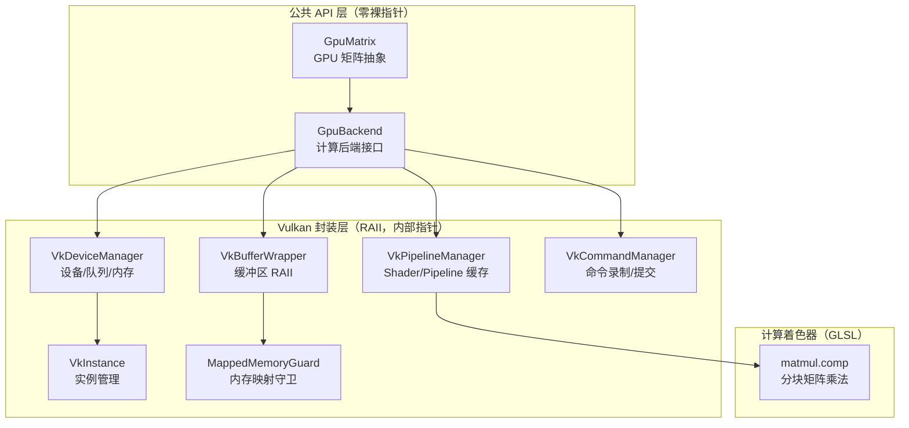
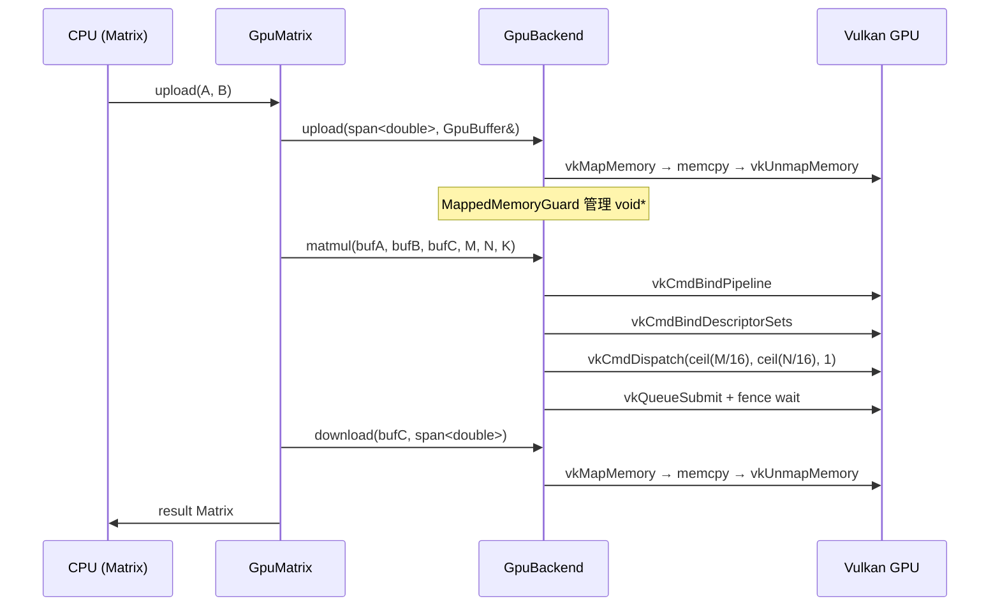

# 🚀 GPU 计算后端设计文档

> 为 neuralnet.cpp 添加 Vulkan Compute 加速，从矩阵乘法开始，逐步扩展到全部计算热点。

---

## 📋 目录

1. [背景与动机](#-背景与动机)
2. [API 选型：为什么是 Vulkan](#-api-选型为什么是-vulkan)
3. [架构总览](#-架构总览)
4. [裸指针最小化策略](#-裸指针最小化策略)
5. [模块设计](#-模块设计)
6. [数据流与生命周期](#-数据流与生命周期)
7. [计算着色器设计](#-计算着色器设计)
8. [与现有代码的集成](#-与现有代码的集成)
9. [分阶段路线图](#-分阶段路线图)

---

## 🎯 背景与动机

当前项目使用 CPU 多线程（自定义 `ThreadPool` + `SmartPolicy`）并行化矩阵运算。对于大规模矩阵（如 Transformer 模型中的注意力计算），GPU 的数千个核心可以提供数量级的吞吐提升。

### 加速目标（按收益排序）

| 优先级 | 运算 | 占比 | 现状 |
|--------|------|------|------|
| P0 | 矩阵乘法 | ~80% | `Matrix::multiply_to`，分块 + 线程池 |
| P1 | 逐元素操作 | ~10% | ReLU/GeLU/加减缩放/优化器更新 |
| P2 | LayerNorm | ~5% | 均值方差归约 + 仿射变换 |
| P3 | Softmax | ~5% | exp + 行内归约 |

本次实现聚焦 **P0 矩阵乘法**，后续迭代覆盖其余。

---

## 🔌 API 选型：为什么是 Vulkan

| API | 跨平台 | 纯计算（无渲染上下文） | 性能 | 裸指针暴露 |
|-----|--------|----------------------|------|-----------|
| **Vulkan Compute** | ✅ Win/Linux/macOS(MoltenVK) | ✅ | 最佳 | 可封装 |
| OpenGL Compute | ✅ (macOS 已弃用) | ❌ 需要 GL context | 中等 | 可封装 |
| DirectX 12 | ❌ 仅 Windows | ✅ | 优秀 | 可封装 |

**Vulkan 的关键优势**：
- `VkInstance → VkDevice → VkQueue` 不依赖窗口系统
- Compute shader 比图形管线简单得多（无光栅化、无顶点处理）
- 所有 Vulkan 句柄（`VkBuffer`、`VkDevice` 等）本质是整数 ID，不是指针

---

## 🏗️ 架构总览



---

## 🔒 裸指针最小化策略

### 原则

> 裸指针仅在 Vulkan C API 调用点出现，且生命周期严格受 RAII 守卫控制。
> 所有公共接口使用 `std::span`、`std::vector<T>&`、`Matrix&` 传递数据。

### 分层规则

| 层级 | 能否用裸指针 | 规则 |
|------|-------------|------|
| **公共 API** | ❌ 完全禁止 | 用户只接触 `GpuMatrix`、`GpuBackend` |
| **Vulkan 封装层** | ⚠️ 仅在 C API 边界 | 用 `span::data()` 传给 Vulkan；用 RAII 守卫管理映射内存 |
| **计算着色器** | N/A | GLSL 无指针概念 |

### 裸指针出现点清单（全部在封装层内部）

| 场景 | Vulkan C API | 裸指针类型 | RAII 化方案 |
|------|-------------|-----------|------------|
| 上传数据到 GPU | `vkMapMemory` + `memcpy` | `void*` | `MappedMemoryGuard`（析构自动 unmap） |
| SPIR-V 字节码 | `VkShaderModuleCreateInfo::pCode` | `const uint32_t*` | `std::vector<uint32_t>::data()`（非所有权借用） |
| 描述符绑定 | `vkUpdateDescriptorSets` | `const VkWriteDescriptorSet*` | `std::array<VkWriteDescriptorSet, N>.data()` |
| 命令提交 | `vkQueueSubmit` | `const VkSubmitInfo*` | 栈上局部变量取地址 |
| 缓冲区拷贝 | `vkCmdCopyBuffer` | `const VkBufferCopy*` | 栈上局部变量取地址 |

**关键设计**：所有 `void*` 映射指针被封装在 `MappedMemoryGuard` 中，作用域结束自动 `vkUnmapMemory`，从不暴露给外部。

---

## 📦 模块设计

### 模块 1：`GpuBackend` — 抽象接口

```cpp
// 公共接口：零裸指针
class GpuBackend {
public:
    virtual ~GpuBackend() = default;

    // 上传 CPU 矩阵数据到 GPU 缓冲区
    [[nodiscard]] virtual Result<void> upload(
        std::span<const double> src, GpuBuffer& dst) = 0;

    // GPU 矩阵乘法：C = A × B
    // M×K @ K×N → M×N
    [[nodiscard]] virtual Result<void> matmul(
        const GpuBuffer& a, const GpuBuffer& b, GpuBuffer& c,
        std::size_t M, std::size_t N, std::size_t K) = 0;

    // 下载 GPU 缓冲区数据到 CPU
    [[nodiscard]] virtual Result<void> download(
        const GpuBuffer& src, std::span<double> dst) = 0;
};
```

### 模块 2：`GpuBuffer` — GPU 缓冲区抽象

```cpp
// GPU 缓冲区句柄：不暴露底层指针
class GpuBuffer {
private:
    std::size_t size_;       // 元素数量
    std::size_t byte_size_;  // 字节数
    // 底层 Vulkan 缓冲区（RAII 管理）
    std::unique_ptr<VkBufferWrapper> impl_;

public:
    [[nodiscard]] std::size_t size() const noexcept;
    [[nodiscard]] std::size_t byte_size() const noexcept;
    [[nodiscard]] bool empty() const noexcept;
};
```

### 模块 3：`VkDeviceManager` — 设备与队列

```
职责：
- VkInstance 创建与销毁（RAII）
- 物理设备选择（偏好独立显卡）
- 逻辑设备与计算队列创建
- 内存类型查找
```

### 模块 4：`VkPipelineManager` — Shader 与 Pipeline

```
职责：
- SPIR-V 加载（std::vector<uint32_t> 持有字节码）
- VkShaderModule 创建（RAII）
- Descriptor Set Layout 创建
- Pipeline Layout / Compute Pipeline 创建
- Pipeline 缓存（按 shader 类型索引）
```

### 模块 5：`VkCommandManager` — 命令录制与提交

```
职责：
- Command Pool 创建（RAII）
- Command Buffer 分配
- 录制：绑定 pipeline → 绑定 descriptor → dispatch → barrier
- 提交到计算队列 + fence 同步
```

### 模块 6：`MappedMemoryGuard` — 内存映射守卫

```cpp
class MappedMemoryGuard {
private:
    VkDevice device_;
    VkDeviceMemory memory_;
    void* ptr_;           // 封装层内部，不暴露
    std::size_t size_;

public:
    MappedMemoryGuard(VkDevice device, VkDeviceMemory mem, std::size_t size);
    ~MappedMemoryGuard();  // 自动 vkUnmapMemory

    // 只暴露 span，不暴露 void*
    [[nodiscard]] std::span<std::byte> bytes() noexcept;
    [[nodiscard]] std::span<const std::byte> bytes() const noexcept;

    // 类型安全的拷入拷出
    void upload(std::span<const double> data);
    void download(std::span<double> dst) const;

    MappedMemoryGuard(const MappedMemoryGuard&) = delete;
    MappedMemoryGuard& operator=(const MappedMemoryGuard&) = delete;
    MappedMemoryGuard(MappedMemoryGuard&&) noexcept;
    MappedMemoryGuard& operator=(MappedMemoryGuard&&) noexcept;
};
```

---

## 🔄 数据流与生命周期

### 矩阵乘法完整数据流



### GpuBuffer 生命周期

```
创建: GpuBuffer(N) → vkCreateBuffer + vkAllocateMemory + vkBindBufferMemory
使用: upload → compute → download
销毁: ~GpuBuffer() → vkDestroyBuffer + vkFreeMemory（RAII 自动）
```

---

## 🎨 计算着色器设计

### matmul.comp — 分块矩阵乘法

```
工作原理：
- WorkGroup 大小：16 × 16（256 线程，适配大多数 GPU）
- 每个 WorkGroup 计算 16×16 的输出分块
- 共享内存（shared memory）缓存 A 和 B 的分块
- 多轮迭代 K 维度，每轮加载 16×16 到 shared memory

参数布局（Storage Buffer）：
- binding 0: A[M][K]（行主序）
- binding 1: B[K][N]（行主序）
- binding 2: C[M][N]（行主序，输出）
- push constants: M, N, K（uint32）

性能特征：
- shared memory 减少全局内存访问
- 合并访问（coalesced access）模式
- 计算/访存比高（O(N³) 计算 vs O(N²) 数据传输）
```

---

## 🔗 与现有代码的集成

### 分层架构（严格遵守 DEVELOPMENT_STANDARDS.md）

```
L5 交互层  src/*.cpp         → 只调用 L4/L3 API
L4 构建层  gpt_common.hpp    → 只调用 L3 Model API
L3 实现层  model.hpp         → 只调用 L2 Layer::forward
L2 计算层  layer.hpp         → 只调用 L1 Matrix 语义 API
L1 代数层  matrix.hpp        → 内部调用 L0 GpuBackend（自动分派）
L0 硬件层  vk_backend.hpp    → 最底层，无外部依赖
```

**关键规则：** Layer(L2) **绝不**直接使用 `GpuTensor`、`GpuBackend` 或 `forward_gpu`。
GPU 加速通过 Matrix 的语义方法（`multiply_to`、`apply_relu_inplace`、`apply_gelu_inplace`）自动分派。

### 集成点：`Matrix` 语义方法扩展

```cpp
// algebra/matrix.hpp — GPU 分派对 Layer 完全透明

void Matrix::multiply_to(Matrix& result, const Matrix& other) const {
#ifdef NN_HAS_VULKAN
    if (SmartPolicy::gpu_enabled && M * N >= SmartPolicy::GPU_THRESHOLD) {
        auto& backend = GpuBackend::instance();
        if (backend.is_initialized() || backend.initialize()) {
            auto mm = backend.matmul_direct(span(), other.span(), result.span(), M, N, K);
            if (mm) return;  // GPU 成功
        }
    }
#endif
    // CPU fallback
}

void Matrix::apply_relu_inplace() {
#ifdef NN_HAS_VULKAN
    if (SmartPolicy::gpu_enabled) {
        auto& backend = GpuBackend::instance();
        if (backend.is_initialized() || backend.initialize()) {
            auto r = backend.elementwise_direct(span(), 0u, size());
            if (r) return;
        }
    }
#endif
    // CPU fallback
}
```

### 集成点：`Layer` 只调用 Matrix API

```cpp
// layer.hpp — Layer 不感知 GPU 的存在

Result<Matrix> ReLU::forward(const Matrix& input) override {
    input_cache_ = input;
    Matrix result = input;
    result.apply_relu_inplace();  // GPU 自动分派
    return result;
}

Result<Matrix> Linear::forward(const Matrix& input) override {
    W_.multiply_to(product_buf_, input);  // GPU 自动分派
    // bias add on CPU (O(n), negligible vs O(n³) matmul)
    Matrix result(out_feat, batch);
    // ... bias add loop ...
    return result;
}
```

### 集成点：`Model` 无需 GPU 路由

```cpp
// model.hpp — Model 不感知 GPU 的存在
Result<Matrix> Model::forward(const Matrix& input) {
    auto result = layers_.front()->forward(input);
    Matrix out = std::move(*result);
    for (std::size_t i = 1; i < layers_.size(); ++i) {
        result = layers_[i]->forward(out);
        out = std::move(*result);
    }
    return out;
}
```

### GpuBackend 内部优化

| 优化 | 说明 |
|------|------|
| **LRU dispatch cache** | MatmulKey / ElemKey → 预录制命令缓冲，零 per-call 分配 |
| **Staging Ring** | 4×256MB 环形缓冲区，fence 同步 |
| **Memory Pool** | 128MB 大块子分配器，O(log n) 合并 |
| **Pre-recorded cmds** | 每个 cached dispatch 预录制所有 staging region 的命令缓冲 |

---

## 📅 分阶段路线图

### Phase 1：基础框架 + 矩阵乘法 ✅

| 任务 | 文件 | 状态 |
|------|------|------|
| Vulkan 设备管理 RAII | `vk_backend.hpp` | ✅ 完成 |
| GPU 缓冲区抽象 | `vk_backend.hpp` | ✅ 完成 |
| 内存映射守卫 | `vk_backend.hpp` | ✅ 完成 |
| matmul 计算着色器 | `shaders/matmul.comp` | ✅ 完成 |
| matmul_direct + LRU cache | `vk_backend.hpp` | ✅ 完成 |
| CMake Vulkan 集成 | `CMakeLists.txt` | ✅ 完成 |

### Phase 2：逐元素操作 ✅

| 任务 | 文件 | 状态 |
|------|------|------|
| elementwise 计算着色器 | `shaders/elementwise.comp` | ✅ 完成 |
| elementwise_direct + LRU cache | `vk_backend.hpp` | ✅ 完成 |
| Matrix::apply_relu_inplace | `algebra/matrix.hpp` | ✅ 完成 |
| Matrix::apply_gelu_inplace | `algebra/matrix.hpp` | ✅ 完成 |
| Layer 分层合规（无 forward_gpu） | `layer.hpp` | ✅ 完成 |

### Phase 3：归约操作（待实现）

| 任务 | 文件 |
|------|------|
| layernorm 计算着色器 | `shaders/layernorm.comp` |
| softmax 计算着色器 | `shaders/softmax.comp` |
| Matrix::layer_norm_inplace | `algebra/matrix.hpp` |
| Matrix::softmax_inplace | `algebra/matrix.hpp` |

### Phase 4：GPU 常驻优化（待实现）

| 任务 | 文件 |
|------|------|
| Matrix 内部可选 GpuTensor 持有 | `algebra/matrix.hpp` |
| 全链路 GPU 推理（零 PCIe 中间传输） | 内部实现 |
| 性能基准对比 | `src/compute_bench.cpp` |

---

## ⚠️ 注意事项

1. **Vulkan 验证层**：Debug 构建启用 `VK_LAYER_KHRONOS_validation`，Release 关闭
2. **设备选择**：优先独显，fallback 到集显，最终 fallback 到 CPU
3. **Push Constants**：矩阵维度通过 push constants 传递，避免为每种尺寸创建新 pipeline
4. **同步**：使用 `VkFence` 确保计算完成后再读取结果
5. **错误处理**：所有 Vulkan 调用检查返回值，通过 `Result<T>` 传播错误

---

> 📅 创建时间：2026-07-15
>
> 分支：`feature/vulkan-compute`
